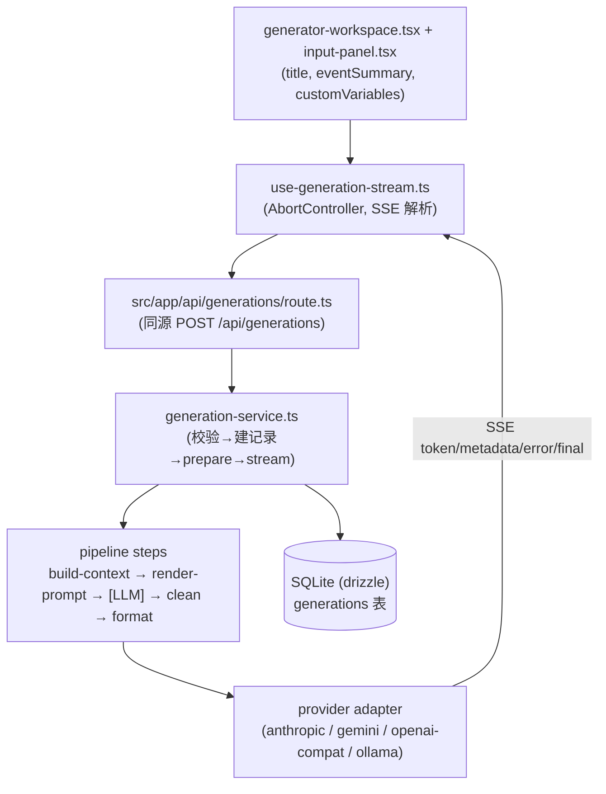

# Post Generator Studio — 0.0.1 First Preliminary Release (Pipeline Hardening)

> **取代说明**：本文件取代 `2026-06-25-comprehensive-iteration-requirements.md`。
> 那份文档的 R1–R23 大多针对 `packages/`（未上线的暂存树）编写，且部分 bug 在
> 当前 `src/` 工作区已被在途重构修复。本文件以**实际在跑的 `src/` 单进程架构**
> 为唯一规范，重新定义 0.0.1 范围。

## Problem Frame

项目目前版本号是 `0.2.0`，但实际状态并不稳：仓库里存在**两套近乎完整重复的代码树**
——在跑、被测的 `src/`（118 文件，单 Next.js 进程，同源 `/api/*` 路由）和一套
搭好骨架却未上线的 `packages/`（115 文件，web+Hono server 双进程暂存区）。同时
`src/` 里有一个**大体量未提交重构**（拆分 `generator-workspace`、贯通自定义变量、
修好取消/快捷键/provider 过滤），它已修掉多数历史 bug，但顺手引入了一个 **secrets
缓存安全回归**，并留下 1 个失败测试。

0.0.1 的目标不是加新功能，而是把这条主链路收敛成**一棵唯一、可信赖、可发布**的
pipeline：删掉重复树、落地在途重构、堵住已知回归、补齐错误可观测性与关键测试护栏。

### 规范 pipeline 主链路（0.0.1 基线 = `src/` 单进程）

## Requirements

**收敛为唯一规范树（0.0.1 地基）**

- R1. 删除 `packages/` 暂存树；移除 `pnpm-workspace.yaml`；保留 `src/` 为唯一来源。
  确认 `tsconfig.json` 仍排除 packages（当前已排除），清理残留 `packages/*/dist`、
  各 package 的 `package.json`/`tsup`/`vitest.config` 等 monorepo 工件。
- R2. 把版本号统一重置为 `0.0.1`（root `package.json` 及任何展示版本号处），写一条
  CHANGELOG 记录把 0.0.1 确立为「第一个可用基线」。
- R3. 落地当前未提交的在途重构（`generator-workspace` 拆分、自定义变量贯通、
  abortRef/快捷键/provider-enabled 过滤修复）为 0.0.1 基线——**前提是测试转绿**（见 R4）。

**主链路不崩**

- R4. 修复 secrets 缓存安全回归（**P0**）：已删除或已清除的 API key 必须不可再被读出。
  钉死 `readSecret` 对「文件缺失」的语义（抛错 vs 返回 `undefined`），让
  `deleteSecret` / `saveSecret(clear)` 的缓存失效与该语义一致，并修正被一并改动的
  `secrets.test.ts` 期望，使 `pnpm test` 全绿（当前 111/112）。
- R5. 在浏览器中端到端验证规范主链路在 `src/` 上真的能跑：生成、流式中途取消、
  历史搜索 + 分页。这些是回归高发路径，重构后需实测确认而非假设。
- R6. 历史页 stale `selected` 防护：搜索过滤或删除某条 generation 后，`selected` 不应
  仍指向不在列表中的陈旧对象。规划阶段先确认 `src/` 是否已处理，未处理则修复。

**错误可观测**

- R7. provider `parseChunk` 加固：四个 adapter 当前对 `raw as X` 做无校验断言，provider
  返回非预期结构时会静默失败。加入轻量 guard，使异常结构产生可观测的 stream `error`
  事件而非静默吞掉 token。
- R8. provider/网络失败 UX：确认 fetch 错误、超时、provider 非 200 响应都会在 SSE 流与
  UI 上产生可见错误状态，而不是无声卡住。规划阶段确认现状，补缺口。

**类型与测试护栏**

- R9. 提取共享 `notFound()` 辅助：`src/infrastructure/storage/` 下四个 repo
  （generation / generation-preset / provider-profile / prompt-template）一字不差地各
  抄一份，应收敛到一个共享工具。
- R10. 清扫 `src/` 内残留的 `as any` / 无校验断言（route handler、wiring 等），确立严格基线。
- R11. 为最高风险的未测逻辑补测试：`use-generation-stream`（6 类 SSE 事件、abort、token
  累积）、生成取消的集成路径、secrets 删除/清除后的缓存语义。

**可发布打包**

- R12. 一条命令的运行故事：从干净 clone 出发，`Start Dev.command` / `pnpm dev` +
  `db:migrate` + `db:seed` 全程可用；`.env.example` 字段完整（含 `POST_GENERATOR_SECRET_KEY`、
  `POST_GENERATOR_DB_PATH`）。
- R13. README 反映 0.0.1 真实状态：单进程 Next.js（非双进程）、支持的 provider、安装步骤、
  环境变量、已知限制。

## Success Criteria

- `packages/` 与 `pnpm-workspace.yaml` 移除后，仓库只剩一棵 `src/` 树；`pnpm typecheck`、
  `pnpm build`、`pnpm test`、`pnpm test:e2e` 全部针对 `src/` 且全绿。
- secrets 回归修复后，删除/清除的 key 在缓存 TTL 内也无法读出；`pnpm test` 112/112。
- 浏览器实测：生成、中途取消、历史搜索+分页三条路径均正常。
- provider 返回畸形 chunk 或网络失败时，UI 出现明确错误状态，无静默卡死。
- 版本号 = 0.0.1，CHANGELOG 与 README 与实际一致，干净 clone 可一键启动。

## Scope Boundaries

- 不切换到 `packages/` 双进程架构（已决策：固化单进程 `src/`）。
- 不新增 AI 功能（LLM-as-Judge 评分、Prompt A/B、模板版本历史 UI）——属下一迭代。
- 不引入 WebSocket / 长连接——SSE 已足够。
- 不做多用户 / 鉴权——single-user 本地工具定位不变。

## Key Decisions

- **唯一规范树 = `src/`，删除 `packages/`**：`src/` 是真正在跑、被测、且自定义变量已贯通
  的那套；`packages/` 是未上线的双进程暂存区，会徒增进程边界与回归面。「简单优于聪明」，
  收敛而非完成迁移。
- **0.0.1 重新定义基线**：现有 `0.2.0` 视为未正式发布的草稿，0.0.1 是第一个对外称为
  「能用」的版本，里程碑由主链路稳健性定义，而非功能数量。
- **secrets 回归优先于一切功能（R4）**：删除的密钥仍可读是安全问题，必须先堵。
- **R3 落地在途重构而非重写**：未提交改动已修掉多数历史 bug，只需稳定 + 转绿即可收编。

## Dependencies / Assumptions

- 假设当前未提交的 `src/` 重构（含 `generator-workspace.tsx` -356 行拆分）逻辑完整，
  唯一已知缺陷是 secrets 缓存回归 + 其 1 个失败测试。
- 假设删除 `packages/` 不影响任何 `src/` 导入（已确认 `src/` 不 import `@postgen/*`）。

## Outstanding Questions

### Deferred to Planning

- [影响 R4][技术] `readSecret` 对缺失文件应「抛错」还是「返回 undefined」？需对齐所有调用处
  （provider-service、route handler）的期望后统一，再据此修测试。
- [影响 R6][技术] `src/` 历史页是否已处理 stale `selected` / fetch 竞态？需读 history 工作区
  组件确认，未处理才纳入修复。
- [影响 R8][Needs research] 现有 SSE `error` 事件链路在「provider 超时 / 非 200」时是否真的
  冒泡到 UI？需实测一个故意失败的 provider 配置。
- [影响 R7][技术] `parseChunk` 加固用 Zod 解析还是手写 type guard？逐 provider 评估，倾向手写
  轻量 guard 以免 bundle 膨胀。

## Next Steps

→ 无阻塞性产品问题，可执行 `/ce:plan` 进行结构化实施规划。
