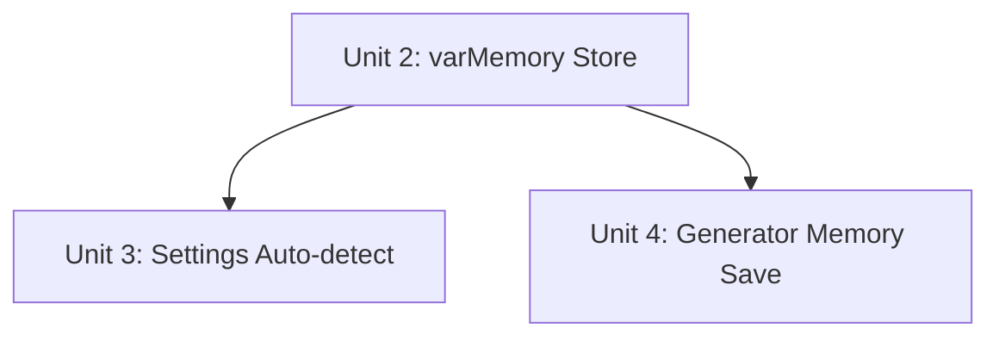

# feat: Custom Variable Memory + Template Defaults

## Overview

Two compounding layers that eliminate repetitive custom variable entry:

1. **Template Defaults** — each template carries its own "factory" values for custom vars, defined once in Settings and auto-detected from the prompt text.
2. **User Memory** — the Generator persists the last-used values per templateId to localStorage via Zustand, so they survive page reload and preset switching.

Pre-fill priority: **user memory → template defaults → empty**.

## Problem Frame

Users with stable template workflows (fixed brand names, platforms, audiences) re-enter the same custom var values every session. Two bugs compound this pain: (1) switching to a preset with a different template clears all vars via an aggressive reset, and (2) var values are pure React state and disappear on every page reload. Templates have no concept of a default starting value. (see origin: `docs/brainstorms/2026-06-25-custom-var-memory-requirements.md`)

## Requirements Trace

- R1. Template edit form auto-detects custom vars with 400ms debounce, shows one default-value input per var.
- R2. Defaults section is reactive to prompt text edits; debounced 400ms.
- R3. `customVariableDefaults: Record<string, string>` stored on PromptTemplate.
- R4. Vars present in prompt text but without a stored default display as empty (not hidden).
- R5. Var values persisted in Zustand persist store keyed by `templateId`.
- R6. Var values are written to memory after each successful generation only.
- R7. Generator pre-fills: user memory → template defaults → empty.
- R8. Switching between presets with the same templateId does not clear or change var values.
- R9. Switching to a preset with a different templateId loads memory/defaults for the new template.
- R10. Users clear a var by deleting the field content; the next successful generation saves the empty-or-new value. (No dedicated clear button.)

## Scope Boundaries

- No cross-template var transfer (BRAND_NAME in Template A does not pre-fill BRAND_NAME in Template B).
- No per-preset memory — storage key is templateId only.
- Memory is not editable in Settings; only defaults are.
- No bulk-clear UI in this iteration.
- No "Set as default from Generator" button.

## As-Built Audit (2026-06-25)

Feasibility review found significant prior implementation. Checkboxes in Implementation Units reflect actual remaining work.

| Component | Status | Notes |
|-----------|--------|-------|
| `customVariableDefaults` schema/migration/repo | **Complete** | `NOT NULL DEFAULT '{}'` in INITIAL_SQL; PRAGMA-guard migration; full JSON round-trip in repo |
| Settings panel: load/save `customVariableDefaults` | **Complete** | `loadForEdit()` initializes from `template.customVariableDefaults`; form submit sends the field |
| Settings panel: auto-detect vars from prompt text | **Missing** | Currently reads from `supportedVariables` form field, not prompt text. R1/R2 not met |
| Settings panel: `supportedVariables` auto-sync on save | **Missing** | New vars added to prompt will fail `assertSupportedVariables` without this |
| Settings panel: `clearTemplate()` on delete | **Missing** | Orphan localStorage keys accumulate on template delete |
| Generator: pre-fill priority chain (memory → defaults → empty) | **Complete** | Raw localStorage `pgs-cvar-${templateId}` with fallback to `customVariableDefaults` |
| Generator: write-on-success only (R6) | **Missing** | Currently saves on every keystroke, not on generation success |
| Generator: empty-string filtering (no persisting `""`) | **Missing** | Empty strings are saved, overriding template defaults permanently |
| Zustand persist store (`var-memory-store.ts`) | **Missing** | Raw localStorage used; no `clearTemplate()` possible; no empty-string guard |

## Context & Research

### Relevant Code and Patterns

- **Domain schemas**: `src/domain/schemas/template.ts` — all three schemas (`promptTemplateSchema`, `promptTemplateCreateSchema`, `promptTemplateUpdateSchema`) already include `customVariableDefaults: z.record(z.string()).default({})`. Field uses `.default({})` not `.optional()` — it is always `{}`, never `undefined` on domain objects.
- **DB schema**: `src/infrastructure/storage/schema.ts` line 25 — `customVariableDefaults: text("custom_variable_defaults").notNull().default("{}")`. Column is NOT NULL with `'{}'` default. No null-handling needed.
- **Migration**: `src/infrastructure/storage/migrations.ts` — column is in `INITIAL_SQL`. For pre-existing DBs, a PRAGMA-guarded `ALTER TABLE` block is already in place (more defensive than try/catch). Do not add another migration.
- **Repo mapping**: `src/infrastructure/storage/prompt-template-repo.ts` — `templateFromRow()`, `create()`, `update()` already handle the field via JSON stringify/parse. No changes needed.
- **Zustand persist pattern**: `src/presentation/store/ui-store.ts` — `create<UiState>()(persist((set) => ({...}), { name: "post-generator-ui" }))`. New store mirrors this with key `"post-generator-var-memory"`.
- **Custom var extraction**: `src/application/prompt/renderer.ts` — `extractTemplateVariables(template: string): string[]` using `TOKEN_PATTERN = /{{\s*([A-Z0-9_]+)\s*}}/g`. Generator already has a `getCustomVars()` wrapper (generator-workspace.tsx lines 40–46) that filters out STANDARD_VARS. Settings panel needs the same logic.
- **Settings panel current defaults rendering**: `prompt-templates-panel.tsx` lines 153–170 render the defaults section keyed from `watchedVars` (which is `form.watch("supportedVariables")`). The section exists but is driven by the wrong source — needs to switch to auto-detect from prompt text.
- **Generator pre-fill**: `generator-workspace.tsx` lines 107–122 — localStorage `pgs-cvar-${templateId}` with fallback to `selectedTemplate.customVariableDefaults`. Already implements priority chain; **missing**: success-only write and empty-string filtering.
- **Success hook**: `src/presentation/generation/use-generation-stream.ts` lines 97–104 — `payload.type === "final" && payload.generation.status === "completed"`. Add `onSuccess?: (vars: Record<string, string>) => void` callback here.
- **supportedVariables validation**: `assertSupportedVariables` in `src/application/prompt/prompt-service.ts` lines 27, 36 — rejects any var not in `template.supportedVariables`. Auto-sync in Settings submit is required.
- **Test directory**: `src/tests/unit/` — relevant existing files: `prompt-renderer.test.ts`, `prompt-service.test.ts`.

### Institutional Learnings

- None found in `docs/solutions/`.

## Key Technical Decisions

- **Zustand store still required despite raw localStorage existing**: The raw localStorage implementation in `generator-workspace.tsx` violates two spec requirements (empty strings persisted, no `clearTemplate()` on delete). Replacing it with a typed Zustand persist store adds empty-string filtering, `clearTemplate()`, and a clean API for other components to call — rather than scattering `localStorage.getItem/setItem` calls. The localStorage key `pgs-cvar-${templateId}` and the Zustand store key `"post-generator-var-memory"` can coexist during the migration; the old key will simply become unused.
- **Do not save empty strings to memory**: If an empty string were persisted, the user would have no way to get template defaults back on next load (no clear button). Only non-empty var values are written to the store. An empty field on generation means "nothing to remember" for that var, so the next load falls through to template defaults.
- **Settings defaults section must switch from `supportedVariables` to prompt-text auto-detect**: The current implementation reads `watchedVars` (the `supportedVariables` RHF field). This fails R1/R2 because users who add `{{BRAND_NAME}}` to a prompt get no defaults input unless they also manually add BRAND_NAME to `supportedVariables`. The fix replaces the `watchedVars` source with a 400ms debounced `useEffect` calling `extractTemplateVariables()` on the prompt text fields. The `supportedVariables` form field is not removed — it's synced from detected vars at submit time.
- **`supportedVariables` auto-sync on save**: On form submit, compute `syncedSupportedVariables = [...new Set([...form.getValues("supportedVariables"), ...detectedVars])]` and include it in the payload. Without this, `assertSupportedVariables` rejects generation when a user adds a custom var to a template but the `supportedVariables` array is stale.
- **Schema/migration already complete**: `customVariableDefaults` column is `NOT NULL DEFAULT '{}'` in the existing `INITIAL_SQL` with a PRAGMA-guarded `ALTER TABLE` for pre-existing DBs. No further DB changes needed.
- **Bootstrap stale on template edit**: Not an issue — Next.js navigation causes remount and fresh `loadBootstrap()`.
- **Delete template → clear varMemory entry**: `clearTemplate(templateId)` called in the Settings panel's `remove()` after a successful delete. Prevents orphan keys accumulating in localStorage.

## Open Questions

### Resolved During Planning

- **varMemory store location**: Separate `var-memory-store.ts` (see Key Technical Decisions).
- **Empty string memory behavior**: Do not store empty strings; fall through to template defaults (see Key Technical Decisions).
- **Bootstrap stale after Settings save**: Not an issue — Next.js page navigation remounts the Generator component (see Key Technical Decisions).
- **`supportedVariables` sync**: Auto-merge on save — any var in `customVariableDefaults` is added to `supportedVariables` before submit (see Key Technical Decisions).

### Deferred to Implementation

- **Exact `getCustomVars` / `extractTemplateVariables` import approach in Settings panel**: Generator-workspace has a local `getCustomVars()` helper that calls `extractTemplateVariables()`. Settings panel needs the same logic. Either inline it locally, import `extractTemplateVariables` directly, or extract `getCustomVars` to a shared util. Decide based on what's cleanest in context.
- **localStorage key migration for old `pgs-cvar-*` data**: The existing raw-localStorage data (key `pgs-cvar-${templateId}`) will be abandoned when the Zustand store takes over. Users lose any currently-saved var values on first load after the change. For a single-user local tool this is acceptable, but confirm during implementation whether a one-time migration is warranted.

## High-Level Technical Design

> *This illustrates the intended approach and is directional guidance for review, not implementation specification. The implementing agent should treat it as context, not code to reproduce.*

```
Settings → Prompt Templates (edit)
  [systemPrompt / userPromptTemplate textarea]
        │ useEffect (watch, 400ms debounce)
        ▼
  extractTemplateVariables() → filter STANDARD_VARS → detectedVars[]
        │
        ▼
  "Custom Variable Defaults" section
  [BRAND_NAME: ____] [PLATFORM: ____] ...
  (local varDefaults state — not react-hook-form fields)
        │
        ▼ on submit
  supportedVariables ← merge(existing, detectedVars)
  customVariableDefaults ← varDefaults (only vars present in detectedVars)
  → PATCH /api/prompt-templates/:id
        │
        ▼
  DB: customVariableDefaults = '{"BRAND_NAME":"MyBrand",...}'
        │
        ▼
  Generator (remount on navigation)
        │ loadBootstrap()
        ▼
  selectedTemplate.customVariableDefaults
        │
        ▼
  useEffect([templateId]):
    memory = varMemoryStore[templateId] ?? {}
    defaults = selectedTemplate.customVariableDefaults ?? {}
    merged = { ...defaults, ...memory }  ← memory wins
    setCustomVarValues(merged)
        │
        ▼
  User fills / edits vars
        │
        ▼
  Generate (on success: payload.type==="final", status==="completed")
        │
        ▼
  onSuccess(customVarValues):
    for each [key, val] in entries:
      if val !== "": varMemoryStore.set(templateId, key, val)
```

## Implementation Units



- [x] **Unit 1: Schema, Migration, and Repo — COMPLETE**

Already implemented. `customVariableDefaults TEXT NOT NULL DEFAULT '{}'` in INITIAL_SQL, PRAGMA-guarded ALTER TABLE migration for pre-existing DBs, full JSON round-trip in `prompt-template-repo.ts`. No work needed.

---

- [x] **Unit 2: varMemory Zustand Persist Store**

**Goal:** Create a dedicated Zustand persist store that holds `Record<templateId, Record<varName, string>>` in localStorage.

**Requirements:** R5, R6

**Dependencies:** None (can run in parallel with Unit 1)

**Files:**
- Create: `src/presentation/store/var-memory-store.ts`
- Test: `src/tests/unit/var-memory-store.test.ts`

**Approach:**
- Mirror `ui-store.ts` exactly: `create<VarMemoryState>()(persist((set, get) => ({...}), { name: "post-generator-var-memory" }))`.
- Store shape: `{ varMemory: Record<string, Record<string, string>>; setVar(templateId, varName, value): void; clearTemplate(templateId): void }`.
- `setVar`: only stores when `value !== ""` (empty strings are not persisted).
- `clearTemplate`: deletes the entire `templateId` key from the store.
- Export `useVarMemoryStore` hook.

**Patterns to follow:**
- `src/presentation/store/ui-store.ts` (full pattern: create, persist, typed state, setters)

**Test scenarios:**
- Happy path: `setVar("tmpl-1", "BRAND_NAME", "Acme")` → `varMemory["tmpl-1"]["BRAND_NAME"] === "Acme"`
- Happy path: `setVar("tmpl-1", "PLATFORM", "")` → key NOT stored (empty string excluded)
- Happy path: `clearTemplate("tmpl-1")` → `varMemory["tmpl-1"]` is undefined
- Edge case: two templateIds stored independently do not interfere
- Edge case: `setVar` on an existing key overwrites the value
- Edge case: `clearTemplate` on a non-existent templateId does not throw

**Verification:**
- All test scenarios pass
- Store is importable and the hook is named `useVarMemoryStore`

---

- [x] **Unit 3: Settings — Auto-detect and Sync (partial re-work)**

**Goal:** Switch the "Custom Variable Defaults" section from `supportedVariables`-driven to prompt-text auto-detect. Add `supportedVariables` auto-sync on save. Add `clearTemplate()` on delete.

**What already works:** The panel already loads `customVariableDefaults` into the form on edit and sends it in the PATCH/POST payload. Do not remove that logic.

**What needs changing:**
- The defaults section currently shows inputs keyed from `watchedVars` (line 46: `useWatch({ name: "supportedVariables" })`). Replace this source with `detectedVars` — a local state derived by calling `extractTemplateVariables()` on the prompt text fields, debounced 400ms.
- Add `supportedVariables` auto-sync in `submit()` before POST/PATCH: merge `detectedVars` into the existing `supportedVariables` form value.
- Add `useVarMemoryStore.getState().clearTemplate(template.id)` in `remove()` after successful delete.

**Requirements:** R1, R2, R4

**Dependencies:** Unit 2 (varMemory store for delete cleanup)

**Files:**
- Modify: `src/presentation/settings/prompt-templates-panel.tsx`

**Approach:**
- Remove or rename `watchedVars` watch (currently line 46). Replace with `detectedVars: string[]` local state.
- Add debounced `useEffect` watching `form.watch(["systemPrompt", "userPromptTemplate"])` at 400ms. On each fire: call `extractTemplateVariables(systemPrompt + userPromptTemplate)`, filter out STANDARD_VARS, `setDetectedVars(result)`.
- The existing `watchedDefaults` watch (line 47: `useWatch({ name: "customVariableDefaults" })`) can remain — it drives the input values.
- Replace line 153 condition (`watchedVars && watchedVars.filter(...)`) with `detectedVars.length > 0`.
- Replace line 156 `.filter(v => !STANDARD_VARS.includes(v)).map(...)` with `detectedVars.map(...)`.
- In `loadForEdit()` (line 49): the `form.reset()` already sets `customVariableDefaults`. Add `setDetectedVars([])` and let the debounced effect re-populate it (or eagerly compute from `template.systemPrompt + template.userPromptTemplate` for instant display on edit load).
- In `submit()` (line 70): before the PATCH/POST, compute synced vars and override the form value: `form.setValue("supportedVariables", [...new Set([...form.getValues("supportedVariables"), ...detectedVars])])`.
- In `remove()` (line 92): after `await fetch(...)`, add `useVarMemoryStore.getState().clearTemplate(id)`.

**Patterns to follow:**
- 400ms debounce: `generator-workspace.tsx` lines 113–121
- `useWatch` pattern: already used on lines 46–47 of the same file
- `form.setValue` pattern: already used on lines 160–164

**Test scenarios:**
- Happy path: editing systemPrompt to add `{{BRAND_NAME}}` → defaults section shows BRAND_NAME input after 400ms
- Happy path: saving with BRAND_NAME default filled → PATCH payload includes `customVariableDefaults: { BRAND_NAME: "..." }`
- Happy path: saving with new custom var → `supportedVariables` in PATCH payload includes BRAND_NAME (auto-synced)
- Edge case: removing all custom vars from prompt text → `detectedVars` becomes `[]`, defaults section hidden, `customVariableDefaults: {}` in payload
- Edge case: loading an existing template — defaults section immediately shows vars from the loaded template's prompt text
- Edge case: cancelling edit → `detectedVars` reset (next edit starts fresh)
- Integration: delete template → `clearTemplate(id)` called on varMemory store
- Integration: `assertSupportedVariables` does not throw when saving a template with a custom var in the prompt

**Verification:**
- Custom Variable Defaults section appears/disappears based on prompt text, not `supportedVariables`
- `supportedVariables` in the PATCH payload always covers every var in `customVariableDefaults`
- Deleting a template triggers varMemory cleanup

---

- [x] **Unit 4: Generator — Memory Save on Success (targeted fix)**

**Goal:** Fix the two bugs in the existing localStorage persistence: (1) values saved on every keystroke instead of generation success only, and (2) empty strings persisted, blocking template defaults from showing on next load.

**What already works:** The pre-fill priority chain (`pgs-cvar-${templateId}` → `selectedTemplate.customVariableDefaults` → empty) is implemented and correct. The template-switch reset is no longer aggressive — the existing useEffect already merges defaults. Do not rework the pre-fill logic.

**What needs changing:**
- Replace the raw-localStorage `useEffect` that saves on every `customVarValues` change (lines 118–122 of generator-workspace.tsx) with `useVarMemoryStore`.
- Add an `onSuccess` callback to `useGenerationStream` and wire it to save non-empty vars only.

**Requirements:** R5, R6, R8, R9, R10

**Dependencies:** Unit 2 (varMemory store)

**Files:**
- Modify: `src/presentation/generation/generator-workspace.tsx`
- Modify: `src/presentation/generation/use-generation-stream.ts`

**Approach:**
- In `use-generation-stream.ts`: add `onSuccess?: (vars: Record<string, string>) => void` as a parameter. In the `payload.type === "final" && payload.generation.status === "completed"` branch (lines 97–104), call `onSuccess(currentVars)` where `currentVars` is passed in or captured from the component.
- In `generator-workspace.tsx`:
  - Import `useVarMemoryStore`.
  - In the pre-fill `useEffect([templateId])` (lines 107–116): replace `localStorage.getItem("pgs-cvar-${templateId}")` with `useVarMemoryStore.getState().varMemory[templateId] ?? {}`. Keep the defaults fallback logic.
  - Remove the save-on-change `useEffect` (lines 118–122) that currently calls `localStorage.setItem`.
  - Pass `onSuccess: (vars) => { Object.entries(vars).forEach(([k, v]) => { if (v) varMemoryStore.setVar(templateId, k, v); }) }` to `useGenerationStream`.

**Patterns to follow:**
- `payload.type === "final"` branch in `use-generation-stream.ts` (lines 97–104)
- `useUiStore` import pattern in the same component (model for how to import a Zustand store)

**Test scenarios:**
- Happy path: successful generation → non-empty vars written to varMemory
- Happy path: switching to a preset with the same `templateId` → var values unchanged (pre-fill from memory)
- Edge case: empty var value on successful generation → NOT written to varMemory (next load shows template default instead)
- Edge case: cancelled generation (stream stopped before final) → varMemory not updated
- Edge case: failed generation (`status === "failed"`) → varMemory not updated
- Edge case: switching to preset with different `templateId` → new template's memory/defaults loaded
- Integration: fill vars → generate → reload page → select same template → vars pre-filled from Zustand store (not old pgs-cvar key)

**Verification:**
- Memory written only on `status === "completed"`, not on keystrokes
- Empty strings not persisted
- Pre-fill uses Zustand store instead of raw localStorage
- Switching templates loads the correct memory context

## System-Wide Impact

- **Interaction graph:** `GET /api/bootstrap` already returns `customVariableDefaults` on all templates since Unit 1 is complete. No API changes needed for any remaining unit.
- **Settings save path:** After Unit 3, the Settings PATCH payload will include a `supportedVariables` that always covers detected custom vars. `assertSupportedVariables` in `prompt-service.ts` will no longer block generation for templates with custom vars.
- **State lifecycle risks:** varMemory entries for deleted templates are cleaned by `clearTemplate()` in Unit 3. Template prompt-text changes (var names added/removed) leave stale keys in varMemory; harmless — unrendered vars are ignored by the Generator's `getCustomVars()` filter.
- **Data migration:** The old raw-localStorage key `pgs-cvar-${templateId}` will be orphaned when Unit 4 switches to the Zustand store. Existing saved var values are lost for users who have them. Acceptable for a single-user local tool; confirm during implementation whether a one-time migration is needed (see Deferred to Implementation).
- **Unchanged invariants:** `assertSupportedVariables` validation preserved — Unit 3 auto-sync ensures `supportedVariables` always covers `customVariableDefaults` vars before they reach the service layer.

## Risks & Dependencies

| Risk | Mitigation |
|------|------------|
| `assertSupportedVariables` throws if user edits a template in old Settings code before Unit 3 ships | Units 2 and 3 should ship together; do not deploy Unit 4 before Unit 3 |
| Old `pgs-cvar-*` localStorage keys orphaned after Unit 4 ships | One-time migration optional; evaluate during implementation |
| varMemory grows large with many templateIds over time | Orphan cleanup on delete (Unit 3) sufficient; values are short strings |
| User confusion: "I cleared a field but defaults aren't coming back" | Placeholder text: e.g., `Default: MyBrand` when memory holds a value differing from default (polish, not required for first ship) |

## Sources & References

- **Origin document:** [`docs/brainstorms/2026-06-25-custom-var-memory-requirements.md`](docs/brainstorms/2026-06-25-custom-var-memory-requirements.md)
- Related code: `src/presentation/generation/generator-workspace.tsx` (lines 40–46, 108–110)
- Related code: `src/presentation/generation/use-generation-stream.ts` (lines 97–104)
- Related code: `src/presentation/store/ui-store.ts`
- Related code: `src/infrastructure/storage/migrations.ts`
- Related code: `src/application/prompt/renderer.ts`
