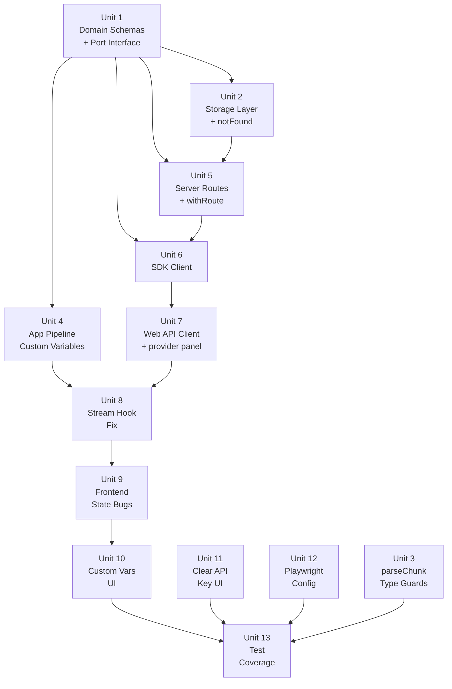

# fix: Comprehensive v0.3 Iteration

## Overview

R1–R23 的完整實施計劃。主線：(1) 搜索+分頁全棧修復（5 層），(2) 自定義變量端到端打通（5 層）。次線：type safety、重複代碼消除、新 UI 功能、測試覆蓋。共 13 個 implementation unit，按依賴順序執行。

## Problem Frame

v0.2.0 Monorepo 遷移後引入兩條高影響回歸：
1. History 搜索和分頁：`search`/`offset` 參數在 Domain schema 層就不存在，導致 5 層全部靜默丟棄
2. 自定義變量：`customVariables` 在 `use-generation-stream.ts` 解構時靜默丟棄，且 backend 5 層全部不接受

同時存在：22 個 route handler `as any` 強轉、4 個 repo 重複 `notFound()`、`BootstrapData` 重複定義、useMemo stale closure、E2E Playwright 路徑失效。

(see origin: docs/brainstorms/2026-06-25-comprehensive-iteration-requirements.md)

## Requirements Trace

- **P0 Regression**: R1（分頁全棧）, R2（abortRef 清除）, R3（Playwright 配置）, R4（customVariables 生成流）, R5（customVariables 預覽流）, R6（resolvePromptVariables + buildContextStep + 合併語義）
- **P1 Frontend**: R7（useMemo stale closure）, R8（selected useEffect）, R9（useApi 競態）, R10（provider enabled 過濾）
- **P1 Type Safety**: R11（StatusCode 類型）, R12（kind 類型）, R13（parseChunk 驗證）
- **P1 Dedup**: R14（notFound 提取）, R15（withRoute wrapper）, R16（BootstrapData 去重）, R17（api.ts 統一）
- **P2 Features**: R18（自定義變量 UI）, R19（Clear API Key UI）
- **P3 Tests**: R20–R23

## Scope Boundaries

- 不新增 AI 功能、A/B 測試、版本歷史 UI、WebSocket
- 不遷移 `src/` 遺留代碼
- customVariables sanitization：服務端 schema 禁止 value 含 `{{` `}}`，不做複雜 client-side escape
- `BootstrapData` 規範來源定為 `packages/sdk/src/client.ts`

## Context & Research

### Relevant Code and Patterns

| 層 | 文件 | 現狀 |
|---|---|---|
| Domain/schemas | `packages/domain/src/schemas/generation.ts` | `generationListQuerySchema` 無 search/offset；`generationRequestSchema` 無 customVariables |
| Domain/schemas | `packages/domain/src/schemas/template.ts` | `promptPreviewRequestSchema` 無 customVariables |
| Domain/ports | `packages/domain/src/ports/storage.ts` | `GenerationRepository.list(limit?)` 無 search/offset/total |
| Infrastructure | `packages/infrastructure/src/storage/generation-repo.ts` | `list()` 只有 LIMIT，無 OFFSET/LIKE/COUNT |
| Infrastructure | 4 個 repo 文件 | 各自定義相同的 local `notFound()` |
| Infrastructure | 4 個 provider adapter 文件 | `parseChunk` 用 `raw as SomeType` 無 runtime 驗證 |
| Application | `packages/application/src/prompt/variables.ts` | `resolvePromptVariables` 只返回 5 個標準變量 |
| Application | pipeline `buildContextStep` | 未合併 customVariables |
| Application | `packages/application/src/prompt/prompt-service.ts` | `previewPrompt` 未合併 customVariables |
| Server | `packages/server/src/routes/*.ts` | 22 個 handler 全部 `status as any`；無 error middleware |
| Server | `packages/server/src/wiring.ts` | `kind as any` |
| SDK | `packages/sdk/src/client.ts` | `listGenerations(limit?)` → `Generation[]`；`BootstrapData` 規範來源 |
| Web | `packages/web/src/presentation/lib/api.ts` | `loadGenerations` 忽略 search/offset；`BootstrapData` 重複定義 |
| Web | `use-generation-stream.ts` | `customVariables` 解構時靜默丟棄 |
| Web | `generator-workspace.tsx` | `bindings` useMemo 缺 deps；`customVarValues` state 已存在 |
| Web | `history-workspace.tsx` | `selected` 在 useEffect deps 造成 bug |
| E2E | `playwright.config.ts`（root） | `testDir: './src/tests/e2e'`（失效）；webServer 未啟動 Hono |

### Institutional Learnings

無相關記錄（docs/solutions/ 只有 lint-staged 問題一筆）。

## Key Technical Decisions

- **R2 — server-cancel only**（用戶決策 2026-06-25）：移除 `abortRef`。`cancel()` 只調用 `client.cancelGeneration(id)`。HTTP SSE 連接讓服務端 abort 後自然關閉。

- **R1 — `{ items, total }` breaking change**：`listGenerations` 返回 `{ items: Generation[], total: number }` 取代 `Generation[]`。`api.ts` 已期望此形狀；SDK 跟進。唯一 consumer 是 `packages/web`，acceptable。

- **R15 — `withRoute()` wrapper 取代 `app.onError`**：`app.onError` 接收 `(err, c)` 返回 `Response`，與現有 `errorResponse()` 元組形狀不兼容，且有捕獲 request body（含 apiKey）記錄的風險。HOF wrapper 更安全。

- **R6 — 合併優先級**：customVariables（請求）> customVariableDefaults（template 默認）> missing → TEMPLATE_VARIABLE_MISSING。

- **R13 — parseChunk 拒絕語義**：驗證失敗拋出 AppError（PROVIDER_PARSE_ERROR），不靜默降級。

- **R14 — 共享 errors.ts**：`notFound()` 提取到 `packages/infrastructure/src/storage/errors.ts`，4 個 repo 統一 import。

## Open Questions

### Resolved During Planning

- R2 語義：server-cancel only（用戶決策）
- R1 返回形狀：`{ items, total }` breaking change（acceptable）
- R15 方案：`withRoute()` HOF，不用 `app.onError`
- R6 合併語義：customVariables > customVariableDefaults > error

### Deferred to Implementation

- `withRoute()` 確切 TypeScript 泛型簽名（取決於 Hono Context 類型，執行時確認）
- `generation-repo.ts` Drizzle COUNT 查詢語法（`count()` 還是 `sql<number>\`COUNT(*)\``，查現有 schema.ts 確認）
- `use-generation-stream.ts` Vitest mock 方式（查 `packages/sdk/tests/` sse 測試確認 ReadableStream mock 模式）
- Playwright webServer 是否需要同時啟動兩個進程（查 root package.json `dev` script）

## High-Level Technical Design

> *Directional guidance — 供 reviewer 驗證方向用，不是 implementation spec。*

**customVariables 數據流（R4–R6）：**

```
generator-workspace.tsx (customVarValues state 已存在)
  └→ use-generation-stream.generate({ ..., customVariables })   [Unit 8: stop dropping]
      └→ sdk.streamGeneration({ ..., customVariables })
          └→ POST /generations body
              └→ generationRequestSchema.parse(body)             [Unit 1: 添加欄位]
                  └→ generation-service → buildContextStep        [Unit 4: 合併 customVariables]
                      └→ resolvePromptVariables + merge           [Unit 4: > customVariableDefaults]
                          └→ renderPromptStep → renderTemplate    [{{CUSTOM}} 解析成功]
```

**Pagination 數據流（R1）：**

```
history-workspace (search, offset, limit)
  └→ api.ts loadGenerations(search, offset, limit)              [Unit 7: stop dropping]
      └→ sdk.listGenerations({ search, offset, limit })          [Unit 6: 新簽名]
          └→ GET /generations?search=&offset=&limit=
              └→ generationListQuerySchema.parse(query)          [Unit 1: 添加 search+offset]
                  └→ generation-repo.list({ search, offset, limit }) [Unit 2: LIKE+OFFSET+COUNT]
                      └→ { items: Generation[], total: number }  [逐層向上傳遞]
```

**`withRoute()` HOF pattern（R15）：**

```
// Pseudo-code — directional only
withRoute(handler) = async (c) => {
  try { return await handler(c, c.get("services")) }
  catch (AppErrorException e) {
    const { status, body } = errorResponse(e)  // status is StatusCode (R11)
    return c.json(body, status)
  }
  catch (unknown) { return c.json({ error: "Internal server error" }, 500) }
}
```

## Implementation Units



---

- [ ] **Unit 1: Domain — Schema Expansion + Port Interface**

**Goal:** 為 pagination（R1）和 customVariables（R4, R5）在 Domain 層打好基礎。

**Requirements:** R1, R4, R5

**Dependencies:** None

**Files:**
- Modify: `packages/domain/src/schemas/generation.ts`
- Modify: `packages/domain/src/schemas/template.ts`
- Modify: `packages/domain/src/ports/storage.ts`
- Test: `packages/domain/tests/schemas.test.ts`

**Approach:**
- `generationListQuerySchema` 新增 `search: z.string().optional()` 和 `offset: z.coerce.number().int().min(0).default(0)`
- `generationRequestSchema` 新增 `customVariables: z.record(z.string()).optional()`；value validation：forbid value containing `{{` or `}}`
- `promptPreviewRequestSchema` 新增 `customVariables: z.record(z.string()).optional()`
- `GenerationRepository.list()` 接口改為 `list(opts: { limit: number; offset: number; search?: string }): Promise<{ items: Generation[]; total: number }>`

**Test scenarios:**
- Happy path: `generationListQuerySchema.parse({ limit: 10, offset: 5, search: "hello" })` → 三個欄位都保留
- Edge case: `offset` 缺省時 default 為 0，`search` 缺省時 undefined
- Error path: customVariables value 含 `{{` → zod validation error
- Happy path: `generationRequestSchema.parse({ ..., customVariables: { PLATFORM: "微信" } })` → field preserved
- Happy path: `promptPreviewRequestSchema` with customVariables parses correctly

**Verification:**
- TypeScript strict 編譯通過（所有依賴此 port 的 infrastructure 文件會出現 type error，提示需同步更新）
- Domain schemas 測試全部 pass

---

- [ ] **Unit 2: Infrastructure — generation-repo Pagination + notFound Extraction**

**Goal:** 實現真正的 search + offset + total 查詢（R1）；提取重複的 `notFound()` 函數（R14）。

**Requirements:** R1, R14

**Dependencies:** Unit 1

**Files:**
- Create: `packages/infrastructure/src/storage/errors.ts`
- Modify: `packages/infrastructure/src/storage/generation-repo.ts`
- Modify: `packages/infrastructure/src/storage/provider-profile-repo.ts`
- Modify: `packages/infrastructure/src/storage/prompt-template-repo.ts`
- Modify: `packages/infrastructure/src/storage/generation-preset-repo.ts`
- Test: `packages/infrastructure/tests/generation-repo.test.ts`（新增 case）

**Approach:**
- `errors.ts`：`export function notFound(entity: string, id: string): never` — 行為同現有 local 版本
- `generation-repo.list()` 實現：WHERE LIKE `%search%`（title OR eventSummary）；OFFSET + LIMIT；同步 COUNT（Drizzle `count()` 或 `sql<number>\`select count(*) ...\``）；search 為 undefined/空串時不加 WHERE 條件
- 4 個 repo 移除 local `notFound()`，改為 `import { notFound } from './errors'`

**Patterns to follow:**
- 現有 Drizzle 查詢風格（`db.select().from(generations).orderBy(...).limit(...)`）
- `AppError` / `AppErrorException` pattern（現有 repo 中的錯誤拋出方式）

**Test scenarios:**
- Happy path: `list({ limit: 10, offset: 0 })` → `{ items, total }` shape，total 等於資料庫總筆數
- Happy path: `list({ limit: 5, offset: 5 })` → 第二頁正確 5 筆
- Happy path: `list({ limit: 10, offset: 0, search: "unique-title" })` → items 只含匹配項，total 等於匹配總數
- Edge case: `list({ limit: 10, offset: 0, search: "" })` → 等同無過濾
- Edge case: `list({ limit: 10, offset: 999 })` 超過總數 → `{ items: [], total: <actual total> }`
- Integration: `total` 與 `list({ limit: 9999 }).items.length` 一致（同 search 條件）

**Verification:**
- `generation-repo.list()` 滿足更新後的 `GenerationRepository` TypeScript 接口
- 4 個 repo 中無 local `notFound()` function
- 現有 infrastructure tests pass

---

- [ ] **Unit 3: Infrastructure — parseChunk Type Guards**

**Goal:** 替換 4 個 provider adapter 的 `raw as SomeType` 無驗證斷言，改為拋出可觀測錯誤（R13）。

**Requirements:** R13

**Dependencies:** None（可與 Unit 2 並行）

**Files:**
- Modify: `packages/infrastructure/src/providers/anthropic.ts`
- Modify: `packages/infrastructure/src/providers/gemini.ts`
- Modify: `packages/infrastructure/src/providers/openai-compatible.ts`
- Modify: `packages/infrastructure/src/providers/ollama.ts`
- Test: 現有各 adapter test 文件（新增錯誤 case）

**Approach:**
- 每個 adapter 的 `parseChunk(raw: unknown)` 先做最小字段 type guard（e.g., Anthropic：`typeof raw === 'object' && raw !== null && 'type' in raw && typeof raw.type === 'string'`）
- 驗證失敗 → `throw new AppErrorException(AppError.create('PROVIDER_PARSE_ERROR', ...))`
- 使用手寫 type guard 而非 Zod schema（避免 bundle size 增加；每個 Provider chunk 結構不同）
- PROVIDER_PARSE_ERROR：若 AppError codes 枚舉沒有此項，按現有 error schema 添加

**Test scenarios:**
- Happy path: 每個 adapter 的 valid chunk → parseChunk 返回預期 events（現有 coverage 應已涵蓋）
- Error path: `parseChunk(null)` → throws AppErrorException
- Error path: `parseChunk("string")` → throws（非 object）
- Error path: `parseChunk({})` → throws（缺少必要字段）
- Error path: `parseChunk({ type: 123 })` → throws（type 非 string）

**Verification:**
- 4 個 adapter 文件中無 `raw as AnthropicEvent` 等類型斷言
- 原有正常 chunk 測試 pass（行為不變）
- 非預期結構拋出 AppErrorException（非 silently undefined）

---

- [ ] **Unit 4: Application — Custom Variables through Pipeline**

**Goal:** 打通 customVariables Application 層：`resolvePromptVariables` 支持合併、`buildContextStep` 傳遞到 variables map、`previewPrompt` 合併後才 renderTemplate（R4, R5, R6）。

**Requirements:** R4, R5, R6

**Dependencies:** Unit 1（generationRequestSchema 已有 customVariables 欄位）

**Files:**
- Modify: `packages/application/src/prompt/variables.ts`
- Modify: `packages/application/src/pipeline/registry.ts`（buildContextStep 所在）
- Modify: `packages/application/src/prompt/prompt-service.ts`
- Test: `packages/application/tests/` prompt 相關測試

**Approach:**
- `resolvePromptVariables(request, preset, date?, customVariables?: Record<string,string>)` 新增可選參數；返回 object 合併 customVariables（customVariables value > customVariableDefaults for same key）
- `buildContextStep`：從 pipeline input 取出 `customVariables`，傳入 `resolvePromptVariables`
- `previewPrompt`：合併 `parsed.customVariables`（fallback 到 template 的 `customVariableDefaults`）後調用 `renderTemplate`
- Sanitization at this layer：strip `{{` 和 `}}` from customVariable values before merging（防止 template token injection）

**Patterns to follow:**
- `resolvePromptVariables` 現有返回 `Record<string, string>` pattern
- `renderTemplate` 現有 variable map 調用方式

**Test scenarios:**
- Happy path: template `{{PLATFORM}}`，customVariables `{ PLATFORM: "微信" }` → rendered 包含「微信」
- Happy path: template `{{TITLE}} {{PLATFORM}}`，標準 + 自定義 → 兩者都替換
- Merge priority: customVariables `{ PLATFORM: "X" }`，customVariableDefaults `{ PLATFORM: "Y" }` → 結果 "X"
- Fallback: customVariables 未提供 `PLATFORM`，customVariableDefaults 有 → 使用默認值
- Error path: template `{{MISSING}}`，兩者都沒有 → throws TEMPLATE_VARIABLE_MISSING
- Sanitization: customVariables value `"a{{b}}"` → stripped to `"ab"` before merging
- Regression: template 只有標準變量，不傳 customVariables → 行為完全不變

**Verification:**
- previewPrompt with customVariables 不再返回 500
- 帶 customVariables 的模板 application 層測試通過
- 現有標準變量 5 個 test cases 全部 pass（regression）

---

- [ ] **Unit 5: Server — Type Safety + withRoute Error Handling**

**Goal:** 消除 22 個 route handler 的 `status as any`、提取共用 `withRoute()` wrapper、修復 wiring.ts `kind as any`（R11, R12, R15）。同時更新 `/generations` route 使用 search+offset（R1 server 端）。

**Requirements:** R1, R11, R12, R15

**Dependencies:** Unit 1（schema 有了 search+offset），Unit 2（repo.list() 新簽名）

**Files:**
- Create: `packages/server/src/lib/with-route.ts`
- Modify: `packages/server/src/routes/generations.ts`
- Modify: `packages/server/src/routes/generation-presets.ts`
- Modify: `packages/server/src/routes/provider-profiles.ts`
- Modify: `packages/server/src/routes/prompt-templates.ts`
- Modify: `packages/server/src/routes/health.ts`
- Modify: `packages/server/src/routes/bootstrap.ts`
- Modify: `packages/server/src/wiring.ts`
- Test: `packages/server/tests/`（先確認現有 mock 路徑是否有效）

**Approach:**
- `errorResponse()` 的 status 返回類型改為 `StatusCode`（`import type { StatusCode } from 'hono/utils/http-status'`）
- `withRoute(handler)` HOF：捕獲 AppErrorException → `errorResponse()` → `c.json(body, status)`；捕獲 unknown → 500
- 22 個 handler 用 `withRoute()` 包裝，移除個別 try/catch
- `wiring.ts`：`kind` 參數改為 `ProviderKind` 類型（用 `providerKindSchema.parse()` 或直接 `as ProviderKind` 加 runtime check）
- `GET /generations` route：從 query 解析 `search`, `offset` 傳入 service

**Patterns to follow:**
- 現有 route handler 結構（`c.get("services")` 取服務）
- 現有 `errorResponse()` helper 調用方式

**Test scenarios:**
- Happy path: 正常請求 → handler 返回 200 response
- Error path: handler 拋出 `AppErrorException(NOT_FOUND)` → withRoute 攔截，返回 404
- Error path: handler 拋出 unknown error → 500 response
- Integration: `GET /generations?search=hello&offset=10&limit=5` → query params 正確解析並傳給 service
- TypeScript: `c.json(body, status)` 無需 `as any`（編譯時驗證）

**Verification:**
- server package TypeScript strict 無 `as any`（withRoute 相關）
- 現有 server tests pass（或確認 mock 路徑問題後修復）
- `wiring.ts` 無 `kind as any`

---

- [ ] **Unit 6: SDK — listGenerations Signature + BootstrapData Export**

**Goal:** 更新 SDK `listGenerations` 接受 search+offset 並返回 `{ items, total }`；確保 `BootstrapData` 從 SDK 導出（R1, R16）。

**Requirements:** R1, R16

**Dependencies:** Unit 1, Unit 5（server route 已返回新格式）

**Files:**
- Modify: `packages/sdk/src/client.ts`
- Modify: `packages/sdk/src/index.ts`（確保 BootstrapData export）
- Test: `packages/sdk/tests/`

**Approach:**
- `listGenerations(opts?: { limit?: number; offset?: number; search?: string }): Promise<{ items: Generation[]; total: number }>`
- GET 請求帶 query params（search, offset, limit）
- 確保 `export type { BootstrapData }` 從 index.ts 導出
- `streamGeneration` 無需改動（server 端 schema 已接受 customVariables）

**Test scenarios:**
- Happy path: `listGenerations({ search: "test", offset: 5, limit: 10 })` → sends correct query params
- Happy path: `listGenerations()` → works with all-default opts
- Happy path: response `{ items: [...], total: 42 }` parsed correctly into typed object
- TypeScript: 返回類型是 `Promise<{ items: Generation[]; total: number }>`

**Verification:**
- SDK TypeScript 編譯通過
- `BootstrapData` 可從 `@postgen/sdk` import
- SDK tests pass

---

- [ ] **Unit 7: Web — API Client Fixes + Provider Panel Unification**

**Goal:** 修復 `loadGenerations` 傳參（R1）；移除 `BootstrapData` 重複定義（R16）；`provider-profiles-panel` 改用 SDK client（R17）。

**Requirements:** R1, R16, R17

**Dependencies:** Unit 6

**Files:**
- Modify: `packages/web/src/presentation/lib/api.ts`
- Modify: `packages/web/src/app/(workspaces)/settings/components/provider-profiles-panel.tsx`（或其實際路徑）

**Approach:**
- `loadGenerations(search?, offset?, limit?)` → `client.listGenerations({ search, offset, limit })` → 直接 return（不再 fake total）
- 移除 api.ts 中的 local `BootstrapData` 類型定義，改為 `import type { BootstrapData } from '@postgen/sdk'`
- `provider-profiles-panel.tsx`：找到直接 `fetchJson<ProviderProfile>(...)` 的地方，改為 `client` 的對應方法

**Test scenarios:**
- Integration: `loadGenerations("hello", 0, 10)` → SDK `listGenerations` 被調用時帶了 `{ search: "hello", offset: 0, limit: 10 }`
- Happy path: `total` 來自 server response，不再等於 `items.length`
- TypeScript: `BootstrapData` import 正確，無 duplicate type error

**Verification:**
- api.ts 中無 local `BootstrapData` 定義
- provider-profiles-panel.tsx 中無直接 fetchJson 調用
- TypeScript 編譯通過

---

- [ ] **Unit 8: Web — use-generation-stream Hook Fixes**

**Goal:** 修復 `customVariables` 被靜默丟棄（R4）；移除死代碼 `abortRef`（R2）。

**Requirements:** R2, R4

**Dependencies:** Unit 4（backend 支持 customVariables）；Unit 7（API client 打通）

**Files:**
- Modify: `packages/web/src/presentation/generation/use-generation-stream.ts`
- Test: hook 測試文件（Unit 13 的 R20 先建立）

**Approach:**
- `generate(params)` 解構包含 `customVariables`：`const { title, eventSummary, presetId, providerProfileId, regenerate, customVariables } = params`
- `client.streamGeneration({ title, eventSummary, presetId, providerProfileId, regenerate, customVariables })`
- 移除 `abortRef` 及所有相關代碼
- 確認 `cancel()` 只調用 `client.cancelGeneration(generationId)`（不需 AbortController）

**Test scenarios:**
- Happy path: `generate({ ..., customVariables: { PLATFORM: "微信" } })` → SDK streamGeneration 被調用時帶 customVariables
- Happy path: `generate({ ..., customVariables: undefined })` → SDK call 中 customVariables 為 undefined（不報錯）
- Happy path: `cancel()` → `client.cancelGeneration` 被調用
- Edge case: 無 active generation 時調用 `cancel()` → 不報錯

**Verification:**
- Hook 文件中無 `abortRef` 或 `AbortController`
- customVariables 正確傳遞到 SDK streamGeneration
- TypeScript 無 unused variable warning

---

- [ ] **Unit 9: Web — Frontend State Bug Fixes**

**Goal:** 修復 4 個獨立的前端狀態問題（R7–R10）。

**Requirements:** R7, R8, R9, R10

**Dependencies:** Unit 8

**Files:**
- Modify: `packages/web/src/presentation/generation/generator-workspace.tsx`
- Modify: `packages/web/src/presentation/history/history-workspace.tsx`
- Modify: `packages/web/src/presentation/lib/use-api.ts`（或 useApi hook 所在）

**Approach:**
- **R7**（useMemo stale closure）：`bindings` useMemo deps 加入 `handleGenerate` 和 `cancel`，或改用 `useCallback` 穩定化 `handleGenerate`（選與現有風格一致的方式）
- **R8**（selected stale）：useEffect deps 移除 `selected`；generations 改變時只在 `selected` 不在新列表中時 reset 為 `generations[0]`
- **R9**（useApi 競態）：`load()` 內使用 `AbortController`；新調用開始時 abort 前一個；stale response 被 ignore 或 abort
- **R10**（provider filter）：`bootstrap?.providerProfiles.filter(p => p.enabled).map(...)` 替換 `bootstrap?.providerProfiles.map(...)`

**Test scenarios:**
- R7 Happy path: 改變 title 後 Ctrl+Enter → handleGenerate 收到最新 title（不是舊值）
- R8 Happy path: 搜索過濾後 selected 重置為第一項
- R8 Edge case: 搜索結果為空 → selected 為 null
- R9 Happy path: 連續兩次快速 load() → 只使用最新結果，舊結果不覆蓋
- R10 Happy path: disabled profile 不出現在 generator selector
- R10 Edge case: 全部 disabled → selector 空（顯示 placeholder 或空 option）

**Verification:**
- generator-workspace 的 useMemo deps 包含 handleGenerate
- history-workspace 的 useEffect deps 不包含 selected
- useApi hook 有 abort 機制
- enabled 過濾在 generator selector 生效

---

- [ ] **Unit 10: Web — Custom Variables Dynamic UI**

**Goal:** 當選中的模板包含非標準 `{{VARIABLE}}` token 時，Generator 表單動態渲染對應輸入欄（R18）。

**Requirements:** R18

**Dependencies:** Unit 8（hook 傳遞 customVariables），Unit 4（backend 支持）

**Files:**
- Modify: `packages/web/src/presentation/generation/generator-workspace.tsx`（`customVarValues` state 已存在）

**Approach:**
- 使用 `extractTemplateVariables(selectedTemplate?.userPromptTemplate ?? '')` 取得所有變量名
- 過濾掉 5 個標準變量（TITLE, EVENT_SUMMARY, DATE, TIME, LOCALE）
- 剩餘 `customVarKeys` → 渲染對應 `<Input>` 欄位（label 為變量名；placeholder 為 `customVariableDefaults[key] ?? ''`）
- 輸入位置：標準欄位（title, eventSummary）之後，Generate 按鈕之前
- 空值行為：允許空字符串提交（后端 TEMPLATE_VARIABLE_MISSING 會報錯，用戶需填）
- `customVarValues` 的 localStorage key 以 templateId 為命名空間避免模板切換時帶入舊值

**Test scenarios:**
- Happy path: template 含 `{{PLATFORM}}` → UI 渲染 label "PLATFORM" 的 input 欄位
- Happy path: template 只有標準變量 → 無額外 input
- Happy path: template 含 `{{A}}` `{{B}}` → 兩個 input 欄位
- Edge case: 切換到不含自定義變量的 template → input 欄位消失
- Edge case: customVariableDefaults 有 `PLATFORM: "微博"` → input placeholder 為「微博」
- Integration: 填入 PLATFORM 值後生成 → 後端收到正確的 customVariables（前提：Unit 4, 8 完成）

**Verification:**
- Generator 在含自定義變量的模板下顯示動態 input 欄位
- 標準模板不受影響（regression）

---

- [ ] **Unit 11: Web — Clear API Key UI**

**Goal:** Settings 面板新增「清除 API Key」按鈕（R19）。後端已完整實現，UI-only change。

**Requirements:** R19

**Dependencies:** None（可與其他 Unit 並行）

**Files:**
- Modify: `packages/web/src/app/(workspaces)/settings/components/provider-profiles-panel.tsx`（或實際路徑）

**Approach:**
- 在編輯現有 profile 的表單中，`profile.keyMasked` 不為 null 時顯示「清除 API Key」按鈕
- onClick：調用 SDK client 或 `fetchJson` 發送 `PATCH { clearApiKey: true }` 到現有 endpoint
- 成功後重新 load bootstrap data 以刷新 UI 狀態
- 不需要確認對話框（單用戶本地工具）

**Test scenarios:**
- Happy path: 有 API Key 的 profile 顯示「清除 API Key」按鈕
- Happy path: 點擊後 PATCH 請求帶 `{ clearApiKey: true }` 被調用
- Happy path: 成功清除後 keyMasked 顯示為空/null
- Edge case: 無 API Key 的 profile → 按鈕不顯示
- Test expectation: none for CSS/visual specifics

**Verification:**
- 編輯有 key 的 profile 時清除按鈕可見且可點擊
- 清除後 profile keyMasked 狀態 UI 刷新

---

- [ ] **Unit 12: E2E — Playwright Configuration Fix**

**Goal:** 修復 Playwright config 的 testDir 和 webServer，確保 E2E 在 monorepo 中可運行（R3）。

**Requirements:** R3

**Dependencies:** Unit 7（web 修復後 E2E 有意義）

**Files:**
- Modify: `playwright.config.ts`（repo root）
- Migrate/Create: E2E test files 到 `packages/web/tests/e2e/`（或 packages/web 結構內的對應位置）

**Approach:**
- 先確認 root `package.json` 的 `dev` script 是否同時啟動 web（3000）和 server（3001）
- `testDir` 改為指向 `packages/web` 下的 e2e 目錄
- `webServer` 改為確保兩個進程都啟動（若 root `pnpm dev` 已包含兩者則直接用；若不是則用 `concurrently` 或兩個 `webServer` 配置）
- 遷移現有 `src/tests/e2e/` 下的測試文件到新位置

**Test scenarios:**
- Test expectation: none for config file itself
- Integration: `pnpm test:e2e` 能找到並啟動測試（不報 "no test files found"）
- Integration: webServer 啟動後 `http://localhost:3000` 和 `http://localhost:3001` 均可訪問

**Verification:**
- `pnpm test:e2e` 不報路徑錯誤
- 至少第一個 E2E test 能執行而不立刻崩潰

---

- [ ] **Unit 13: Test Coverage**

**Goal:** 補充 R20–R23 的測試覆蓋。

**Requirements:** R20, R21, R22, R23

**Dependencies:** Unit 8（hook 修復後），Unit 3（parseChunk 有 error path），Unit 11（clearApiKey UI 完成，backend 邏輯在 infra）

**Files:**
- Create: `packages/web/tests/use-generation-stream.test.ts`（R20）
- Create: `packages/server/tests/wiring-smoke.test.ts`（R21）
- Modify: `packages/infrastructure/tests/provider-profile-repo.test.ts`（R22）
- Create: `packages/server/tests/generation-cancel.test.ts`（R23）

**Approach:**
- **R20**：mock `ReadableStream` 模擬 SSE 流（參考 `packages/sdk/tests/` 的 SSE mock 方式）；測試 token 累積、cancel 調用、complete 狀態轉換
- **R21**：import `createServices`（或 wiring entry），傳入 mock db/config，斷言所有 services 可被實例化且有必要 methods
- **R22**：直接單元測試 `provider-profile-repo.ts` 的 clearApiKey 三元邏輯（null/undefined/string 三種輸入）
- **R23**：integration test：發起生成 → 立刻調用 cancelGeneration → 驗證 generation status 最終為 "cancelled"

**Patterns to follow:**
- `packages/sdk/tests/sse.test.ts`（SSE mock 模式）
- `packages/server/tests/api-routes.test.ts`（server test 結構）
- `packages/infrastructure/tests/`（repo test 結構）

**Test scenarios:**
- R20: 5 個 token events → hook 累積 5 個 tokens
- R20: `complete` event → `isGenerating` 變 false
- R20: `cancel()` 在生成中調用 → `cancelGeneration` API 被調用（不是 AbortController）
- R20: stream 發出 error event → error state 設置
- R21: `createServices(mockDb, mockConfig)` 返回包含 generation/provider/prompt/preset/export 的 object
- R21: 每個 service 有對應的 method（duck-type check）
- R22: `update({ clearApiKey: null })` → deleteSecret 調用 + keyMasked 設為 null
- R22: `update({ clearApiKey: undefined })` → key 不變
- R22: `update({ clearApiKey: "new-key" })` → encryptAndStore 調用
- R23: generation created → cancelGeneration → status = "cancelled"

**Verification:**
- `pnpm test` 全部 packages 通過
- R20–R23 有明確場景覆蓋（不靠 count，靠場景）

---

## System-Wide Impact

- **Interaction graph**: `GenerationRepository.list()` 接口改變影響 generation-service、server route、SDK；`resolvePromptVariables` 簽名改變影響 buildContextStep 和 previewPrompt；`listGenerations` SDK 返回形狀改變影響 api.ts 和調用 loadGenerations 的所有 React components
- **Error propagation**: `withRoute()` 統一 server 層錯誤傳播；parseChunk 拋出 PROVIDER_PARSE_ERROR → BaseAdapter → streaming error event → hook error state；customVariables 缺失 → TEMPLATE_VARIABLE_MISSING → 返回 422
- **State lifecycle risks**: `useApi` race condition 修復需要確保 cleanup 在 component unmount 時正確 abort；`customVarValues` localStorage key 以 templateId 為命名空間（Unit 10）
- **API surface parity**: Unit 1–6 的改動影響 `GenerationRepository` port（所有 infra 實現需同步）、SDK `listGenerations`（web 端需同步）、server route response shape（SDK 端需同步）；三處是一致的 chain，TypeScript 的 interface 報錯會自動提示
- **Integration coverage**: R1 全棧需要集成測試（search 從 web 到 SQLite 不丟失）；R4–R6 customVariables 需要驗證 buildContextStep → renderTemplate 的完整路徑（Unit 13 R20 的 integration scenario 涵蓋部分）
- **Unchanged invariants**: Provider adapters 的 `buildRequest()` 不變；Drizzle schema (`schema.ts`) 不變；seed data 不變；AES-256-GCM 加密邏輯不變；現有 5 個標準變量行為完全不變

## Risks & Dependencies

| Risk | Mitigation |
|------|------------|
| Drizzle COUNT 查詢語法（Unit 2）可能需要 `sql<number>` 原始 SQL | 執行時查 Drizzle 文件或現有 schema.ts 中的 Drizzle 用法；備選是 `select().from(...).where(...).all().length`（性能差但可靠，可先實現後優化） |
| `withRoute()` TypeScript 泛型簽名（Unit 5）可能複雜 | Defer to implementation；如型別太複雜允許單一 `as Handler` 轉型（局部 any，可接受） |
| packages/server/tests/ 現有 mock 路徑 `@/application/...` 在 monorepo 後可能已失效 | Unit 5 實施前先運行 `pnpm --filter @postgen/server test` 確認；若大量失效先 skip 再補 |
| Playwright webServer 需要同時啟動兩個進程（Unit 12） | 執行時確認 root `pnpm dev` script；若不包含 server，用 `concurrently` 或 Playwright 的 multi-webServer 配置 |
| Unit 10 customVarValues 切換 template 時可能帶入舊 key 的值 | localStorage key 用 `customVarValues:${templateId}` 命名空間隔離（Unit 10 Approach 已指定） |
| Unit 1 Domain port 改動導致 TypeScript 編譯批量失敗 | 預期且可控：TypeScript 的 interface 報錯自動定位所有需同步更新的地方；按 Unit 1→2→4→5→6→7 順序修復即可 |

## Documentation / Operational Notes

- README.md 的「Prompt 模板」功能描述在 R18 完成後更新：說明支持 custom variables
- R3 完成後 `pnpm test:e2e` 才可正常使用（其他 Unit 實施期間避免依賴 E2E）
- Unit 5 實施後：22 個 route handler 所有錯誤路徑都走 `withRoute()`，生產問題排查靠 `app.onError` 之外的集中 logger call

## Sources & References

- **Origin document:** [docs/brainstorms/2026-06-25-comprehensive-iteration-requirements.md](docs/brainstorms/2026-06-25-comprehensive-iteration-requirements.md)
- Related code: `packages/domain/src/`, `packages/infrastructure/src/storage/`, `packages/application/src/prompt/`, `packages/server/src/routes/`, `packages/sdk/src/client.ts`, `packages/web/src/presentation/`
- Document review: 14 present findings（2026-06-25 session）
