# fix: 0.0.1 First Preliminary Release — Pipeline Hardening

## Overview

把 Post Generator Studio 从「两套重复代码树、带未提交重构、含 1 个安全回归」的不稳状态，
收敛成一棵**唯一、可信赖、可发布**的 `src/` 单进程 pipeline，发布为第一个对外称「能用」
的 `0.0.1`。不新增 AI 功能；只做收敛、堵回归、补可观测性与测试护栏、整理可发布性。

## Problem Frame

仓库当前 `0.2.0`，但实际不稳（详见 origin）：
- `src/`（118 文件，单 Next.js 进程，同源 `/api/*`）与 `packages/`（115 文件，未上线的双进程
  暂存区）近乎完整重复；根 `dev/test/build` 跑的是 `src/`。
- `src/` 工作区有一个**大体量未提交重构**（拆分 `generator-workspace`、贯通自定义变量、修好
  abortRef/快捷键/provider-enabled 过滤），已修掉多数历史 bug，但顺手在 `secrets.ts` 引入了
  缓存安全回归并留下 1 个失败测试（当前 `pnpm test` 111/112）。

决策（见 origin「Key Decisions」）：**以 `src/` 为唯一规范、删除 `packages/`、重置 0.0.1。**

## Requirements Trace

- R1. 删除 `packages/` 暂存树 + 移除 `pnpm-workspace.yaml`，`src/` 为唯一来源 → Unit 2
- R2. 版本重置为 `0.0.1` + CHANGELOG 基线 → Unit 8
- R3. 落地未提交在途重构为 0.0.1 基线（前提：测试转绿）→ Unit 1（解阻塞）+ 贯穿全程
- R4. 修复 secrets 缓存/删除安全回归，`pnpm test` 全绿 → Unit 1
- R5. 浏览器端到端验证主链路（生成 / 中途取消 / 历史搜索+分页）→ Unit 7
- R6. 历史页 stale `selected` 防护 → Unit 4
- R7. provider `parseChunk` 加固 → Unit 5
- R8. provider/网络失败可观测（含超时）→ Unit 5
- R9. 提取共享 `notFound()` 辅助 → Unit 3
- R10. 清扫 `src/` 残留 `as any` → Unit 3
- R11. 补关键测试（use-generation-stream / 取消集成 / secrets 缓存）→ Unit 6
- R12. 一键运行（clean clone → migrate → seed → dev）→ Unit 8
- R13. README 反映 0.0.1 真实状态 → Unit 8

## Scope Boundaries

- 不切到 `packages/` 双进程架构（固化单进程 `src/`）。
- 不新增 AI 功能（LLM-as-Judge、Prompt A/B、模板版本历史 UI）。
- 不引入 WebSocket / 长连接；不做多用户 / 鉴权。

## Context & Research

### Relevant Code and Patterns

- 规范主链路（单进程）：`src/presentation/generation/generator-workspace.tsx` + `input-panel.tsx`
  → `use-generation-stream.ts` → `src/app/api/generations/route.ts` → `generation-service.ts`
  → pipeline steps → `src/infrastructure/providers/*` → SSE 回传。
- SSE 错误链路**已完整**：`base-adapter.ts:68-77`（非200 yield error，含 429/5xx retryable 标记）
  → `generation-service.ts:222`（yield error + 落 `status:"failed"`）→ `route.ts:32-35`（SSE 编码 +
  catch-all）→ `use-generation-stream.ts:93-98`（落 UI error 态）。**唯一缺口：provider fetch 无超时**
  （`base-adapter.ts:69` 只有 `signal: abortSignal`）。
- `parseChunk` 现状：anthropic / openai-compatible / ollama 已全程 optional chaining；唯一真缺口是
  `gemini.ts:71-72` 的 `parsed.usageMetadata.promptTokenCount/.candidatesTokenCount` 缺 `?.`。
- 历史 stale-selected：`src/presentation/history/history-workspace.tsx:22,33-39`，effect 仅在 `!selected`
  时设值，未在列表变更后校验 `selected` 是否仍在列表内。`use-api.ts` 有 `mountedRef`（防 unmount 后
  setState）但无「忽略陈旧响应」守卫。
- `notFound()` 重复：`src/infrastructure/storage/{generation,generation-preset,provider-profile,
  prompt-template}-repo.ts` 四处一字不差。
- secrets：`readSecret` 对缺失文件返回 `undefined`（`secrets.ts:111-114`）；`deleteSecret:129` 与
  `saveSecret(existingRef):87` 均已调 `cacheInvalidate`。调用方契约：`provider-service.ts:58` 接受
  `undefined`，`generation-service.ts:167` 用 `?? ""` 兜底。

### Institutional Learnings

- `docs/solutions/build-errors/` 存在；实施 Unit 2 删 `packages/` 后若出现构建/类型错误，先查此目录。
- 无 `AGENTS.md`；遵循 root `/Users/dex/.claude/CLAUDE.md`（read-before-edit、simple-over-clever、
  最小注释、英文 commit）。

### External References

- 未做外部研究：主链路全部有本仓库现成模式可循（SSE/Hono-free Next route/drizzle 均已落地多处）。

## Key Technical Decisions

- **唯一规范树 = `src/`，删 `packages/`**：`src/` 真正在跑/被测、自定义变量已贯通；`packages/` 未上线
  且会徒增进程边界。收敛而非完成迁移（simple over clever）。
- **`readSecret` 契约 = 缺失返回 `undefined`（非抛错）**：两个调用方已按此契约written；测试统一为
  `.resolves.toBeUndefined()`。安全保证靠「删除/清除即失效缓存」，而非靠抛错。
- **R8 收窄为加超时**：错误冒泡链路已完整，唯一真实失败面是 provider 挂起无超时。用
  `AbortSignal.timeout()` 合并进现有 `abortSignal`。
- **R7 右尺寸缩小**：运行时已普遍 optional chaining，仅补 Gemini 两处 + 一个顶层「chunk 非对象」守卫
  使畸形结构产生可观测 error 而非静默吞掉。
- **R3 落地而非重写**：未提交改动已修掉多数历史 bug，只需解掉 secrets 阻塞 + 转绿即收编。

## Open Questions

### Resolved During Planning

- readSecret 缺失语义（throw vs undefined）？→ **undefined**，调用方契约支持（见上）。
- SSE 失败是否冒泡到 UI？→ **已完整冒泡**；唯一缺口是无超时（纳入 Unit 5）。
- parseChunk 用 Zod 还是手写 guard？→ **手写轻量 guard**，避免 bundle 膨胀；范围仅 Gemini + 顶层对象校验。
- 历史是否已处理 stale-selected / fetch race？→ **均未处理**，纳入 Unit 4。

### Deferred to Implementation

- secrets 失败测试的「偶发返回明文」精确触发条件属运行期排查：执行时先复现 `pnpm test`，确认
  invalidate→unlink 顺序与 TTL 边界，再让测试转绿（契约已定，方向无歧义）。
- 删 `packages/` 后是否有隐藏的 `tsconfig`/`next.config`/lint glob 仍引用 `packages/*`：执行期 grep 清理。
- provider 超时默认值（如 60s/120s）的具体取值：执行期参照现有 Playwright 120s server 超时与 provider
  实测延迟定，作为可配置常量。

## Implementation Units

```mermaid
flowchart TB
    U1["Unit 1: secrets 缓存/删除修复<br/>(R4) — 解阻塞, 测试转绿"]
    U2["Unit 2: 删 packages/ 收敛单树<br/>(R1)"]
    U3["Unit 3: notFound() 提取 + as-any 清扫<br/>(R9,R10)"]
    U4["Unit 4: 历史 stale-selected + 忽略陈旧<br/>(R6)"]
    U5["Unit 5: provider 超时 + parseChunk 加固<br/>(R7,R8)"]
    U6["Unit 6: 关键测试补全<br/>(R11)"]
    U7["Unit 7: 主链路浏览器 E2E 验证<br/>(R5)"]
    U8["Unit 8: 发布打包(0.0.1/CHANGELOG/README/env)<br/>(R2,R12,R13)"]
    U1 --> U2
    U2 --> U3
    U2 --> U4
    U2 --> U5
    U3 --> U6
    U4 --> U6
    U5 --> U6
    U6 --> U7
    U7 --> U8
```

- [ ] **Unit 1: secrets 缓存/删除安全回归修复（解阻塞）**

**Goal:** 让已删除/已清除的 API key 在缓存 TTL 内也不可读；`pnpm test` 由 111/112 → 全绿。

**Requirements:** R4（解阻塞 R3）

**Dependencies:** 无（最先做，其余单元的「全绿」门槛依赖它）

**Files:**
- Modify: `src/infrastructure/security/secrets.ts`
- Test: `src/tests/unit/secrets.test.ts`

**Approach:**
- 确认契约：`readSecret(ref)` 对「文件缺失」返回 `undefined`；`deleteSecret` 与 `saveSecret(existingRef)`
  必须在任何文件操作前 `cacheInvalidate(ref)`（当前已是，执行期复现失败并定位真实泄漏点）。
- 复现 `pnpm test` 失败 → 确认是缓存未失效还是测试期望过时；按已定契约对齐 `.resolves.toBeUndefined()`。
- 不改变加解密逻辑与 envelope 结构。

**Execution note:** 先跑现有失败测试复现，再改——本单元是 bug 收口，test-first 复现优先。

**Patterns to follow:** 现有 `cacheGet/cacheSet/cacheInvalidate` 三函数；ENOENT→undefined 既有处理。

**Test scenarios:**
- Happy path：save → read 得明文 → mask 不等于明文。
- Error path（核心）：save → read（填充缓存）→ delete → read 应 `resolves.toBeUndefined()`（TTL 内也不可读）。
- Edge case：save → read → `saveSecret(newSecret, sameRef)`（清除/覆盖）→ read 得新值而非旧缓存值。
- Edge case：`readSecret(undefined)` → `undefined`；`deleteSecret(undefined)` → 不抛错。

**Verification:** `pnpm test` 全绿（112/112）；删除/覆盖后无任何路径能读出旧明文。

- [ ] **Unit 2: 删除 packages/ 收敛为单一规范树**

**Goal:** 仓库只剩 `src/` 一棵树，根 `typecheck/build/test/test:e2e` 全部针对 `src/` 且全绿。

**Requirements:** R1

**Dependencies:** Unit 1（先有全绿基线再删，便于二分定位回归）

**Files:**
- Delete: `packages/`（domain/application/infrastructure/sdk/server/web 全部）
- Delete: `pnpm-workspace.yaml`
- Modify（按需清理对 `packages/*` 的残留引用）: `tsconfig.json`（当前已 exclude packages，确认）、
  `next.config.ts`、`.eslintrc`/eslint flat config、`playwright.config.ts`、root `package.json` scripts
- Modify: 删除根未追踪的 monorepo 工件（`packages/*/dist`、各 `package.json`/`tsup`/`vitest.config`）

**Approach:**
- 删除前 grep 全仓 `@postgen/`、`packages/` 字样，确认 `src/` 无任何导入依赖（origin 已确认 `src/` 不 import
  `@postgen/*`）。逐项清理配置引用。
- 删除后立即跑四件套（typecheck/build/test/test:e2e）确认无回归。

**Patterns to follow:** 既有 root `package.json` 单进程脚本（`next dev` / `vitest run` / `playwright test`）。

**Test scenarios:** `Test expectation: none — 纯删除/配置收敛单元`。验证靠下方 Verification 的命令级全绿。

**Verification:** `git status` 无 `packages/`；`pnpm typecheck`、`pnpm build`、`pnpm test`、`pnpm test:e2e`
全部针对 `src/` 通过；全仓 grep 无残留 `@postgen/` 引用。

- [ ] **Unit 3: 提取共享 notFound() + 清扫残留 as any**

**Goal:** 消除四个 repo 的 `notFound()` 重复；`src/` 内无未经论证的 `as any`。

**Requirements:** R9, R10

**Dependencies:** Unit 2

**Files:**
- Create: `src/infrastructure/storage/repo-utils.ts`（或并入既有 storage 工具文件）
- Modify: `src/infrastructure/storage/{generation,generation-preset,provider-profile,prompt-template}-repo.ts`
- Modify: 任何 grep 命中的 `as any` 处（route handler / wiring 等）
- Test: `src/tests/unit/repo-utils.test.ts`（如新建工具）

**Approach:**
- 抽出统一的 `notFound(entity, id)` → 返回/抛出与现有四处完全一致的错误，逐个替换。
- `grep -rn "as any" src/`，逐个评估：能用正确类型/guard 消除则消除；确属框架限制（如个别 StatusCode）
  则保留并加一行 why 注释。

**Patterns to follow:** 现有四处 `notFound()` 的错误形态（保持错误类型/消息不变）。

**Test scenarios:**
- Happy path：四个 repo 的 `get(missingId)` 行为与重构前一致（同样的 not-found 错误/返回）。
- Edge case：存在的 id 正常返回，未受影响。

**Verification:** 四个 repo 引用同一 `notFound()`；`grep "as any" src/` 仅剩带 why 注释的已知例外；
`pnpm test` 全绿。

- [ ] **Unit 4: 历史页 stale selected + 忽略陈旧响应**

**Goal:** 搜索过滤/删除后 `selected` 不再指向不在列表中的陈旧对象；快速 search+offset 切换时最新响应总是获胜。

**Requirements:** R6

**Dependencies:** Unit 2

**Files:**
- Modify: `src/presentation/history/history-workspace.tsx`（line 22 state、33-39 effect）
- Modify: `src/presentation/lib/use-api.ts`（或 hook 实际所在）— 加忽略陈旧守卫
- Test: `src/tests/unit/history-workspace.test.tsx`、`src/tests/unit/use-api.test.ts`

**Approach:**
- 修 effect：当 `generations` 变化且 `selected` 的 id 不在新列表内 → 重置为 `generations[0] ?? null`。
- `use-api` 加 ignore-stale：每次 load 递增一个 requestId/或用 AbortController，只采纳最新一次的结果。

**Patterns to follow:** `use-generation-stream.ts` 已有的 `AbortController` 用法（line 60-61）。

**Test scenarios:**
- Happy path：初次加载自动选中第一条。
- Edge case（核心）：选中某条 → 改 search 使该条不在结果中 → `selected` 重置为新列表首条（非陈旧对象）。
- Edge case：删除当前选中条 → `selected` 重置；列表空 → `selected = null`。
- Integration/race：连续触发两次 load（旧响应后到）→ 最终状态反映最新一次请求，而非被旧响应覆盖。

**Verification:** 搜索/删除后 UI 不再渲染不在列表中的条目；竞态下结果一致。

- [ ] **Unit 5: provider 超时 + parseChunk 加固（错误可观测）**

**Goal:** provider 挂起会超时并产生可观测 error；畸形 chunk 产生 error 而非静默吞掉。

**Requirements:** R7, R8

**Dependencies:** Unit 2

**Files:**
- Modify: `src/infrastructure/providers/base-adapter.ts`（line 69 fetch 加超时）
- Modify: `src/infrastructure/providers/gemini.ts`（line 71-72 补 `?.`）
- Modify: `src/infrastructure/providers/base-adapter.ts` 或各 `parseChunk` 入口（顶层「chunk 非对象」守卫）
- Test: `src/tests/unit/provider-base-adapter.test.ts`、`src/tests/unit/provider-gemini.test.ts`

**Approach:**
- 超时：用 `AbortSignal.timeout(ms)` 与传入的 `abortSignal` 合并（`AbortSignal.any([...])`），超时则走现有
  `responseError`/error-event 路径，标记 retryable。超时值设为可配置常量（默认值执行期定）。
- Gemini：`parsed.usageMetadata?.promptTokenCount` / `?.candidatesTokenCount`。
- 顶层守卫：parseChunk 入口判断 `raw` 为非空对象，否则 yield 一个可观测 error（含原始片段摘要），不静默。

**Patterns to follow:** `base-adapter.ts:71` 既有 `responseError(...)` + retryable 标记；错误事件 yield 形态。

**Test scenarios:**
- Error path（核心）：provider fetch 超时 → 产生 SSE `error` 事件、retryable 标记正确、generation 落 `failed`。
- Error path：provider 返回非 JSON / 非对象 chunk → 产生可观测 error，不抛未捕获异常、不静默丢 token。
- Edge case：Gemini chunk 有 `usageMetadata` 但缺 token 字段 → metadata 字段为 `undefined`，不抛错。
- Happy path：正常 chunk 流不受超时/守卫影响，token 累积与重构前一致。

**Verification:** 故意配置一个挂起/畸形 provider → UI 出现明确错误态而非无声卡死；正常流不退化。

- [ ] **Unit 6: 关键路径测试补全**

**Goal:** 最高风险的未测逻辑获得覆盖，测试总数较 0.2.0 基线显著增长。

**Requirements:** R11

**Dependencies:** Unit 1, 3, 4, 5（被测行为先定型）

**Files:**
- Create: `src/tests/unit/use-generation-stream.test.ts`
- Create/Modify: `src/tests/integration/generation-cancel.test.ts`（或并入既有 generation-service 集成测试）
- Modify: `src/tests/unit/secrets.test.ts`（缓存语义补强，若 Unit 1 未尽）

**Approach:**
- `use-generation-stream`：mock `ReadableStream` 喂入 6 类 SSE 事件（generation/token/metadata/error/
  complete/final）+ abort，验证状态机与 token 累积。
- 取消集成：验证 `status === "cancelled"` 路径完整影响 generation 状态。

**Execution note:** 优先 `use-generation-stream` 测试；确认 Vitest 的 `ReadableStream` mock 支持度后再展开。

**Patterns to follow:** 既有 `src/tests/integration/generation-service.test.ts`（mock fetch 全流程）。

**Test scenarios:**
- use-generation-stream Happy：token 事件按序累积成完整内容；final 落终态。
- use-generation-stream Error：error 事件 → `status:"Failed"` + error 文案映射（`use-generation-stream.ts:96`）。
- use-generation-stream Edge：流中途 abort → 客户端中断且不再 setState。
- Cancel Integration：生成中触发取消 → 服务端 `CancelRegistry` 发信号 → generation 落 `cancelled`。

**Verification:** `pnpm test` 全绿且新增测试覆盖上述场景；`use-generation-stream` ≥6 个测试。

- [ ] **Unit 7: 主链路浏览器端到端验证**

**Goal:** 在真实浏览器确认规范主链路三条路径可用：生成、流式中途取消、历史搜索+分页。

**Requirements:** R5

**Dependencies:** Unit 6（逻辑层先全绿）

**Files:**
- Modify/Create: `src/tests/e2e/generation-flow.spec.ts`（扩展覆盖取消 + 历史搜索/分页）

**Approach:**
- 复用既有 Playwright 配置（testDir `src/tests/e2e`，baseURL `127.0.0.1:3000`，自起 `pnpm dev`）。
- 用一个可控/mock provider 或 ollama 本地，避免依赖真实付费 API。
- 三条用例：① 填表生成出内容；② 生成中点取消，状态变 cancelled 且无残留 streaming；③ 历史页输入搜索词
  + 翻页，结果随之变化且选中项不陈旧。

**Patterns to follow:** 既有 `src/tests/e2e/generation-flow.spec.ts`。

**Test scenarios:**
- E2E Happy：title+eventSummary → Generate → 出现非空生成内容。
- E2E Cancel：生成中 Cancel → UI 显示 cancelled，无持续 token 流入。
- E2E History：search 过滤 + 分页 offset 改变 → 列表更新、详情面板与选中项一致。

**Verification:** `pnpm test:e2e` 三条用例通过；手动浏览器复核一次主链路无回归。

- [ ] **Unit 8: 发布打包（0.0.1 / CHANGELOG / README / env）**

**Goal:** 版本=0.0.1，干净 clone 可一键启动，文档与实际一致。

**Requirements:** R2, R12, R13

**Dependencies:** Unit 7（功能稳定后再定版/写文档）

**Files:**
- Modify: `package.json`（version → `0.0.1`）
- Create/Modify: `CHANGELOG.md`（确立 0.0.1 基线条目）
- Modify: `README.md`（单进程 Next.js、支持的 provider、安装步骤、env、已知限制）
- Modify: `.env.example`（确保含 `POST_GENERATOR_SECRET_KEY`、`POST_GENERATOR_DB_PATH` 等必需项）
- Verify: `Start Dev.command`、`scripts/migrate.ts`、`scripts/seed.ts` 从干净 clone 全程可用

**Approach:**
- 从干净 checkout 走一遍：install → `db:migrate` → `db:seed` → `dev`，记录任何缺步并补进 README/脚本。
- README 明确「这是单进程 Next.js（非双进程）」，纠正任何 packages/ 时代的描述。

**Patterns to follow:** 既有 `Start Dev.command` 的前置检查（Node 版本、.env 生成、frozen-lockfile、migrate）。

**Test scenarios:** `Test expectation: none — 文档/元数据/打包单元`。验证靠干净 clone 的一键启动复跑。

**Verification:** `package.json` version=`0.0.1`；CHANGELOG/README 与实际一致；干净 clone 一条命令起服务
并能完成一次生成。

## System-Wide Impact

- **Interaction graph:** 改动集中在 secrets（被 provider-service / generation-service 调用）、provider
  base-adapter（被全部 4 个 adapter 继承）、history 表现层、storage repo 工具层。删 `packages/` 不触达
  `src/` 运行图（已确认无跨导入）。
- **Error propagation:** SSE error 链路已完整，Unit 5 仅补「超时」与「畸形 chunk」两个入口，沿用既有
  `responseError`/error-event 形态，保持一致。
- **State lifecycle risks:** secrets 缓存（Unit 1）需保证删除/覆盖即失效，防止已撤销的 key 仍可用；history
  `selected`（Unit 4）需防陈旧引用。
- **API surface parity:** `readSecret` 契约（undefined-on-missing）跨两个调用方一致，Unit 1 不改变该契约。
- **Integration coverage:** Unit 6/7 覆盖单元测试证明不了的跨层行为（SSE 状态机、取消落库、E2E 主链路）。
- **Unchanged invariants:** 不改加解密/envelope 结构、不改 SSE 事件协议、不改 drizzle schema、不改同源
  `/api/*` 路由形态。

## Risks & Dependencies

| Risk | Mitigation |
|------|------------|
| 删 `packages/` 后隐藏配置仍引用它，导致 build/lint 失败 | 删除前全仓 grep；删除后立即跑四件套，必要时查 `docs/solutions/build-errors/` |
| secrets 泄漏「偶发」难复现 | 契约已定（undefined-on-missing + 删除即失效缓存）；执行期以失败测试驱动复现，先红后绿 |
| E2E 依赖真实付费 provider 不稳/有成本 | 用 mock provider 或本地 ollama；CI 跑可控用例 |
| 未提交大重构里还藏有未发现缺陷 | Unit 6/7 的测试与 E2E 作为收编门槛；任何新发现的回归补测后再过 |
| provider 超时值设置不当（过短误杀 / 过长无效） | 设为可配置常量，默认参照 Playwright 120s server 超时与实测延迟 |

## Documentation / Operational Notes

- README 必须纠正为「单进程 Next.js」，移除 packages/ 双进程时代的任何描述。
- CHANGELOG 把 0.0.1 标为「第一个可用基线」，列出本轮收敛/修复/护栏要点。
- `.env.example` 是新用户一键启动的关键，缺字段会直接导致首次运行失败。

## Sources & References

- **Origin document:** [docs/brainstorms/2026-06-25-v0-0-1-pipeline-hardening-requirements.md](docs/brainstorms/2026-06-25-v0-0-1-pipeline-hardening-requirements.md)
- 被取代的旧文档：`docs/brainstorms/2026-06-25-comprehensive-iteration-requirements.md`、
  `docs/plans/2026-06-25-003-fix-comprehensive-v0-3-iteration-plan.md`（packages/ 视角，已不适用）
- 关键代码锚点：`src/infrastructure/security/secrets.ts`、`src/infrastructure/providers/base-adapter.ts:68-77`、
  `src/presentation/history/history-workspace.tsx:22,33-39`、`src/presentation/generation/use-generation-stream.ts:82-118`
