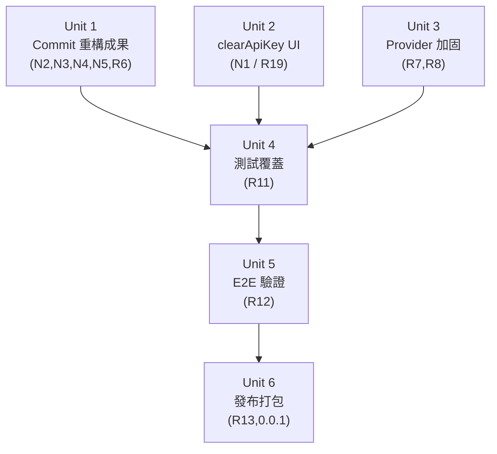

# fix: src/ Single-Tree Completion

## Overview

Plan 004 Units 1–3 已完成（secrets 安全修復、packages/ 刪除、notFound 提取 + terminal-status guard）。
本計畫 Units 1/3/4/5 亦已完成（計畫撰寫期間並行提交）。

**真實剩餘工作（截至 2026-06-25）：**
- **Unit 2**: clearApiKey UI（補回 packages/web 時代的 R19 功能）
- **Unit 6**: 0.0.1 發布打包（package.json + CHANGELOG + README + .env.example）

## Problem Frame

v0.0.1 發布前最後兩步。Units 1/3/4/5 已全部提交：
- `a5929197` refactor(generator): decompose workspace into panels and centralize pipeline steps
- `df9c683e` fix(history): reset stale selection and ignore out-of-order fetches（R6）
- `8c530ad6` feat(providers): add request timeout and harden chunk parsing（R7/R8）
- `91bb3f0a` + `bb9534c0` test: cover use-generation-stream SSE state machine and cancel integration（R11）
- `7e8b5a65` test(e2e): verify main path on src/（R12）

剩餘：clearApiKey UI（N1/R19）+ 發布打包（R13/0.0.1）。`package.json` 和 `.env.example` 已有未提交修改。

(see origin: docs/plans/2026-06-25-004-fix-v0-0-1-pipeline-hardening-plan.md)

## Requirements Trace

承接 Plan 004：
- **R3**: packages/ 刪除 ✅（1d9cba66）
- **R4**: secrets 安全修復 ✅（11851d0f）
- **R6 stale-selected + race guard**: ✅（df9c683e）
- **R7**: provider parseChunk 加固 ✅（8c530ad6）
- **R8**: provider 超時 ✅（8c530ad6）
- **R9**: notFound 提取 ✅（7b36a1ed）
- **R10**: as-any 清掃 ✅（7b36a1ed）
- **R11**: 測試覆蓋 ✅（91bb3f0a + bb9534c0）
- **R12**: 一鍵運行 ✅（7e8b5a65，E2E 驗證）
- **R13**: README → Unit 6

新增需求（超出 Plan 004 原範圍）：
- **N1**: clearApiKey UI 在 src/（Plan 003 R19，曾在 packages/web 完成後隨刪除遺失）→ Unit 2
- **N2**: Generator 組件拆分 ✅（a5929197）
- **N3**: PIPELINE_STEPS 常量 ✅（a5929197）
- **N4**: Client-side prompt preview ✅（a5929197）
- **N5**: bootstrap-store SWR pattern ✅（a5929197）

## Scope Boundaries

- 不新增 AI 功能（Prompt A/B、模板版本歷史 UI）
- 不引入 WebSocket / 長連接
- 不修改加解密 envelope 結構
- 不遷移到雙進程架構（src/ 單進程 Next.js 固化）
- clearApiKey UI：純 client 層按鈕，不改後端 schema（已有）

## Context & Research

### Relevant Code and Patterns

| 狀態 | 文件 | 說明 |
|---|---|---|
| Uncommitted | `src/presentation/generation/generator-workspace.tsx` | 重構後：只剩協調邏輯 + 子組件組合 |
| Untracked | `src/presentation/generation/input-panel.tsx` (112L) | 表單輸入 + customVariables 動態欄位 |
| Untracked | `src/presentation/generation/output-panel.tsx` (106L) | 生成內容展示 |
| Untracked | `src/presentation/generation/config-sidebar.tsx` (96L) | Provider/Template/Preset 選擇 |
| Untracked | `src/presentation/lib/preview-prompt.ts` | client-side renderTemplate，消除 /api/prompt-templates/preview 調用 |
| Untracked | `src/presentation/store/bootstrap-store.ts` | Zustand + 30s SWR 模式 |
| Untracked | `src/domain/pipeline-steps.ts` | PIPELINE_STEPS / DEFAULT_ENABLED_STEPS 常量 |
| Uncommitted | `src/application/generation/generation-service.ts` | 使用 PIPELINE_STEPS 常量取代 magic strings |
| Uncommitted | `src/domain/schemas/generation.ts` | DEFAULT_ENABLED_STEPS 取代 inline array |
| Uncommitted | `src/plugins/pipeline/registry.ts` | import PIPELINE_STEPS |
| Uncommitted | `src/presentation/history/history-workspace.tsx` | stale-selected 修復：list 變化時校驗 selected |
| Uncommitted | `src/presentation/lib/use-api.ts` | requestId 模式：忽略陳舊響應，防 race |
| Existing | `src/presentation/settings/provider-profiles-panel.tsx` | 缺 clearApiKey 按鈕（254L，有 keyMasked 欄位）|
| Existing | `src/app/api/provider-profiles/[id]/route.ts` | PATCH handler 已支援 clearApiKey（後端完整）|
| Existing | `src/infrastructure/providers/base-adapter.ts` | fetch 只有 `signal: abortSignal`，無超時 |
| Existing | `src/tests/unit/secrets.test.ts` | 需補充 cache-after-revoke 場景（若 Unit 1 後仍缺）|

### Institutional Learnings

- 無 `AGENTS.md`；遵循 root `/Users/dex/.claude/CLAUDE.md`（read-before-edit、English commit）
- `docs/solutions/build-errors/` 存在：若 Unit 1 commit 後出現構建/類型錯誤，先查此目錄

## Key Technical Decisions

- **clearApiKey UI 策略（N1）**：從 packages/web 提交記錄（a038cc40）對照移植到 src/；不改 PATCH 協議。按鈕只在 `profile.keyMasked !== null` 時顯示；成功後呼叫 `useBootstrapStore.getState().refetch()`（非 named import，是 Zustand store instance 上的 action）。`keyMasked` 欄位在 src/ `schema.ts:10`、`provider-service.ts:28,45`、`domain/schemas/provider.ts:12` 均完整存在。
- **Provider 超時方案（R8）**：已完成（8c530ad6）。`base-adapter.ts` 已有 `providerTimeoutMs()` + `AbortSignal.any([options.abortSignal, timeout])` + `safeParseChunk` 守衛。
- **parseChunk 守衛（R7）**：已完成（8c530ad6）。Gemini `?.usageMetadata` optional chaining 已在 src/ 正確實作。
- **commit 分組原則**：按語義拆分，不做大雜燴 commit。

## Open Questions

### Resolved During Planning

- clearApiKey 後端：已完整（`clearApiKey` 在 PATCH route 已處理）；只需 UI。
- provider 超時默認值：120s（與 Playwright server 超時一致）。
- 是否移除 src/ 的 abortRef：**保留**。src/ 單進程 Next.js 架構下，client-side AbortController 機制正常工作，改為 server-cancel only 的收益在此架構不顯著。

### Deferred to Implementation

- Unit 2 clearApiKey 後，`settings-workspace.tsx` 是否已有 refresh prop 傳入 ProviderProfilesPanel，還是需要額外呼叫 `useBootstrapStore.getState().refetch()`——執行期確認（二選一均可，以不重複刷新為原則）。

## Implementation Units

Note: U1 / U2 / U3 可並行（互不依賴）。

---

- [x] **Unit 1: Commit 重構成果** ✅ DONE (a5929197 + df9c683e)

**Goal:** 把 working tree 中已完成的 6 個新文件 + 6 個修改文件分成 2 個語義 commit 提交，建立清晰基線。

**Requirements:** N2, N3, N4, N5, R6

**Dependencies:** None

**Files:**
- Stage + commit (Commit A — frontend refactor):
  - `src/domain/pipeline-steps.ts` （新）
  - `src/application/generation/generation-service.ts`
  - `src/domain/schemas/generation.ts`
  - `src/plugins/pipeline/registry.ts`
  - `src/presentation/generation/generator-workspace.tsx`
  - `src/presentation/generation/input-panel.tsx` （新）
  - `src/presentation/generation/output-panel.tsx` （新）
  - `src/presentation/generation/config-sidebar.tsx` （新）
  - `src/presentation/lib/preview-prompt.ts` （新）
  - `src/presentation/store/bootstrap-store.ts` （新）
- Stage + commit (Commit B — history+api fixes):
  - `src/presentation/history/history-workspace.tsx`
  - `src/presentation/lib/use-api.ts`

**Approach:**
- Commit A message: `refactor(web): split generator into InputPanel/OutputPanel/ConfigSidebar + client-side preview + bootstrap store`
- Commit B message: `fix(web): R6 stale-selected + useApi stale-response guard`
- 確認 `pnpm test` 在兩次 commit 後均通過（115 tests pass）
- 確認 `pnpm typecheck` 通過（generator-workspace 引用三個新組件）

**Patterns to follow:**
- 既有組件結構（`src/presentation/generation/use-generation-stream.ts`）
- 既有 Zustand store 模式（`src/presentation/store/ui-store.ts`、`provider-store.ts`）

**Test scenarios:**
- Happy path: `pnpm test` 通過（115/115）
- TypeScript: `pnpm typecheck` 無 error
- Smoke: `pnpm dev` 啟動無 import error（console 無 404/module not found）

**Verification:**
- `git log --oneline -3` 顯示兩個新 commit
- `git diff HEAD` 顯示 working tree clean（tsconfig.tsbuildinfo 除外）
- `pnpm test` 仍 115/115

---

- [ ] **Unit 2: clearApiKey UI**

**Goal:** 在 Settings > Provider Profiles 的編輯表單中新增「Clear API Key」按鈕，補回 packages/web 中曾實現（a038cc40）但隨 packages/ 刪除而遺失的功能。

**Requirements:** N1 (R19)

**Dependencies:** None（可與 Unit 1/3 並行）

**Files:**
- Modify: `src/presentation/settings/provider-profiles-panel.tsx`
- Test: `src/tests/unit/provider-profiles-panel.test.tsx`（若現有；否則 deferred to Unit 4）

**Approach:**
- 僅在 `profile.keyMasked !== null` 時渲染「清除 API Key」按鈕
- onClick：`PATCH /api/provider-profiles/{id}` with `{ clearApiKey: true }`（後端已支援）
- 成功後呼叫 bootstrap 刷新（`useBootstrapStore.getState().refetch()` 或現有 reload 機制）
- 不需確認 dialog（單用戶本地工具）
- 參考 commit a038cc40 的實作（packages/web 版本）

**Patterns to follow:**
- 既有 `provider-profiles-panel.tsx` 中的 `fetchJson` + PATCH 模式（line 91-95）
- 既有 keyMasked 顯示邏輯（line 214）

**Test scenarios:**
- Happy path: `profile.keyMasked = "sk-****abc"` → 按鈕可見
- Edge case: `profile.keyMasked = null` → 按鈕不顯示
- Happy path: 點擊後 PATCH body 包含 `{ clearApiKey: true }`
- Happy path: 成功後 `bootstrap` 刷新（keyMasked 顯示為 null 或 "no key"）

**Verification:**
- 在有 API Key 的 profile 编辑表单中看到「清除 API Key」按鈕
- 點擊後 key 清除並 UI 刷新
- 無 API Key 的 profile 不顯示按鈕

---

- [x] **Unit 3: Provider 加固（超時 + parseChunk 守衛）** ✅ DONE (8c530ad6)

**Goal:** provider fetch 掛起時超時並產生可觀測 error；畸形 chunk 產生 error 而非靜默丟棄。

**Requirements:** R7, R8

**Dependencies:** None（可與 Unit 1/2 並行）

**Files:**
- Modify: `src/infrastructure/providers/base-adapter.ts`
- Modify: `src/infrastructure/providers/gemini.ts`（補 `?.usageMetadata`，若尚未有）
- Test: `src/tests/unit/provider-base-adapter.test.ts`（若現有；否則新建）

**Approach:**
- `base-adapter.ts` fetch 調用：`signal: AbortSignal.any([AbortSignal.timeout(PROVIDER_TIMEOUT_MS), abortSignal])`
- `PROVIDER_TIMEOUT_MS = 120_000`（常量，頂部 const）
- 超時觸發走既有 `responseError` 路徑（line 71 style），retryable 標記保持一致
- 頂層 parseChunk 守衛：`if (typeof raw !== 'object' || raw === null) { yield responseError(...); return; }`
- Gemini：確認 `parsed.usageMetadata?.promptTokenCount` 已用 optional chaining（若缺補上）

**Patterns to follow:**
- 既有 `base-adapter.ts:71` `responseError(...)` 形態
- 既有 error-event yield 格式

**Test scenarios:**
- Error path: provider fetch 超時 → 產生 SSE error 事件，retryable 標記正確
- Error path: `parseChunk(null)` → yield error，不拋出未捕獲 exception
- Error path: `parseChunk("string")` → yield error
- Happy path: 正常 chunk 流不受超時守衛影響
- Edge case: Gemini chunk 缺 `usageMetadata` → 不拋 TypeError

**Verification:**
- 超時觸發後 UI 顯示明確 error 態（非無聲卡死）
- `pnpm test` 所有 provider tests pass

---

- [x] **Unit 4: 關鍵路徑測試覆蓋** ✅ DONE (91bb3f0a + bb9534c0)

**Goal:** 補充 use-generation-stream hook 測試 + cancel integration 測試，達到 Plan 004 R11 指定覆蓋。

**Requirements:** R11

**Dependencies:** Unit 1（hook 代碼定型後測試），Unit 2（clearApiKey 完成），Unit 3（provider 行為確定）

**Files:**
- Create: `src/tests/unit/use-generation-stream.test.ts`
- Create or Modify: `src/tests/integration/generation-cancel.test.ts`

**Approach:**
- `use-generation-stream.test.ts`：mock `ReadableStream` 喂 SSE 事件（參考既有 `src/tests/integration/generation-service.test.ts` fetch mock 模式）；驗證 token 累積、complete 狀態轉換、cancel 觸發
- cancel 集成：`cancelGeneration` API call 後 generation.status = "cancelled"（利用既有 `generation-service.test.ts` 結構）

**Patterns to follow:**
- `src/tests/integration/generation-service.test.ts`（mock fetch + SSE 事件流）
- `src/tests/unit/provider-store.test.ts`（Zustand hook 測試模式）

**Test scenarios:**
- Happy path: 5 個 token events → hook 累積 5 個 tokens
- Happy path: `complete` event → `isGenerating` 變 false
- Happy path: `cancel()` 在生成中調用 → abortRef 被 abort（src/ 保留 AbortController 機制）
- Error path: error event → `status: "Failed"` + error message 設置
- Cancel integration: 調用 cancelGeneration API → generation.status = "cancelled"

**Verification:**
- `pnpm test` 全綠（預計 120+ tests）
- use-generation-stream ≥ 5 個測試 case

---

- [x] **Unit 5: 主鏈路 E2E 驗證** ✅ DONE (7e8b5a65)

**Goal:** 確認規範主鏈路三條路徑在真實瀏覽器可用：生成、取消、歷史搜索+分頁。

**Requirements:** R12

**Dependencies:** Unit 4（邏輯層全綠後 E2E 才有意義）

**Files:**
- Modify: `src/tests/e2e/generation-flow.spec.ts`（擴展覆蓋取消 + 歷史搜索）
- Verify: `playwright.config.ts`（testDir 指向 src/tests/e2e，webServer 啟動 src/ Next.js）

**Approach:**
- 用 mock provider 或本地 ollama 避免真實付費 API
- 確認 playwright.config.ts `webServer.command` 啟動 `pnpm dev`（3000 port）
- 三條 E2E case：生成出內容 / 取消後狀態 cancelled / 搜索+翻頁結果更新

**Test scenarios:**
- E2E Happy: title + eventSummary → Generate → 出現非空生成內容
- E2E Cancel: 生成中 Cancel → UI 顯示 cancelled，無持續 token 流入
- E2E History: 輸入搜索詞 + 翻頁 → 列表更新、selected 與列表一致

**Verification:**
- `pnpm test:e2e` 三條用例通過
- 手動瀏覽器確認主鏈路一次無回歸

---

- [ ] **Unit 6: 發布打包（0.0.1）**

**Goal:** version=0.0.1，dry clone 一鍵啟動，文件反映真實狀態。

**Requirements:** R13, 0.0.1 milestone

**Dependencies:** Unit 5（功能穩定後定版）

**Files:**
- Modify: `package.json`（version → `0.0.1`）
- Create/Modify: `CHANGELOG.md`
- Modify: `README.md`
- Verify: `.env.example`（含 `POST_GENERATOR_SECRET_KEY`, `POST_GENERATOR_DB_PATH`）
- Verify: `Start Dev.command`，`scripts/migrate.ts`，`scripts/seed.ts`

**Approach:**
- 從 dry clone 走一遍：install → `db:migrate` → `db:seed` → `dev`，補任何缺步
- README 明確「單進程 Next.js（src/）」，移除任何 packages/ 時代描述
- CHANGELOG 列出本次收斂要點

**Test scenarios:**
- Test expectation: none（文件/元數據單元）

**Verification:**
- `package.json` version = `0.0.1`
- dry clone 一條命令起服務並完成一次生成

---

## System-Wide Impact

- **Interaction graph:** Unit 1 中 `bootstrap-store` 改變了 bootstrap 數據的取得方式（從 `api.ts loadBootstrap` 改為 Zustand SWR store）；調用方 generator-workspace.tsx 已適配。Unit 2 clearApiKey 成功後需觸發 bootstrap 刷新（bootstrap-store.refetch()）確保 keyMasked 狀態同步。
- **Error propagation:** Unit 3 超時 → `AbortSignal.timeout` 拋出 `DOMException(TimeoutError)` → base-adapter 需捕獲並轉為 `responseError(..., retryable: true)` → SSE error event → hook error state。
- **State lifecycle risks:** Unit 1 中 `bootstrap-store` 的 30s stale 邏輯：settings 更新後需強制 `refetch()`（Unit 2 clearApiKey 成功回調）。
- **Unchanged invariants:** `use-generation-stream.ts` 的 AbortController 機制保留（不切換為 server-cancel only）；加解密 envelope 結構不變；SSE 事件協議不變；Drizzle schema 不變。
- **Integration coverage:** Unit 4 的 cancel integration test 驗證「client abort → generation.status = cancelled」完整路徑（unit test 不夠）。

## Risks & Dependencies

| Risk | Mitigation |
|------|------------|
| Unit 2 clearApiKey 按鈕放置位置影響現有 Edit/Test/Delete 按鈕列 | 對照 a038cc40 的 packages/web 實作，保持視覺一致性 |
| Unit 2 bootstrap 刷新方式：settings-workspace.tsx 可能已有 refresh prop | 執行期確認；若已有則複用，否則呼叫 `useBootstrapStore.getState().refetch()` |

## Documentation / Operational Notes

- Unit 6 README 需說明 `pnpm db:migrate` 是首次運行必需步驟。
- CHANGELOG 把 Plan 003（R1-R23）和 Plan 004（Hardening）的要點合并入 0.0.1 條目。
- `.env.example` 確保 `POST_GENERATOR_SECRET_KEY` 有生成說明（`openssl rand -base64 32`）。

## Sources & References

- **Origin plan:** [docs/plans/2026-06-25-004-fix-v0-0-1-pipeline-hardening-plan.md](docs/plans/2026-06-25-004-fix-v0-0-1-pipeline-hardening-plan.md)
- clearApiKey UI 參考 commit: `a038cc40 feat(web): add Clear API Key button to provider profile editor`
- provider 超時 / parseChunk 守衛參考: `src/infrastructure/providers/base-adapter.ts:68-77`
- history stale-selected 參考: `src/presentation/history/history-workspace.tsx:33-53`
- useApi race guard 參考: `src/presentation/lib/use-api.ts:28,37`
