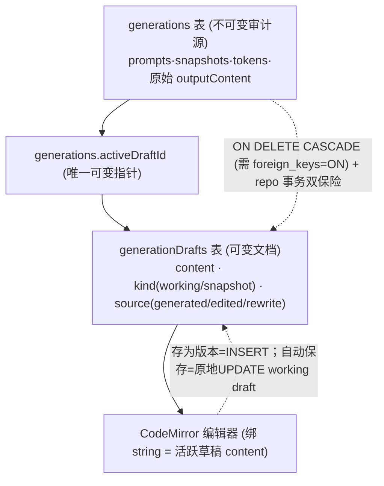
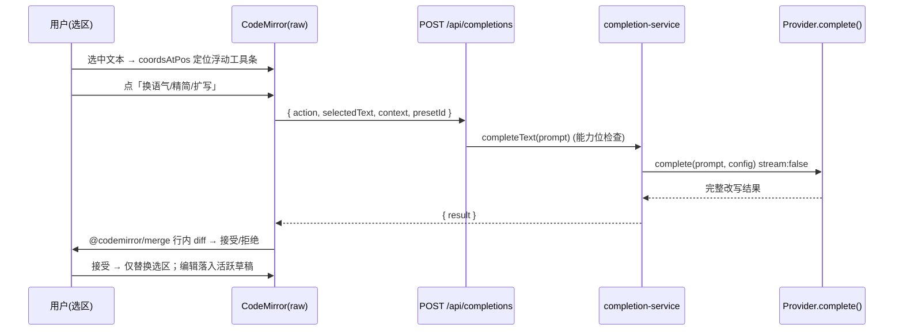
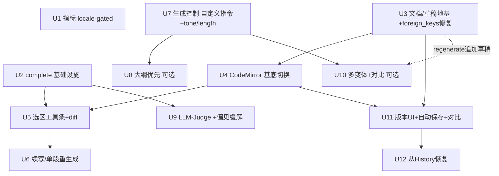

# Editor Optimization Roadmap — 从生成器到好用的写作工具

## Overview

Post Generator Studio 当前是一个**“生成器 + 只读预览”**：输入标题与事件摘要，流式生成整篇文章，输出区是一个裸 `Textarea`（raw）或 Markdown 预览，能做的操作只有复制、导出、保存、**整篇重生成（regenerate）**、调字号。

这份路线图把它升级为一个真正**好用的写作工具**，沿三条主线分阶段推进（balanced，全面战略路线图）：

1. **编辑/迭代体验** — 让“生成后的改稿”变顺手：选中段落改写/扩写/精简、续写、行内 AI 编辑的接受/拒绝、字数与阅读时长。
2. **生成质量与控制** — 让“一次生成”更准：自定义指令、语气/长度/受众控制、大纲优先、多版本对比、LLM-as-Judge 质量自评。
3. **工作流闭环** — 让“持续打磨”成立：每篇多版本草稿、版本对比、从历史继续改。

路线图按版本分三阶段：**v0.1（编辑迭代地基 + 文档持久化）→ v0.2（生成质量与控制）→ v0.3（版本工作流闭环）**。每阶段先落“快赢”，再落需要新基础设施的能力。

> **本计划已经过一轮重型 deepening**（架构审查 + 数据完整性审查 + AI 写作工具 UX 调研三股交叉验证），关键决策 D1（编辑器基底）已由“维持 textarea”翻转为“采用 CodeMirror 6”，并把“文档作为持久单元”从 v0.3 提前为 v0.1 地基，以修复 regenerate 吞掉用户编辑的潜伏 bug。详见 Key Technical Decisions 与各单元。

> **与现有文档的关系**：`docs/brainstorms/2026-06-25-comprehensive-iteration-requirements.md` 与 `docs/plans/2026-06-25-003-...` 讲的是 monorepo 迁移后的 **bug 修复 / 代码硬化**，且引用的 `packages/web/...` 路径在 “src/ single-tree consolidation”（`2026-06-25-005` 计划）后已失效。本计划是**产品方向**的独立路线图，建立在 `src/` 单树结构之上，不替代那条硬化线。

## Problem Frame

用户（单人、本地优先工具的作者）真实的工作流是：生成一篇 → 觉得某段不行 → 想只改那一段 / 换个语气 / 再长一点。今天工具只给了一个核武器——**整篇重生成**——它会清空所有已满意的内容（`use-generation-stream.ts:56` 每次生成都 `content: ""`），迭代成本极高，且**用户在输出区的手动编辑会被 regenerate 无法恢复地吞掉**。同时缺少任何“这篇写得怎么样”的反馈。

“更好用”在此 = **降低改稿单位成本** + **提高单次生成命中率** + **让多轮打磨可沉淀**。其根本是一次架构重定位：**让“文档”成为可持久、可编辑的单元，而“生成”只是喂给它的一个来源**——其余一切都是其上的交互。

## Requirements Trace

每条需求对应一个可观测的成功标准，后续实施单元回溯到这些编号。

- **R1（编辑体验）** 输出区实时显示字数 / 中文字符数 / 预估阅读时长；可读性分数按语言（locale）gate 并标注“英文可读性”。
- **R2（编辑体验）** 用户可在编辑器中选中一段文本，触发浮动工具条执行 AI 动作（改写 / 扩写 / 精简 / 换语气），结果以 diff 形式呈现，可接受或拒绝，未选中部分逐字不变。
- **R3（编辑体验）** 用户可“续写”（文末追加）或对单段重生成，而不丢失文档其余部分。
- **R4（生成控制）** 用户可在生成前填写自由文本“自定义指令”，并设置语气 / 目标长度 / 受众（请求级，非保存到 preset），结构化注入 prompt 影响输出。
- **R5（生成控制）** 用户可选择“大纲优先”流程：先生成可编辑大纲，确认后扩写为全文。
- **R6（生成质量）** 每篇生成可触发 LLM-as-Judge 五维评分（Relevance / Coherence / Factuality / Style / Completeness），含偏见缓解，结果以“试读者”口吻呈现而非权威判决。
- **R7（生成质量）** 用户可一次生成 N 个变体并排对比、选定其一进入编辑；**每个变体的编辑都持久化**，切换变体往返不丢编辑。
- **R8（工作流）** 同一篇生成可保存多个版本草稿，可在版本间切换与对比。
- **R9（工作流）** 用户可从 History 把一篇过往生成“恢复”回工作区继续编辑（载入其活跃草稿）。
- **NF1（基础设施）** 引入非流式一次性补全路径 `complete()`（同端口、可选方法、能力位 gate），支撑 R2/R3/R6，不破坏现有流式架构与分层依赖方向。
- **NF2（数据安全）** 引入可变文档/草稿模型，`generations` 保持不可变审计源；FK 级联真正生效（`PRAGMA foreign_keys = ON`）；草稿写入有终态门禁与事务保证。
- **NF3（质量纪律）** 每个功能承载单元保持 unit + integration 测试文化，分层边界不被违反。

## Scope Boundaries

- **不做** 实时协作 / 多用户 / 云同步 —— 本地优先单用户定位不变；变体/版本采用 last-write-wins，不建锁。
- **不做** TipTap / ProseMirror 富文本（WYSIWYG 节点树）—— 内容保持 markdown **字符串**模型；采用 CodeMirror 6（见 D1）。WYSIWYG 留作 future，仅当产品愿景明确转向所见即所得时再评估（届时基底翻回 TipTap）。
- **不做** WebSocket / 长连接 —— SSE 已足够。
- **不做** Yjs/CRDT 协同 —— 单用户用区域锁 + 位置映射即可（见 D7）。
- **不做** 自动 SEO / 配图 / 发布到外部平台 —— 超出“写作工具”核心。
- **不替代** 现有 bug 修复 / 类型安全硬化 backlog（003 线）—— 正交工作。
- **大纲优先（R5）与多变体（R7）** 标记为阶段内**可选增强**，时间紧可降级，不阻塞主线。

## Context & Research

### Relevant Code and Patterns

- **生成主流程**：`src/application/generation/generation-service.ts`（`streamGeneration()` line 145、`streamToProvider()` line 184）；UI 侧 `src/presentation/generation/use-generation-stream.ts`（`fetch("/api/generations")` line 37、**`content: ""` 清空 line 56**、SSE append `content: s.content + payload.value` line 88、regenerate 省略 `idempotencyKey` line 71-75）。
- **SSE 事件类型**（`src/domain/schemas/generation.ts:57-68`）：`generation | token | metadata | complete | error | final`。新增编辑能力复用同一契约或走非流式 JSON 路径。
- **Pipeline 步骤系统**：`src/domain/pipeline-steps.ts`（`BUILD_CONTEXT → RENDER_PROMPT → CLEAN_CONTENT → FORMAT_OUTPUT`），注册于 `src/plugins/pipeline/registry.ts`，由 preset 的 `enabledPipelineSteps`（JSON 数组）启用。质量评分 / 控制项注入可作为新 `PipelineStep` 干净插入。
- **Provider 适配器**：`src/infrastructure/providers/`（`base-adapter.ts` 抽象类含 `safeParseChunk`/timeout/`combineSignals`；`openai-compatible.ts` / `anthropic.ts` / `gemini.ts` / `ollama.ts`）。端口 `src/domain/ports/provider.ts` 当前**只有流式 `generate()`**，`capabilities()` 有 `supportsStreaming` 但无 `supportsCompletion` —— NF1 缺口。
- **输出 UI**：`src/presentation/generation/output-panel.tsx`（单个受控 `Textarea` raw line 54-60 + `ReactMarkdown` preview）；工作区编排 `generator-workspace.tsx:209-226`（仅以 `string` prop 绑定编辑器，下游无人知道编辑器类型——故基底可替换）。
- **持久化（关键约束）**：`generations` 表 `outputContent` 字段（`schema.ts:56-77`，nullable line 66）；`generation-repo.ts:113-118` **终态（completed/failed/cancelled）后 status/content 不可变**。**运行时 schema 真源是 `migrations.ts` 的 `INITIAL_SQL` + 幂等 ALTER guard（如 `custom_variable_defaults` block line 104-108），不是 drizzle-kit 的 `drizzle/*.sql`**（后者 `getDb()` 不执行，仅 `db:generate` 产物）。`migrations.ts:99` 与 `db.ts` **均未设 `PRAGMA foreign_keys = ON`**。`promptTemplateVersions` 表存在但未使用（且与草稿是不同实体，勿复用）。
- **历史**：`src/presentation/history/history-workspace.tsx`（分页 + 标题搜索 + 行内编辑）。

### Institutional Learnings

- `docs/optimization/generator-quality-spec.md` **已完整设计 LLM-as-Judge 评分体系**：五维 1-5 rubric、Judge prompt、采样/实验/成功标准（平均提升 ≥0.5）。R6 是“实现既有规格 + 补偏见缓解”，非从零设计。
- `docs/solutions/build-errors/` 有构建错误沉淀，实施时参考。
- 仓库测试文化成熟（99+ 测试，unit/integration/e2e 分层）。

### External References（AI 写作工具 UX 调研要点）

- **核心两律**：(1) 廉价指标常驻（字数/阅读时长/可读性为纯客户端运算，零 token，常显）；昂贵 AI 永远 opt-in（改写/评分耗 token+延迟，必须用户触发）。(2) **绝不静默覆盖**用户编辑或被选中的变体——信任头号杀手。
- **基底选型（已交叉验证）**：内容是 markdown **字符串**且流式逐字 append，CodeMirror 6（`@codemirror/lang-markdown` + `@codemirror/merge`）保持字符串模型、改动小，`coordsAtPos` 支撑浮动工具条、`@codemirror/merge` 免费提供 diff 接受/拒绝；TipTap 需把字符串流改写成节点树（大改 + mid-stream 序列化风险），故否决。
- **选中即改写**：浮动工具条出现在选区上方，少量高频动作；结果走**行内 diff + 接受/拒绝**，按选区长度过滤动词（单词 vs 句 vs 段）。
- **生成控制**：一个自由文本“自定义指令”框是最强廉价杠杆，胜过五个预设菜单；长度是最被遵守的旋钮、语气最被需要；tone/length 应是**请求级**字段（非 preset）。
- **多变体**：并排卡片 + 选定，2-3 个即够；变体的**编辑**必须各自持久化。
- **LLM-Judge 偏见**：verbosity bias（偏好更长 → “improve”循环会越改越臃肿）、self-enhancement（模型给自己打高 10-25% → 用不同 model 或打折）、position bias（偏好单输出评分而非两两对比）；用二元标签（清楚/不清楚）优于嘈杂的 Likert 数字；定位成鼓励性“试读者”，永不权威。
- **流式 + 可编辑**：流式期间编辑器应只读/程序化追加，完成（`final`）后才可编辑，避免 token 覆盖用户输入。

## Key Technical Decisions

- **D1：采用 CodeMirror 6 作为编辑器基底，内容保持 `string`；否决 TipTap，淘汰裸 textarea。**
  理由（绑定本代码库）：编辑器仅在 `output-panel.tsx` 一处被触碰，下游 Application/Domain/Infrastructure 只认 `string`，故换基底是**零跨层影响的就地替换**。决定性理由不是 bundle，而是 Unit 5/6 的人体工学——textarea 要浮动工具条得手写“隐藏 div 镜像测量光标几何”的脆弱 hack，CodeMirror 提供 `coordsAtPos()`；diff 接受/拒绝 textarea 要手写，`@codemirror/merge` 免费提供（Unit 5/6/11 共用）。原计划“维持 textarea”的反对理由（Markdown 双向同步冲突）是误把 TipTap 的问题安到 CodeMirror——CodeMirror 文档本身就是字符串，无此问题。**安装时须验证** `@uiw/react-codemirror` 的 React 19 兼容与 `@codemirror/merge` 的接受/拒绝 ergonomics（建议先 spike）。

- **D2：新增非流式一次性补全 `complete()`，置于现有 `LLMProviderAdapter` 端口、作为可选方法 + `BaseAdapter` 默认实现。**
  理由：`complete()` 与 `generate()` 共享 config/key/abort/timeout/请求构造，仅 `stream:false` 与“收全文 vs yield 事件”不同；放同端口内聚最高。可选方法 + 基类默认让四个现有 adapter 免费获得。**新增 `supportsCompletion` 能力位**，Application 层据此快速失败返回结构化 `AppError`，绝不调用未定义的可选方法（延续“可观测错误，绝不静默”纪律）。

- **D3：质量评分（R6）与控制项注入（R4）实现为 `PipelineStep`，复用可组合管线。**
  契合 `ARCHITECTURE.md` 既定扩展点，按 preset 的 `enabledPipelineSteps` 选择性启用，零侵入主流程。

- **D4：把“文档”与“生成”分为两个概念，且这是整份路线图最高杠杆的结构决策。**
  `generations` = **不可变审计记录**（prompts、snapshots、token、*原始* `outputContent`），终态守卫保留不动。`generationDrafts` = **可变文档**（编辑、自动保存、存为版本、变体选择都写这里），`generations.activeDraftId` 指向活跃草稿。分层干净：Domain 加 `GenerationDraft` schema + `GenerationDraftRepository` 端口；Infrastructure 实现 repo + 迁移；Application 加 `document-service` 编排“从生成建草稿/存编辑/列版本”；Presentation 的编辑器仍绑 `string`（活跃草稿内容），故 **CodeMirror 决策与文档模型决策彼此正交、干净组合**。**绝不**放松 `generations` 终态守卫去就地编辑 `outputContent`。（原“复用 `promptTemplateVersions` 表”的说法作废——那是不同实体。）

- **D5：行内 AI 编辑一律走 diff 接受/拒绝，绝不静默覆盖用户文本。** 小编辑用替换+撤销，多段编辑用候选卡/diff。

- **D6：regenerate 与变体 = 同一机制“追加一个草稿，切换分页器”。**
  改 `use-generation-stream.ts`：generate/regenerate **新开一个草稿**而非 `content: ""` 清空缓冲。R7 变体与 R8 版本是**同一张 `generationDrafts` 表**加一个 `source` 判别符（`generated` / `edited` / `rewrite`）。一表服务三需求，并直接修复 regenerate 数据丢失 bug。

- **D7：流式期间编辑器只读/程序化追加，`final` 事件后才转为用户可编辑（区域锁 + 位置映射，不用 CRDT）。**
  这是 CodeMirror 唯一须主动设计的 gotcha（受控编辑器被一个逐字增长的字符串驱动）：用 CM 的 `readOnly`/`EditableFilter` facet 表达，避免每 token 全量重置文档或让 CM 的编辑历史与流冲突。

## Open Questions

### Resolved During Planning / Deepening

- **编辑器基底？** → CodeMirror 6，内容保持 string（D1，已交叉验证）。
- **短调用流式还是非流式？** → 非流式 `complete()`，同端口可选方法 + 能力位（D2）。
- **可变文档放哪、何时建？** → 独立 `generationDrafts` 表，v0.1 地基；`generations` 保持不可变审计源（D4）。
- **regenerate 吞编辑怎么修？** → 追加草稿而非清空；变体与版本合一（D6）。
- **评分 rubric 从哪来？** → 复用 `generator-quality-spec.md` 五维 + 补偏见缓解。

### Deferred to Implementation

- **`@uiw/react-codemirror` React 19 兼容 + `@codemirror/merge` ergonomics**：Unit 4 前先做小 spike 验证。
- **`complete()` 超时/重试**：复用 base-adapter 的 120s 还是为短调用设更短超时？Unit 2 实测各 provider 延迟后定。
- **评分用哪个 provider/model**：固定独立“judge profile”还是复用当前 preset？为缓解 self-enhancement 倾向，倾向用与生成不同的 model；Unit 9 实现时按成本/可用性定。
- **多变体并发上限**：默认串行 2-3 还是小并发？Unit 10 实测本地/限流 provider 后定。
- **preview 模式选区改写**：`ReactMarkdown` 渲染态的选区映射回源文 offset 复杂；首版选区改写**仅 raw（CodeMirror）模式**，preview 改写延后。

## High-Level Technical Design

> *以下示意意在传达方案形状，是供评审校准方向的指导性内容，不是实现规格。实施 agent 应将其视为上下文，而非照抄的代码。*

### 文档 vs 生成的数据模型（D4/D6 的形状）

### 编辑迭代闭环（R2/R3 运行时形状）

### 单元依赖图（v0.1 地基在前）

### 控制项 → 输出影响（R4 决策矩阵）

| 控制项 | 取值示例 | 注入方式 | 质量杠杆 / 复杂度 |
|--------|----------|----------|-------------------|
| 自定义指令 | 自由文本 | 追加到 rendered userPrompt | 最高 / 低 |
| 长度 Length | 短(~150) / 默认 / 长(~600) | userPrompt 软约束 + maxTokens | 高 / 低 |
| 语气 Tone | 专业 / 轻松 / 故事化 | pipeline 步骤改 systemPrompt | 中高 / 低 |
| 受众 Audience | 大众 / 行业 / 新手 | userPrompt 约束 | 中 / 低 |
| 大纲优先 Outline | 开/关 | 两步生成（Unit 8） | 高 / 中 |

## Implementation Units

> 单元按依赖排序并归入版本阶段；每个功能承载单元都列了测试文件与场景。

### 阶段 v0.1 — 编辑迭代地基 + 文档持久化

- [ ] **Unit 1: 输出指标（字数 / 阅读时长，locale-gated 可读性）**

**Goal:** OutputPanel 底栏实时显示字数、中文字符数、预估阅读时长；可读性分数仅在英文内容时显示并标注。纯前端快赢。

**Requirements:** R1

**Dependencies:** 无

**Files:**
- Create: `src/lib/text-metrics.ts`（`countWords`, `countCjkChars`, `estimateReadingTime`, `englishReadability`）
- Modify: `src/presentation/generation/output-panel.tsx`（底栏指标）
- Test: `src/tests/unit/text-metrics.test.ts`

**Approach:**
- 纯函数；中英分别统计（CJK 按字符、拉丁按空白分词）；阅读时长按中文 ~400 字/分、英文 ~200 词/分。
- 计算前先 `stripMarkdown` 去标记/代码。可读性公式（ARI 或 Flesch-Kincaid）为英文调，**按 locale gate**：内容主体非英文时隐藏或标注“英文可读性（仅供参考）”，绝不当作门槛。
- `useMemo` 基于 `content` 派生。

**Patterns to follow:** `src/lib/utils.ts`（`stripMarkdown` 等纯工具）。

**Test scenarios:**
- Happy：纯中文 800 字 → 字数=800、阅读≈2 分钟、不显示英文可读性。
- Happy：纯英文 200 词 → 词数=200、阅读≈1 分钟、显示可读性。
- Edge：空串 → 全 0 不抛错。
- Edge：中英混排 + Markdown 符号 → 标记不计入正文字数。

**Verification:** 流式过程中数字跳动；手动编辑后同步；中文内容下不弹英文可读性。

---

- [ ] **Unit 2: 非流式补全基础设施 `complete()` + 能力位**（地基）

**Goal:** 为 Provider 适配器新增可选 `complete()` 一次性补全，经 application service 暴露为 `POST /api/completions`（JSON），Application 层按能力位 gate。

**Requirements:** NF1（支撑 R2/R3/R6）

**Dependencies:** 无（Unit 5/6/9 依赖它）

**Files:**
- Modify: `src/domain/ports/provider.ts`（`complete?(request, config, options): Promise<{ content; tokens? }>`；`ProviderCapabilities` 加 `supportsCompletion`）
- Modify: `src/infrastructure/providers/base-adapter.ts`（`complete()` 默认实现：单次非流式 fetch + parse）+ 各 adapter 覆写请求体/响应解析与 `supportsCompletion`
- Create: `src/application/content/completion-service.ts`（`completeText(prompt, presetId)`：取 config+解密 key→能力位检查→adapter.complete；不支持则抛结构化 `AppError`）
- Create: `src/app/api/completions/route.ts`（POST，Zod 校验，返回 JSON）
- Create: `src/domain/schemas/completion.ts`（`completionRequestSchema`）
- Test: `src/tests/unit/completion-service.test.ts`、扩展 `openai-compatible-adapter.test.ts`、新路由进 `api-routes-crud.test.ts`

**Approach:**
- 复用 `provider-service.testProfile` 同源的取 config+解密 key 路径与 `wiring`/registry。
- 错误结构复用 `AppError`，路由错误处理与现有 handler 一致。

**Execution note:** 先为 `completion-service` 写失败的集成测试（mock fetch 返回固定文本 + 一个 `supportsCompletion:false` 分支），再实现。

**Patterns to follow:** `base-adapter.ts`（fetch+timeout+`safeParseChunk`）；`provider-service.ts`（config+key）；现有 `api/*/route.ts` 校验/错误模式。

**Test scenarios:**
- Happy：mock adapter 返回固定文本 → service 返回该文本。
- Error：provider 未启用 / key 缺失 → 结构化 AppError。
- Error：`supportsCompletion:false` → 快速失败 AppError，不调用未定义方法。
- Error：provider 返回非预期结构 → 可观测错误，非静默空串。
- Integration：`POST /api/completions` 合法→200 JSON；非法→400。

**Verification:** curl `/api/completions` 拿到完整 JSON；现有流式生成回归通过。

---

- [ ] **Unit 3: 文档 / 草稿持久化地基（含 foreign_keys 修复）**（keystone）

**Goal:** 建立可变文档模型：`generationDrafts` 表 + `generations.activeDraftId`，`generations` 保持不可变审计源；regenerate 改为“追加草稿”而非清空。修复 FK 级联静默失效的 bug。

**Requirements:** R3/R7/R8 的共同地基；NF2；修复 regenerate 数据丢失

**Dependencies:** 无（Unit 4/5/6/10/11 依赖它）

**Files:**
- Modify: `src/infrastructure/storage/migrations.ts`（`INITIAL_SQL` 加 `CREATE TABLE IF NOT EXISTS generation_drafts`（FK `ON DELETE CASCADE` + `generation_id` 索引 + `kind`/`source` 列）；以 `PRAGMA table_info` guard 幂等 `ALTER TABLE generations ADD COLUMN active_draft_id TEXT`（nullable 无默认，瞬时不重写）；**在 line 99 旁加 `database.pragma("foreign_keys = ON")`**）
- Modify: `src/infrastructure/storage/db.ts`（`new Database(...)` 后立即 `pragma("foreign_keys = ON")`）
- Modify: `src/infrastructure/storage/schema.ts`（drizzle 定义 `generationDrafts` + `activeDraftId`，与 INITIAL_SQL 对齐）
- Create: `src/infrastructure/storage/generation-draft-repo.ts`（draft CRUD：list/create/update(working)/setActive/delete，事务包裹）
- Modify: `src/infrastructure/storage/generation-repo.ts`（`delete()` 同事务删除 drafts，FK 之外双保险 line 138-141）
- Modify: `src/domain/ports/storage.ts` + `src/domain/schemas/generation.ts`（`GenerationDraft` 类型 + `GenerationDraftRepository` 端口）
- Create: `src/application/content/document-service.ts`（从生成建草稿 / 解析活跃内容 / 懒生成）
- Modify: `src/presentation/generation/use-generation-stream.ts`（generate/regenerate 新开草稿，**移除 `content:""` 清空语义**改为切换活跃草稿）
- Test: `src/tests/unit/generation-draft-repo.test.ts`、`src/tests/integration/generation-drafts.test.ts`、`src/tests/unit/migrations-parity.test.ts`（`INITIAL_SQL` ↔ `schema.ts` 一致）

**Approach（含数据完整性硬规则）:**
- **有效内容解析**：`activeDraftId != null ? draft.content : generations.outputContent`。旧生成（无草稿）**首次编辑时懒生成**一条草稿并 set active；迁移**不批量回填**（纯 DDL 不碰数据，最安全）。
- **写入节奏**：(a) `status` 非终态时**禁止**写 draft（repo 层强制，不止 UI）；(b) 自动保存**原地 UPDATE** 单个 working draft，仅“存为版本”才 INSERT；(c) `createDraft + setActive` 与 `delete` 各包一个 `db.transaction`；(d) 删除草稿时若其为 active，则同事务把 `activeDraftId` 重置到另一草稿或 NULL（处理悬挂指针）。
- **FK 真生效**：`foreign_keys = ON` 必须在**每个连接**上设（连接作用域，每次 open 重置）；级联测试须跑真实 `getDb()` 连接而非临时内存库，否则假绿。

**Execution note:** 先写 repo 层迁移 + draft CRUD 的集成测试（含 FK 级联、事务、懒生成、悬挂指针）再接上层。

**Patterns to follow:** `migrations.ts` 的 `custom_variable_defaults` ALTER-guard（line 104-108）；现有 `generation-repo.ts` CRUD 与 `repo-utils.ts`。

**Test scenarios:**
- Happy：建生成→开 working draft→编辑→有效内容取 draft.content。
- Happy：regenerate → 追加新草稿，旧草稿与编辑仍在，不清空。
- Edge（必跑真实连接）：删 generation → 级联删 drafts，无孤儿行。
- Edge：删 active draft → `activeDraftId` 重置，读不报错。
- Edge：旧生成无草稿 → 回退 `outputContent`；首次编辑懒生成。
- Error：`status` 非终态时写 draft → repo 拒绝。
- Parity：`INITIAL_SQL` 与 `schema.ts` 字段一致。

**Verification:** regenerate 不再吞编辑；删一篇文章其草稿一并清除（真实 DB 验证）；旧库升级后既有生成可正常读。

---

- [ ] **Unit 4: CodeMirror 6 基底切换**

**Goal:** 把输出区 raw 模式从 `Textarea` 换成 CodeMirror 6（markdown），保留 `ReactMarkdown` 预览；内容仍为 `string`，对下游零影响。

**Requirements:** R2/R3 的编辑基底；D1/D7

**Dependencies:** Unit 3（编辑器绑活跃草稿内容）

**Files:**
- Add deps: `@uiw/react-codemirror`、`@codemirror/lang-markdown`、`@codemirror/merge`（安装前 spike 验证 React 19）
- Modify: `src/presentation/generation/output-panel.tsx`（`Textarea`→CodeMirror 包装，`value=content` / `onChange=onContentChange`；preview 分支不动）
- Create: `src/presentation/generation/editor/codemirror-editor.tsx`（封装 + `readOnly` facet 接 `isGenerating`）
- Test: `src/tests/unit/codemirror-editor.test.tsx`（渲染 + 受控 value + 流式只读）

**Approach:**
- 流式期间编辑器 `readOnly` / 程序化追加（D7），`final` 后可编辑；避免每 token 全量重置文档。
- App Router 下客户端加载（`"use client"` 已在；必要时 dynamic import 避 SSR）。

**Execution note:** 先做一次性 spike 确认 React 19 兼容与 merge ergonomics，再正式接入。

**Patterns to follow:** 现有 `output-panel.tsx` 受控 prop 契约（保持 `string`）。

**Test scenarios:**
- Happy：受控 value 渲染；onChange 透传。
- Happy：`isGenerating` 时只读，token 追加可见。
- Edge：raw↔preview 切换内容一致。
- Edge：空内容占位提示。

**Verification:** 切换后生成/编辑/导出全部如常，下游 string 契约不变。

---

- [ ] **Unit 5: 选区浮动工具条 + AI 改写（CodeMirror diff 接受/拒绝）**

**Goal:** raw 模式选中文本弹浮动工具条（改写/扩写/精简/换语气），调 `/api/completions`，结果用 `@codemirror/merge` 行内 diff 呈现，接受仅替换选区，拒绝还原。

**Requirements:** R2

**Dependencies:** Unit 2、Unit 4

**Files:**
- Create: `src/presentation/generation/editor/selection-toolbar.tsx`（`coordsAtPos` 定位）
- Create: `src/presentation/generation/editor/rewrite-actions.ts`（动作→prompt 映射，按选区长度过滤动词）
- Modify: `src/presentation/generation/editor/codemirror-editor.tsx`（接入工具条 + merge diff 接受/拒绝）
- Modify: `src/presentation/lib/api.ts`（`requestCompletion()` 客户端封装，统一经此路径）
- Test: `src/tests/unit/rewrite-actions.test.ts`、`src/tests/unit/selection-toolbar.test.tsx`

**Approach:**
- 选区改写**仅 raw（CodeMirror）模式**（preview 映射延后）。
- 动作 prompt 带标题 + 选区前后少量上下文以保持连贯，但只要求返回替换后的选区文本；接受落入活跃草稿（编辑持久化）。
- `isGenerating` 时禁用工具条。

**Execution note:** 先为“替换中段而不动首尾”写测试。

**Patterns to follow:** Unit 4 的 CodeMirror 封装；`components/ui/button.tsx`。

**Test scenarios:**
- Happy：选第 2 段换语气→接受→仅第 2 段变，1/3 段逐字不变。
- Happy：拒绝→完全还原无残留 diff。
- Edge：空选区→工具条不出现。
- Edge：选区在首/尾→替换不越界。
- Error：`/api/completions` 失败→提示，原文不动。
- Integration：生成中选区→工具条禁用。

**Verification:** 选一段换语气，diff 弹出，接受后只该段变，指标随之更新，刷新后编辑仍在（草稿持久化）。

---

- [ ] **Unit 6: 续写 / 单段重生成**

**Goal:** 提供“续写”（文末追加）与“重生成本段”（替换光标所在段），均不丢其余内容。

**Requirements:** R3

**Dependencies:** Unit 2、Unit 4、Unit 5（复用 diff/替换）

**Files:**
- Modify: `src/presentation/generation/editor/codemirror-editor.tsx`（续写/重生成本段动作）
- Modify: `src/presentation/generation/editor/rewrite-actions.ts`（continue / regenerate-paragraph prompt）
- Test: `src/tests/unit/rewrite-actions.test.ts`（扩展）、`src/tests/unit/paragraph-regen.test.ts`

**Approach:**
- 续写：全文为上下文，仅产出后续内容，append。
- 重生成本段：用 CodeMirror `lineAt`/文档 API 定位光标段 range，发该段+上下文，结果复用 Unit 5 的 merge diff 接受/拒绝。

**Patterns to follow:** CodeMirror 文档 API（替代手写 offset 扫描）；Unit 5 diff 组件。

**Test scenarios:**
- Happy：光标在第 2 段→重生成本段→仅第 2 段进 diff。
- Happy：续写→新内容追加文末，原文不动。
- Edge：空文档续写→等价普通生成或友好提示。
- Edge：多空行间段落定位正确不越界。

**Verification:** 续写两段、重生成中间一段，其余保持不变，全部落入活跃草稿。

---

### 阶段 v0.2 — 生成质量与控制

- [ ] **Unit 7: 生成控制（自定义指令 + 语气/长度/受众，请求级）**

**Goal:** 生成前可填自由文本“自定义指令”，并设语气/长度/受众，结构化注入 prompt。这些是**请求级**字段，不保存进 preset。

**Requirements:** R4

**Dependencies:** 无

**Files:**
- Modify: `src/domain/schemas/generation.ts`（**请求** schema 增 `customInstruction? / tone? / lengthTarget? / audience?` 可选字段）
- Create/Modify: `src/plugins/pipeline/registry.ts` 新增 `applyControlsStep`（插在 RENDER_PROMPT 后，按控制项调整 system/userPrompt；自定义指令追加到 userPrompt）
- Modify: `src/domain/pipeline-steps.ts`（注册新步骤 id）
- Modify: `src/presentation/generation/input-panel.tsx`（自定义指令文本框 + 三控件）+ `preview-prompt.ts`（预览纳入控制项）
- Test: `src/tests/unit/apply-controls-step.test.ts`、`src/tests/unit/schemas.test.ts`

**Approach:**
- 控制项→prompt 片段映射集中一处便于调参；长度同时影响约束与 `maxTokens` 提示（软约束“~N”）。
- 全空时与当前逐字一致（向后兼容）；保留 Custom 逃生口。

**Patterns to follow:** 现有 pipeline step 接口与 `renderPromptStep`；`computePromptPreview`。

**Test scenarios:**
- Happy：自定义指令“多用短句”→ userPrompt 含该指令。
- Happy：length=短→约束 + maxTokens 收紧。
- Happy：tone=轻松→systemPrompt 含对应片段。
- Edge：全空→prompt 与基线逐字相同。
- Edge：未知 tone→schema 拒绝或回退默认。

**Verification:** 切换控制项后 ConfigSidebar prompt 预览随之变化，生成体感不同。

---

- [ ] **Unit 8: 大纲优先生成（可选增强）**

**Goal:** “大纲优先”开关：先生成可编辑大纲，确认后扩写全文。

**Requirements:** R5

**Dependencies:** Unit 7（复用控制项）、Unit 2（大纲为一次性补全）

**Files:**
- Create: `src/presentation/generation/outline-panel.tsx`
- Modify: `src/presentation/generation/generator-workspace.tsx`（两步编排）
- Modify: `src/presentation/generation/editor/rewrite-actions.ts`（大纲 + 扩写 prompt）
- Test: `src/tests/unit/outline-flow.test.ts`

**Approach:**
- 第一步 `/api/completions` 产结构化大纲（小节列表，非段落粒度），用户增删改；第二步把大纲作约束走流式全文，扩写时传相邻小节上下文。开关关则走原单步。

**Test scenarios:**
- Happy：开大纲→生成→改一条→扩写→全文遵循。
- Edge：清空大纲后扩写→友好阻止或回退。
- Edge：开关关→行为同今日。

**Verification:** 端到端：开大纲、改两条、扩写，全文结构与大纲一致。

---

- [x] **Unit 9: LLM-as-Judge 质量评分（含偏见缓解）**

**Goal:** 实现既定五维 rubric 评分（1-5/维 + 理由 + 总分），含偏见缓解，以“试读者”口吻呈现。

**Requirements:** R6

**Dependencies:** Unit 2

**Files:**
- Create: `src/application/quality/judge-service.ts`（构造 Judge prompt、调 `completeText`、Zod 解析评分）
- Create: `src/domain/schemas/quality.ts`（`qualityScoreSchema`）
- Modify: `src/infrastructure/storage/schema.ts` + `migrations.ts` + `generation-repo.ts`（Generation 加 `qualityScore?`(JSON) 可空字段，幂等 ALTER guard）
- Create: `src/app/api/generations/[id]/score/route.ts`
- Create: `src/presentation/generation/quality-badge.tsx`（分数徽章 + 逐维理由展开）
- Modify: ConfigSidebar 或 OutputPanel 接入
- Test: `src/tests/unit/judge-service.test.ts`、`src/tests/unit/quality-schema.test.ts`、`src/tests/integration/generation-score.test.ts`

**Approach（含偏见缓解）:**
- 复用 spec 的 Judge prompt 与五维定义；要求严格 JSON，Zod 解析，失败给可观测错误。
- **缓解**：(a) 评分优先用**与生成不同的 model**（self-enhancement，否则对分数打折）；(b) 内部用**二元/枚举标签**（清楚/不清楚）再聚合，弱化 Likert 噪声；(c) 单输出评分而非两两对比（position bias）；(d) UI 文案定位“试读者建议”，**不**驱动自动 improve 循环（避免 verbosity bias 越改越长）。
- 按需触发（按钮），不阻塞生成；结果持久化。

**Execution note:** 先写 judge-service 失败测试，固定一份样例 JSON fixture。

**Patterns to follow:** `generator-quality-spec.md`；Unit 2 `completeText`。

**Test scenarios:**
- Happy：mock 合法五维 JSON→结构化分数 + 正确 overall。
- Error：非 JSON/缺维度→Zod 报错，UI 显示失败，不写脏数据。
- Edge：空内容→阻止或明确提示。
- Integration：`POST .../score`→持久化且 History 可读回。

**Verification:** 点“评分”，徽章显总分，展开见五维 + 一句理由，刷新仍在，文案为建议口吻。

---

- [ ] **Unit 10: 多变体生成 + 并排对比（可选增强）**

**Goal:** 一次生成 2-3 变体，并排对比，选定其一进入编辑；**每个变体的编辑经草稿持久化**。

**Requirements:** R7

**Dependencies:** Unit 3（变体编辑落 drafts）、Unit 7（变体可叠不同控制），可选叠 Unit 9（按分排序）

**Files:**
- Modify: `src/presentation/generation/generator-workspace.tsx`（变体数选择 + 对比编排）
- Create: `src/presentation/generation/variant-compare.tsx`（并排卡片 + 选定）
- Modify: `src/presentation/generation/use-generation-stream.ts`（串行/小并发多次生成，互不覆盖）
- Modify: `src/infrastructure/storage/schema.ts`（`generations` 加 nullable `parent_generation_id` 分组，或采纳“变体即顶层生成”方案——见 D6）
- Test: `src/tests/unit/variant-compare.test.ts`、扩展 `use-generation-stream.test.ts`

**Approach:**
- 默认 2-3 变体，串行/小并发（实测定上限）；每变体独立 generation，**编辑写各自的 `generationDrafts`**，切换往返不丢编辑（关键，依赖 Unit 3）。选定的进主编辑区。

**Test scenarios:**
- Happy：请求 3 变体→3 条独立内容互不串台。
- Happy：编辑变体 2→切到变体 1→再切回→变体 2 编辑仍在（草稿持久化）。
- Edge：某变体失败→其余可用，标记失败项。
- Edge：并发取消→全部停止。

**Verification:** 生成 3 变体，分别编辑后来回切换，编辑均不丢失。

---

### 阶段 v0.3 — 版本工作流闭环

- [ ] **Unit 11: 版本 UI + 自动保存 + 版本对比**

**Goal:** 在已存在的草稿表之上提供版本 UI：自动保存 working draft、“存为版本”、版本切换、版本对比。

**Requirements:** R8

**Dependencies:** Unit 3（草稿表/repo 已就绪）、Unit 4（编辑器）

**Files:**
- Create: `src/presentation/generation/draft-switcher.tsx`（版本下拉 + 存为新版本 + 切换）
- Modify: `src/presentation/generation/editor/codemirror-editor.tsx`（自动保存 debounce 接 working draft；版本对比用 `@codemirror/merge`）
- Modify: `src/app/api/generations/[id]/drafts/route.ts`（GET/POST 草稿——若 Unit 3 未建则此处建）
- Modify: `src/application/content/document-service.ts`（list 版本 / 存为版本）
- Test: `src/tests/integration/generation-drafts.test.ts`（扩展版本 UI 路径）、`src/tests/unit/draft-switcher.test.tsx`

**Approach:**
- 自动保存 debounce（~500ms-1s）**原地 UPDATE** working draft，**非终态不写**（Unit 3 已强制）；“存为版本”INSERT 一条 `kind:'snapshot'`。
- 版本切换设 `activeDraftId`；对比读两条 draft 用 merge 视图。
- **版本切换入口须显眼**（研究示一处放置不当导致 76.5% 误点率）。

**Test scenarios:**
- Happy：存 3 版本→列表时序正确；切换生效。
- Happy：版本 A vs B 对比→显示差异。
- Edge：无 snapshot→回退 working/outputContent。
- Edge：自动保存在生成中→被 repo 拒绝（不落半成品）。
- Integration：编辑后存版本→刷新仍在可切回。

**Verification:** 一篇文章存两版、来回切换并对比；自动保存在重载后恢复编辑。

---

- [ ] **Unit 12: 从 History 恢复到工作区继续编辑**

**Goal:** History 选一篇过往生成，一键“恢复编辑”载入工作区（含活跃草稿），继续打磨。

**Requirements:** R9

**Dependencies:** Unit 11（载入活跃草稿），现有 History 页

**Files:**
- Modify: `src/presentation/history/history-workspace.tsx`（「恢复编辑」→跳 generator 带 `?generationId=`）
- Modify: `src/presentation/generation/generator-workspace.tsx`（读 `?generationId=` 初始化：还原 title/eventSummary/preset/活跃草稿内容）
- Modify: `src/presentation/lib/api.ts`（按 id 取完整 generation + drafts）
- Test: `src/tests/unit/restore-from-history.test.ts`、扩展 `src/tests/e2e/generation-flow.spec.ts`

**Approach:**
- 复用现有 URL 参数初始化机制（`generator-workspace` 已读 `?title=&summary=`，扩展为 `?generationId=`）；恢复后 Unit 5/6/11 编辑动作即可继续。

**Test scenarios:**
- Happy：History 点“恢复编辑”→载入标题/摘要/活跃草稿。
- Edge：被删 generationId→友好错误不白屏。
- Edge：无草稿旧生成→载入 `outputContent`（懒生成草稿）。
- E2E：生成→History→恢复→续写→存版本，全链路通。

**Verification:** 从 History 恢复旧文，续写并存新版本，全程无丢失。

## System-Wide Impact

- **交互图 / 入口**：新增 `POST /api/completions`、`POST /api/generations/[id]/score`、`/api/generations/[id]/drafts`，均沿用现有 route handler 校验/错误模式。编辑器与流式生成共享同一 `content` 状态——`isGenerating` 时全面禁用编辑动作（D7），生成/regenerate 切换活跃草稿而非清空。
- **错误传播**：新短调用复用 `AppError` 结构化错误，UI 局部提示；评分/改写失败绝不污染原文（D5）；`complete()` 不支持时能力位快速失败（D2）。
- **状态生命周期（数据安全硬规则）**：`generations` 终态不可变守卫保留；可变内容一律走 `generationDrafts`。**写入节奏**：(a) 非终态禁止写 draft（repo 强制）；(b) 自动保存原地 UPDATE 单个 working draft，仅“存为版本”INSERT；(c) `createDraft+setActive` 与 `delete` 包事务；(d) 删 active draft 时同事务重置 `activeDraftId`。**FK 级联**：`PRAGMA foreign_keys = ON` 须在每个连接设（`migrations.ts` + `db.ts`），删除走 repo 事务双保险；级联测试跑真实连接。`qualityScore`/`activeDraftId`/`parent_generation_id` 均 nullable 向后兼容。
- **API 表面一致性**：客户端调用统一经 `src/presentation/lib/api.ts`，避免绕过封装（与 003 线 R17 同源教训）。
- **迁移真源**：运行时 schema 真源是 `migrations.ts`（`INITIAL_SQL` + 幂等 ALTER guard），**不是 drizzle-kit**；新表/列两处都要（新装走 INITIAL_SQL、旧装走 guard），并加 `INITIAL_SQL ↔ schema.ts` parity 测试。
- **不变量**：现有流式生成（`/api/generations` SSE）契约、6 种 SSE 事件、Pipeline 默认四步、Provider 流式 `generate()` 一律不改动；新能力以新增端口方法 / 新 Pipeline 步骤 / 新表/字段叠加，向后兼容。

## Risks & Dependencies

| 风险 | 缓解 |
|------|------|
| 🔴 `foreign_keys` 默认 OFF，`ON DELETE CASCADE` 静默失效留孤儿行，且测试可能假绿 | Unit 3 阻塞前置：`migrations.ts` + `db.ts` 每连接设 `PRAGMA foreign_keys = ON`；repo 删除走事务双保险；级联测试跑真实 `getDb()` 连接 |
| regenerate `content:""` 吞掉用户编辑且不可恢复 | D6：regenerate 追加草稿而非清空（Unit 3）；编辑持久化于 drafts |
| Unit 10 变体编辑无处存（`outputContent` 不可变） | 变体编辑写 `generationDrafts`，加 `parent_generation_id` 分组（Unit 3/10 打通） |
| 流式 token 写入与用户编辑竞争覆盖文本 | D7：`isGenerating` 时编辑器只读/程序化追加，`final` 后才可编辑；编辑动作全面禁用 |
| `@uiw/react-codemirror` / `@codemirror/merge` 与 React 19 兼容未知 | Unit 4 前先 spike 验证，再正式接入 |
| 自动保存原地 UPDATE + append 模型若误用产生海量垃圾行 | 单 working draft 原地 UPDATE，仅“存为版本”INSERT（Unit 11） |
| `activeDraftId` 悬挂指针（指向已删草稿）→读崩 | 删草稿同事务重置指针或禁删 active（Unit 3） |
| LLM-Judge 偏见（verbosity/self-enhancement/position）→分数失真、improve 循环膨胀 | Unit 9 缓解：不同 model 评分/打折、二元标签、单输出评分、“试读者”口吻不驱动自动 improve |
| 可读性公式英文调，中文内容下误导 | Unit 1 按 locale gate/标注“英文可读性” |
| 迁移双真源（手写 `INITIAL_SQL` vs drizzle-kit）漂移 | 真源定为 `migrations.ts`；`db:generate` 仅留 schema-of-record；加 parity 测试 |
| `complete()` 各 provider 延迟/行为不一致 | Unit 2 实测后单独设短调用超时；失败结构化报错 |
| 多变体并发压垮本地/限流 provider | 默认串行/小并发，实测定上限 |
| 路线图过长导致 v0.1 迟迟不交付价值 | Unit 1 即时快赢；Unit 8/10 标可选可降级 |

## Documentation / Operational Notes

- 每阶段完成后更新 `ARCHITECTURE.md` 扩展点表（新增 `/api/completions`、评分步骤、`generationDrafts` 表、CodeMirror 基底）与 `README.md` 功能列表。
- Unit 9 落地后，把 `generator-quality-spec.md` 的实验/采样策略接上真实评分入口，形成质量回归基线。
- 新增 DB 字段/表须配套 `pnpm db:generate`（保持 schema-of-record 同步）+ `migrations.ts` 幂等 guard；发版前 `pnpm test` + `pnpm test:e2e` 全绿，且级联/事务测试跑真实连接。

## Sources & References

- 现状代码：`src/presentation/generation/{output-panel,generator-workspace,use-generation-stream}.tsx`（line 56 清空 / line 88 append）；`src/application/generation/generation-service.ts`；`src/plugins/pipeline/registry.ts`；`src/domain/ports/{provider,storage}.ts`；`src/infrastructure/storage/{migrations,db,schema,generation-repo}.ts`、`providers/base-adapter.ts`。
- 架构与扩展点：`ARCHITECTURE.md`。
- 质量评分规格（R6 直接复用）：`docs/optimization/generator-quality-spec.md`。
- 正交工作线（非本计划）：`docs/plans/2026-06-25-003-fix-comprehensive-v0-3-iteration-plan.md`、`docs/brainstorms/2026-06-25-comprehensive-iteration-requirements.md`。
- Deepening 来源：架构审查（D1/D4/D6/D7 与 complete() 端口）、数据完整性审查（foreign_keys、迁移机制、写入节奏、变体持久化）、AI 写作工具 UX 调研（CodeMirror、自定义指令、judge 偏见、流式可编辑）。
