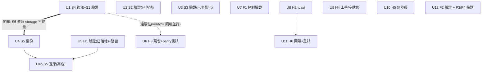

# Comprehensive Optimization Roadmap — Stability Wrap-up + UI/UX Humanization

## Overview

把 Post Generator Studio 從「功能堆疊但體驗粗糙」推進到「感覺像成品」。盤點顯示：穩定性大致穩固（待一次複核確認）、功能線已交付到 U9、真正缺口是 **UI/UX 人性化**。本計劃聚焦**可立即交付的 P1（穩定收尾 + 高危體驗）與 P2（體驗人性化）**——這兩階段合起來是一個可獨立發布的增量。已建的功能單元（F1/U7 生成控制、F2/U9 評分）改為「驗證 + 收殘留」而非重建；P3 版本閉環（U11/U12）與選配（U10 多變體）的 HOW 沿用 `006` 計劃，本計劃只列接點。

> ⚠️ **完成度時效性（本計劃最重要的一條）**：分支由平行程序實時推進——撰寫到第二輪審查間 HEAD 已走 `6a990c64` → `d4b99699` → `fc7e14aa`（PR #9/#10/#11）。**已驗證落地**：S3 `update()` 事務化、H3 狀態 i18n、S1 測試 `{ timeout: 10_000 }`、**S2 `validateChunkShape` 已在四個 adapter**、**H1 `confirm-dialog.tsx` + `@radix-ui/react-alert-dialog` 已裝且四刪除點已接**——故 **Unit 1/2/3/5/6 皆改為「驗證 + 收窄殘留」**。**真正待建**：**S5（備份/還原，唯一大工程）、H2 toast、H4 上手、H5 a11y、H6 重試**（+ 各 verify unit 的測試殘留）。**實作每個 unit 前必先 `git log` + grep 重核分類（build vs verify）**——這不是「行號漂移」而是「整單元分類可能已變」（本計劃審查期間就有 4 個 unit 從 build 翻成 verify）。所有行號為線索非真理。（see origin: docs/brainstorms/2026-06-26-comprehensive-optimization-roadmap-requirements.md）

## Problem Frame

對象是單人、本地優先的內容作者（已確認＝開發者本人、桌面為主）。痛點按風險排序：**整庫資料無備份**（最大不可逆風險）、**刪除無確認**（誤刪即不可恢復）、**狀態字串中英夾雜**（zh-CN 下中英混雜）、**新人撞錯誤牆**（未配 provider 點 Generate 直接報錯）、無 toast/無障礙/無失敗重試。設計系統地基（Tailwind/CSS 變數/Radix/動畫）已有，缺的是「成品感」那層。（see origin: Problem Frame）

**北極星成果指標**：「到一篇可發布稿所需的重生成/改稿次數下降」。⚠️ 目前無埋點，階段重估閘門為**定性自評**；想要數據可在 P1 順手加一個輕量「每篇重生成/編輯計數」（持久化於 draft，需一欄＋三處 migration，見 KTD-6），否則勿包裝成「指標驅動」。

## Requirements Trace

P1（穩定收尾 + 高危體驗）：
- **S4.** 穩定複核（首件）：逐條核對舊 `comprehensive-iteration` R1/R3/R7-R10/R14-R23 在現 `src/` 樹現況；判定 S1 flaky 根因（race vs 延遲）。複核可能重開穩定範圍 → P1 成員/「P1+P2 可發布」/「不大改架構」三承諾在 S4 前皆**暫定**。
- **S1.** `/api/bootstrap` flaky 測試穩定化（依 S4 根因）。
- **S2.** Provider adapter `parseChunk`「物件但欄位形狀錯」缺口 → 加 per-adapter 欄位驗證（疊在既有 `safeParseChunk` 上）。
- **S3.** `generation.update()` 的 cancel-vs-complete race → 把 read-modify-write 收進單一同步 `db.transaction`。
- **S5.** DB 整檔備份 + 還原（含密鑰），用 `.backup()`，覆寫前 H1 級確認。
- **H1.** 所有破壞性刪除（generation/provider/template/preset）加二次確認。
- **H3.** 生成狀態 + 錯誤字串全面 i18n（含原始 provider 錯誤訊息包裝，留在 P1 不延到 H6）。
- **F1 殘留.** 驗證 prompt 預覽是否反映生成控制、控制標籤是否已 i18n。

P2（體驗人性化）：
- **H2.** toast/通知元件（`@radix-ui/react-toast`；成功自動消失、錯誤持久並承載重試）。
- **H4.** 首次上手與空狀態引導。
- **H5.** 無障礙修復（精簡範圍：tab role、焦點管理、aria-disabled、aria-describedby；aria-live 播報為可選）。
- **H6.** 操作回饋（複製/儲存視覺確認）+ 失敗重試（入口在持久失敗介面）。

P3/P4（本計劃只列接點，HOW 見 `006`）：
- **F2/U9 殘留.** 驗證評分；單一 model fallback 定為「停用+提示」。
- **F3 / F4 / F5.** 版本 UI（006-U11）/ 從歷史恢復（006-U12）/ 多變體（006-U10）——HOW 引用 `006` 計劃對應 Unit。（注意：「006-U*」指**編輯器 roadmap** 的單元編號，與本計劃自身的 Unit 10/11/12 是不同命名空間。）

## Scope Boundaries

- **不做** 多用戶/雲同步/協作、TipTap/WebSocket/CRDT、自動 SEO/配圖/外部發布（沿用 006）。
- **不重建** 已落地的編輯器單元（006-U7 生成控制＝F1、006-U8 大綱、006-U9 評分＝F2）——只驗證收殘留。（這些是 006 命名空間，勿與本計劃 Unit 7/8/9 混淆。）
- **不大改穩定性架構**（前提：S4 複核未翻出回歸）。
- **H5 螢幕報讀器 aria-live 播報、H7 行動端**降為可選（使用者＝開發者桌面）。本計劃**不含 P2 的 H7**（整項可選順延）。
- **F2 單一 model fallback 不採「同模型打折」**（自評扭曲相對排序，打折仍不可信）。
- **不新增資料表**（P1/P2 全部 unit 皆不需要；S5 是檔案操作；唯一可選的 regen 計數欄見 KTD-6，預設不做）。

## Context & Research

### Relevant Code and Patterns

**儲存 / 資料層**
- `src/infrastructure/storage/db.ts:17-21` — `new Database(getDatabasePath())` + `pragma("journal_mode = WAL")` + `pragma("foreign_keys = ON")`。**任何新開的連線都要重設這兩個 pragma**（per-connection）。
- `src/infrastructure/storage/migrations.ts` — 執行期 schema 真源＝`INITIAL_SQL` + 冪等 `PRAGMA table_info` ALTER guard（pattern 在 `:118-131`：`custom_variable_defaults`/`active_draft_id`/`quality_score`）；`ensureStorageDirectories()`（`:102`）已建 `getBackupsDir()` 但**未使用**。新表/欄要改三處（INITIAL_SQL + ALTER guard + `schema.ts`）+ parity 測試。**drizzle-kit 的 `drizzle/*.sql` 非執行期真源**。
- `src/infrastructure/storage/generation-repo.ts` — **`update()`@117 已是 `db.transaction((tx) => {...})`@119**（含 `canTransition`@112/126 + 重讀，HEAD `d4b99699` 已落地，非「非事務」）；`delete()`@155 同樣事務化。終態守衛不可放鬆。→ S3 改為驗證既有事務是否真涵蓋 cancel-vs-complete race（Unit 3）。
- `src/infrastructure/config/paths.ts` — `getDataHome()`(~/.post-generator)、`getDatabasePath()`、`getSecretsDir()`、`getExportsDir()`、`getBackupsDir()`、`getLogsDir()`。
- `src/infrastructure/security/secrets.ts` — `getEncryptionKey()`@58-72：`POST_GENERATOR_SECRET_KEY` 若設則用（hex-64 raw / 否則 sha256），未設則派生自 `sha256(post-generator-dev-key:${username}:${homedir})`@69-71；密文存 `getSecretsDir()/{ref}.json`（AES-256-GCM、檔案模式 0o600）；`readSecret` 缺檔回 `undefined` 不拋；`deleteSecret`/覆寫須先 `cacheInvalidate` 再動 fs。

**Provider 適配器**
- `src/infrastructure/providers/base-adapter.ts` — 已有 `safeParseChunk`（非物件/拋例外 → 可觀測錯誤）+ timeout（`AbortSignal.any`，預設 120s）。**勿重建外層 guard**。
- cast 點：`ollama.ts:71,89`、`gemini.ts:60,105`、`anthropic.ts:64,87`、`openai-compatible.ts:91,109,136`（anthropic completion 路徑已部分驗證、串流未驗）。

**Presentation**
- 刪除點：`history-workspace.tsx:43`(`handleDelete`)/`:114`、`provider-profiles-panel.tsx:269`(`remove(profile.id)`)、`prompt-templates-panel.tsx:243`(`remove(template.id)`)、`generation-presets-panel.tsx:202`(`remove(preset.id)`)。
- 狀態字串（H3）：**已 i18n**（`use-generation-stream.ts:26` `useTranslations("Generation")`、`:29` `t("statusReady")` 等，HEAD `d4b99699`）。真殘留只剩：`:122` `payload.message || payload.error?.message`、`:143` `streamError.message`（裸 provider 錯誤）、`:132` `: payload.generation.status`（status enum fallthrough）。i18n parity 測試尚未存在（只有 `i18n-request.test.ts`）。
- toast/狀態現況：`settings-workspace.tsx` 的 `notify()`（3s）、`generator-workspace.tsx` 的 `setStatus()`。
- 客戶端 API 一律經 `src/presentation/lib/api.ts`（勿繞過 wrapper）。
- i18n：`messages/en.json` / `messages/zh-CN.json` 須 key-set 相等（缺 key → next-intl render 期拋錯）；`useTranslations()` 消費者須在 `NextIntlClientProvider` 內——**Radix toast/dialog 走 portal，須確認仍在 provider 樹內**。locale＝`NEXT_LOCALE` cookie + Zustand 鏡像，`router.refresh()` 切換。
- 既有 Radix（8 個套件）：`@radix-ui/react-dialog`、**`@radix-ui/react-alert-dialog@^1.1.17` 已裝**（H1 用，`confirm-dialog.tsx` 也已建並接好四刪除點）；**僅 `@radix-ui/react-toast` 仍未裝**（H2 需新增）。

### Institutional Learnings

- `docs/solutions/build-errors/lint-staged-eslint9-execa-shell-env-2026-06-25.md` — lint-staged 經 execa 無 shell，inline `VAR=value cmd` → ENOENT；專案用 legacy `.eslintrc.json`（需 `ESLINT_USE_FLAT_CONFIG=false`），env 走 `scripts/eslint-fix.sh`。**任何動到 hook/eslint config 的 unit 都要走 wrapper**；首次 build/type 錯先查 `docs/solutions/build-errors/`。
- `006` 計劃：`generations` 不可變審計源、可變內容走 `generation_drafts`、終態守衛、API 經 `lib/api.ts`。
- `export-service.ts:17` 匯出的是 `generation.outputContent`（**非 active draft**）——草稿模型上線後它匯出的是舊原文；若 S5/F3 觸及匯出需留意（S5 走整庫 `.backup()` 可規避此問題）。
- 淨新領域（無前例）：next-intl portal 行為、Radix toast 無障礙接線、`.backup()` 還原衝突處理（schema 版本/ID-FK）——後者列 Deferred。

## Key Technical Decisions

- **KTD-1（S5 用 `.backup()` 不裸 copy）**：WAL 下最新寫入可能還在 `-wal`，裸 copy `post-generator.db` 會掉資料。用 better-sqlite3 `.backup()`（WAL 安全）。
- **KTD-2（S5 密鑰：功能 + 機密性雙重）**：備份 bundle 含 `getSecretsDir()`（只搬密文 envelope），否則還原後 provider 憑證全壞（API key 不在 DB）。**功能面**：跨機還原需兩端設同一 `POST_GENERATOR_SECRET_KEY`（預設金鑰綁 username+homedir，換機/換 POSIX user 即解不開）。**機密性面（F1）**：未設 `POST_GENERATOR_SECRET_KEY` 時，密文僅由弱預設金鑰保護，bundle 一旦離機（雲端/email）≈ 明文 API key → 含密鑰備份須警告且**分享預設改為「不含密鑰」**。
- **KTD-3（S5 還原＝高危覆寫 → validate-before-destroy + 關連線 + 可回滾）**：連線是 process 單例（`db.ts:8`、永不關、`migrated` 不重置），故還原**不能**直接覆寫 live 檔。正解序列：先在 temp 驗證 bundle（`integrity_check`/`foreign_key_check`/schemaVer/zip-slip）→ 完整自我備份（DB+secrets，失敗即 abort）→ `closeDb()`（關連線+重置單例+`migrated`）→ 刪 `-wal`/`-shm` sidecar → 覆寫 db+secrets → 重開並重跑 migrations（forward-heal）→ 清 secrets cache → reconcile 非終態 generation。任一步失敗從自我備份回滾。覆寫確認用 H1 `ConfirmDialog`（見 Unit 4b）。
- **KTD-10（S5 還原端安全：不信任 bundle + 阻 CSRF）**：bundle 可能離機回來＝不可信輸入 → restore selector 用 opaque id（非 client 路徑）、secrets 檔名走 `[^a-zA-Z0-9_-]` allowlist + 解析路徑須在 `getSecretsDir()` 內、驗 envelope `algorithm`。備份/還原路由加 server 端 origin guard（`Sec-Fetch-Site` ∉ {same-origin,none} 即拒）阻 CSRF——H1 對話框是前端 UI、擋不住直接打 API；並加 `-H 127.0.0.1` 到 `dev`/`start`（next 預設 0.0.0.0，目前未綁 loopback）。產出檔案顯式 chmod 0o600 / 目錄 0o700。
- **KTD-4（S2 只補欄位驗證）**：疊在 `safeParseChunk` 上做 per-adapter 欄位形狀檢查，不重建外層 guard、不重設 timeout。手寫 type guard vs Zod 留 Deferred（逐 provider 評估 bundle）。
- **KTD-5（S3 同步事務）**：把 `get(id)` 存在性 + `canTransition` + write 收進單一 `db.transaction`（沿用 `delete()` 的 `tx` 範本）。better-sqlite3 事務**同步**，故現行 `await this.get()` 在事務內要走同步讀。
- **KTD-6（北極星計數，預設不做）**：若要數據支撐閘門，加 `generation_drafts.regen_count`/`edit_count`（一欄＋INITIAL_SQL＋ALTER guard＋schema.ts＋parity 測試）。預設**不做**，閘門維持定性自評。
- **KTD-7（H1 用 alert-dialog）**：新增 `@radix-ui/react-alert-dialog`，封裝一個 `ConfirmDialog` 共用元件（`src/presentation/components/ui/`），四個刪除點共用；高衝擊刪除（provider，因連帶 presets/templates/history）文案更強。
- **KTD-8（H2 用 Radix toast、行為分流）**：新增 `@radix-ui/react-toast`，全域 Provider 掛在 `layout.tsx` 的 `NextIntlClientProvider` **內**（portal 仍需 translations）。成功/資訊自動消失；錯誤持久 + 承載重試。取代 `notify()`/`setStatus()` 散落文字。
- **KTD-9（H3 provider 錯誤包裝留 P1）**：原始 provider 英文錯誤訊息的 i18n 包裝屬 H3/P1，H6 只負責失敗 UI 呈現/重試——否則「P1 後 zh-CN 無英文殘留」反依賴 P2（反模式）。

## Open Questions

### Resolved During Planning
- **toast/dialog 自建 vs Radix？** → Radix（`react-toast` + `react-alert-dialog`），與既有 7 個 Radix 套件一致（KTD-7/8）。
- **S5 備份格式？** → 整庫 `.backup()` + secrets 目錄，非 per-table 匯出（KTD-1/2）。
- **F2 單一 model fallback？** → 「停用+提示」（不採同模型打折）。
- **H5/H7 範圍？** → 精簡（使用者＝開發者桌面）；H7 不在本計劃。

### Deferred to Implementation
- **S1 根因**（race vs 延遲）→ 由 S4/U1 先判定，再決定「mock 服務」或「提高該測試 timeout」。
- **S2 欄位驗證手寫 type guard vs Zod**（逐 provider）。
- **S5 跨版本還原（新→舊 app）**：整庫覆寫式還原 + 還原後重跑 migrations 能 forward-heal「舊 backup → 新 app」（H5）；「新 backup → 舊 app」以 `PRAGMA user_version` gate 拒絕（**前提：先建 user_version 機制，見 Unit 4b Files/AP2**——目前 migrations.ts 無版本概念，gate 在此前不成立）。完整 downgrade 策略仍 Deferred。
- **working draft 與 version 的概念關係**（影響未來 F3/U11；本計劃不觸及）。
- **H4 三個面的空狀態文案/CTA**（各自「下一步」不同，實作時定稿）。

## High-Level Technical Design

> *以下示意傳達方案形狀，是供評審校準方向的指導性內容，非實作規格。實作 agent 應視為上下文，而非照抄的程式碼。*

### S5 備份 / 還原資料流（KTD-1/2/3 的形狀）

```mermaid
flowchart TB
  subgraph Backup
    DB["post-generator.db (+ -wal)"] -->|".backup() WAL-safe"| BK["getBackupsDir()/backup-&lt;ts&gt;.db"]
    SEC["~/.post-generator/secrets/*.json"] -->|"copy"| BKS["bundle/secrets/"]
    BK --> BUNDLE["backup bundle (.db + secrets/ + meta: schemaVer, createdAt)"]
    BKS --> BUNDLE
  end
  subgraph Restore["Restore (validate-before-destroy, 順序不可換)"]
    SEL["selector = opaque id (非 client 路徑)"] --> VAL["1. temp 解包 + 驗證 (integrity_check / foreign_key_check / schemaVer / zip-slip / envelope algo)"]
    VAL --> SB["2. 完整自我備份 DB+secrets (失敗即 abort)"]
    SB --> CLOSE["3. closeDb() 關單例連線 + 重置 migrated"]
    CLOSE --> DEL["4. 刪 .db + -wal + -shm sidecar"]
    DEL --> OVR["5. 覆寫 db + secrets (永不清空 data home)"]
    OVR --> REOPEN["6. 重開 + 重跑 migrations (forward-heal) + 清 secrets cache + reconcile 非終態"]
    REOPEN -. 任一步失敗 .-> RB["從自我備份回滾"]
    SEL -. CSRF: server 端 origin guard .-> SEL
  end
```

### 階段依賴圖

## Implementation Units

> Phase 1 = P1（穩定收尾 + 高危體驗，含 S4 前置）；Phase 2 = P2（體驗人性化）；Phase 3 = 驗證已建 + P3/P4 接點。**每個 unit 動工前先 git/grep 重核完成度與行號。**
>
> **編號說明**：共 13 個 unit（1, 2, 3, 4, **4b**, 5–12）；「4b」是 S5 還原（高危覆寫），刻意與 4（備份）拆開、排在 U5 之後（複用其 `ConfirmDialog`），不重編後續以免引入新的 stale 引用。**多數 P1 unit 實為「驗證 + 收窄殘留」**（S1/S2/S3/H1/H3 已落地）——unit 內若仍有 `Modify`/`Create`，那是收殘留的小幅實作，不是從零建。本計劃自身的 Unit 7–12 與**編輯器 roadmap 的 006-U7~U12 是不同命名空間**（後者一律加 `006-` 前綴）。

### Phase 1 — 穩定收尾 + 高危體驗（P1）

- [x] **Unit 1: 穩定複核 + flaky 根因判定（S4 + S1）** — ✅ HEAD 07dbdb92：S1 已解(延遲非race)、R1/R7/R8/R9/R10 已修、R3 殘留(e2e 未接 CI)、R11/R14-17 N-A；S5 硬閘解除。findings: docs/solutions/stability/2026-06-26-s4-stability-reverify-findings.md

**Goal:** 確認穩定線是否真能「收尾」：驗證 S1 flaky 是否仍復現（其首選解 `{ timeout: 10_000 }` **已在 `api-routes.test.ts:61/78` 落地**），逐條複核舊回歸在現 `src/` 樹的現況（**先剔除已隨 monorepo→單樹消亡的 R 項**），產出有明確判定的 findings。

**Requirements:** S4, S1

**Dependencies:** 無（P1 起手）。**對後續的 gate 不一致已釐清（AP5）**：**硬閘 U4/U4b**（S5 還原正確性建立在 storage 不變量——終態守衛、R7-R10 stale/race——之上，正是 S4 複核範圍，故備份/還原須待 S4 確認穩定後才建）；對 **verify 類（U2/U3/U6）與 H 類（H1/H2/H4/H5/H6）為建議性**（無程式依賴，可並行）。

**Files:**
- Investigate: 對照舊 `docs/brainstorms/2026-06-25-comprehensive-iteration-requirements.md`，**只複核在單樹仍有意義的項**：R1（search/offset）、R3（E2E 可跑且接 CI）、R7-R10（stale state/競態/override filter）。**R14/R16/R17 等引用已不存在的 `packages/web`/`packages/sdk` 路徑者直接標 N/A**（單樹合併後消亡，勿浪費複核）。
- Verify/Modify: `src/tests/unit/api-routes.test.ts`（S1：先連跑確認 10s timeout 是否已解；**若仍 flaky → 根因不是冷啟動延遲而是 race/test-isolation，timeout 救不了，須查測試隔離**）。
- Create: 複核 findings（每項「仍成立/已修/N/A」+ S1 是否已解）寫入 `docs/solutions/`（若翻出回歸）。

**Approach:**
- **S4 客觀完成準則（AP6）**：findings 必須把**每個在用 R 項**解析為恰好一個 `仍成立 / 已修 / N-A`，**附 file:line 證據**（不是「能讓人判斷」這種主觀標準）。S1 給「已解 / 仍 flaky（根因＝race/isolation）」二擇一結論。
- **明確的 reopen 觸發**：若任一在用 R 項判為「仍成立」，則對應的「不大改架構」承諾即被推翻、該回歸開為新穩定 unit、且 U4/U4b 的硬閘維持到該回歸修復；若全部「已修/N-A」+ S1 已解，則三承諾轉為確定。

**Execution note:** 調查優先（investigation-first）；勿預設已全解，也勿預設仍未解（S1 的 timeout 已落地，先驗證再判）。

**Test scenarios:**
- Happy：`api-routes.test.ts` 連跑 ≥5 次穩定綠（確認 S1 已解）；若任一次紅 → 記錄為 race/isolation 而非 timeout。
- Integration：R3 — `pnpm test:e2e` 在 `src/` 樹可跑且 CI 有接。
- 文件：findings 列出每個**在用** R 項三態（附 file:line）+ 被標 N/A 的 packages/* 項。

**Verification:** 每個在用 R 項有三態判定 + file:line；S1 結論二擇一；「仍成立」項已轉成新 unit 或明確 reopen。

---

- [x] **Unit 2: 驗證 Provider `parseChunk` 欄位驗證 + 補測試（S2 — 已落地，改驗證）** — ✅ 四 adapter validateChunkShape 確認涵蓋(SSE+ndjson 兩路徑皆走 safeParseChunk)；補 anthropic/ollama/openai per-adapter malformed-shape + inline-error fixture(+5 測試)；gemini 已在 base-adapter 測試代表

**Goal:** S2 的欄位形狀驗證**已落地**——`base-adapter.ts:223` 有 `validateChunkShape` hook，在 `safeParseChunk:240` 內於 parseChunk **之前**呼叫，且四個 adapter 皆已實作（`anthropic:63`、`ollama:70`、`gemini:59`、`openai-compatible:90`，例如 openai-compatible 已偵測 HTTP-200 的 `{error:...}` body 與缺 `choices`）。`raw as XChunk` casts 仍在但已被上游 guard 保護。本 unit 改為**驗證涵蓋面 + 補缺測試**。

**Requirements:** S2（驗證）

**Dependencies:** 無（可與任何 P1 unit 並行）

**Files:**
- Verify: `base-adapter.ts` `validateChunkShape` + 四 adapter 的實作。
- Test: 確認/補齊 per-adapter「物件但欄位形狀錯」fixture，特別是 **anthropic 串流 `content_block_delta`** 路徑是否也有 guard（feasibility 指此路徑待確認）。

**Approach:**
- 先讀現碼確認四 adapter 的 `validateChunkShape` 涵蓋面；針對未被測到的 malformed-shape 補 fixture；若發現某 adapter（如 anthropic 串流）漏 guard 才補小修。
- ⚠️ 「cast 點仍在」**不等於**未做——驗證在 `validateChunkShape`（上游）而非 cast 處。

**Patterns to follow:** `base-adapter.ts` `safeParseChunk` 的錯誤事件形狀；completion 路徑既有的 `typeof content !== "string"` 檢查（openai-compatible:111 / ollama:91 / anthropic 陣列檢查）。

**Test scenarios:**
- Happy：正常 chunk → 照常產 token。
- Edge：`{ choices: [{ delta: { content: null } }] }` / 缺 `choices` / `choices: null` → 可觀測錯誤或安全略過，**不** silently 吞整段。
- Edge：anthropic 串流 `content_block_delta` 形狀異常 → 可觀測錯誤。
- Error：完全不符結構的物件 → 結構化錯誤事件，非空字串。

**Verification:** 餵異常但可 parse 的 fixture，串流回報可觀測錯誤；正常生成回歸通過。

---

- [ ] **Unit 3: 驗證 `generation.update()` 事務涵蓋 race（S3 — 已落地，改驗證）**

**Goal:** `update()` **已是 `db.transaction`**（`generation-repo.ts:119`，HEAD `d4b99699`）。本 unit 改為**驗證**：既有交易是否真的把存在性檢查 + `canTransition` + write 全包進去、確實涵蓋 cancel-vs-complete race，並補測試固化此保證。若驗證發現交易未完整覆蓋（如讀仍在交易外），才補小修。

**Requirements:** S3

**Dependencies:** 建議性（可與其他 P1 unit 並行）

**Files:**
- Verify: `src/infrastructure/storage/generation-repo.ts`（`update()`@117-142：確認 `tx.select` 讀 + `canTransition` + `tx.update` 同在 `db.transaction` 內）。
- Test: `src/tests/integration/`（補/確認 cancel-vs-complete 整合測試）。

**Approach:**
- 先讀現碼確認交易邊界完整；若完整 → 只補一個固化 race 行為的整合測試；若有讀在交易外 → 移進交易（沿用 `delete()` 同步 `tx` 範本，better-sqlite3 交易同步）。

**Execution note:** ⚠️ 既有 `update()` 已事務化，「先寫失敗測試」可能直接 PASS——那正是「驗證通過」，不要因測試沒紅就以為要改碼。

**Patterns to follow:** `generation-repo.ts` `delete()`/`update()` 既有同步 `tx` 交易。

**Test scenarios:**
- Happy：generating→completed、generating→cancelled 各自成功。
- Edge：終態後再 update → 守衛拒絕。
- Integration（真實 `getDb()`）：cancel 與 complete 近同時 → 最終狀態確定、無中間態覆寫。

**Verification:** 整合測試證明 race 已被既有交易涵蓋（或補小修後涵蓋）。

---

- [ ] **Unit 4: DB 整檔備份（S5 備份端）**

**Goal:** 產出使用者可自救的一致備份 bundle（DB + 密鑰 + meta），WAL 安全、檔案權限正確、寫入原子。

**Requirements:** S5（備份端）

**Dependencies:** Unit 1（**硬閘**：S5 還原正確性建立在 storage 不變量——終態守衛、R7-R10——之上，正是 S4 複核範圍；備份/還原須待 S4 確認穩定後才建。AP5）

**Files:**
- Create: `src/application/storage/backup-service.ts`（`createBackup()` / `listBackups()`）。
- Modify: `src/infrastructure/storage/db.ts`（用 `database.$client`（drizzle-orm 0.36.4 已暴露底層 better-sqlite3 `Database`）呼叫 `.backup()`；**無需新增 accessor**；L10）。
- Create: `src/app/api/storage/backup/route.ts`（POST 建 / GET 列）。
- Modify: `src/presentation/settings/storage-panel.tsx`（備份/列表 UI + 「含/不含密鑰」選項，見 KTD-2）、`src/presentation/lib/api.ts`（client 封裝）。
- Modify: `messages/*.json`（備份 UI 文案 + F1 警語）。
- Test: `src/tests/unit/backup-service.test.ts`、`src/tests/integration/backup-restore.test.ts`（與 Unit 4b 共用）。

**Approach（資料安全硬規則）:**
- DB：better-sqlite3 `.backup()`（WAL 安全、產一致單檔、**不含 sidecar**；勿裸 copy `.db`）。
- 密鑰：複製整個 `getSecretsDir()` 進 bundle（**只搬密文 envelope，永不解密、永不入 log**）；容忍 secrets 目錄缺/空（新裝；L12）；複製後對每個檔 `chmod 0o600`，bundle 目錄 `0o700`（F4/L12 — copyFile 與 `.backup()` 預設是 umask ~0o644，須顯式 chmod）。
- meta：`{ schemaVer, createdAt, includesSecrets }`，**meta 最後寫**當完成標記（L13）。
- 原子寫入：先寫 temp dir → 全部完成 → rename/標記；`listBackups()` 只列有合法 meta 的 bundle（L13）。
- **F1 機密性（KTD-2 升級為安全閘）**：若 `POST_GENERATOR_SECRET_KEY` 未設，含密鑰備份的密文僅由弱預設金鑰（username+homedir 派生）保護 → UI 明確警告「勿上傳雲端/email」，並**把「不含密鑰備份」設為分享預設**。
- reuse `getBackupsDir()`（既建未用）；不新增資料表。

**Patterns to follow:** `paths.ts` 目錄函式；`api/*/route.ts` Zod + `errorResponse`；`secrets.ts` 0o600/檔案處理；`logger.ts`（勿 log home-bearing 路徑或 envelope 內容，F5）。

**Test scenarios:**
- Happy：建備份 → bundle 含一致 `.db` + `secrets/` + meta；`listBackups` 可見。
- Edge：WAL 有未 checkpoint 寫入時備份 → `.backup()` 仍含最新資料（裸 copy 會掉）。
- Edge：無 secrets 目錄（新裝）→ 備份成功、bundle 標 `includesSecrets:false`。
- Edge（F4）：產出的 `.db` 與 secret 檔模式為 0o600、backups 目錄 0o700。
- Edge（L13）：備份中途中斷 → 無合法 meta → `listBackups` 不列該半成品。
- Security（F1）：未設 `POST_GENERATOR_SECRET_KEY` 的含密鑰備份 → UI 顯示弱保護警告、預設切到不含密鑰。

**Verification:** 建備份產出可被 Unit 4b 還原的一致 bundle；權限正確；無金鑰時有明確警告。

---

- [ ] **Unit 4b: DB 還原（S5 還原端 — 高危覆寫，validate-before-destroy）**

**Goal:** 以「先驗證、後破壞、可回滾」的序列安全還原 bundle，絕不在 live 連線開著時直接覆寫檔案。這是整個計劃資料風險最高的 unit。

**Requirements:** S5（還原端）

**Dependencies:** Unit 4（備份格式）、Unit 5（複用 `ConfirmDialog` 做覆寫確認）

**Files:**
- Modify: `src/application/storage/backup-service.ts`（`restoreBackup(id)`）。
- Modify: `src/infrastructure/storage/db.ts`（**新增 `closeDb()`：`database.$client.close()` + `database = null` + `migrated = false`**（C1/H5）；**新增 `restoreInProgress` 旗標**，`getDb()` 於旗標期間拒絕重開（AP3 並發守衛）。`getDb()` 各呼叫端皆 per-method 取連線，故旗標解除後透明重開）。
- Modify: `src/infrastructure/storage/migrations.ts`（**採 `PRAGMA user_version` 作 schema 版本**，每次 schema 變更於 `runMigrations()` bump；供備份寫 meta.schemaVer / 還原 gate 比對 — AP2/M7）。
- Modify: `src/infrastructure/security/secrets.ts`（**export** 既有的 `cacheInvalidate()`（`secrets.ts:50` 已存在、未導出）供還原後清快取 — M6）。
- Create: `src/app/api/storage/restore/route.ts`（POST；selector = opaque backup id 經 `listBackups` 驗證，**非 client 路徑** — F2）。
- Modify: `src/presentation/settings/storage-panel.tsx`（還原走 ConfirmDialog + 跨機金鑰提示 + active-generation 警示）。
- Test: `src/tests/integration/backup-restore.test.ts`（round-trip + 失敗回滾 + 惡意 bundle）。

**Approach — 還原序列（每步失敗即 abort/best-effort 回滾，順序不可調換）:**
0. **並發靜止（硬閘，非僅警示）— AP3**：還原須取得一個 process 級 restore mutex，且**有任何非終態 generation 在飛時硬性拒絕還原**（不是警示）。進入還原窗口後，**`getDb()` 必須拒絕重開**（加一個 `restoreInProgress` 旗標），否則 in-flight SSE 或第二分頁會在步驟 5-6 之間重建剛刪的 `.db`/`-wal`、重新引入 C1/C2 的 corruption。窗口結束才解旗標。
1. **解 bundle 到 temp**；selector 用 opaque id 對照 `listBackups()`（F2）。
2. **驗證（動現庫之前全部做完）**：read-only 開 bundle 的 `.db` 跑 `PRAGMA integrity_check` + `PRAGMA foreign_key_check`；驗 meta；**比對版本**——見下方「schemaVer 前置」（M7/AP2）；每個匯入的 secret 檔名以 `[^a-zA-Z0-9_-]` allowlist 清洗 + 解析路徑須落在 `getSecretsDir()` 內（**zip-slip 防護** F2）；驗 envelope shape 且 `algorithm === "aes-256-gcm"`（F2）。
3. **完整自我備份（DB + secrets，非只 DB）** 到 `getBackupsDir()`；**失敗即 abort，絕不進入覆寫**（C3）；disk-full → abort（M9）。
4. **關連線**：呼叫 `closeDb()`（close + 重置單例 + `migrated=false`）（C1）。
5. **刪 sidecar**：刪 `getDatabasePath()` + `*-wal` + `*-shm`（C2，否則舊 WAL replay 汙染新檔）。
6. **替換（依 `includesSecrets` 分支 — AP1）**：放入 bundle 的 `.db`；**僅當 `meta.includesSecrets === true` 才覆寫 `getSecretsDir()`**——若為 false（已是分享預設！），**不動現有 secrets 目錄**並在還原後明確提示「provider 憑證需重新輸入/沿用本機現有」。否則「不含密鑰備份」還原會清掉/錯配本機密鑰、provider 全失效。只覆寫 db（+ 視情況 secrets）兩個目標，**永不清空 data home**（M9）。
7. **重開 + heal**：解 `restoreInProgress` 旗標後，下次 `getDb()` 重開新連線（WAL+foreign_keys 既有路徑重設）並重跑 migrations（`migrated` 已重置 → ALTER guard forward-heal 舊 backup 缺欄 — H5）。`seedDefaults()`（`seeds.ts`）**已確認為 insert-if-missing 冪等**（adversarial 驗證），故重開時跑它**安全、不會重複種**——原「feasibility 殘留」已釋疑。
8. **清快取**：`cacheInvalidate()` 清 secrets 記憶體 cache（M6）。
9. **reconcile**：把還原進來的非終態 generation 標為 `failed`/`cancelled`（避免 zombie；M8）。（步驟 0 已硬性禁止「本機有 active generation 時還原」，此步處理的是「bundle 內凍結的非終態列」。）
10. **失敗回滾（best-effort，非保證 — AP4）**：任一步失敗 → 嘗試從步驟 3 的自我備份回滾（DB + secrets）。**若回滾本身也失敗**（disk-full / 二次失敗）：停止一切寫入、**保留自我備份不刪、向使用者顯示其檔案路徑**供手動還原，並明確告知處於半完成狀態。不可宣稱「保證可回滾」。
- **schemaVer 前置（AP2）**：M7 的版本 gate 依賴一個目前**不存在**的 schema 版本來源——`migrations.ts` 用 `CREATE TABLE IF NOT EXISTS` + `PRAGMA table_info` ALTER guard，**無 `PRAGMA user_version`、無版本表**。故 gate 成立的**前置工作**：採用 `PRAGMA user_version`，在 `runMigrations()` 每次 schema 變更時 bump，備份時讀入 meta.schemaVer；並把「bump user_version」加進 migration 變更檢查清單（與「INITIAL_SQL + ALTER guard + schema.ts + parity 測試」並列）。在此前置完成前，M7 跨版本 gate **不能**作為唯一防線。
- **F3 CSRF**：`/api/storage/restore`（及 backup）加 server 端 origin guard（拒絕 `Sec-Fetch-Site` ∉ {same-origin,none}，transport-independent 主防線）——H1 ConfirmDialog 只是前端 UI，擋不住直接打 API。**並把 `-H 127.0.0.1` 加進 `package.json` 的 `dev`/`start` 與 `Start Dev.command`**（next 預設綁 0.0.0.0；defense-in-depth）。

**Execution note:** 先寫「替換 secrets 後注入失敗 → 現庫與密鑰可從自我備份完整回滾」與「含 `../` 的惡意 bundle 被拒、secrets 目錄外無任何寫入」兩個失敗測試再實作。

**Patterns to follow:** `generation-repo.ts` 的事務/守衛紀律；`secrets.ts` `secretPath()` 既有的 `[^a-zA-Z0-9_-]` sanitize（F2 直接複用）；`migrations.ts` ALTER guard。

**Test scenarios:**
- Happy：還原 → 重啟 process 前即讀到新資料（證明連線已重開，非 stale 單例 C1）；DB + 密鑰皆復原、provider 可解密。
- Edge（C2）：還原後不存在殘留 `-wal`/`-shm`；無舊 WAL replay。
- Edge（H5）：還原一份缺欄的舊 backup → migrations 重跑補欄、select `quality_score`/`active_draft_id` 不報 "no such column"。
- Edge（M6）：同機還原 → secrets cache 已失效，`readSecret` 回新值非 stale。
- Edge（M8）：還原含非終態 generation 的 backup → reconcile 後無 zombie。
- Error（C3/H4）：自我備份失敗 → abort，現庫/密鑰原封不動；覆寫中途失敗 → 從自我備份完整回滾。
- Security（F2）：bundle 含 `../../x` 條目 → 拒絕，`getSecretsDir()` 外零寫入；selector 傳任意路徑 → 拒絕。
- Security（F3）：跨 origin POST `/api/storage/restore` → server 拒絕（不靠前端對話框）。
- Edge（M7/AP2）：`meta.schemaVer > app` → 拒絕並提示（前提：user_version 機制已建）。
- Edge（AP1）：還原 `includesSecrets:false` bundle → 不動現有 secrets、提示憑證需處理；`includesSecrets:true` → 覆寫且可解密。
- Error（AP3）：有非終態 generation 在飛時還原 → **硬性拒絕**；還原窗口內 `getDb()` 重開被拒。
- Error（AP4）：注入「回滾本身也失敗」→ 自我備份保留、顯示路徑、停止寫入、明示半完成（不宣稱已回滾）。

**Verification:** 還原在 long-running process 下立即生效且無 corruption；in-flight generation 時被硬性拒絕；含/不含密鑰備份各自正確處理 secrets；惡意/損壞 bundle 安全拒絕；失敗走 best-effort 回滾、回滾失敗有手動救援路徑；跨 origin 無法觸發。

---

- [ ] **Unit 5: 驗證刪除確認 + 補測試/連帶文案（H1 — 已落地，改驗證+收殘留）**

**Goal:** H1 **已端到端落地**（HEAD `fc7e14aa`）：`@radix-ui/react-alert-dialog@^1.1.17` 已裝、`confirm-dialog.tsx` 已存在且 API＝`{open,onOpenChange,title,description,confirmLabel,onConfirm,variant}`、四刪除點皆已用 `pendingDeleteId` state + gated `onConfirm` 接好。本 unit 只收**兩個真殘留**：(1) `confirm-dialog.test.tsx` 不存在；(2) provider 刪除仍用通用文案，未依 KTD-7 加「連帶影響 presets/templates/history」的更強警示。

**Requirements:** H1（驗證 + 殘留）

**Dependencies:** 無（**Unit 4b 還原確認複用此既有 `ConfirmDialog`**）

**Files:**
- Verify: `confirm-dialog.tsx` + 四刪除點接線（`history-workspace.tsx:201-209`、`provider-profiles-panel.tsx:279-286`、`prompt-templates-panel.tsx`、`generation-presets-panel.tsx`——grep 重定位）。
- Modify: provider 刪除文案（連帶影響警示）；`messages/*.json` 對應 key。
- Test: **Create** `src/tests/unit/confirm-dialog.test.tsx`；各 panel 刪除流程測試。

**Approach:** 不重建（dep 已裝、元件已接）。只補測試與 provider 連帶文案（KTD-7）。

**Patterns to follow:** 既有 `confirm-dialog.tsx` 用法。

**Test scenarios:**
- Happy：點刪除 → 彈確認 → 確認後才呼叫 `remove`/`handleDelete`（補測試固化既有行為）。
- Edge：取消 → 不刪、無副作用。
- Edge：provider 確認文案含連帶影響提示（新增）。
- i18n：zh-CN 下確認文案無英文殘留；en/zh-CN key-set 相等。
- a11y：對話框可鍵盤操作、焦點進對話框、Esc 關閉。

**Verification:** 四個刪除點都需確認；誤點不再即時毀資料。

---

- [ ] **Unit 6: 收窄 — provider 錯誤包裝 + 狀態 fallthrough + i18n parity 測試（H3 殘留）**

**Goal:** H3 的狀態字串**已 i18n**（`use-generation-stream.ts` 已用 `t("statusReady")` 等，HEAD `d4b99699`）。本 unit 只收三個真殘留：(1) 原始 provider/網路錯誤仍裸存（`:122` `payload.message || payload.error?.message`、`:143` `streamError.message`）；(2) 狀態 fallthrough 到原始 enum（`:132` `: payload.generation.status`）；(3) **建立 en/zh-CN key-set parity 測試**（目前不存在，多個 unit 的 i18n 安全都靠它）。

**Requirements:** H3（KTD-9：provider 錯誤包裝）

**Dependencies:** 無

**Files:**
- Modify: `src/presentation/generation/use-generation-stream.ts`（:122/:132/:143 — **grep 重定位**）。
- Modify: `messages/en.json` + `messages/zh-CN.json`（錯誤/未知狀態 keys；key-set 相等）。
- Test: `src/tests/unit/use-generation-stream.test.ts` 擴充、**Create** `src/tests/unit/i18n-parity.test.ts`（en/zh-CN key 完全相等——此測試獨立於本 unit 是否收窄，必建）。

**Approach:**
- `:132` fallthrough：把任何非 "completed" 的原始 status enum 也映成 i18n（不要裸露 enum）。
- provider 錯誤（`:122/:143`）：建一張「已知錯誤模式 → i18n 訊息」對照；**未知錯誤顯示通用 i18n 訊息**，原始英文**僅放進可展開的 details / log，不出現在主訊息**（修正原「原文附註」會反而製造英文殘留的矛盾——對任意上游英文訊息，主視覺一律 i18n）。
- 成功標準據此校準：**主訊息無英文殘留**；上游原文若需保留供除錯，置於次要可展開區，不計入「殘留」。

**Patterns to follow:** 既有 `useTranslations("Generation")`；`006-i18n` parity 紀律。

**Test scenarios:**
- Happy：zh-CN 下取消/完成/串流主狀態皆 i18n（回歸，確認既有 t() 未壞）。
- Error：provider 回任意英文錯誤 → 主訊息為 i18n 通用訊息、無裸英文（原文最多在可展開 details）。
- Edge（:132）：非 completed 的原始 status → 映成 i18n，不裸露 enum。
- Parity：en/zh-CN key-set 完全相等（新測試強制）。

**Verification:** 切 zh-CN 觸發一次 provider 失敗 → 主訊息無英文；parity 測試綠。

---

- [ ] **Unit 7: F1 生成控制殘留驗證（已建）**

**Goal:** F1/U7 已落地，僅驗證殘留：prompt 預覽是否反映 tone/length/audience/自定義指令、控制標籤是否已 i18n；補缺。

**Requirements:** F1 殘留

**Dependencies:** 無

**Files:**
- Verify/Modify: `src/presentation/generation/preview-prompt.ts`（或 `computePromptPreview`）是否納入控制項；`input-panel.tsx` 控制標籤 i18n；`messages/*.json`。
- Test: 既有 `apply-controls-step.test.ts` 已驗「全空逐字一致」；補預覽反映控制的測試。

**Approach:** 先 grep 確認現況（可能已完成）；只補真缺口。

**Test scenarios:**
- Happy：設 tone=輕鬆 → prompt 預覽可見對應片段。
- Edge：全空 → 預覽與基線逐字相同。
- i18n：控制標籤 zh-CN 無英文殘留。

**Verification:** 切換控制，預覽即時變化；標籤雙語正確。

---

### Phase 2 — 體驗人性化（P2）

- [ ] **Unit 8: Toast 通知系統（H2）**

**Goal:** 引入 `@radix-ui/react-toast`，全域 Provider；成功/資訊自動消失、錯誤持久並承載重試；取代散落的 `notify()`/`setStatus()`。

**Requirements:** H2

**Dependencies:** 無（U10 H6 依賴此）

**Files:**
- Add dep: `@radix-ui/react-toast`。
- Create: `src/presentation/components/ui/toast.tsx` + `src/presentation/components/toast-provider.tsx`（或 store-backed `useToast`）。
- Modify: `src/app/layout.tsx`（Provider 掛在 `NextIntlClientProvider` **內**）。
- Modify: `settings-workspace.tsx`（`notify()` → toast）、`generator-workspace.tsx`（成功/失敗 `setStatus` → toast）。
- Modify: `messages/*.json`（toast 文案）。
- Test: `src/tests/unit/toast.test.tsx`。

**Approach:**
- toast 類型分流：`success`/`info` 自動消失（~3s）；`error` 持久直到關閉、可掛重試 action（與 H6 對齊）。
- 若同時用 aria-live（H5），共用單一 region 避免重複播報。

**Patterns to follow:** 既有 Radix 元件封裝（dialog）；`components/ui/` 風格。

**Test scenarios:**
- Happy：成功操作 → 綠色 toast 自動消失。
- Happy：錯誤 → 紅色 toast 持久、含關閉。
- Edge：多個 toast 堆疊不遮蔽編輯器（位置/上限）。
- a11y：toast 在 `NextIntlClientProvider` 內、不因 portal 拋 i18n 錯。

**Verification:** 複製/儲存/生成失敗各有對應視覺 toast；錯誤 toast 不自動消失。

---

- [ ] **Unit 9: 首次上手與空狀態引導（H4）**

**Goal:** 偵測未配置 provider 時引導使用者先設定；Generator/History/Settings 空狀態給「下一步」提示，避免新人撞錯誤牆。

**Requirements:** H4

**Dependencies:** 無

**Files:**
- Modify: `src/presentation/generation/generator-workspace.tsx`（未配 provider → 引導橫幅/導向 Settings，而非點 Generate 才報錯）。
- Modify: `config-sidebar.tsx`（"None" → 可行動提示）、`history-workspace.tsx`（空列表 CTA）、`settings/*`（無 provider 時的空狀態）。
- Modify: `messages/*.json`（引導文案，三面各自 CTA）。
- Test: `src/tests/unit/` 相關元件測試（未配置狀態渲染引導）。

**Approach:** 輕量引導（橫幅/空狀態提示導向 Settings），非多步精靈（YAGNI）。三個面文案各自定（Deferred）。

**Test scenarios:**
- Happy：無 enabled provider → Generator 顯示「先去設定 provider」引導，不讓使用者撞 Generate 錯誤。
- Edge：History 無紀錄 → 顯示「去生成第一篇」CTA。
- Edge：Settings 無 provider → 「新增 provider」空狀態。
- i18n：三面引導文案 zh-CN 無英文殘留。

**Verification:** 全新（無 provider）狀態下，使用者被引導完成首次設定→生成，不撞錯誤牆。

---

- [ ] **Unit 10: 無障礙修復（H5，精簡範圍）**

**Goal:** 補人人受惠的無障礙項：Settings tab 語意、表單焦點管理、工具條 busy 態、錯誤關聯。

**Requirements:** H5（aria-live 播報為可選，不在本 unit 強制）

**Dependencies:** 無

**Files:**
- Modify: `settings-workspace.tsx`（tab `role="tab"`/`aria-selected`）、provider/template/preset panels（編輯/關閉焦點管理、`aria-describedby` 錯誤關聯）、`selection-toolbar.tsx`（busy 時 `aria-disabled`）。
- Test: `src/tests/unit/` 相關測試（aria 屬性、焦點）。

**Approach:** 只做人人受惠項；螢幕報讀器 aria-live 播報降可選（使用者＝開發者桌面），日後有需要再補。

**Test scenarios:**
- Happy：Settings tab 有 `role="tab"`/`aria-selected`；鍵盤可切換。
- Edge：開啟編輯表單 → 焦點移入；關閉 → 焦點回觸發按鈕。
- Edge：工具條 busy → `aria-disabled`。
- Edge：表單錯誤 → `aria-describedby` 連到錯誤訊息。

**Verification:** 鍵盤可走完主流程；tab/表單語意正確。

---

- [ ] **Unit 11: 操作回饋 + 失敗重試（H6）**

**Goal:** 複製/儲存給視覺確認；生成失敗在持久失敗介面提供「重試」入口（不必重填參數）。

**Requirements:** H6

**Dependencies:** Unit 8（toast；錯誤 toast 承載重試）

**Files:**
- Modify: `generator-workspace.tsx` / `output-panel.tsx`（複製/儲存 → toast 確認；失敗 → 持久錯誤 toast/banner + 重試）。
- Modify: `use-generation-stream.ts`（重試入口：以同參數重新觸發）。
- Test: `src/tests/unit/`（複製確認、重試以同參數）。

**Approach:** 重試入口寄生在 Unit 8 的持久錯誤 toast 或 inline banner（不隨成功 toast 自動消失）。⚠️ `use-generation-stream.generate()` 的參數是**逐次傳入、不持久**——「免重填」需在 hook 內保存上次 invocation 的 title/summary/preset/controls（新增一塊 lastParams 狀態），重試時重用；這是本 unit 要新增的 hook 狀態，非既有。

**Test scenarios:**
- Happy：複製 → 「已複製」視覺確認。
- Happy：生成失敗 → 持久錯誤 + 重試按鈕；點重試以原參數重生成。
- Edge：重試不需重填 title/summary/preset。

**Verification:** 失敗後一鍵重試成功；複製/儲存有視覺回饋。

---

### Phase 3 — 驗證已建功能 + P3/P4 接點

- [ ] **Unit 12: 驗證 F2/U9 評分殘留 + P3/P4 接點（HOW 見 006）**

**Goal:** F2/U9 已落地——驗證評分流程、把單一 model fallback 定為「停用+提示」（移除任何「同模型打折」）；並列出 P3（U11 版本 UI、U12 從歷史恢復）與選配 U10 多變體的接點，HOW 引用 `006`。

**Requirements:** F2 殘留；F3/F4/F5 接點

**Dependencies:** 無（驗證性質）

**Files:**
- Verify/Modify: `src/application/quality/judge-service.ts` + 評分相關 UI（單一 model 時「停用+提示」）；`messages/*.json`。
- Reference only: `docs/plans/2026-06-25-006-feat-editor-optimization-roadmap-plan.md` 的 006-U11（版本 UI）/ 006-U12（從歷史恢復）/ 006-U10（多變體）。
- Test: 評分單一 model fallback 測試。

**Approach:** 先 grep 確認 U9 現況（已建）；只調整 fallback 與補測；P3/P4 不在本計劃實作，僅留接點與依賴（U12 依賴 U11）。

**Test scenarios:**
- Happy：≥2 model 時評分正常、試讀者口吻。
- Edge：僅 1 model → 評分停用 + 明確提示（不出現「打折分數」）。
- i18n：評分相關文案 zh-CN 無英文殘留。

**Verification:** 單一 model 時不顯示不可信分數；P3/P4 接點清楚可被後續計劃接續。

## System-Wide Impact

- **Interaction graph:** 新增 `/api/storage/backup`、`/api/storage/restore`（沿用 route 校驗/`errorResponse`）；全域 Toast Provider 與 ConfirmDialog 掛在 `NextIntlClientProvider` 內（portal i18n）。客戶端一律經 `lib/api.ts`。
- **Error propagation:** S2 讓 adapter 異常浮為可觀測錯誤；H3 把 provider 錯誤 i18n 包裝；H6 失敗走持久 toast + 重試；S5 還原失敗不破壞現庫（先自動備份）。
- **State lifecycle risks:** S3 把 cancel-vs-complete 收進同步交易；**S5 還原須先 `closeDb()` 關 process 單例連線、刪 sidecar、再覆寫、重開重跑 migrations**（連線是永不關的單例，這是 corruption 的根源 — KTD-3）；`generations` 終態守衛不變、可變內容仍走 drafts；還原後 reconcile 非終態 generation。
- **API surface parity:** 刪除確認覆蓋全部四個破壞性入口；toast 取代所有 `notify()`/`setStatus()`，避免回饋管道分歧。
- **Integration coverage:** S5 round-trip、S3 race、H1 刪除流程須跑真實 `getDb()` 連線（in-memory 會假綠）。
- **Unchanged invariants:** SSE 生成契約、6 種事件、Pipeline 預設步驟、`generations` 不可變審計源、migration 真源（`migrations.ts`）一律不變；本計劃不新增資料表。

## Risks & Dependencies

| 風險 | 緩解 |
|------|------|
| 🔴 S4 複核翻出仍成立的回歸 → P1 範圍/發布時程變動 | U1 為前置；三承諾在 S4 前標暫定；翻出即開新 unit |
| 🔴 **S5 還原時 live 單例連線未關 → 覆寫 live 檔造成 corruption / 讀到 stale 舊資料** | KTD-3：`closeDb()` 先關連線+重置單例/`migrated`，刪 sidecar 後覆寫再重開（Unit 4b 步驟 3-7） |
| 🔴 **S5 還原留舊 `-wal`/`-shm` → 舊 WAL replay 汙染新主檔** | Unit 4b 步驟 5：覆寫前刪 `.db`+`-wal`+`-shm` |
| 🔴 **S5 自我備份只備 DB、或失敗仍繼續 → 部分覆寫不可逆** | KTD-3：自我備份含 DB+secrets、失敗即 abort、validate-before-destroy + 回滾（Unit 4b 步驟 2-3,10） |
| 🔴 **S5 含密鑰備份用弱預設金鑰 → 離機 bundle≈明文 API key** | KTD-2/F1：無 `POST_GENERATOR_SECRET_KEY` 時警告 + 分享預設改「不含密鑰」 |
| 🟠 S5 還原信任不可信 bundle（zip-slip / 任意路徑 selector / 偽 envelope） | KTD-10：opaque id、檔名 allowlist+路徑圍欄、驗 algorithm |
| 🟠 S5 destructive 路由無 origin guard → CSRF 觸發還原 | KTD-10：server 端 `Sec-Fetch-Site` guard + 綁 127.0.0.1（H1 對話框擋不住 API） |
| 🔴 **S5 還原「不含密鑰」備份（已是分享預設）卻無條件覆寫 secrets → provider 全失效（AP1）** | Unit 4b 步驟 6 依 `meta.includesSecrets` 分支：false 則不動 secrets + 提示需處理憑證 |
| 🟠 **S5 還原窗口內 in-flight SSE/第二分頁呼叫 `getDb()` 重建剛刪的檔 → 重新引入 corruption（AP3）** | Unit 4b 步驟 0：restore mutex 硬性拒絕（非警示）+ 窗口內 `getDb()` 拒絕重開 |
| 🟡 **S5「任一步皆可回滾」過度承諾（回滾本身會失敗）（AP4）** | 改 best-effort：回滾失敗則保留自我備份、顯示路徑、停寫、明示半完成 |
| 🟡 **S5 `schemaVer` gate 依賴不存在的版本來源（AP2）** | 前置：採 `PRAGMA user_version` 並於 migration 變更時 bump；在此前 gate 不作為唯一防線 |
| 🟡 S5 還原舊 backup 後 `migrated` 不重置 → ALTER guard 不補欄 → "no such column" | Unit 4b 步驟 7：重置 `migrated` 後重跑 migrations forward-heal |
| 🟡 S5 備份漏密鑰 → 還原後 provider 全壞 | KTD-2 含 `getSecretsDir()`；UI 明示跨機需設 `POST_GENERATOR_SECRET_KEY` |
| 🟡 S5 裸 copy `.db` 在 WAL 下掉資料 | KTD-1 用 `.backup()`；測試含未 checkpoint 情境 |
| 🟡 S5 還原後 secrets 記憶體 cache stale / 非終態 generation 變 zombie / 檔案權限掉 0644 | Unit 4b：清 cache(M6)、reconcile(M8)、chmod 0600(F4) |
| 🟡 Radix toast/dialog portal 在 `NextIntlClientProvider` 外 → render 拋 i18n 錯 | Provider 掛在 NextIntl 內；測試覆蓋 |
| 🟡 en/zh-CN key-set 不等 → next-intl render 拋錯 | parity 測試強制 key-set 相等 |
| 🟡 動 eslint/hook config → lint-staged ENOENT | 走 `scripts/eslint-fix.sh` wrapper；查 `docs/solutions/build-errors/` |
| 🟡 完成清單時效短（分支快速推進） | 每 unit 動工前 git/grep 重核；行號視為線索 |
| 🟢 S1 只提 timeout 卻是 race | U1 先判根因再修 |
| 🟢 S5 跨版本還原 schema 衝突 | Deferred；整庫 `.backup()` 覆寫式還原規避大半 |

## Documentation / Operational Notes

- S5 落地後在 `README.md` 記錄備份/還原與「複製 `~/.post-generator/`」過渡備援、跨機 `POST_GENERATOR_SECRET_KEY` 需求。
- 更新 `ARCHITECTURE.md` 擴展點表（新增 `/api/storage/backup|restore`、ConfirmDialog、Toast Provider）。
- 若 U1 翻出回歸或定位 S1 根因，沉澱進 `docs/solutions/`。
- 發版前 `pnpm test` + `pnpm test:e2e` 全綠，且 S3/S5/H1 的級聯/round-trip 測試跑真實連線。

## Sources & References

- **Origin document:** [docs/brainstorms/2026-06-26-comprehensive-optimization-roadmap-requirements.md](docs/brainstorms/2026-06-26-comprehensive-optimization-roadmap-requirements.md)
- 功能線 HOW（P3/P4）：`docs/plans/2026-06-25-006-feat-editor-optimization-roadmap-plan.md`（Unit 11/12/10）
- 舊回歸清單（S4 複核對象）：`docs/brainstorms/2026-06-25-comprehensive-iteration-requirements.md`（R1-R23）
- build 沉澱：`docs/solutions/build-errors/lint-staged-eslint9-execa-shell-env-2026-06-25.md`
- 評分規格：`docs/optimization/generator-quality-spec.md`
- 關鍵程式：`src/infrastructure/storage/{db,migrations,generation-repo}.ts`、`src/infrastructure/security/secrets.ts`、`src/infrastructure/config/paths.ts`、`src/infrastructure/providers/{base-adapter,ollama,gemini,anthropic,openai-compatible}.ts`、`src/presentation/generation/use-generation-stream.ts`、`src/presentation/{history,settings}/*`、`src/presentation/lib/api.ts`、`messages/{en,zh-CN}.json`
