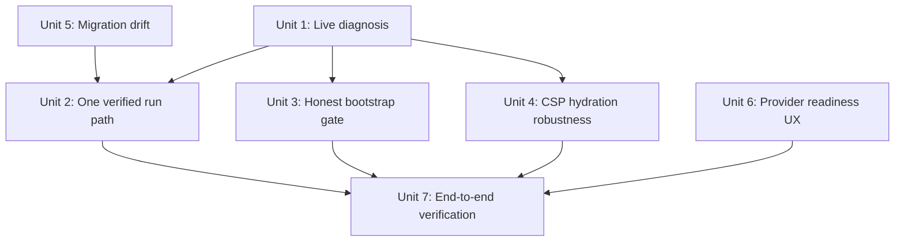

# fix: Make every WebUI feature actually usable

## Overview

The user reports that "no features in the WebUI work" — the screen looks blank, buttons
do nothing, generation errors out. Live investigation shows the **code is healthy** (370
unit/integration tests green, `tsc --noEmit` clean, production build serves HTTP 200, and
`/api/bootstrap` returns complete valid data). The breakage is **not in the code** — it is
in the *running instance and the path to obtaining one*. The app's first paint is gated by a
single bootstrap load; when that gate is stuck (because hydration never completes against a
runaway/stale dev server, or because no clean instance was ever started), the entire
generator workspace renders its "Failed to load app data" fallback and every downstream
feature appears dead.

This plan root-causes that single gate, establishes one verified run path, makes the
bootstrap loader self-explanatory instead of a silent dead-end, and then proves every
feature works end-to-end against a clean instance.

## Problem Frame

The user said, verbatim, that they are "not sure how I start it / haven't successfully run
it" and that *all four* failure modes apply at once (blank screen, dead buttons, generation
errors, weird behavior). Four symptoms appearing together with a green codebase is the
signature of a **single upstream gate failing**, not four independent bugs.

Evidence gathered live (2026-06-26):

| Observation | Evidence | Implication |
|---|---|---|
| Code is healthy | 370 tests pass, `typecheck` exit 0, build artifacts present | Don't chase code bugs first |
| Backend works at runtime | `GET /api/health` → `{ok:true}`; `GET /api/bootstrap` → 200 + 5 providers + templates | The server and DB are fine |
| First paint is the failure | Served HTML body contains `Failed to load app data` inside a Suspense boundary | The bootstrap gate is what the user sees |
| Runaway/duplicate servers | `next dev` PID 9592 = 1804 min CPU / ~1 GB RAM; plus 2 more `next` processes; `:3000` owned by a separate `next-server` | Stale builds, port confusion, hydration instability |
| Fragile CSP coupling | `next.config.ts` toggles `script-src`/`connect-src` on `NODE_ENV==='development'` | Hydration silently breaks if NODE_ENV/run-mode mismatch |
| Migration drift | `drizzle/` has both `0000_initial.sql` (hand-written) and `0000_fancy_wendigo.sql` (generated); journal only tracks `fancy_wendigo` | Fresh-machine setup is ambiguous; data-safety risk |
| Provider readiness | Only `Sealion` + `Ollama` enabled; OpenAI/Anthropic/Gemini disabled, no key | Generating with those → error = "generation fails" symptom |

**Root cause (one sentence):** The user has never obtained a clean, hydrated instance, so
the bootstrap-gated UI is stuck on its loading/error fallback and every feature looks broken
— amplified by runaway duplicate Next servers and the absence of one verified start path.

## Requirements Trace

- R1. A first-time user can go from clone/checkout → a fully interactive WebUI via **one**
  documented, verified command path, with no leftover/conflicting processes.
- R2. The bootstrap gate never silently dead-ends: on failure it shows *which* gate failed
  and offers retry; on success the full workspace mounts.
- R3. Hydration succeeds in both `dev` and `build && start` without CSP surprises.
- R4. Every user-facing feature is verified working against a clean instance: generate +
  stream + cancel, drafts/versions, variant compare, selection-rewrite, outline, history
  restore, export, settings CRUD (providers/templates/presets), i18n, theme.
- R5. Database setup is unambiguous and safe on a fresh machine (no migration drift).
- R6. Selecting a provider with no usable key guides the user instead of throwing on submit.

## Scope Boundaries

- **Non-goal:** new features, new providers, or redesign. This is a "make what exists
  actually run" pass.
- **Non-goal:** rewriting the storage layer or provider adapters — they are tested and work.
- **Non-goal:** the parked S5 backup/restore work and the broader optimization roadmap
  (tracked separately in `2026-06-26-001-feat-comprehensive-optimization-roadmap-plan.md`).
- **Non-goal:** fixing the known flaky `api-routes.test.ts` bootstrap timeout (TODOS P0) —
  unrelated to runtime usability; leave to its own task unless it blocks verification.

## Context & Research

### Relevant Code and Patterns

- `src/presentation/generation/generator-workspace.tsx:328-352` — the single bootstrap gate.
  L329 spinner branch, L337-352 `failedToLoad` branch with retry button. L119
  `useEffect(() => void fetchBootstrap())` is the only client trigger.
- `src/presentation/store/bootstrap-store.ts` — zustand SWR store; 30 s staleness; swallows
  errors into `error: string`. No auto-retry, no surfacing of *which* dependency failed.
- `src/presentation/lib/api.ts:33-81` — `fetchJson` + `loadBootstrap`. Uses relative
  `/api/bootstrap`, robust error throwing, module-level cache. Path is sound for a browser.
- `src/app/api/bootstrap/route.ts` — aggregates providers/templates/presets/pipeline.
- `next.config.ts` `headers()` — CSP toggled on `NODE_ENV`. Production omits `unsafe-eval`
  and `ws:` (correct), dev relaxes both. This is the fragility surface for hydration.
- `scripts/migrate.ts` + `src/infrastructure/storage/migrations` — custom migration runner
  (not `drizzle-kit migrate`). `drizzle/meta/_journal.json` only references `0000_fancy_wendigo`.
- `README.md`, `Start Dev.command`, `package.json` scripts — current (insufficient) run docs.
- `src/presentation/settings/*` and `src/presentation/generation/*` — the feature surfaces
  to verify in R4.

### Institutional Learnings

- Memory `project_dev-server-csp-gotcha`: "`next dev` was browser-broken by the app CSP;
  browser-test via `pnpm build && pnpm start`." The config now *attempts* to relax dev CSP,
  but this plan must verify that fix actually holds in a browser, since it is the historical
  failure mode and directly explains "blank screen / dead buttons."

### External References

- None required. Root cause is reproduced locally with direct evidence; external research
  would add no value over the live observations above.

## Key Technical Decisions

- **Diagnose against a clean instance before changing any UI code.** The bootstrap gate may
  be working-as-designed and the real fault is the runaway server / stale build. Changing
  code first would chase a phantom. (Unit 1 is characterization-first.)
- **One canonical run path, port-guarded.** Rather than document caveats, give the user a
  single command that kills stragglers, builds, and starts — so "I'm not sure how to run it"
  stops being a failure mode. (Unit 2.)
- **Make the gate honest, not just retryable.** The fallback should name the failed
  dependency (network vs HTTP status vs DB) and auto-retry once, so a transient miss
  self-heals and a real failure is diagnosable. (Unit 3.)
- **Decouple CSP correctness from NODE_ENV ambiguity.** Hydration must not depend on an env
  var being exactly right. (Unit 4.)
- **Single source of truth for migrations.** Retire the orphan `0000_initial.sql` so fresh
  setup is deterministic. (Unit 5.)

## Open Questions

### Resolved During Planning

- *Is this a code bug or a runtime/setup problem?* → Runtime/setup. Tests + build + API all
  green; the failure is the un-hydrated first paint and the absence of a clean instance.
- *Is the backend reachable?* → Yes; `/api/bootstrap` returns 200 with full data.

### Deferred to Implementation

- *Exact reason hydration doesn't complete in the user's browser* (stale build vs runaway
  server vs a real hydration mismatch vs CSP). Pin it in Unit 1 with console + network
  capture against a clean `build && start`. The fix in Units 2-4 is selected by that finding.
- *Whether `0000_initial.sql` is referenced anywhere at runtime* — confirm before deleting
  (Unit 5) by checking the migration runner's file-discovery logic.

## High-Level Technical Design

> *This illustrates the intended approach and is directional guidance for review, not
> implementation specification. The implementing agent should treat it as context.*

Failure chain and where each unit cuts it:

```
[ no clean instance / runaway servers ]      <- Unit 2 (one verified run path)
            |
            v
[ stale/instent build serves SSR fallback ]
            |
            v
[ hydration never completes ]                <- Unit 1 (diagnose) + Unit 4 (CSP robustness)
            |
            v
[ bootstrap useEffect never re-renders ]
            |
            v
[ workspace stuck on "Failed to load app data" ]  <- Unit 3 (honest, self-healing gate)
            |
            v
[ every feature looks dead ]                 <- Unit 7 (end-to-end verification proves R4)

  side gates: Unit 5 (migration drift, fresh-machine safety)
              Unit 6 (provider has no key -> generate errors)
```

Unit dependency graph:



## Implementation Units

- [ ] **Unit 1: Live diagnosis of the bootstrap-gated dead screen**

**Goal:** Determine the exact reason a real browser stays on "Failed to load app data" even
though `/api/bootstrap` returns 200, and record the decisive evidence.

**Requirements:** R2, R3 (informs the fix selection for both)

**Dependencies:** None (must run first; all other units branch from its finding)

**Files:**
- Investigate only (no production edits): `src/presentation/generation/generator-workspace.tsx`,
  `src/presentation/store/bootstrap-store.ts`, `src/presentation/lib/api.ts`, `next.config.ts`
- Capture notes into: this plan's findings / a scratch note

**Approach:**
- Kill all stray Next processes; start exactly one clean `pnpm build && pnpm start`.
- Open `/` in a browser; capture (a) console errors, (b) the Network entry for
  `/api/bootstrap` (status, timing, whether it even fires), (c) any React hydration-mismatch
  warning, (d) the CSP response header actually served.
- Decision tree: bootstrap request never fires → hydration broken (→ Unit 4 / stale build →
  Unit 2). Request fires and 200 but UI doesn't update → store/render bug (→ Unit 3).
  Request blocked by CSP `connect-src` → Unit 4. Hydration mismatch thrown → Unit 4 + the
  mismatching component.

**Execution note:** Characterization-first investigation. Do not edit production code until
the failing gate is identified. Use the browser to observe real behavior.

**Test scenarios:**
- Test expectation: none (investigation unit) — output is a documented root-cause finding
  with console/network evidence that selects the fix path for Units 2-4.

**Verification:** A written, evidence-backed statement of *why* the UI was stuck, naming the
exact failing step, agreed before any fix lands.

---

- [ ] **Unit 2: One canonical, verified run path + kill runaway servers**

**Goal:** A single documented command takes the user from checkout to a fully interactive
WebUI with no leftover/conflicting processes.

**Requirements:** R1

**Dependencies:** Unit 1 (confirms whether dev or build/start is the reliable mode); Unit 5
(fresh DB must migrate cleanly as part of the path)

**Files:**
- Modify: `package.json` (add a guarded start script, e.g. preflight that frees `:3000` and
  runs migrate before `build && start`)
- Modify: `Start Dev.command` (align it to the canonical path; stop spawning duplicate dev
  servers)
- Modify: `README.md` (a single "Run it" section: prerequisites → one command → expected
  result → how to confirm it worked)

**Approach:**
- Add a preflight that detects an existing listener on the app port and refuses or reclaims
  it deterministically, so duplicate servers can't silently stack.
- Make the documented path `build && start` the blessed one (production CSP, real behavior),
  with `dev` clearly marked as HMR-only and its known caveats.
- Ensure the path runs DB migrate first so a fresh machine isn't gated by a missing schema.

**Patterns to follow:** existing `package.json` scripts; existing `scripts/migrate.ts` CLI.

**Test scenarios:**
- Happy path: from a clean checkout with no running server, the documented command yields a
  page that mounts the full workspace (not the fallback).
- Edge case: a stale server already holds the port → preflight reclaims/frees it rather than
  silently starting a second instance.
- Error path: DB not yet migrated → path runs migrate and still reaches a working UI.

**Verification:** Following only the README "Run it" section on a clean process table
produces an interactive workspace; `lsof :3000` shows exactly one server.

---

- [ ] **Unit 3: Make the bootstrap gate honest and self-healing**

**Goal:** The workspace never silently dead-ends. On bootstrap failure it shows which
dependency failed and auto-retries once; on success it mounts.

**Requirements:** R2

**Dependencies:** Unit 1 (confirms whether the gate logic itself contributes)

**Files:**
- Modify: `src/presentation/store/bootstrap-store.ts` (preserve structured error detail;
  add a single auto-retry/backoff on transient failure)
- Modify: `src/presentation/generation/generator-workspace.tsx` (distinguish "loading" vs
  "failed" cleanly; surface the structured reason; keep the retry button)
- Modify: `src/presentation/lib/api.ts` (ensure `loadBootstrap` failures carry a typed,
  human-readable reason rather than a generic string)
- Modify: `messages/en.json`, `messages/zh-CN.json` (reason strings: network / server / db)
- Test: `src/tests/unit/` (extend `api-bootstrap-cache.test.ts` / bootstrap-store coverage)

**Approach:**
- Map failure classes (fetch/network error, non-OK HTTP, structured `AppError`) to distinct
  user-facing reasons so the fallback is diagnosable.
- One automatic retry on first transient failure (covers the "stuck on first paint" case),
  then fall to the manual retry button.

**Test scenarios:**
- Happy path: store resolves → `data` set, `error` null, workspace mounts.
- Error path: `loadBootstrap` rejects with network error → store exposes a network-class
  reason; workspace shows it + retry button.
- Error path: 500 from `/api/bootstrap` → store exposes a server-class reason.
- Edge case: first call fails, retry succeeds → workspace mounts without user action.
- Integration: clicking retry calls `refetch` and recovers when the backend is healthy.

**Verification:** With the backend forced to fail, the UI explains the failure and offers
retry; with it healthy after a transient miss, the UI recovers on its own.

---

- [ ] **Unit 4: CSP that lets hydration succeed in dev and prod without NODE_ENV guessing**

**Goal:** Hydration (inline bootstrap scripts, dev HMR websocket) is never broken by CSP,
regardless of run mode, while production stays locked down.

**Requirements:** R3

**Dependencies:** Unit 1 (only tighten/loosen based on the observed served header + any
CSP-blocked request)

**Files:**
- Modify: `next.config.ts` (`headers()` CSP construction)

**Approach:**
- Remove the fragility of hydration depending on `NODE_ENV` being exactly right: ensure the
  dev directives (`unsafe-eval`, `ws:`) are present whenever HMR can run, and production
  keeps the strict set. Validate the *actually served* header in both modes matches intent.

**Test scenarios:**
- Happy path (prod): served CSP omits `unsafe-eval`, page still hydrates (inline scripts
  allowed via `unsafe-inline`), workspace mounts.
- Happy path (dev): served CSP includes `unsafe-eval` + `ws:`, HMR connects, no console CSP
  violations.
- Edge case: a stray `NODE_ENV` value does not silently strip the directives needed to
  hydrate.

**Verification:** In both `dev` and `build && start`, browser console shows zero CSP
violations and the workspace mounts.

---

- [ ] **Unit 5: Resolve migration drift for safe fresh-machine setup**

**Goal:** One unambiguous, deterministic migration set so a fresh DB is created correctly
and existing data is untouched.

**Requirements:** R5

**Dependencies:** None (but Unit 2's run path depends on this being clean)

**Files:**
- Investigate then modify: `drizzle/0000_initial.sql` (orphan — likely retire),
  `drizzle/0000_fancy_wendigo.sql`, `drizzle/meta/_journal.json`
- Verify: `scripts/migrate.ts`, `src/infrastructure/storage/migrations` (file-discovery
  logic — confirm which files it actually applies before deleting anything)
- Test: `src/tests/integration/` (a migrate-from-empty integration check if absent)

**Approach:**
- Confirm the runner only consumes journal-tracked migrations; if `0000_initial.sql` is
  never applied, retire it to remove the drift. If it *is* applied, reconcile the two into a
  single source of truth.

**Execution note:** Characterization-first — run migrate against a **throwaway** DB path and
diff the resulting schema before touching the real `~/.post-generator` data. Never run
destructive migration steps against the live DB.

**Test scenarios:**
- Happy path: migrate against an empty temp DB → expected tables created, no errors.
- Edge case: migrate against an already-migrated DB → idempotent no-op, no data loss.
- Error path: a malformed/duplicate migration is rejected, not half-applied.

**Verification:** `pnpm db:migrate` then `pnpm db:migrate status` on a temp DB shows the
expected tables once; the live DB is unaffected.

---

- [ ] **Unit 6: Provider readiness UX — no dead "Generate"**

**Goal:** Selecting a provider with no usable key guides the user (configure / test
connection) instead of letting them submit into an error.

**Requirements:** R6

**Dependencies:** None (parallelizable); folds into Unit 7 verification

**Files:**
- Modify: `src/presentation/generation/input-panel.tsx` (disable/annotate Generate when the
  selected profile lacks a usable key)
- Modify: `src/presentation/settings/provider-profiles-panel.tsx` (make "test connection"
  prominent; clear empty/disabled state)
- Modify: `src/presentation/generation/generator-workspace.tsx` (surface a "no usable
  provider configured" guide rather than a raw error)
- Modify: `messages/en.json`, `messages/zh-CN.json`
- Test: `src/tests/unit/provider-profiles-panel.test.tsx`, input-panel coverage

**Approach:**
- Treat "enabled + has key" as the readiness predicate; when the selected provider isn't
  ready, the primary action explains what to do and links to settings.

**Test scenarios:**
- Happy path: ready provider selected → Generate enabled.
- Edge case: only disabled/keyless providers exist → workspace shows a configure-guide, not
  a dead button.
- Error path: selecting a keyless provider and attempting to generate is prevented with an
  actionable message (not a raw provider error).
- Integration: "test connection" on a configured provider reports success/failure inline.

**Verification:** With only keyless providers, the UI guides to configuration; after adding
a key + enabling, Generate becomes available and a test connection passes.

---

- [ ] **Unit 7: End-to-end feature verification pass (proves "all features usable")**

**Goal:** Drive a clean running instance through every user-facing feature and confirm each
works; fix any residual breakage surfaced here.

**Requirements:** R4 (and confirms R1-R3, R6 in a real instance)

**Dependencies:** Units 2, 3, 4, 6 (a clean, hydrated, gate-honest, provider-ready instance)

**Files:**
- Verify across: `src/presentation/generation/*` (generate, stream, cancel, drafts/versions,
  variant-compare, selection-rewrite, outline, restore-from-history),
  `src/presentation/settings/*` (providers/templates/presets CRUD),
  `src/presentation/history/history-workspace.tsx`, export, i18n, theme toggle
- Optionally extend: `src/tests/e2e/generation-flow.spec.ts`

**Approach:**
- Use the canonical run path. Walk each feature, recording pass/fail with the observed
  result. Any failure becomes a tracked fix before this unit closes.

**Execution note:** Verification spine — drive the live app in a browser; this is where R4 is
actually proven, not asserted.

**Test scenarios:**
- Happy path: a full generation streams to completion against a ready provider; cancel mid-
  stream stops it; drafts save and switch; variant compare renders; selection-rewrite applies;
  outline generates; history restore repopulates; export downloads md/txt.
- Integration: settings CRUD for providers/templates/presets persists and reflects in the
  generator after refetch.
- Edge case: i18n EN/zh-CN switch and theme toggle apply without reload artifacts.

**Verification:** A checklist where every R4 feature is marked working against the clean
instance, with any breakage fixed and re-verified.

## System-Wide Impact

- **Interaction graph:** The bootstrap gate (`generator-workspace` + `bootstrap-store` +
  `loadBootstrap`) fans out to every feature panel; settings and history also consume
  `loadBootstrap`. Changes to the gate (Unit 3) affect all three workspaces.
- **Error propagation:** Bootstrap failures must surface as typed, human-readable reasons
  from `api.ts` → store → workspace, not collapse into a generic string.
- **State lifecycle risks:** Module-level `bootstrapCache` in `api.ts` plus the zustand
  store both cache; ensure auto-retry and `invalidateBootstrapCache` stay consistent so a
  retry actually refetches.
- **API surface parity:** Settings (`useApi(loadBootstrap)`) and the generator
  (`useBootstrapStore`) load bootstrap via different wrappers — verify both honor the new
  error semantics.
- **Unchanged invariants:** Provider adapters, storage layer, SSE streaming, and the API
  routes are tested and stay behaviorally unchanged; this plan does not alter their
  contracts — it fixes the path to exercising them.

## Risks & Dependencies

| Risk | Mitigation |
|------|------------|
| "Fix" lands before root cause is confirmed (Unit 1 skipped) | Unit 1 is a hard gate; no production edits until evidence names the failing step |
| Touching migrations corrupts the live DB | Unit 5 characterization runs against a throwaway DB; never destructive against `~/.post-generator` |
| CSP change re-breaks dev or weakens prod | Verify the *served* header in both modes (Unit 4 scenarios) |
| Runaway servers reappear and mask the fix | Port-guarded preflight in Unit 2; verify single listener |
| Bootstrap auto-retry masks a real backend failure | Cap at one retry, then show the typed reason + manual retry |

## Documentation / Operational Notes

- README "Run it" section becomes the single source of truth for starting the app (Unit 2).
- Update memory `project_dev-server-csp-gotcha` once Unit 4 verifies the dev CSP fix holds.
- Note the runaway `next dev` processes (PID 9592 et al.) should be killed before any clean
  verification run.

## Sources & References

- Live investigation (2026-06-26): tests/typecheck green; `/api/health` + `/api/bootstrap`
  200; served HTML contains `Failed to load app data`; `lsof`/`ps` show runaway+duplicate
  Next servers; `drizzle/` migration drift; provider enablement state.
- Related code: `src/presentation/generation/generator-workspace.tsx:328-352`,
  `src/presentation/store/bootstrap-store.ts`, `src/presentation/lib/api.ts:33-81`,
  `next.config.ts`, `scripts/migrate.ts`, `drizzle/meta/_journal.json`.
- Related plan: `docs/plans/2026-06-26-001-feat-comprehensive-optimization-roadmap-plan.md`
  (broader roadmap; this plan is the narrower "make it run" prerequisite).
- Memory: `project_dev-server-csp-gotcha`, `project_post-generator-studio`.
