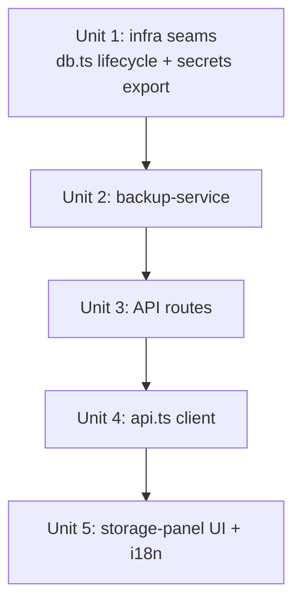

# feat: S5 Local DB Backup & Restore (rebuilt against post-003 main)

## Overview

Give the local single-user app a **two-way** data-safety flow: create a consistent, WAL-safe snapshot of the SQLite database **plus the encrypted secrets directory**, list/delete snapshots, and **restore** one over the live data with a self-backup rollback safety net. The feature already exists on the parked branch `wip/post-v0-pending`, but that code forked **before** the 003 high-cohesion refactor and cannot be merged as-is. This plan rebuilds it against the current `main`, where three integration seams changed.

The largest unrecoverable risk for a local single-user tool is the whole SQLite file being corrupted or lost (greater than deleting one record). "Export-only" does not protect against this — restore must be in-band (see origin: roadmap-requirements S5).

## Problem Frame

- **Origin requirement S5** (P1, "資料持久性"): DB whole-file backup + restore, including the secrets directory, because API keys live in `~/.post-generator/secrets/` (the DB stores only `apiKeyRef` + mask). Restore is an overwriting operation and must carry an H1-level confirmation.
- **Why the parked code can't merge:** `wip/post-v0-pending` was built when `getDb()` was synchronous and `db.ts` already carried restore hooks. On current `main` (post-003): `getDb()` is **async**, `db.ts` has **no** restore lifecycle (`closeDb`/`setRestoreInProgress` were never merged), and `secrets.ts` keeps `cacheInvalidate` **module-private**. Merging the old branch would drag pre-003 versions of repos/migrations/schema backward over the refactor.
- **What already landed on main** (so we do NOT rebuild it): `getBackupsDir()` in `paths.ts`, `confirm-dialog.tsx`, `errorResponse()` in `application/errors.ts`, the `fetchJson` client helper, and the `Settings.storage` i18n namespace (currently info-only).

## Requirements Trace

- **R1 (origin S5):** User can create a WAL-safe DB snapshot from Settings → Storage. Backup uses better-sqlite3 `.backup()`, never a bare file copy.
- **R2 (origin S5):** Backup bundle includes the `secrets/` directory so provider credentials survive restore on the same machine. UI warns that cross-machine restore needs `POST_GENERATOR_SECRET_KEY` set on both ends.
- **R3 (origin S5):** User can list and delete snapshots; list is newest-first and only shows bundles with a valid completion marker (`meta.json`).
- **R4 (origin S5):** User can restore a snapshot. Restore is overwriting and gated by an H1-level confirmation. A pre-restore self-backup is taken; if restore fails, the app rolls back automatically.
- **R5 (origin S5 success criterion "備份→還原可往返"):** After restore, the DB and secrets are usable (or the UI clearly states API keys must be re-entered when secrets are excluded). Reconnecting forward-migrates an older-schema bundle.
- **R6 (origin Scope Boundaries):** Local single-user only — no cloud sync, no multi-user, no merge semantics.

## Scope Boundaries

- **Not** F4 "restore from History" (`use-restore-from-history.ts` on the wip branch is a *separate* editor feature — out of scope here).
- **Not** a per-table machine-readable export/import or selective/partial restore — restore is **whole-file replace**, which is simpler and inherently restorable.
- **Not** scheduled/automatic backups, retention policies, or off-machine upload.
- **Not** a migration/merge of conflicting records — because restore replaces the entire file, there is no row-level ID/FK reconciliation to perform.
- **Not** reopening H1 broadly — this plan only consumes the already-merged `confirm-dialog.tsx` for the restore/delete confirmations it introduces.

## Context & Research

### Relevant Code and Patterns

- **`src/infrastructure/storage/db.ts`** (main) — async `getDb()`, singleton `database`/`migrated`. Drizzle client reachable via `(database as any).$client`. **No** `closeDb`/restore guard today; the wip version is the reference for what to add.
- **`src/infrastructure/config/paths.ts`** — `getBackupsDir()`, `getSecretsDir()`, `getDatabasePath()` already present.
- **`src/infrastructure/security/secrets.ts`** — `cacheInvalidate(ref?)` exists at module scope but is **not exported** (line ~50). Restore must clear the decrypted-secret cache so the next `readSecret` re-reads restored files.
- **`src/application/errors.ts`** — `errorResponse(error, status?)`; all routes wrap with it. Backup routes follow the `bootstrap/route.ts` shape (`runtime = "nodejs"`, try/catch → `errorResponse`).
- **`src/presentation/lib/api.ts`** — thin client; every call goes through `fetchJson<T>`. Add backup client fns + `BackupMeta` type here.
- **`src/presentation/settings/storage-panel.tsx`** — currently a 20-line info stub; the wip branch has the full 165-line backup UI to port.
- **`src/presentation/components/ui/confirm-dialog.tsx`** — `ConfirmDialog` with `variant: "default" | "destructive"`. Use this instead of `window.confirm`/`window.alert` (the wip UI used native dialogs — native modal dialogs also block the in-app browser-automation tooling, so replacing them is correct on two counts).
- **Reference implementation:** `git show wip/post-v0-pending:src/application/storage/backup-service.ts` and `:src/presentation/settings/storage-panel.tsx`. Treat as a starting point, not a drop-in (see Key Technical Decisions for the required fixes).

### Institutional Learnings

- Memory `project_dev-server-csp-gotcha`: browser-verify via `pnpm build && pnpm start`, not `next dev` (CSP blocks it).
- 003 refactor established: application services call `@/infrastructure/*` directly; routes stay thin; tests swap storage via `setStorage()`. Backup-service is application-layer and may import infrastructure directly.
- Test harness (`src/tests/setup.ts`) sets `POST_GENERATOR_HOME` to a temp dir and a test `POST_GENERATOR_SECRET_KEY` — backup/restore tests get a real isolated filesystem for free.

### External References

- better-sqlite3 `Database.prototype.backup(destination)` — online backup API, WAL-safe, **returns a Promise**. (The wip code called it without `await`; this plan fixes that.) No further external research needed — the pattern is embodied in the reference code and well understood.

## Key Technical Decisions

- **Whole-file replace, not merge.** Restore swaps the entire `.db` file. This resolves the origin's deferred "ID / FK / active_draft_id conflict" question: there is nothing to reconcile because no rows are merged. Pre-swap integrity is proven with `PRAGMA integrity_check` + `PRAGMA foreign_key_check` on the bundle.
- **Backup includes the secrets directory** (origin's recommended default = "complete restore"). The UI keeps the existing amber warning that cross-machine restore needs `POST_GENERATOR_SECRET_KEY` on both ends. `meta.includesSecrets` records what the bundle actually contains.
- **Schema-version policy.** Store the app's current max migration version in `meta.schemaVer`. On restore: **reject** a bundle whose `schemaVer` is *newer* than the running app (a backup from a future version we can't safely down-migrate); **accept** equal-or-older — after the file swap, `closeDb()` resets `migrated=false`, so the next `getDb()` runs `runMigrations()` forward over the restored file. (The exact source of "current version" is a small implementation detail — see Deferred.)
- **`getDb()` is async on main** → `createBackup` must `await getDb()` then `await sqlite.backup(...)`; **`restoreBackup` must become `async`** because it calls `createBackup` for the self-backup (the wip code was sync and never awaited — a latent bug to fix during port).
- **Restore ordering is load-bearing (correctness, not style).** The self-backup runs **before** `setRestoreInProgress(true)`. If the guard is set first (as the wip code implied), the self-backup's `createBackup()` → `getDb()` hits the guard and throws, so the rollback safety net is *never created* and every restore falls into manual-recovery. Documented order: validate → quiesce-check → self-backup → set guard → closeDb → swap.
- **Both swaps are atomic via same-filesystem rename, not copy-over.** DB: copy bundle into `live.db.tmp` then `rename()` over `live.db`. Secrets: `rename secrets/ → secrets.old`, `rename` staged-new into place, delete old on success. A crash mid-`copy`-over-live would otherwise leave a truncated, WAL-less, unopenable DB.
- **Crash recovery uses an on-disk marker, not the in-memory flag.** Write `backups/.restore-in-progress` (recording the self-backup id) before `closeDb()`, delete it on success. App boot checks for it; if present, a prior restore was interrupted → auto-rollback from the recorded self-backup. `isRestoreInProgress` is process-memory only and does nothing across a crash.
- **Restore has a quiescence precondition.** `isRestoreInProgress` only gates *new* `getDb()` calls; it does not stop a long-lived holder (streaming generation, judge scoring — tens of seconds) that already captured the connection. Restore refuses (409-style) when a stream/scoring job is active. Repos themselves `await getDb()` per operation, so short calls transparently pick up the reopened connection — only the long holders need the guard.
- **Restore lifecycle lives in `db.ts`.** Add `setRestoreInProgress`/`isRestoreInProgress` (a guard so `getDb()` throws while a swap is mid-flight) and `closeDb()` (closes the better-sqlite3 handle, nulls the singleton, resets `migrated`). Mirror the wip version but keep `getDb()`'s existing async signature.
- **Reuse, don't rebuild.** `getBackupsDir()`, `confirm-dialog.tsx`, `errorResponse`, `fetchJson`, and the `Settings.storage` i18n namespace already exist on main and are consumed as-is.
- **Path-traversal hardening stays.** `resolveBackupPath`/`deleteBackup` keep the `path.resolve().startsWith(backupsAbs)` guard so a crafted `id` can't escape the backups dir.

## Open Questions

### Resolved During Planning

- *Include secrets in the bundle?* → Yes (complete same-machine restore); cross-machine caveat surfaced in UI. (origin deferred item, decided.)
- *How to handle ID/FK/active_draft_id conflicts on restore?* → N/A by design — whole-file replace means no row merge. (origin deferred item, dissolved.)
- *Confirmation mechanism?* → Use the merged `ConfirmDialog`, not native `window.confirm`/`alert`.

### Resolved During Implementation

- **Schema-version source** → `runMigrations()` had no version tracking (idempotent forward-only). Added `CURRENT_SCHEMA_VERSION = 1` constant in `migrations.ts` (Unit 1). Restoring equal-or-older is always safe (reconnect forward-migrates); restore rejects newer.
- **`seedDefaults` resurrection risk (Finding #5b)** → Verified safe **without code change**: `seedDefaults` is all-or-nothing per table (`length === 0` gate), so it never resurrects an *individually* deleted default row. The only re-seed case is restoring a backup where the user had emptied an entire table — acceptable (you need ≥1 provider). Documented; no guard added.
- **Quiescence hard-gate (Finding #3) → not needed.** Investigated the storage layer: every repo method does `await getDb()` at its start then runs **synchronous** better-sqlite3 ops with no further await before use — no long-lived handle is captured across awaits. better-sqlite3 is synchronous and single-threaded, so a statement cannot interleave with the restore swap. Combined with the `isRestoreInProgress` guard (new `getDb()` calls throw), an in-flight generation/scoring write either completes before `closeDb()` or fails cleanly with "restore in progress" — it can never write to a half-swapped file. Adding a cross-module active-job registry would be speculative complexity (YAGNI); the guard-based clean failure is sufficient.

### Deferred to Implementation
- **Whether route-level coverage needs its own test file** or is sufficiently exercised through the service + a thin smoke test. Decide when wiring Unit 3 (the service test carries the real risk).
- **Post-restore client behavior**: after a successful restore the client likely needs to re-fetch bootstrap (provider list may change). Confirm whether a full reload or a `useBootstrapStore.invalidate()` is enough during Unit 5.

## High-Level Technical Design

> *This illustrates the intended approach and is directional guidance for review, not implementation specification. The implementing agent should treat it as context, not code to reproduce.*

Restore sequence (fail-anywhere, abort with self-backup rollback).
**Ordering is load-bearing** — the self-backup must happen *before* the restore guard is set, or `createBackup()`'s own `getDb()` deadlocks on the guard (see Key Technical Decisions → "Restore ordering"):

```
restoreBackup(id):                              createBackup():
  dir = resolveBackupPath(id)                     mkdir backups/<temp>/ (0700)
  meta = loadMeta(dir) ── reject schemaVer>CUR    db = await getDb()
  validateBackupDb(bundle.db)                     await db.$client.backup(temp/post-generator.db)
     open conn, integrity_check, FK_check,        copy secrets/* → temp/secrets/ (0600)
     CLOSE conn + clean its -wal/-shm  (#6)        write temp/meta.json   ← completion marker
  ── PRECONDITION (#3): refuse (409) if a          atomic rename temp → backups/<id>/
     stream/scoring job is active ──               return meta
  selfBackup = await createBackup()  ← BEFORE guard, live DB still consistent (#1)
  write backups/.restore-in-progress {selfBackupId}  ← on-disk crash marker (#2)
  setRestoreInProgress(true)                      listBackups(): readdir, keep valid meta.json,
  try:                                                            sort newest-first
    closeDb()
    stage db:  copy bundle.db → live.db.tmp (same FS), rename → live.db   ← ATOMIC (#2)
    stage secrets:  rename secrets/→secrets.old, rename new→secrets/, rm old  ← ATOMIC dir swap (#4)
    cacheInvalidate()                  ← drop decrypted-secret cache
    delete backups/.restore-in-progress
  catch:
    rollbackFromSelfBackup(selfBackup.id)  ← restore BOTH db + secrets (#4); else manual-recovery msg
  finally:
    setRestoreInProgress(false)
  → next getDb() reopens + runMigrations() forward-migrates restored file
  → app boot: if .restore-in-progress marker exists, a prior restore was interrupted
    → auto-rollback from its selfBackupId (#2)
```

## Implementation Units



- [x] **Unit 1: Infrastructure seams — restore lifecycle + secrets cache export**

**Goal:** Add the hooks `backup-service` depends on without changing existing behavior.

**Requirements:** R4, R5

**Dependencies:** None

**Files:**
- Modify: `src/infrastructure/storage/db.ts` (add `isRestoreInProgress`/`setRestoreInProgress`/`closeDb`; guard `getDb()` to throw when a restore is in progress — keep async signature)
- Modify: `src/infrastructure/security/secrets.ts` (export the existing `cacheInvalidate`)
- Modify (maybe): `src/infrastructure/storage/migrations.ts` (introduce/confirm `CURRENT_SCHEMA_VERSION` source — see Deferred)
- Test: `src/tests/unit/db-restore-lifecycle.test.ts`

**Approach:**
- Mirror the wip `db.ts` restore additions but preserve main's `async getDb()`. `closeDb()` reads `(database as any).$client`, `.close()` best-effort, nulls `database`, resets `migrated=false`.
- `getDb()` first line: if `isRestoreInProgress()` throw a clear error.
- **Boot-time crash recovery:** the DB bootstrap path (first `getDb()` / `runMigrations`) must call a `recoverInterruptedRestore()` (owned by Unit 2) *before* opening the DB — if `backups/.restore-in-progress` exists, a prior restore was interrupted and must auto-rollback first. Wire the call here; the logic lives in backup-service.
- Export `cacheInvalidate` (one-line change); no behavior change for existing callers.
- **`seedDefaults` idempotency check:** confirm `seedDefaults()` (run on every reopen, incl. post-restore) does **not** re-insert default Provider/Template/Preset rows the user had deleted in the backed-up state. If it would, that is a silent data change — flag it; the restored file may be populated and user-pruned.

**Patterns to follow:** wip `db.ts` (`closeDb`, `setRestoreInProgress`); existing `secrets.ts` export style; `seedDefaults` current guards.

**Test scenarios:**
- Happy path: `closeDb()` after `getDb()` lets a subsequent `getDb()` reopen and return a working handle.
- Edge case: `closeDb()` when no DB is open is a no-op (no throw).
- Error path: `getDb()` throws while `setRestoreInProgress(true)` is set; succeeds again after `setRestoreInProgress(false)`.
- Integration: `cacheInvalidate()` is importable from `secrets.ts` and clears a cached secret (next `readSecret` re-reads from disk).
- Integration: reopening a restored DB whose user had deleted a default row does **not** resurrect that row (`seedDefaults` idempotency).

**Verification:** Restore guard, `closeDb` reopen, and seed-idempotency behaviors pass; existing storage/secrets tests stay green.

---

- [x] **Unit 2: `backup-service.ts` (application/storage)**

**Goal:** Port the backup/restore engine, fixing the async-`getDb` and missing-`await` bugs.

**Requirements:** R1, R2, R3, R4, R5, R6

**Dependencies:** Unit 1

**Files:**
- Create: `src/application/storage/backup-service.ts`
- Test: `src/tests/unit/backup-service.test.ts`

**Approach:**
- Port `createBackup`, `listBackups`, `deleteBackup`, `restoreBackup`, plus helpers `loadMeta`, `resolveBackupPath`, `validateBackupDb`, `rollbackFromSelfBackup` from the wip reference. Add a new exported `recoverInterruptedRestore()` (boot-time crash recovery, wired from Unit 1).
- **Fixes vs wip (data-safety-critical):**
  - `createBackup` does `const db = await getDb()` and `await sqlite.backup(targetDbPath)`.
  - `restoreBackup` becomes `async`. **Ordering (Finding #1):** validate → quiescence check → `await createBackup()` self-backup → write `.restore-in-progress` marker → `setRestoreInProgress(true)` → `closeDb()` → swap. The self-backup must precede the guard or it deadlocks on its own `getDb()`.
  - **Atomic DB swap (Finding #2):** copy bundle.db → `live.db.tmp` on the same filesystem, then `fs.renameSync(tmp, liveDb)`. Never copy directly over the live file.
  - **Atomic secrets swap (Finding #4):** stage into a temp dir, `rename secrets/ → secrets.old`, `rename` staged → `secrets/`, delete `secrets.old` on success. `rollbackFromSelfBackup` restores **both** db and secrets to pre-state.
  - **Validation cleanup (Finding #6):** `validateBackupDb` explicitly closes its inspection connection and removes any `-wal/-shm` it created on the bundle, before the bundle is copied into place.
  - **Crash marker (Finding #2):** `backups/.restore-in-progress` written before `closeDb`, deleted on success. `recoverInterruptedRestore()` checks it at boot and auto-rolls-back from the recorded self-backup id.
- `meta.schemaVer` = current schema version (Unit 1 source); `restoreBackup` rejects bundles with `schemaVer > current`.
- **Quiescence precondition (Finding #3):** `restoreBackup` refuses (throws a 409-mappable error) when a streaming generation or scoring job is active. Document that `isRestoreInProgress` only gates *new* `getDb()` calls.
- Keep: temp-dir → atomic rename on create, `meta.json` as completion marker, 0700/0600 modes, path-traversal guard, integrity + FK pragma validation, self-backup rollback with manual-recovery message if rollback itself fails.

**Execution note:** Characterization-first — write the round-trip and rollback tests against the ported surface before adjusting internals, since this is data-safety-critical code being moved across a refactor boundary.

**Patterns to follow:** wip `backup-service.ts` (structure), 003 application-service conventions (plain exported async functions, direct infra imports).

**Test scenarios:**
- Happy path: `createBackup()` writes a bundle dir with `post-generator.db` + `meta.json`; `listBackups()` returns it; round-trip — create, mutate a row, `restoreBackup`, reconnect → restored row state is back.
- Happy path: bundle includes `secrets/` when secrets exist; `meta.includesSecrets === true`.
- Edge case: `listBackups()` ignores dirs lacking a valid `meta.json` (interrupted/partial backup) and returns newest-first order.
- Edge case: backup when no secrets dir exists → `includesSecrets === false`, restore still succeeds.
- Error path: `resolveBackupPath("../../etc")` (and `deleteBackup` with traversal id) throws "Invalid backup ID".
- Error path: restoring a bundle whose DB fails `integrity_check` or has FK violations throws before any file swap (live DB untouched).
- Error path: restoring a bundle with `schemaVer` newer than the app is rejected.
- Error path / Integration: a forced failure mid-restore triggers `rollbackFromSelfBackup`; **both** live DB and secrets return to pre-restore state. If rollback also fails, the thrown error names the self-backup recovery path.
- Error path: self-backup is created **before** the guard is set — assert `restoreBackup` does not throw a "restore in progress" error from its own self-backup step (Finding #1 regression guard).
- Error path: `restoreBackup` refuses with a quiescence error when a stream/scoring job is flagged active (Finding #3).
- Integration: a leftover `.restore-in-progress` marker on boot triggers `recoverInterruptedRestore()` → live files match the recorded self-backup (Finding #2 crash recovery).
- Integration: after restore, `cacheInvalidate` has run so a previously-cached secret reflects the restored secrets file.
- Edge case: `validateBackupDb` leaves no `-wal/-shm` next to the bundle after running (Finding #6).

**Verification:** All scenarios green; a deliberate mid-restore fault leaves the original DB **and** secrets intact via rollback; an interrupted-restore marker auto-recovers on next boot.

---

- [x] **Unit 3: Storage API routes**

**Goal:** Expose the service over HTTP following main's thin-route convention.

**Requirements:** R1, R3, R4

**Dependencies:** Unit 2

**Files:**
- Create: `src/app/api/storage/backup/route.ts` (GET = list, POST = create → 201)
- Create: `src/app/api/storage/backup/[id]/route.ts` (DELETE → 404 when not found)
- Create: `src/app/api/storage/restore/route.ts` (POST, body `{ id }`, 400 on missing id)
- Test: `src/tests/unit/storage-routes.test.ts` (decide scope per Deferred)

**Approach:** Port the wip routes nearly verbatim (they already use `errorResponse` + `runtime = "nodejs"`, both present on main). `restoreBackup` is now async → `await` it in the restore route.

**Patterns to follow:** `src/app/api/bootstrap/route.ts`, `src/app/api/generations/[id]/drafts/route.ts`.

**Test scenarios:**
- Happy path: POST `/api/storage/backup` returns 201 + `BackupMeta`; GET returns the list.
- Error path: DELETE unknown id → 404; restore POST without `id` → 400 `VALIDATION_ERROR`.
- Error path: service throwing maps to `errorResponse` (500) rather than an unhandled rejection.

**Verification:** Route tests pass; manual `curl`/UI smoke shows create→list→restore→delete.

---

- [x] **Unit 4: `api.ts` client functions + `BackupMeta` type**

**Goal:** Client bindings for the new routes.

**Requirements:** R1, R3, R4

**Dependencies:** Unit 3

**Files:**
- Modify: `src/presentation/lib/api.ts` (add `BackupMeta` type + `listBackups`, `createBackup`, `deleteBackup`, `restoreBackup`, all via `fetchJson`)

**Approach:** Mirror existing `fetchJson<T>` call sites. `restoreBackup(id)` POSTs `{ id }` to `/api/storage/restore`.

**Patterns to follow:** existing `loadDrafts`/`saveDraftVersion` in `api.ts`.

**Test scenarios:** Test expectation: none — thin `fetchJson` wrappers with no branching; covered transitively by Unit 3 route tests and Unit 5 UI behavior. (If any wrapper grows logic during implementation, add a focused test.)

**Verification:** `pnpm typecheck` clean; storage-panel compiles against these signatures.

---

- [x] **Unit 5: `storage-panel.tsx` UI + i18n keys**

**Goal:** Replace the info stub with the full backup/restore UI, using `ConfirmDialog` (not native dialogs).

**Requirements:** R1, R2, R3, R4, R5

**Dependencies:** Unit 4

**Files:**
- Modify: `src/presentation/settings/storage-panel.tsx`
- Modify: `messages/en.json`, `messages/zh-CN.json` (add the `Settings.storage` backup keys)

**Approach:**
- Port the wip panel (create button, list with createdAt/fileSize/includesSecrets, restore + delete per row, secrets warning banner, loading/empty/error states).
- **Swap** `window.confirm(restoreConfirm)` / `window.confirm(backupConfirmDelete)` / `window.alert(restoreSuccess)` for `ConfirmDialog` (restore + delete = `destructive` variant) and an inline/toast success indicator — no native modal dialogs.
- After a successful restore, refresh bootstrap (full reload or `useBootstrapStore.invalidate()` — confirm per Deferred) since provider/profile data may have changed.
- Add the ~16 i18n keys the panel references (`backupTitle`, `backupSubtitle`, `createBackup`, `backupCreating`, `restoreBtn`, `restoring`, `restoreConfirm`, `restoreSuccess`, `restoreFailed`, `backupConfirmDelete`, `backupDeleteFailed`, `backupFailed`, `noBackups`, `loading`, `createdAt`, `fileSize`, `includesSecrets`, `secretsWarning`) to **both** locales.

**Execution note:** Test-first for the confirmation gate — assert restore does not call the API until the user confirms.

**Patterns to follow:** existing settings panels using `Header`, `Button`, `ConfirmDialog`; the wip `storage-panel.tsx` for layout.

**Test scenarios:**
- Happy path: panel lists backups from `listBackups`; clicking Create calls `createBackup` then refreshes the list.
- Edge case: empty state shows `noBackups`; loading state shows `loading`.
- Error path: a failed create/restore/delete surfaces the localized error string, not a raw stack.
- Integration: clicking Restore opens `ConfirmDialog`; the restore API is **not** called until confirmation; on success the bootstrap refresh fires.
- i18n: every referenced key resolves in both `en` and `zh-CN` (no missing-key fallback). zh-CN strings carry no English residue (origin H3 spirit).

**Verification:** Panel renders and round-trips create→list→restore→delete in `pnpm build && pnpm start`; no missing i18n keys; no native `alert`/`confirm` remain.

## System-Wide Impact

- **Interaction graph:** `closeDb()` touches the `db.ts` singleton consumed by every repo via `getStorage()`/`getDb()`. The restore guard (`isRestoreInProgress`) is the chokepoint that prevents a half-swapped file from being read mid-restore.
- **Error propagation:** Service throws → route `errorResponse` → client `fetchJson` rejects → panel shows localized error. Restore's internal failures are caught and converted to rollback; only a rollback-failure escapes as a manual-recovery message.
- **State lifecycle risks:** WAL/SHM sidecars are deleted before the swap; `meta.json`-last + atomic rename make partial backups invisible to `listBackups`. Self-backup before overwrite is the core anti-data-loss guarantee.
- **API surface parity:** New `/api/storage/*` routes; no change to existing endpoints. `cacheInvalidate` export is additive.
- **Caches & side-effects invalidated on restore (explicit inventory):** (1) decrypted-secret `Map` → `cacheInvalidate()`; (2) `db.ts` `database`/`migrated` singletons → `closeDb()`; (3) repos `await getDb()` per call, so `getStorage()` singleton needs nothing; (4) provider `adapterCache` in `registry.ts` persists across the swap — **assert** adapters read config per call and hold no DB/secret state (if any adapter caches a key, it must be cleared); (5) `seedDefaults()` runs on reopen — must be idempotent against a populated, user-pruned restored DB (Unit 1); (6) client-side `useBootstrapStore` → `invalidate()`/reload after restore (Unit 5).
- **Integration coverage:** The create→restore round-trip, the forced-fault rollback (db **and** secrets), and the interrupted-restore boot recovery are the scenarios unit mocks won't prove — all run against a real temp-dir SQLite (Unit 2).
- **Unchanged invariants:** `getDb()` keeps its async signature and existing callers; secrets encryption/`apiKeyRef` model unchanged; API keys still never touch the DB.

## Risks & Dependencies

| Risk | Mitigation |
|------|------------|
| Restore corrupts live data on partial failure | Self-backup **before** the guard (Finding #1); atomic same-FS rename for DB **and** secrets (Findings #2/#4); rollback restores both; manual-recovery path if rollback also fails |
| Crash/kill mid-swap with no on-disk evidence | `.restore-in-progress` marker + boot-time `recoverInterruptedRestore()` auto-rollback (Finding #2) |
| In-flight stream/scoring during restore | **Decided: no hard gate** (see Open Questions → Resolved During Implementation). Repos `await getDb()` per-op + synchronous better-sqlite3 + the `isRestoreInProgress` guard mean an in-flight write either completes before `closeDb()` or fails cleanly with "restore in progress" — **never corruption** (confirmed by review). Known limitation: a generation streaming at the instant of restore is marked failed; acceptable for a user-initiated local action. |
| Reading the DB mid-swap | `isRestoreInProgress` guard makes new `getDb()` calls throw; repos re-`getDb()` per op so short calls pick up the reopened connection |
| Bare-copy WAL inconsistency | Use better-sqlite3 `.backup()` (awaited), never `fs.copy` of the live `.db`; validation connection closed + sidecars cleaned before swap (Finding #6) |
| `seedDefaults` resurrecting user-deleted default rows post-restore | Verify seed idempotency against a populated, pruned DB (Finding #5 / Unit 1) |
| Cross-machine restore silently breaks API keys | `meta.includesSecrets` + amber UI warning about `POST_GENERATOR_SECRET_KEY` on both ends |
| Restoring a future-version bundle | Reject when `meta.schemaVer > CURRENT`; forward-migrate equal-or-older on reconnect |
| Path traversal via crafted backup id | `resolveBackupPath`/`deleteBackup` resolve+prefix-check against the backups dir |
| Native `alert`/`confirm` blocking UI/automation | Replace with `ConfirmDialog` + inline success (Unit 5) |

## Documentation / Operational Notes

- README/CLAUDE note (zero-cost transition, origin S5): until/unless users rely on in-app restore, copying the whole `~/.post-generator/` directory is itself a backup (Time Machine/git included).
- No production deploy — local-first desktop app. "Operational validation" = the create→restore→delete smoke in `pnpm build && pnpm start` plus the Unit 2 round-trip/rollback tests.

### Known limitations / future work (from code review)

- **Self-backups are not garbage-collected.** Each restore writes a pre-restore self-backup; repeated restores grow `~/.post-generator/backups` unbounded. A retention policy (keep N / prune by age) is deferred — out of scope for this PR.
- **`CURRENT_SCHEMA_VERSION` is bumped manually.** It must be incremented whenever `runMigrations` gains a schema-changing step, or a backup from a newer app would stamp the old version and bypass the newer-than-app reject. Process discipline, not enforced in code.
- **In-flight generation during restore fails cleanly** (see Risks table) — not prevented, by deliberate decision.
- **Server network binding** is unchanged by this PR (`next start` binds all interfaces). On an untrusted LAN the unauthenticated storage endpoints are reachable; binding to `127.0.0.1` is recommended but is an app-wide config change tracked separately from S5.

## Sources & References

- **Origin document:** `docs/brainstorms/2026-06-26-comprehensive-optimization-roadmap-requirements.md` (S5 + its Deferred items)
- Reference implementation: `wip/post-v0-pending` — `src/application/storage/backup-service.ts`, `src/app/api/storage/**`, `src/presentation/settings/storage-panel.tsx`
- Main seams: `src/infrastructure/storage/db.ts`, `src/infrastructure/security/secrets.ts`, `src/infrastructure/config/paths.ts`, `src/application/errors.ts`, `src/presentation/components/ui/confirm-dialog.tsx`
- Related memory: `project_post-generator-studio`, `project_dev-server-csp-gotcha`
