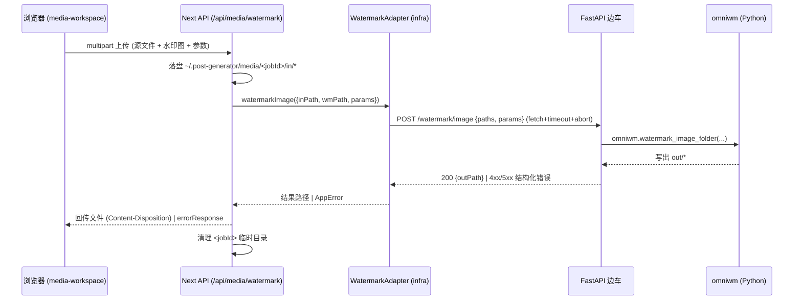
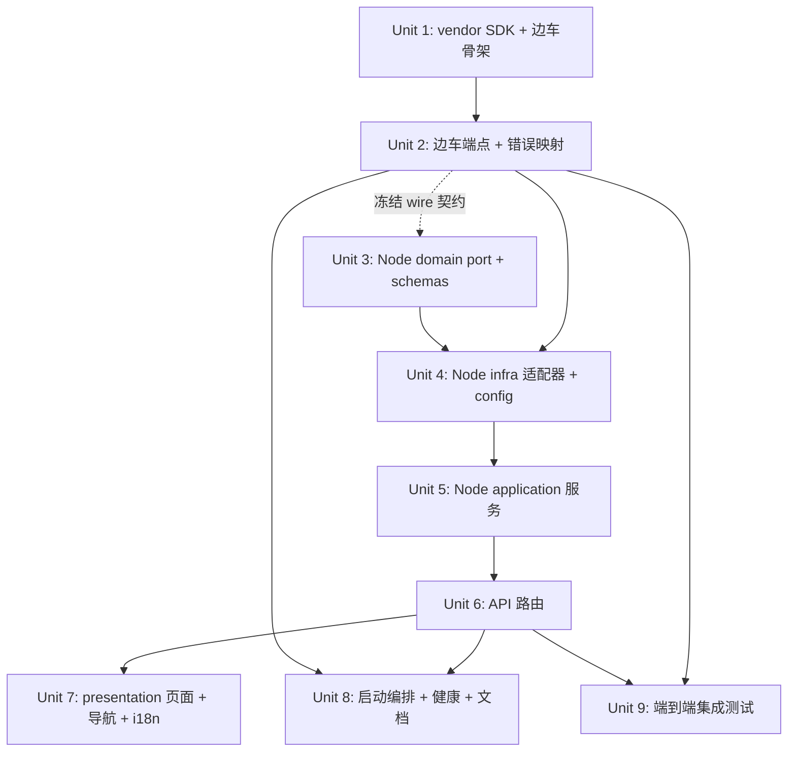

# feat: 把 omniwm 水印 SDK 接成媒体水印功能（FastAPI 边车）

## Overview

在 Post Generator Studio 里**新增一块独立的「媒体水印」功能**：用户上传图片/视频 → 加水印 / 去标(delogo) / 水印检测 → 下载结果。

底层算法不重写——直接复用 `/Users/dex/YDEX/INPORTANT WORK/POST /omniwm-sdk` 这个纯 Python SDK。因为本服务是 Next.js/TypeScript，与 Python 之间通过一个 **FastAPI 边车微服务（sidecar）**桥接：Node 经 HTTP 调边车，边车 `import omniwm` 跑算法。

这是服务里第一块媒体能力，整条新链路沿用现有的分层架构（`presentation → app(API) → application → domain ← infrastructure`），把边车当成一个外部 provider 来对待——与现有 LLM provider 经 HTTP 调上游的模式同构。

## Problem Frame

- **能力来源**：omniwm 是从 OmniPublisher 抽出的纯算法 SDK，四个高层函数：`watermark_image_folder` / `watermark_video` / `delogo_video` / `detect_watermark_regions`，外加 `VideoWatermarkConfig`。运行期依赖系统 `ffmpeg`/`ffprobe`。未发布 PyPI，需本地 wheel / editable / vendor 安装。
- **宿主现状**：Post Generator Studio 整条链路（generation → pipeline → export）**只处理文本**，无任何图片/视频/媒体环节，仓库零 Python。
- **两条鸿沟**：语言（Python ↔ Node）+ 领域（媒体水印 ↔ 文字生成）。用户已拍板：(1) 做成**独立功能**，(2) 用 **FastAPI 边车**对接。
- **本地优先约束**：应用是 local-first（数据落 `~/.post-generator`），边车与 Next 跑在同一台机器、共享文件系统——这一点直接决定了文件传输策略（见 Key Technical Decisions）。

### 威胁模型（一等约束，所有取舍以此为锚）

「local-first 单机单用户」不等于「无信任边界」。一旦上线，本机就有 `:3000`（Next）与 `:8765`（边车）两个监听端口，而本机现实是**多 session / 多 agent 并发**（见记忆）。因此：

- **上传的媒体一律视为不可信输入**（哪怕来自本人浏览器）——文件名、文件内容、媒体参数都可能被构造。
- **边车是一台「按路径读写文件 + 驱动 ffmpeg」的机器**，必须强制 loopback 绑定 + 进程间最小鉴权，否则同机任意进程即可调用它（配合下方注入面 = 本地任意文件读写）。
- **`ffmpeg` 是不可信输入的下游消费者**，是攻击面而非仅「可能缺失的依赖」。

本期不做的是**用户级鉴权**（单用户场景），但进程间最小鉴权与输入不可信假设仍然成立。

## Requirements Trace

- R1. 用户能上传图片并加水印，可指定水印图、宽度、位置；下载结果。
- R2. 用户能上传视频并加水印（corner-cycle / fixed / diagonal 模式）；下载结果。
- R3. 用户能对视频做水印检测，拿到区域坐标；并能据此对**同分辨率**源做 delogo 去标。
- R4. Python 算法经 FastAPI 边车暴露，Node 仅通过稳定 HTTP 契约调用，不在 Node 内重写算法。
- R5. 缺 `ffmpeg` / 边车未起 / `[face]` 未装等降级与失败场景，要给出可观测、结构化的错误，不静默崩。
- R6. 新链路遵守现有分层依赖规则与既有错误/超时/取消模式，不污染文本生成链路。
- R7. 开发与生产启动时，边车的生命周期与健康检查要纳入现有 `pnpm` 启动流程。

## Scope Boundaries

- **不做**：把水印接进文本 generation/export 流水线（用户明确选了「独立功能」，不是「接进生成/导出流水线」）。
- **不做**：把 omniwm 算法用 Node/ffmpeg 重写（用户选了边车，不是「纯 ffmpeg 化」）。
- **不做**：多用户、**用户级**鉴权、云存储、横向扩缩容；沿用 local-first 单机假设。（注意：进程间最小鉴权 + loopback 绑定**仍要做**，见威胁模型与 Key Technical Decisions。）
- **明确做**：把上传媒体视为不可信输入——体积/分辨率/时长上限、内容嗅探、ffmpeg 注入防护、资源耗尽防护，均属本期范围（见 Risks 与 Unit 2/5/6）。
- **不做**：把边车发布成公开 API 给外部第三方调用（仅本服务内部消费）。
- **不做**：inpainting 级去水印（SDK 的 delogo 是 ffmpeg 覆盖式滤镜，能力边界照搬）。
- **不做**：批量队列/限流编排（SDK 单次同步执行，并发交由调用方；本期一次处理一份）。
- **暂不默认启用** `[face]` 人脸避让 extra（拖入 torch、体积大）；缺失时图片水印自动降级为默认定位，作为可选项留待后续。

## Context & Research

### Relevant Code and Patterns

- **外部 HTTP 调用 + 超时/取消/错误归一**：`src/infrastructure/providers/base-adapter.ts` —— `fetch` + `AbortSignal.timeout` + `combineSignals` + 结构化错误。边车适配器应镜仿这套（超时、用户取消、5xx 重试语义）。
- **端口契约**：`src/domain/ports/export-port.ts`、`provider.ts`、`storage.ts` —— 极简 interface。新增 `watermark-port.ts` 照此风格。
- **API 路由形态**：`src/app/api/generations/[id]/export/route.ts`（GET + zod query + 自定义响应头返回文件）、`src/app/api/generations/route.ts`（POST + `parseBody` + `errorResponse`）。新增路由 `runtime = "nodejs"`。
- **错误归一**：`src/app/api/api-helpers.ts#errorResponse` + `src/application/errors.ts#toAppError`；边车错误需映射成既有 `AppError` 码（`NOT_FOUND`/`CONFLICT`/`INTERNAL_ERROR`/自定义）。
- **配置/路径**：`src/infrastructure/config/paths.ts` —— `getDataHome()` 等。新增 `getMediaDir()`（`~/.post-generator/media`）与边车 URL/超时的 env 读取。
- **导航/页面**：`src/app/layout.tsx`（`NavLink` 三项：Generate/History/Settings）、`src/app/page.tsx`、`src/app/{history,settings}/page.tsx`、对应 `src/presentation/{history,settings}/*-workspace.tsx`。新增 `/media` 页 + `media-workspace.tsx`。
- **i18n**：`messages/en.json` + `messages/zh-CN.json`，`Navigation` / 分模块 key；新增 `MediaWatermark` 段 + `Navigation.media`。
- **测试**：`src/tests/unit/*`（Vitest，`fetch` 用 `vi.spyOn` mock；adapter 测试见 `anthropic-adapter.test.ts`；路由测试见 `api-routes*.test.ts`）。

### Institutional Learnings

- `docs/plans/` 已有大量同型计划（命名 `YYYY-MM-DD-NNN-<type>-...-plan.md`）。
- 记忆提示：本仓库**演进很快、多 session 并发**，开工前应 `git fetch` + 看日志，避免分支撞车；并行 agent 用 worktree。
- 启动一律走 `pnpm`；`pnpm dev`/`start:clean` 会自动回收 port 3000、锁 Node 22。边车需占一个**新端口**（建议 `8765`），避免与 3000 冲突。
- `better-sqlite3` ABI 陷阱与本计划无关（不碰原生 Node 模块），但提醒：边车是独立 Python venv，不要与 Node 依赖混装。
- CSP 陷阱：`next dev` 浏览器侧被 CSP 限制（无 unsafe-eval），浏览器联调要 `pnpm build && pnpm start`。

### External References

- omniwm `README.md` / `INTEGRATION.md`（SDK 内）：公共 API、安装三法、能力边界、`[face]` 权重解析顺序（`model_path` > env `YOLO_FACE_MODEL` > ultralytics 自动下载）。
- FastAPI（边车框架）官方文档：`UploadFile` / `StreamingResponse` / `lifespan` 健康检查 —— 实现期再查版本细节。

## Key Technical Decisions

- **复用的是 HTTP 调用范式，不是 provider 抽象本身**（评审修正）：`BaseAdapter` 是**流式生成专用**的 abstract class（方法签名全绑定 `NormalizedGenerationRequest`/`GenerationEvent`/`AsyncIterable`、SSE/JSON-lines 解析），水印是「同步请求-响应、返回一个路径」，**几乎没有可继承的东西**。正确做法：把 base-adapter 里真正领域无关的内核——`combineSignals`（user signal + timeout 合并，含 `AbortSignal.any` 旧运行时降级）+「区分用户取消/超时/网络错误」的 fetch 错误归一——抽成共享工具 `src/infrastructure/http/with-timeout.ts`，让现有 LLM adapter 与新 `WatermarkAdapter` **都用它**（这才是真复用）。`WatermarkAdapter` **不继承 `BaseAdapter`**。理由：避免被迫塞一堆 LLM 概念空实现的错误抽象（R4/R6）。

- **文件传输走共享文件系统（路径契约），不走 HTTP 多段二进制中转**：浏览器上传 → Node 落盘到 `~/.post-generator/media/<jobId>/in/*` → Node 调边车时**只传路径**（边车与 Node 同机共享 FS）→ 边车把结果写到 `.../out/*` → Node 读出回传浏览器 → 清理。理由：(a) omniwm 的 API 本就是**基于路径**的（folder/file path），共享 FS 是最自然契约；(b) 省掉「Node→边车→Node」2 跳大文件搬运（浏览器→Node 的 multipart 上传不可避免）；(c) 与 local-first 单机假设吻合。**被评估过的备选**：FastAPI `UploadFile` HTTP 直传（边车现成能力）——为 local-first 的路径契约简洁性而放弃，非「唯一自然解」。**这条契约把部署形态钉死了，已升级为 System-Wide Impact 的一等架构约束**：边车与 Node 必须 (1) 同机、(2) 共享同一 `MEDIA_DIR` 绝对路径字符串、(3) 同 uid 或对 `MEDIA_DIR` 有共同读写权限（不同用户/容器身份会导致一方写出另一方读不到/删不掉）。容器化时必须共享卷且路径完全一致。路径包含判断必须 `realpath` 规范化后再比前缀（防 symlink 绕过）。

- **边车是独立可部署进程，纳入 `pnpm` 启动编排，但 dev 路径绝不跑重装**（评审修正）：不把 Python 塞进 Next 进程。**拆成两个 script**：`pnpm sidecar:setup`（显式、一次性、重——建 venv + 装 fastapi/uvicorn/opencv/numpy 等重 wheel，可能数分钟）与 `pnpm sidecar`（仅运行）。`pnpm dev` 里**只做轻量就绪探测 + 缺失时清晰报错指路**，绝不在 dev 路径里自动重装（否则首跑会像「卡死」——正是记忆里「阻塞锁=打不开」的同型根因）。启动前必须**探测/回收 8765 上的陈旧边车**（健康同版本则复用，否则回收），照搬 Next 回收 3000 的哲学。dev 用 `concurrently` 把边车生命周期绑到 Next（关机一并回收，避免后台泄漏残留进程）；生产守护方式 defer。`ensure-sidecar.mjs` 还要校验 `python3` 存在性与版本（≥3.10）。（R5/R7）

- **边车强制 loopback 绑定 + 进程间最小鉴权**：边车进程必须 `--host 127.0.0.1`（**禁止 `0.0.0.0`**），URL 默认 `http://127.0.0.1:8765`（env `OMNIWM_SIDECAR_URL` 覆盖）。Node↔边车之间用共享 secret header（或 unix domain socket）做最小鉴权。理由：边车是无用户鉴权的「路径读写 + ffmpeg」机器，同机多进程/多 agent 现实下，裸暴露 = 配合注入面的本地任意文件读写（见威胁模型）。

- **`ffmpeg` 调用是不可信输入边界（安全评审 C1，最高优先）**：水印路径、`VideoWatermarkConfig` 字段、输出路径都来自浏览器，最终成为 ffmpeg 入参，至少四个真实利用面：filtergraph 注入（恶意值闭合 `-vf` 再注入 `movie=`/`drawtext textfile=` → 任意文件读取）、`-` 开头文件名被当选项解析（arg-list 也中招）、协议注入（`http://`/`concat:`/`subfile:` → SSRF/越权读）、shell 注入。**硬要求**：(a) 所有路径必须是 `MEDIA_DIR` 下、服务端生成、经 `--`/`./` 前缀隔离的真实常规文件，拒绝 `-` 开头、拒绝非常规文件（symlink/fifo/协议串）；(b) **实现期必须审计 omniwm 的 ffmpeg 构造代码**，确认 `subprocess` 用 arg-list 且 `shell=False`、无任何浏览器可控字符串进入 filtergraph 表达式；(c) 所有 config 字段服务端白名单（数值范围 / 枚举），杜绝自由文本入滤镜。

- **不可信媒体的资源边界（安全评审 C2）**：timeout 不是资源边界。Pillow 解压炸弹（几 KB → GB 级像素，需保留/收紧 `MAX_IMAGE_PIXELS`）、超大分辨率/超长/超高 fps/多流视频均需上限。处理前用 `ffprobe` 取时长/分辨率/fps/流数，按上限拒绝。**取消必须 kill 子进程**：Node abort 只断 HTTP，边车里的 ffmpeg 子进程仍在跑（继续吃 CPU、续写 `out/`，且可能在清理后才写完 → 孤儿进程 + 孤儿大文件）；边车侧须自带处理超时并在超时/取消时 kill ffmpeg + 清理半成品。

- **上传限流必须在解析前生效 + 内容嗅探（安全评审 H1）**：`await request.formData()` 会先把整个 body 缓冲进内存——解析后再查 size，DoS 已发生。体积上限必须在解析前生效（先看 `Content-Length` 拒绝 / 流式上限 / 框架级 body 限制），并注意 Next App Router 自身的请求体限制（大视频可能需额外配置）。扩展名白名单零成本可伪造，喂给 ffmpeg 前必须做 **magic-byte / MIME 嗅探**。

- **SDK 以 vendor 方式入库**：把 `omniwm-sdk/` 复制进本仓库 `sidecar/vendor/omniwm-sdk/`（INTEGRATION.md 方式 C），边车 `requirements.txt` 用 `editable`/wheel 引用。理由：随仓库版本化，不依赖外部绝对路径（路径里还带空格，易踩坑），CI/部署可复现。**权衡**：SDK 升级需手动同步 vendor；可接受，本期 SDK 稳定。

- **`ffmpeg` 作为运行期系统依赖、显式探测**：边车启动与 `/health` 都探测 `ffmpeg`/`ffprobe`，缺失时健康检查失败并回传可读原因，而非在第一次跑视频时才崩（R5）。

- **`[face]` extra 默认不装**：core 依赖（Pillow/numpy/opencv-headless）即可跑图片默认定位 + 视频 + delogo + 检测；人脸避让作为可选增强，env 开关后续再加。理由：torch 体积大、本期非核心。**供应链注意（安全评审 L1）**：`[face]` 的权重解析顺序含「ultralytics 自动下载」——这是未固定来源的远程拉取；将来启用时必须用 `model_path`/env `YOLO_FACE_MODEL` 固定本地权重、禁用自动下载。

- **一次处理一份、同步语义**：API 同步等待边车完成（受超时约束），不引入任务队列。理由：SDK 单次同步、单机单用户、KISS；批量/异步留作 Future。

## Open Questions

### Resolved During Planning

- **Python ↔ Node 怎么接？** → FastAPI 边车（用户拍板）。
- **媒体从哪来？** → 用户**上传**（独立功能，非生成链路产物）。
- **文件怎么传给 Python？** → 共享 FS + 路径契约（见 Key Technical Decisions）。
- **SDK 怎么入库？** → vendor 进 `sidecar/vendor/`。
- **边车端口？** → 默认 `8765`，强制 `--host 127.0.0.1`，env `OMNIWM_SIDECAR_URL` 可覆盖（避开 3000）。
- **`[face]` 装不装？** → 本期不装，降级默认定位。
- **跨语言 wire 契约何时定？**（评审修正）→ **不 defer**：在 Unit 2/3 把边车 HTTP wire 契约**冻结为交付物**（一份显式 JSON 示例 + 字段表），pydantic 与 zod 都照它实现。理由：JSON↔pydantic↔zod 三处字段漂移是本项目 #1 集成风险，不能留到最后「现场对齐」。

### Deferred to Implementation

- delogo 的 `regions` dict（`tl/tr/bl/br`）在前端如何呈现/可编辑（先「检测→直接喂给 delogo」闭环，可视化编辑留待 UI 细化）。**安全约束（H2）**：detect→delogo 闭环的引用必须走**服务端 session**（服务端记住上一步的 jobId/路径），**客户端永不回传文件系统路径**，否则把路径注入面开给了客户端。
- 视频处理耗时较长时的进度反馈（先用同步 + loading + 合理超时；流式进度留作 Future）。
- 大文件上传的体积上限与磁盘配额/清理策略的精确阈值（实现时定默认值 + env 覆盖）。
- 生产部署里边车的进程守护方式（launchd / pm2 / docker-compose）——取决于实际部署形态。

## High-Level Technical Design

> *以下示意「方案形状」，是给评审看方向的导引，不是实现规格；实现 agent 应当作上下文，而非照抄的代码。*

请求时序（以「图片加水印」为例）：



边车 HTTP 契约（草图，字段名实现期定稿）：

```
GET  /health                 -> { ok, ffmpeg: bool, face: bool, version }
POST /watermark/image        { inDir|inPath, outDir, watermarkPath, wmWidth, position } -> { outputs:[paths] }
POST /watermark/video        { inPath, outPath, config:{watermark, wm_mode,...} }       -> { outPath }
POST /detect                 { inPath }                                                  -> { regions:{tl,tr,bl,br} }
POST /delogo                 { inPath, outPath, regions }                                -> { outPath }
错误：4xx 业务/输入错误、5xx 算法/ffmpeg 失败，body { code, message }（映射 OmniwmError/WatermarkError/FFmpegNotFoundError）
```

## Implementation Units

依赖关系（非线性，先放总览）：



> **依赖顺序修正（评审）**：wire 契约在 U2 冻结、U3 据此写 zod、U4 据此实现——不再是「U4 现场对齐」。U2/U3 之间是「契约交付物」依赖，不是软对齐。

---

- [x] **Unit 1: vendor omniwm SDK + 搭 FastAPI 边车骨架**

**Goal:** 在本仓库内建立 `sidecar/` Python 项目，vendor 进 omniwm，能 `import omniwm` 并起一个最小 FastAPI 应用（仅 `/health`）。

> **排期注意（评审）**：本单元名为「搭骨架」，实则环境敏感度高——建 venv + 首次安装 opencv/numpy 等平台相关重 wheel + ffmpeg 前置 + python3 版本校验，远不止「骨架」。排期给足。

**Requirements:** R4, R7

**Dependencies:** 无

**Files:**
- Create: `sidecar/vendor/omniwm-sdk/`（从 SDK 整目录复制，排除其 `dist/`、`tests/fixtures`、任何权重/凭据）
- Create: `sidecar/requirements.txt`（`fastapi`、`uvicorn[standard]`、`python-multipart`、`-e ./vendor/omniwm-sdk`）
- Create: `sidecar/app/main.py`（FastAPI 实例 + `lifespan` + `/health`）
- Create: `sidecar/app/__init__.py`
- Create: `sidecar/README.md`（如何建 venv、装依赖、起服务、ffmpeg 前置）
- Create: `sidecar/.gitignore`（`.venv/`、`__pycache__/`、`*.pt`）
- Test: `sidecar/tests/test_health.py`

**Approach:**
- vendor 走 INTEGRATION.md 方式 C；确认 `import omniwm; omniwm.__all__` 在 core 依赖下可用（顶层无 torch import，已验证）。
- `/health` 探测 `shutil.which("ffmpeg")` 与 `ffprobe`，回 `{ok, ffmpeg, face, version}`；`face` 通过尝试 import ultralytics 判定（惰性、失败即 false）。`/health` 还应做 **`MEDIA_DIR` 双向可写探测**（写一个探针文件，供 Node 侧验证 uid/权限契约——不只单侧 `os.access`）。
- 端口默认 `8765`，可由 env `OMNIWM_SIDECAR_PORT` 覆盖；进程强制 `--host 127.0.0.1`。
- 进程间最小鉴权：校验共享 secret header（env 注入），无效请求直接拒。

**Patterns to follow:** SDK 的 `INTEGRATION.md`「方式 C」；制品卫生（绝不打包 `*.pt`/凭据，照搬 `pyproject.toml [tool.hatch.build].exclude`）。

**Test scenarios:**
- Happy path：`GET /health` 返回 200 且 `ok=true`（ffmpeg 在 PATH 时）。
- Edge case：ffmpeg 不在 PATH 时 `/health` 的 `ffmpeg=false`，整体 `ok=false`，但服务仍能起（不在 import 期崩）。
- Edge case：未装 `[face]` 时 `import omniwm` 成功、`face=false`（验证降级安全）。

**Verification:** 在干净 venv 里 `pip install -r requirements.txt` 后 `uvicorn app.main:app` 能起，`curl /health` 拿到结构化 JSON。

---

- [x] **Unit 2: 边车四个端点 + 错误映射**

**Goal:** 把 omniwm 四个高层函数包成 HTTP 端点，输入/输出走路径契约，异常映射为结构化 4xx/5xx。

**Requirements:** R1, R2, R3, R5

**Dependencies:** Unit 1

**Files:**
- Create: `sidecar/app/routes.py`（`/watermark/image`、`/watermark/video`、`/detect`、`/delogo`）
- Create: `sidecar/app/schemas.py`（Pydantic 请求/响应模型，对照 omniwm 签名）
- Create: `sidecar/app/errors.py`（`OmniwmError`/`WatermarkError`/`FFmpegNotFoundError` → HTTP 映射）
- Modify: `sidecar/app/main.py`（挂载 router）
- Test: `sidecar/tests/test_routes.py`

**Approach:**
- **先冻结 wire 契约（交付物）**：写一份 `sidecar/CONTRACT.md`（或 `contract.json` 示例）固定四端点的请求/响应字段名与类型，作为 U3（zod）/U4 的唯一依据，杜绝跨语言漂移。
- 端点接收**路径**（由 Node 落盘后传入）与参数；`image` 走 `watermark_image_folder(folder,output,...)`；`video` 用 `VideoWatermarkConfig` 构造后 `watermark_video`；`detect` 回 `regions` dict；`delogo` 收 `regions` 调 `delogo_video`。
- 统一异常处理器：`FFmpegNotFoundError` → 503（依赖缺失）；`WatermarkError`/输入类 → 422；其余 `OmniwmError`/未知 → 500；body `{code, message}`。
- **ffmpeg 注入防护（C1，最高优先）**：所有入参路径必须 `realpath` 规范化后落在 `MEDIA_DIR` 内、且为**真实常规文件**——拒绝 `-` 开头、拒绝 symlink/fifo、拒绝 `http://`/`concat:`/`subfile:` 等协议串、拒绝绝对路径注入；config 字段服务端白名单（数值范围 / 枚举），杜绝自由文本进入 filtergraph。**实现期审计 vendor 的 omniwm ffmpeg 构造代码**，确认 `subprocess` arg-list + `shell=False`、无浏览器可控字符串入 `-vf`。
- **不可信媒体资源边界（C2）**：处理前用 `ffprobe`/Pillow 取时长、分辨率、fps、流数、像素总量，超上限即拒；保留/收紧 Pillow `MAX_IMAGE_PIXELS`。
- **取消/超时杀子进程（C2 / 架构评审）**：边车侧自带处理超时；超时或检测到客户端断开时 **kill ffmpeg 子进程 + 清理半成品**，避免孤儿进程与孤儿大文件。
- **并发语义**：uvicorn 默认单 worker → 请求串行。显式文档化「一次一份、串行」语义；繁忙时让上层能感知（见 U5/U6 的「忙碌中」反馈）。
- 单文件隔离：`image` 端点吃的是**文件夹**，Node 须保证 `in/` 目录每 job 只有一个源文件，否则会处理到杂项/产出多文件（见 U5）。

**Approach（坐标契约提醒）:** detect 坐标相对**输入原生分辨率**，detect 与 delogo 须同分辨率源——在响应里回传源分辨率，便于 Node/前端校验。

**Patterns to follow:** omniwm README「检测→去标同坐标契约」；SDK 自带异常类型。

**Test scenarios:**
- Happy path：给 fixture 图片 + 水印图，`/watermark/image` 产出文件且返回 outputs 路径。
- Happy path：`/detect` 对含水印视频 fixture 返回 `regions` 四角 dict。
- Integration：`/detect` 的输出直接喂 `/delogo`，同分辨率源能成功去标。
- Error path：传不存在的 `inPath` → 422，结构化 body。
- Error path：路径越出 `MEDIA_DIR` → 400/403（目录穿越防护）。
- Error path（C1）：`-` 开头文件名、协议串（`http://`/`concat:`）、绝对路径注入 → 拒绝。
- Error path（H2）：`MEDIA_DIR` 内的 **symlink 指向外部** → realpath 后被拒。
- Error path（C2）：超分辨率/超时长/解压炸弹媒体 → ffprobe/Pillow 预检拒绝。
- Error path（C2）：处理超时 → ffmpeg 子进程被 kill、半成品被清理。
- Error path：ffmpeg 缺失时跑视频端点 → 503 `FFmpegNotFound`。
- Error path：缺/错共享 secret header → 拒绝。

**Verification:** `pytest sidecar/tests` 全绿；wire 契约文档存在且被 U3/U4 引用；手测四端点对 fixture 产出/检测正确，注入用例全被拒。

---

- [x] **Unit 3: Node 侧 domain port + zod schemas**

**Goal:** 定义水印能力的领域契约（端口接口 + 请求/响应/参数的 zod schema），与边车 HTTP 契约一一对应。

**Requirements:** R1, R2, R3, R6

**Dependencies:** 无（可与 Unit 1/2 并行；契约对齐在 Unit 4）

**Files:**
- Create: `src/domain/ports/watermark-port.ts`（`WatermarkPort`：`watermarkImage` / `watermarkVideo` / `detectRegions` / `delogoVideo` / `health`）
- Modify: `src/domain/schemas.ts`（或新增 `src/domain/watermark-schemas.ts`）：`WatermarkPosition` 枚举、`VideoWmMode` 枚举、`DetectRegions`、各请求参数 schema、`WatermarkResult`
- Test: `src/tests/unit/watermark-schemas.test.ts`

**Approach:**
- zod schema **照 U2 冻结的 wire 契约**实现（不是「对照函数签名现场定」）。注意：跨语言下 zod **不是**整条链路的单一事实源——pydantic 与 zod 是同一契约的两份描述，真正的事实源是 U2 的契约文档；本 schema 是它在 Node 侧的落地。
- 枚举值照搬 SDK：position（`bottom-right` 等）、`wm_mode`（`corner-cycle`/`fixed`/`diagonal`）。
- zod schema 在 Node 侧既给 API 入参校验用，也给 adapter 出参解析用。
- 端口方法返回结构化结果或抛 `AppErrorException`，与现有 `provider.ts` 风格一致。**诚实标注**：domain port 在此是**约定一致性**（与 `provider.ts`/`export-port.ts` 风格对齐），不是可替换性需求——只会有一个实现，测试也走 `fetch` spy，不靠端口换实现。

**Patterns to follow:** `src/domain/ports/provider.ts`、`export-port.ts`；`src/domain/schemas.ts` 的 zod + 类型导出风格。

**Test scenarios:**
- Happy path：合法参数对象通过 schema 解析。
- Edge case：非法 position / wm_mode 被拒，给出 zod 错误。
- Edge case：`DetectRegions` 缺角或坐标非数值被拒。

**Verification:** `pnpm typecheck` 通过；schema 单测全绿。

---

- [x] **Unit 4: Node 侧 infrastructure 适配器 + 配置**

**Goal:** 实现 `WatermarkAdapter`（`WatermarkPort` 的 HTTP 实现，调边车），并加入边车 URL / 媒体目录 / 超时的配置读取。

**Requirements:** R4, R5, R6

**Dependencies:** Unit 3（端口）；与 Unit 2 做**契约对齐**

**Files:**
- Create: `src/infrastructure/http/with-timeout.ts`（**新共享工具**：从 base-adapter 抽出 `combineSignals` + 「取消/超时/网络错误」归一）
- Modify: `src/infrastructure/providers/base-adapter.ts`（改用新共享工具，验证无回归——这才让「复用」名副其实）
- Create: `src/infrastructure/watermark/watermark-adapter.ts`（**不继承 `BaseAdapter`**，是薄 HTTP 客户端 + 共享工具）
- Create: `src/infrastructure/watermark/index.ts`（`getWatermarkAdapter()` 单例即可——只有一个实现、无 `ProviderKind` 分发，**不套 registry 样板**）
- Modify: `src/infrastructure/config/paths.ts`（新增 `getMediaDir()` → `~/.post-generator/media`）
- Create: `src/infrastructure/config/sidecar.ts`（`getSidecarUrl()` 读 `OMNIWM_SIDECAR_URL`，默认 `http://127.0.0.1:8765`；`getSidecarTimeoutMs()`；共享 secret 读取）
- Test: `src/tests/unit/watermark-adapter.test.ts`

**Approach:**
- **不继承 `BaseAdapter`**（它是流式生成专用，方法签名全绑定 LLM 概念，硬套会被迫塞空实现）。改为：把 base-adapter 里领域无关的 `combineSignals`/超时/错误归一抽成 `src/infrastructure/http/with-timeout.ts`，现有 LLM adapter 与 `WatermarkAdapter` 共用。
- 请求带共享 secret header；视频/检测超时显著长于图片（视频耗时）；用独立 env 默认值。
- 边车 4xx/5xx body `{code,message}` → 映射成 `AppErrorException`（依赖缺失类 → 可读提示 R5）。
- 网络错误（边车没起）→ 明确 `SIDECAR_UNAVAILABLE` 错误码，供 UI 降级提示。

**Patterns to follow:** `src/infrastructure/providers/base-adapter.ts`（仅抽其 `combineSignals` 47-60 行 + 超时/错误归一内核）、`config/paths.ts`。

**Test scenarios:**
- Happy path（mock fetch）：`watermarkImage` 解析边车 200 响应为结果。
- Regression：抽取共享工具后，跑现有 provider adapter 测试确认无回归。
- Error path：边车 503（ffmpeg 缺失）→ 抛带可读 message 的 `AppErrorException`。
- Error path：`fetch` reject（边车没起）→ `SIDECAR_UNAVAILABLE`。
- Error path：超时 → 超时错误码。
- Edge case：边车返回非预期结构 → 结构化解析失败错误（仿 `safeParseChunk`）。

**Verification:** adapter 单测全绿（`vi.spyOn(global,"fetch")`）；现有 provider 测试无回归；`pnpm typecheck` 通过。

---

- [x] **Unit 5: Node 侧 application 服务**

**Goal:** 编排「落盘上传 → 调适配器 → 取回结果 → 清理临时目录」的用例服务，不含 HTTP 细节。

**Requirements:** R1, R2, R3, R5, R6

**Dependencies:** Unit 4

**Files:**
- Create: `src/application/watermark/watermark-service.ts`（`watermarkImage` / `watermarkVideo` / `detectRegions` / `delogoVideo`）
- Create: `src/application/watermark/media-files.ts`（jobId 临时目录创建、写入上传、读出结果、清理；落在 `getMediaDir()` 下）
- Test: `src/tests/unit/watermark-service.test.ts`

**Approach:**
- `jobId` 必须 **crypto 随机 UUID**（不可预测，防跨 job 引用/猜测命中他人文件）；目录 `media/<jobId>/{in,out}`；处理结束（成功或失败）**务必 finally 清理**。
- **文件名服务端生成**：绝不用上传的原始 filename 拼路径（`../` 注入源）；`in/` 每 job **只放一个源文件**（image 端点吃文件夹，杂项会被一起处理）。
- **路径校验**：所有落盘/传给边车的路径经 `realpath` 规范化后必须仍在 `getMediaDir()` 内，拒绝 symlink、拒绝绝对路径注入（与边车侧双重防护，H2）。
- 服务校验入参（zod，Unit 3），调 `getWatermarkAdapter()`，把结果文件路径/内容回给上层。
- **detect→delogo 闭环走服务端 session**：服务端记住上一步 jobId/路径，客户端只传不透明的 session/job 引用，**永不回传文件系统路径**（H2）；同分辨率约束在服务层前置校验或透传边车结果。
- 不做并发编排：一次一份，同步等待；繁忙时返回可感知状态（配合 U6）。

**Patterns to follow:** `src/application/export/export-service.ts`、`generation/generation-service.ts`（application 不碰 HTTP，经端口调 infra）。

**Test scenarios:**
- Happy path：给临时图片，服务产出结果文件路径，且事后临时目录被清理。
- Integration：detect 返回 regions → delogo 用同源同分辨率成功（跨方法编排，经服务端 session 引用而非客户端路径）。
- Error path：适配器抛错时，临时目录仍被清理（finally 生效），错误向上传播。
- Edge case：上传为空 / 不支持的扩展名（非 `IMAGE_EXTS`/`VIDEO_EXTS`）被拒。
- Edge case（H2）：jobId 为 crypto 随机；构造的原始 filename 含 `../` 不影响落盘路径。
- Edge case：`in/` 每 job 仅一个源文件（单文件隔离）。

**Verification:** 服务单测全绿；手动跑一次本地图片端到端（配合已起边车）。

---

- [x] **Unit 6: API 路由（multipart 上传 + 返回结果）**

**Goal:** 暴露 `/api/media/*` 路由，处理 multipart 上传、参数校验、调用服务、回传文件或结构化错误。

**Requirements:** R1, R2, R3, R5, R6

**Dependencies:** Unit 5

**Files:**
- Create: `src/app/api/media/watermark/image/route.ts`（POST）
- Create: `src/app/api/media/watermark/video/route.ts`（POST）
- Create: `src/app/api/media/detect/route.ts`（POST）
- Create: `src/app/api/media/delogo/route.ts`（POST）
- Create: `src/app/api/media/health/route.ts`（GET，透传边车 health 供 UI 降级）
- Test: `src/tests/unit/api-media-routes.test.ts`

**Approach:**
- `export const runtime = "nodejs"`（需要 FS 与 Node API）。
- **体积上限在解析前生效（H1）**：`await request.formData()` 会先把整个 body 缓冲进内存——必须先看 `Content-Length` 拒绝 / 流式上限，并处理 Next App Router 自身的请求体限制（大视频上传可能需额外配置）。默认上限 + env 覆盖。
- 取 `File` + 字段后 zod 校验参数；**喂给 service/ffmpeg 前做 magic-byte / MIME 嗅探**（扩展名零成本可伪造，H1）；交给 `watermark-service`。
- 加水印/去标返回文件：文件名用**服务端净化后**的名字（防 Content-Disposition 头注入，M2），显式设 `Content-Type` + `Content-Disposition`（仿 export 路由用 `contentDisposition`）+ `X-Content-Type-Options: nosniff`；detect 返回 JSON regions。
- 全程 `try/catch` → `errorResponse`（含 `SIDECAR_UNAVAILABLE` → 503；繁忙 → 可感知状态）。

**Patterns to follow:** `src/app/api/generations/[id]/export/route.ts`（返回文件 + 头）、`src/app/api/generations/route.ts`（POST + errorResponse）、`api-helpers.ts`。

**Test scenarios:**
- Happy path：multipart 上传图片 → 200，响应头含 `Content-Disposition`。
- Happy path：`/detect` → 200 JSON regions。
- Error path：缺必填字段 → 400 结构化 `AppError`。
- Error path（H1）：超体积 body 在**解析前**被拒（413/400），不进内存缓冲。
- Error path（H1）：伪装扩展名（`.png` 实为他物）被 magic-byte 校验拒。
- Error path：边车未起 → 503 `SIDECAR_UNAVAILABLE`。
- Edge case（M2）：响应文件名经服务端净化、含 `nosniff` 头。
- Integration：`/media/health` 透传边车 `{ok,ffmpeg,face}`。

**Verification:** 路由单测全绿；`pnpm build` 通过（路由类型/runtime 正确）。

---

- [x] **Unit 7: presentation —— 媒体水印页面 + 导航 + i18n**

**Goal:** 新增 `/media` 页与 `media-workspace`：上传、选模式（图片水印 / 视频水印 / 检测 / 去标）、填参数、提交、下载/查看结果，并在缺边车/缺 ffmpeg 时给降级提示。

**Requirements:** R1, R2, R3, R5

**Dependencies:** Unit 6

**Files:**
- Create: `src/app/media/page.tsx`
- Create: `src/presentation/media/media-workspace.tsx`
- Create: `src/presentation/media/use-watermark.ts`（client API 调 `/api/media/*`，loading/error 状态）
- Create: `src/presentation/media/upload-field.tsx`（文件选择 + 预览）
- Modify: `src/app/layout.tsx`（加 `NavLink`/`MobileNavLink` 第四项 `/media`，配图标）
- Modify: `messages/en.json` + `messages/zh-CN.json`（`Navigation.media` + `MediaWatermark` 段）
- Test: `src/tests/unit/media-workspace.test.tsx`（`@vitest-environment jsdom`）

**Approach:**
- 进页面先 `GET /api/media/health`：区分**「检测中」vs「确认不可用」**两态（边车启动慢/处理大文件时 health 可能变慢，别把「未就绪窗口」误报成「不可用」）；边车不可用 / ffmpeg 缺失 → advisory banner 提示如何启动边车（不让用户在提交后才撞墙，R5）。banner 是软提示，不硬阻断页面。
- 模式切换显隐对应参数表单；视频处理给 loading（耗时较长）。
- 结果区：图片/视频预览 + 下载按钮；detect 显示 regions（先文本/JSON 呈现，可视化编辑留待 Future）。
- 文案走 i18n，EN + zh-CN 同步。

**Patterns to follow:** `src/presentation/{history,settings}/*-workspace.tsx`、`src/app/{history,settings}/page.tsx`、`layout.tsx#NavLink`、现有 i18n key 组织。

**Test scenarios:**
- Happy path：选图片 + 参数 → 提交 → 显示结果与下载（mock API）。
- Edge case：health 报边车不可用 → 渲染降级 banner、禁用提交。
- Error path：API 返回 `AppError` → 展示可读错误。
- Edge case：未选文件时提交按钮禁用。

**Verification:** 组件单测全绿；`pnpm build && pnpm start` 后浏览器手测四模式可用（CSP 缘故不用 `next dev` 联调）。

---

- [x] **Unit 8: 启动编排 + 健康门禁 + 文档**

**Goal:** 把边车纳入 `pnpm` 启动流程与文档，开发/生产可一键拉起并健康可见。

**Requirements:** R7, R5

**Dependencies:** Unit 2（边车可跑）、Unit 6（health 路由）

**Files:**
- Modify: `package.json`（**拆开** `sidecar:setup`（一次性重装）与 `sidecar`（仅运行）；`dev` 用 `concurrently` 把边车生命周期绑到 Next）
- Create: `scripts/ensure-sidecar.mjs`（**轻量**就绪探测：检查 venv/关键包/`python3` 存在与版本≥3.10/`ffmpeg`；缺失只**清晰报错指路**，**绝不在 dev 路径自动重装**）
- Modify: `CLAUDE.md`（新增「媒体水印边车」段：端口、env、ffmpeg 前置、启动命令、能力边界、**同机/同 MEDIA_DIR/同 uid 部署约束**）
- Modify: `.env.example`（若有）或 CLAUDE.md 环境变量表：`OMNIWM_SIDECAR_URL`、`OMNIWM_SIDECAR_PORT`、共享 secret、媒体目录/超时/体积/分辨率/时长上限 env
- Test expectation: none —— 纯脚本/配置/文档（手动验证启动流程）。

**Approach:**
- **拆分 setup/run（评审）**：`pnpm sidecar:setup` 显式一次性装重 wheel（fastapi/uvicorn/opencv/numpy，可能数分钟）；`pnpm sidecar` 仅运行。`pnpm dev` 只做轻量就绪探测——首跑不自动重装（否则像「卡死」，正是「阻塞锁=打不开」同型根因）。
- **回收 8765 陈旧边车（评审）**：启动前探测 8765——健康同版本则复用，否则回收，照搬 Next 回收 3000 的哲学。
- **生命周期绑定**：dev 用 `concurrently` 让边车随 Next 一起关（避免后台泄漏残留进程→又回到陈旧进程问题）；生产守护方式 defer。
- **启动时一次性 `MEDIA_DIR` 残留清扫**（廉价 TTL reaper）：堵住 SIGKILL/崩溃导致的孤儿 jobId 目录磁盘泄漏长尾。
- 文档明确：边车与 Next **必须同机、共享同一 `MEDIA_DIR` 绝对路径、同 uid 或共同读写权限**（路径契约前提）。

**Patterns to follow:** `scripts/ensure-native.mjs`（自愈式预检，但注意：native 平时近 no-op，sidecar 首装很重，故反其道——dev 不自动装）、CLAUDE.md「Commands」「Environment Variables」两表的写法、记忆中「启动一律走 pnpm + 自动回收端口」哲学。

**Test scenarios:** Test expectation: none —— 配置/文档单元。手动验证：全新机器照 CLAUDE.md 步骤能起边车 + Next 并打通一次图片水印；8765 上有陈旧进程时能自动回收；缺 python3 时报清晰错误。

**Verification:** `pnpm sidecar:setup` 装好依赖、`pnpm sidecar` 能起边车；陈旧 8765 被回收；`/api/media/health` 在 UI 显示就绪；CLAUDE.md 步骤可被他人照做复现。

---

- [x] **Unit 9: 端到端集成测试（mock 测不出的两条契约）**

**Goal:** 把「共享 FS 路径契约」和「detect→delogo 同分辨率」这两条 mock 验证不了的契约，落成受测交付物，而非散落在手测里。

**Requirements:** R3, R4

**Dependencies:** Unit 2（真实边车）、Unit 6（API 路由）

**Files:**
- Create: `sidecar/tests/test_detect_delogo_e2e.py`（对真实 fixture 跑 detect→delogo 全链）
- Create: `src/tests/e2e/media-watermark.spec.ts`（Playwright，对**真实起着的边车**做一次图片水印 smoke，验证落盘→调用→回传→清理闭环）
- Test: 上述两文件即测试本体

**Approach:**
- 边车侧：一条真跑 detect→delogo 的集成测试（同分辨率源），验证坐标契约闭环。
- Node 侧：一条 e2e smoke——经 API 上传图片、拿到结果、确认 `media/<jobId>` 事后被清理。本仓库已有 Playwright（`pnpm test:e2e`），归此入口。
- 明确 owner：这两条是「mock 测不出」缺口的落地，不依赖 U2/U5 的「手测」verification。

**Execution note:** 需真实边车在跑——CI 里需先 `sidecar:setup` + 起边车，或标记为需本地环境的集成测试。

**Test scenarios:**
- Integration：detect→delogo 同分辨率真跑成功，输出去标可见。
- Integration：API 图片水印 smoke 全链通过且临时目录清理。

**Verification:** `pytest sidecar/tests/test_detect_delogo_e2e.py` 与 `pnpm test:e2e`（媒体用例）在边车在跑时全绿。

## System-Wide Impact

- **Interaction graph**：新增独立链路 `media-workspace → /api/media/* → watermark-service → WatermarkAdapter → FastAPI 边车 → omniwm`。**不触碰**现有 generation/export/pipeline/provider 链路；仅 `layout.tsx`（加一个导航项）、`config/paths.ts`（加 `getMediaDir`）、i18n、`package.json` 为共享改动点。
- **部署契约（一等架构约束，评审升级）**：共享 FS 路径契约把部署形态钉死——边车与 Node 必须 **(1) 同机、(2) 共享同一 `MEDIA_DIR` 绝对路径字符串、(3) 同 uid 或对 `MEDIA_DIR` 有共同读写权限**。不同用户/容器身份 → 一方写出另一方读不到/删不掉。容器化必须共享卷且路径完全一致。这不是「风险」，是设计前提，文档须强声明。
- **Error propagation**：边车 4xx/5xx/网络错误 → adapter 映射 `AppErrorException` → service finally 清理 → 路由 `errorResponse` → UI 可读提示。`SIDECAR_UNAVAILABLE` 全程贯通到降级 banner。**Node 启动不阻塞等边车**——边车未起时主服务的文字功能必须照常可用（平行子系统定位）。
- **取消跨 HTTP 边界（评审）**：浏览器取消 → Node fetch abort 只断 HTTP；边车里的 ffmpeg 子进程不会自动停 → 孤儿进程 + 半成品文件。须由边车侧在客户端断开/超时时 kill 子进程（见 Unit 2）。
- **健康探测竞态（评审）**：health 须区分「检测中」与「确认不可用」，并定义超时/重试；启动慢或处理大文件时别误报不可用。
- **State lifecycle risks**：`media/<jobId>` 临时文件**必须 finally 清理**；SIGKILL/崩溃留孤儿 → 启动时 TTL reaper 兜底（Unit 8）；需上传体积/分辨率/时长上限 + 目录配额意识。路径穿越防护：realpath 规范化 + 拒 symlink/绝对路径，双侧校验（Unit 2/5）。
- **API surface parity**：四个能力在「边车端点 / Node 端口 / API 路由 / 前端调用」四处要保持契约一致；**跨语言下 pydantic 与 zod 是同一 wire 契约的两份描述，真正事实源是 U2 冻结的契约文档**（非任一侧 schema），降低漂移。
- **Integration coverage**：detect→delogo 同分辨率约束、共享 FS 路径契约——这两点 mock 测不出，落为 **Unit 9** 的受测交付物（不再只是手测）。
- **Unchanged invariants**：文本 generation / export / quality scoring / provider / storage 行为完全不变；分层依赖规则不破（presentation→app→application→domain←infra）；本地优先与单机假设不变。新增的是平行子系统，不是对既有契约的修改。

## Risks & Dependencies

| Risk | Mitigation |
|------|------------|
| **[CRITICAL] ffmpeg 注入**（filtergraph/`-`选项/协议串/shell → 任意文件读取、SSRF） | 路径 realpath 校验 + 拒 `-`/symlink/协议串 + `--`/`./` 隔离；config 字段服务端白名单；**审计 omniwm 确认 arg-list + shell=False + 无可控串入 filtergraph**（Unit 2） |
| **[CRITICAL] 不可信媒体资源耗尽**（Pillow 解压炸弹、超大分辨率/时长/fps、多流） | 处理前 ffprobe/Pillow 预检按上限拒绝；保留/收紧 `MAX_IMAGE_PIXELS`；timeout ≠ 资源边界（Unit 2） |
| **[HIGH] 边车无鉴权 + 共享机器** → 同机任意进程可调「路径读写+ffmpeg」机器 | 强制 `--host 127.0.0.1`（禁 `0.0.0.0`）+ Node↔边车共享 secret header / unix socket（KTD） |
| **[HIGH] 上传 DoS** —— `formData()` 解析前体积失控、伪装扩展名 | 解析前按 `Content-Length`/流式限流 + Next body 限制；magic-byte 嗅探（Unit 6） |
| **[HIGH] 路径穿越** —— symlink/绝对路径/客户端文件名/可预测 jobId | realpath 后比前缀 + 拒 symlink/绝对路径；服务端生成文件名；crypto 随机 jobId；detect→delogo 走服务端 session 不回传路径（Unit 2/5） |
| **取消不杀 ffmpeg 子进程** → 孤儿进程 + 半成品 | 边车侧超时/客户端断开时 kill 子进程 + 清半成品（Unit 2） |
| 共享 FS 路径契约（同机/同 MEDIA_DIR/同 uid），部署分离即失效 | 升为一等架构约束（System-Wide Impact）；health 双向可写探测；文档强声明 |
| 边车未启动 → 功能整块不可用 | health 软提示 + UI 降级 banner + `ensure-sidecar` 预检 + 启动编排；Node 启动不阻塞、文字功能照常 |
| 陈旧边车占住 8765 → `pnpm dev` 起不来（同「阻塞锁=打不开」根因） | 启动前探测/回收 8765（健康同版本复用，否则回收） |
| 首次 `pip install` 重 wheel 拖死 `pnpm dev` | 拆 `sidecar:setup`（重、显式）与 `sidecar`（仅跑）；dev 只轻量探测、不自动重装 |
| `ffmpeg`/`ffprobe`/`python3` 缺失或版本不符 | 启动与 `/health` 显式探测；CLAUDE.md 写明 `brew install ffmpeg`；503 可读错误 |
| 大文件/视频耗时长 → 请求超时或阻塞；单 worker 串行 | 视频独立长超时；上传上限；文档化串行语义 + 「忙碌中」反馈；进度/异步留作 Future |
| 临时文件泄漏占满磁盘（含 SIGKILL 孤儿） | jobId finally 清理 + 启动时 TTL reaper + 处理前查可用空间/单 job 配额 |
| **跨语言 wire 契约漂移**（pydantic↔JSON↔zod） | U2 冻结契约为交付物（示例 JSON + 字段表）；共享 fixture 两侧对齐测试（Unit 9） |
| 响应头注入（Content-Disposition 反射文件名） | 服务端净化文件名 + `nosniff` 头（Unit 6） |
| `[face]` 权重 ultralytics 自动下载（供应链/网络） | 本期不装；将来启用须 `model_path`/env 固定本地权重、禁自动下载 |
| vendor 的 SDK 与上游不同步 | 本期 SDK 稳定；vendor 入库版本化；升级走显式同步流程 |
| 多 session 并发改仓库撞车（记忆提示） | 开工前 `git fetch` + 看日志；并行 agent 用 worktree |
| Python venv 与 Node 依赖混淆 | 边车独立 `.venv`；`ensure-sidecar` 与 `ensure-native` 各管各 |

## Documentation / Operational Notes

- CLAUDE.md 增「媒体水印边车」段（架构层表加一行、Commands 加 `pnpm sidecar`、Environment Variables 加边车 env）。
- `sidecar/README.md` 写清 venv/依赖/ffmpeg/启动/能力边界。
- 运维：边车需进程守护（dev 用 concurrently / 生产 launchd 或 docker-compose，按部署形态定，见 Deferred）。
- 监控：`/api/media/health` 可纳入现有 `/api/health` 聚合，便于一眼看边车状态。
- 磁盘卫生：启动时 `MEDIA_DIR` TTL reaper + 处理前可用空间/单 job 配额检查，防孤儿目录长尾泄漏。
- 部署约束（强声明）：边车与 Next 同机、共享同一 `MEDIA_DIR` 绝对路径、同 uid/共同读写权限；容器化须共享卷且路径一致。

## Sources & References

- **SDK**：`/Users/dex/YDEX/INPORTANT WORK/POST /omniwm-sdk`（`README.md`、`INTEGRATION.md`、`omniwm/__init__.py`、`pyproject.toml`）
- **实现期必读（安全 C1 成败关键）**：`omniwm/{video_watermark,video_utils,delogo,image_watermark}.py` 的 ffmpeg 调用构造方式——确认 arg-list + `shell=False`、无浏览器可控字符串进入 filtergraph，才能签掉注入风险
- 镜仿模式：`src/infrastructure/providers/base-adapter.ts`、`src/domain/ports/export-port.ts`、`src/app/api/generations/[id]/export/route.ts`、`src/app/api/generations/route.ts`、`src/infrastructure/config/paths.ts`、`src/app/layout.tsx`、`scripts/ensure-native.mjs`
- 计划惯例：`docs/plans/`、CLAUDE.md
