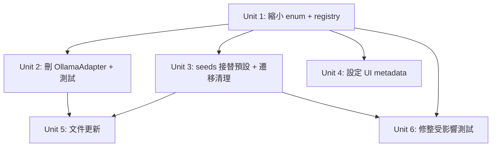

# refactor: Remove Ollama provider

## Overview

移除 Ollama 這個 LLM provider。它涉及 domain enum、provider adapter + registry、seed 資料、設定 UI metadata，以及一批測試。最關鍵的不是刪程式碼，而是兩件「不刪會出事」的事:

1. **接替開箱預設** —— 目前 seed 唯一 `enabled:true` 的 profile 與全部 6 個 preset 都指向 `provider_ollama_local`。決策(已確認):新增一個 `openai-compatible` 本地 seed profile 接替,保留「本地、免 API key、開箱即用」的體驗。
2. **既有資料遷移** —— `provider-profile-repo.ts` 每次讀取都對 `providerKind` 做 `zod.parse()`。一旦從 enum 移除 `"ollama"`,現有使用者 DB 裡任何 `provider_kind = 'ollama'` 的列都會讓 `list()` 整批拋錯 → bootstrap 壞掉 → 全站不可用。需要一個啟動時的冪等遷移把舊 ollama 列清掉並重指 preset。

## Problem Frame

使用者不再需要 Ollama provider。這是一個有外部契約面(zod enum 是 provider profile 的驗證閘門)與既有持久化資料(SQLite 本地檔)的移除,屬於 Standard refactor —— 不能只當「刪檔」處理,否則會在既有安裝上炸掉。

## Requirements Trace

- R1. `"ollama"` 從 `providerKind` 列舉與 provider registry 中完全移除,新建/驗證 provider 時不再接受 ollama。
- R2. 移除 `OllamaAdapter` 及其專屬測試,且不殘留 dangling import。
- R3. Seed 不再建立 ollama profile;新增 `openai-compatible` 本地 seed(enabled、免金鑰)接替為開箱預設,所有 preset 改指向它。
- R4. 既有安裝在升級後不因殘留的 `ollama` 列而崩潰(讀取不拋錯、bootstrap 正常)。
- R5. 設定 UI 不再出現 Ollama 選項;`PROVIDER_META` 與 `providerKind` 型別對齊(無 TS 缺鍵錯誤)。
- R6. `pnpm typecheck` / `pnpm test` 全綠。

## Scope Boundaries

- 不改 `BaseAdapter` 或其他 provider adapter 的行為。
- 不改 DB schema(`provider_kind` 是自由文字 `text` 欄、無 CHECK constraint,故**無需 drizzle migration**)。
- 不動歷史文件(`docs/plans/`、`docs/brainstorms/`、`CHANGELOG.md` 等)中對 ollama 的歷史性提及 —— 那些是時間快照,不是現役程式。`README.md` / `ARCHITECTURE.md` 若把 ollama 列為「目前支援的 provider」則需更新(見 Unit 5)。
- 不提供「把舊 ollama profile 自動轉換成其他 provider」的智慧遷移;遷移策略是「刪除殘留 ollama 列 + 重指 preset」,因為 ollama 設定(localhost endpoint、本地模型名)對其他 provider 無意義。

## Context & Research

### Relevant Code and Patterns

- `src/domain/schemas/enums.ts:6-15` —— `providerKindSchema` z.enum,移除 `"ollama"`(第 10 行)。這是唯一的型別閘門;`adapterFactories: Record<ProviderKind, ...>` 與 `PROVIDER_META: Record<ProviderKind, ...>` 都會在 enum 縮小後由 TS 強制同步。
- `src/infrastructure/providers/registry.ts:5,16` —— 移除 `OllamaAdapter` import 與 `ollama:` factory。
- `src/infrastructure/providers/ollama.ts` —— 整檔刪除(`OllamaAdapter extends BaseAdapter`,無其他檔案 re-export)。
- `src/infrastructure/storage/seeds.ts:67-138, 158-174` —— 移除 ollama profile 物件、新增 openai-compatible 本地 profile、把 preset 的 `providerProfileId` 從 `provider_ollama_local` 改為新 id。
- `src/presentation/settings/provider-profiles-panel.tsx:34` —— 移除 `PROVIDER_META.ollama`。
- `src/infrastructure/storage/provider-profile-repo.ts:11-26` —— `providerFromRow()` 的 `providerProfileSchema.parse()` 是遷移風險來源;遷移邏輯放在 seed/啟動路徑而非這裡(這裡保持純讀取)。

### Migration insight

`drizzle/0000_fancy_wendigo.sql:30,66` 確認 `provider_kind` 為純 `text`、無 CHECK,故 DB 層不阻擋舊值,風險完全在應用層 zod。遷移只需「在 seed/啟動時刪掉殘留 ollama 列、把孤兒 preset 重指」,屬資料清理而非 schema 變更。

### Institutional Learnings

- 記憶 [[project_post-generator-studio]]:多 agent 並行有碰撞風險 —— 開工前 fetch+log,平行工作用 worktree。此計畫為單一連續變更,單分支即可。

## Key Technical Decisions

- **不加 DB migration**:`provider_kind` 無 DB 約束,enum 純在 zod 層。決策是讓資料遷移走「啟動時冪等清理」而非 schema 變更,符合 local-first 單檔 SQLite 的現況。
- **接替預設 = 新增 openai-compatible 本地 seed**(已與使用者確認):保留 ollama 原本「本地、免 API key、預設啟用」的開箱體驗,優於改指向 disabled 且需金鑰的 OpenAI。新 profile id 建議 `provider_local_openai_compatible`。
- **遷移採「刪除 + 重指」而非「轉換」**:ollama 的 baseUrl/model 對其他 provider 無意義,硬轉換會產生壞設定。乾淨刪除殘留列、把指向它的 preset 重指到新本地 seed,語意最清楚。
- **遷移點放在 `seedDefaults` 路徑**:seed 已在啟動/migrate 流程被呼叫且是冪等的,把清理邏輯併入同一處,避免新增獨立 migration 機制。

## Open Questions

### Resolved During Planning

- 接替預設用哪個 provider? → 新增 openai-compatible 本地 seed(使用者確認)。
- 需要 drizzle migration 嗎? → 不需要,`provider_kind` 無 DB 約束。
- 殘留 ollama 列怎麼處理? → 啟動時冪等刪除 + 重指孤兒 preset,不做智慧轉換。

### Deferred to Implementation

- 新 seed profile 的確切 id 字串與 `model` 預設值(`local-model` vs 空字串)—— 實作時對齊 `provider-profiles-panel.tsx` 的 `CREATE_DEFAULTS` 既有慣例。
- 遷移清理的確切寫法(是否在刪 profile 前先 `UPDATE` preset 的外鍵指向,以避開 FK constraint)—— 依 `foreign-keys.test.ts` 揭示的 FK 行為,順序須「先重指 preset、後刪 profile」。

## Implementation Units

- [ ] **Unit 1: 從 enum 與 registry 移除 ollama**

**Goal:** 把 `"ollama"` 從 `providerKindSchema` 移除,並從 adapter registry 拿掉 factory 與 import。這是型別閘門,移除後 TS 會自動逼出所有 `Record<ProviderKind, ...>` 的缺鍵點。

**Requirements:** R1

**Dependencies:** None

**Files:**
- Modify: `src/domain/schemas/enums.ts`
- Modify: `src/infrastructure/providers/registry.ts`
- Test: `src/tests/unit/provider-registry.test.ts`(更新斷言)、`src/tests/unit/schemas.test.ts`(更新)

**Approach:**
- `enums.ts`:刪 `"ollama"` 那一行。
- `registry.ts`:刪 `OllamaAdapter` import 與 `ollama:` 條目。`adapterFactories` 是 `Record<ProviderKind, ...>`,enum 縮小後若殘留 ollama 鍵會 TS 報「多餘鍵」,移除後即對齊。

**Patterns to follow:** 其餘 provider 在這兩檔的既有寫法。

**Test scenarios:**
- Happy path:`listProviderAdapters()` 回傳的 kind 陣列不含 `"ollama"`,且仍含其餘 6 個。
- Edge case:`providerKindSchema.parse("ollama")` 應拋出(驗證閘門生效)。
- Edge case:`providerKindSchema.parse("openai-compatible")` 等其餘值仍通過。

**Verification:** `provider-registry.test.ts`、`schemas.test.ts` 綠;`getProviderAdapter` 對其餘 kind 仍可取得 adapter。

- [ ] **Unit 2: 刪除 OllamaAdapter 與其專屬測試**

**Goal:** 移除 adapter 實作檔與只測它的測試檔,確認無 dangling import。

**Requirements:** R2

**Dependencies:** Unit 1

**Files:**
- Delete: `src/infrastructure/providers/ollama.ts`
- Delete: `src/tests/unit/ollama-adapter.test.ts`
- Modify: `src/tests/unit/provider-base-adapter.test.ts`(移除 import 與 ollama 相關案例)

**Approach:**
- 刪兩個檔。
- `provider-base-adapter.test.ts` 有 `import { OllamaAdapter }` 與兩個用到它的案例(行 ~146「Ollama-style error string」、~254「empty content」)。這兩個案例其實是在測 `BaseAdapter` 的共用行為,只是借 OllamaAdapter 當載體 —— 改用另一個仍存在的 adapter(例如 `OpenAICompatibleAdapter`)當載體重寫,以保留對 base 行為的覆蓋,而非直接刪掉。

**Patterns to follow:** `provider-base-adapter.test.ts` 中其他以 OpenAICompatibleAdapter 為載體的案例。

**Test scenarios:**
- Happy path:`provider-base-adapter.test.ts` 全綠,且仍覆蓋「provider 傳回 error 字串時 surface 成錯誤」「complete() 空內容拋錯」這兩個 base 行為(改以保留的 adapter 驗證)。
- Edge case:全專案 grep `OllamaAdapter` 應為 0 命中(排除 docs)。

**Verification:** `pnpm typecheck` 無「找不到模組 ollama」錯誤;base-adapter 測試綠。

- [ ] **Unit 3: seeds 接替開箱預設 + 既有資料遷移清理**

**Goal:** (a) 移除 ollama seed profile;(b) 新增 openai-compatible 本地 seed(enabled、免金鑰)接替;(c) preset 改指向新 id;(d) 加入啟動時冪等清理,移除既有安裝殘留的 ollama 列並重指孤兒 preset。

**Requirements:** R3, R4

**Dependencies:** Unit 1

**Files:**
- Modify: `src/infrastructure/storage/seeds.ts`
- Test: `src/tests/integration/foreign-keys.test.ts`(更新)、`src/tests/unit/preset-service.test.ts`(更新)

**Approach:**
- 新 seed profile(建議):`id: "provider_local_openai_compatible"`、`providerKind: "openai-compatible"`、`baseUrl: "http://localhost:8000"`、`model`: 對齊 panel `CREATE_DEFAULTS`、`apiKeyRef/keyMasked: null`、`enabled: true`。把它放在原 ollama 物件的位置(維持「首個即預設」語意)。
- preset 的 `providerProfileId` 由 `provider_ollama_local` 改為新 id。
- **遷移清理(冪等)**:在 `seedDefaults` 內,於既有資料路徑(`existingProviders.length > 0` 時也要執行,不能只在首次 seed 跑)加入清理:先把任何 `providerProfileId = 'provider_ollama_local'` 或指向 `provider_kind='ollama'` 列的 preset 重指到新本地 seed(若新 seed 不存在則一併補建),再刪除 `provider_kind = 'ollama'` 的 profile 列。順序須「先重指 preset、後刪 profile」以避開 FK constraint(見 `foreign-keys.test.ts` 揭示的 RESTRICT 行為)。
- 冪等性:重複啟動時,ollama 列已不存在 → 清理為 no-op。

**Execution note:** 先寫一個「既有 DB 含 ollama 列 → 啟動後該列消失且 preset 已重指、`list()` 不拋錯」的失敗整合測試,再實作遷移(characterization-first,因為這條路徑是回歸風險最高處)。

**Patterns to follow:** `seedDefaults` 既有的 `existingX.length === 0` 冪等判斷;`foreign-keys.test.ts` 的 seed→FK 斷言寫法。

**Test scenarios:**
- Happy path(全新 DB):seed 後存在 `provider_local_openai_compatible`(enabled)、不存在任何 ollama profile、所有 preset 指向新 id。
- Integration(既有 DB 遷移):預先插入一個 `provider_ollama_local`(kind=ollama)列 + 一個指向它的 preset → 跑 `seedDefaults` → 該 profile 被刪、preset 已重指、`providerProfiles.list()` 不拋 zod 錯。
- Edge case(冪等):連續跑兩次 `seedDefaults` 不重複建檔、不拋錯。
- Error path:重指與刪除的順序錯置時 FK constraint 會擋 —— 測試驗證正確順序下刪除成功。

**Verification:** `foreign-keys.test.ts`、`preset-service.test.ts` 綠;手動以一個含 ollama 列的 DB 啟動 `pnpm dev`,provider 清單正常載入。

- [ ] **Unit 4: 移除設定 UI 的 Ollama metadata**

**Goal:** 從 `PROVIDER_META` 移除 ollama 條目,使設定面板不再列出 Ollama,且型別與縮小後的 `ProviderKind` 對齊。

**Requirements:** R5

**Dependencies:** Unit 1

**Files:**
- Modify: `src/presentation/settings/provider-profiles-panel.tsx`
- Test: `src/tests/unit/provider-profiles-panel.test.tsx`(更新)

**Approach:**
- 刪 `PROVIDER_META.ollama`(行 34)。`PROVIDER_META: Record<ProviderKind, ProviderMeta>`,enum 縮小後殘留 ollama 鍵會 TS 報多餘鍵。
- `CREATE_DEFAULTS` 已是 `openai-compatible`,不受影響。

**Patterns to follow:** `PROVIDER_META` 其他條目。

**Test scenarios:**
- Happy path:provider kind 下拉選單不含 Ollama 選項;選其餘 kind 仍正常顯示 displayName。
- Edge case:移除原本三個 ollama 專屬 UI 測試案例(顯示 "Ollama (Local)"、ollama 無 apiKeyUrl 連結、ollama 無金鑰 toggle),改以另一個 `requiresApiKey:false` 的 kind(`openai-compatible`)覆蓋「免金鑰時不顯示連結/toggle」的等價行為,以免丟失該分支覆蓋。

**Verification:** `provider-profiles-panel.test.tsx` 綠;UI 不再出現 Ollama。

- [ ] **Unit 5: 更新現役文件中的 provider 列表**

**Goal:** 把 `README.md` / `ARCHITECTURE.md` 中「目前支援的 provider」清單裡的 Ollama 移除(僅限現役描述,不動歷史 plan/brainstorm/CHANGELOG)。

**Requirements:** R1(對外描述一致)

**Dependencies:** Unit 2, Unit 3

**Files:**
- Modify: `README.md`(若列出 Ollama 為支援 provider)
- Modify: `ARCHITECTURE.md`(同上)

**Approach:** 先讀這兩檔的 ollama 上下文,判斷是「現役支援清單」還是「歷史/範例」。只改現役清單,歷史敘述保留。

**Test scenarios:** Test expectation: none —— 純文件變更,無行為。

**Verification:** README/ARCHITECTURE 不再把 Ollama 列為支援的 provider;歷史文件未被動到。

- [ ] **Unit 6: 修整其餘受影響測試 + 全綠驗收**

**Goal:** 更新所有仍引用 ollama 字串/`provider_ollama_local` 的測試,使整套測試與 typecheck 全綠。

**Requirements:** R6

**Dependencies:** Unit 1, Unit 3

**Files:**
- Modify: `src/tests/unit/schemas.test.ts`、`src/tests/unit/provider-service.test.ts`、`src/tests/unit/preset-service.test.ts`、`src/tests/integration/foreign-keys.test.ts`(凡用 `providerKind: "ollama"` 或 `provider_ollama_local` 之處改為仍存在的 kind / 新 seed id)

**Approach:**
- `schemas.test.ts`:把斷言 `providerKind` 從 ollama 改為其餘 kind(如 `openai-compatible`)。
- `provider-service.test.ts`、`preset-service.test.ts`:測試 fixture 的 ollama / `provider_ollama_local` 改為新本地 seed id 或其他有效 kind。
- `foreign-keys.test.ts`:把對 `provider_ollama_local` 的 FK 斷言改為對新 seed 預設 id(seed 後仍是「被 preset 引用、刪除應被 RESTRICT」的那一個)。
- 此 Unit 與 Unit 3 的測試更新有重疊,以實際跑 `pnpm test` 的紅燈為準收斂。

**Test scenarios:**
- Happy path:`pnpm test` 全綠、`pnpm typecheck` 無錯。
- Edge case:全專案 grep `"ollama"` 與 `provider_ollama_local` 在 `src/` 下為 0 命中。

**Verification:** `pnpm typecheck` && `pnpm test` 全綠;`src/` 下無 ollama 殘留。

## System-Wide Impact

- **型別閘門連鎖**:`providerKindSchema` 縮小後,`adapterFactories`(registry)與 `PROVIDER_META`(UI)兩個 `Record<ProviderKind,...>` 會由 TS 強制同步 —— 這是好事,typecheck 會自動指出所有缺漏點。
- **既有資料風險(最高)**:`provider-profile-repo.ts` 的 `parse-on-read` 使任何殘留 ollama 列足以讓 `list()` 整批失敗 → bootstrap (`GET /api/bootstrap`) 回傳全部 provider profiles → 全站初始化崩潰。Unit 3 的遷移清理是此風險的唯一護欄。
- **FK 生命週期**:preset → providerProfile 為 RESTRICT 外鍵。遷移與 seed 都須「先重指 preset、後刪 profile」,否則刪除被擋。
- **不變量**:`BaseAdapter` 與其他 6 個 provider 行為不變;DB schema 不變(無 migration);`bootstrap` / `generation` 串流路徑對其餘 provider 完全不受影響。

## Risks & Dependencies

| Risk | Mitigation |
|------|------------|
| 既有使用者 DB 殘留 ollama 列導致升級後 bootstrap 崩潰 | Unit 3 啟動時冪等遷移:重指 preset + 刪 ollama 列;先寫失敗整合測試再實作 |
| 遷移順序錯誤觸發 FK RESTRICT | 固定「先 UPDATE preset 外鍵、後 DELETE profile」順序,以 `foreign-keys.test.ts` 模式驗證 |
| 借 OllamaAdapter 當載體的 base-adapter 測試被連帶刪除,丟失 base 行為覆蓋 | Unit 2 改用 OpenAICompatibleAdapter 重寫該兩案例,而非刪除 |
| 文件誤刪歷史性 ollama 記錄 | Unit 5 僅改現役支援清單,明確排除 docs/plans、brainstorms、CHANGELOG |

## Documentation / Operational Notes

- 無 DB migration、無新環境變數。
- 既有使用者升級後首次啟動會自動清理 ollama 列(冪等),無需手動操作。
- 若使用者原本實際在用本機 Ollama,升級後其 preset 會自動改走新的本地 openai-compatible 預設(localhost:8000);此行為變更值得在 CHANGELOG 註記(由後續 /ship 流程處理,不在本計畫範圍)。

## Sources & References

- Related code: `src/domain/schemas/enums.ts`、`src/infrastructure/providers/registry.ts`、`src/infrastructure/providers/ollama.ts`、`src/infrastructure/storage/seeds.ts`、`src/infrastructure/storage/provider-profile-repo.ts`、`src/presentation/settings/provider-profiles-panel.tsx`
- DB 約束確認:`drizzle/0000_fancy_wendigo.sql:30,66`(`provider_kind` 為無約束 text)
