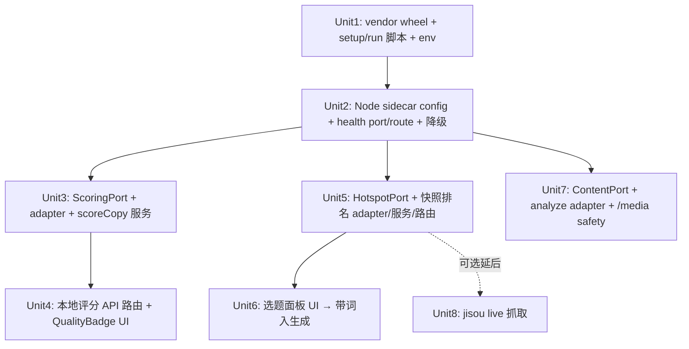

# feat: 把 hotspot-sdk 接进 Post Generator Studio 工作流

## Overview

把 `~/Downloads/hotspot-sdk`(一个从「熱點監控」app 抽出的 Python SDK)的三块能力接进本项目:

1. **文案评分(scoring)** — 零依赖纯函数,对着词库给文案打分(奖励爆点词/开头钩子/CTA,惩罚「AI 味」八股),作为现有 LLM 评审的**本地、秒回、确定性**互补信号。
2. **热点选题(hotspot)** — 排名/告警逻辑(跳升/掉榜/新词),用来驱动「今天写什么」选题面板,作为生成的 title/eventSummary 种子。
3. **媒体识别(content/NSFW)** — 给 `/media` 页加一个「安全检测」动作(NSFW 检测即用;封面动作评分需 CLIP 权重,延后)。

**核心架构决定**:三块能力**统一走「专属 Python sidecar + Node HTTP 客户端」**,完整复刻现有 omniwm 水印边车范式(`infrastructure/config/sidecar.ts` + `WatermarkAdapter` + `/api/media/health` 降级)。hotspot-sdk **自带一个测试完整的 FastAPI 服务**(`hotspot-sdk-server`),所以 Python 侧几乎零编码——装 wheel、起进程、配环境变量即可;真正的工作量在 Node 侧的 adapter/service/route/UI。

不含 Telegram 监控转发(本质是分发渠道,非生成,延后到后续迭代)。

## Problem Frame

本项目是本地优先的 AI 发文生成器。当前质量反馈只有一条路径:`scoreGeneration()`(LLM-as-Judge,五维),它**慢、花钱、且有自我评估偏差**(judge 模型 == 生成模型时打折)。同时,选题完全靠用户手填 title/eventSummary,没有「热度」信号;`/media` 页只有水印/去标,没有内容安全判断。

hotspot-sdk 恰好补这三个缺口,且它的能力都是**注入式配置、可独立部署的 HTTP 服务**,与本项目既有的 Python sidecar 部署契约天然对齐。

## Requirements Trace

- **R1**(评分):用户在生成/编辑文案时,能拿到一个**本地、秒回**的词库质量分(总分 + breakdown + `ai_slop`/opener/cta 等 flags),与 LLM 评审并列展示,且 sidecar 不可用时优雅降级。
- **R2**(热点):用户能把一份排行榜快照喂给排名器,得到跳升/新词/掉榜告警,并能**一键把某个热词带入生成**(填充 title/eventSummary)。
- **R3**(媒体):用户能在 `/media` 页对一个媒体文件触发 NSFW/内容检测,得到结构化判定;封面动作评分在缺 CLIP 权重时明确降级而非报错。
- **R4**(共通):新增能力全部经由一个**专属 sidecar**,有独立 health 端点与降级 UI;进程间可选 shared-secret 鉴权;媒体路径受 root 限制 + 大小上限。
- **R5**(诚实标注):凡 SDK README 标注「需凭证/需权重才满血」的部分(jisou 抓取、CLIP 封面),在计划与 UI 中明确标为延后/降级,不假装可用。

## Scope Boundaries

- ❌ **不含 Telegram 监控转发**(`/telegram/*`)。
- ❌ **不实现 jisou/极搜 live 抓取**(需 bot 用户名 + TG 凭证)。热点 MVP 只接「快照 → 排名 → 告警」纯逻辑端点;live 抓取列为后续可选单元。
- ❌ **不接 CLIP 封面动作评分**(`clip_act` 权重 SDK 未打包)。媒体 MVP 只用 nudenet 的 NSFW 检测。
- ❌ 不改现有 LLM-as-Judge 逻辑;本地评分是**并列新增**,不替换。
- ❌ 不做繁→简归一化(SDK 词库是简体子串匹配);本项目目标内容为 zh-CN,可接受,列入已知限制。
- ❌ 不把 hotspot 能力塞进现有 omniwm sidecar 进程(见 Key Technical Decisions 的隔离理由)。

## Context & Research

### Relevant Code and Patterns(要照抄的模板)

- **Sidecar 配置范式**:`src/infrastructure/config/sidecar.ts` — `getSidecarUrl()` / `getSidecarSecret()` / `msFromEnv()` 超时。新增 hotspot 版本镜像它。
- **HTTP 客户端范式**:`src/infrastructure/watermark/watermark-adapter.ts` — `call<T>()` + `fetchError()`(分类 cancelled/timeout/SIDECAR_UNAVAILABLE)+ `parse<T>()` + `health()`。**新 adapter 是它的结构化拷贝**,只换端点与 zod。
- **Port 范式**:`src/domain/ports/watermark-port.ts`(`WatermarkPort` / `SidecarHealth` / `WatermarkOptions`)。
- **Health 路由 + 降级**:`src/app/api/media/health/route.ts`(sidecar 挂掉返回 503 body 而非 throw)+ 前端 `src/presentation/media/use-watermark.ts` 的降级 banner。
- **既有评分服务**:`src/application/quality/judge-service.ts` + `src/domain/schemas/quality.ts` + `src/presentation/generation/quality-badge.tsx` — 本地评分 UI 挂在质量徽章旁。
- **On-demand 评分路由范式**:`src/app/api/generations/[id]/score/route.ts`(本地评分新增一个平行路由)。
- **Pipeline**:`src/plugins/pipeline/registry.ts` + `src/domain/pipeline-steps.ts` — 若选「自动评分」,在 `formatOutput` 后追加一个非阻塞注解步骤(默认仍走 on-demand,见 Open Questions)。
- **SDK vendoring 先例**:omniwm SDK 被 vendor 进 `sidecar/`(CLAUDE.md「wraps the vendored omniwm SDK」)。hotspot-sdk 同法 vendor wheel。

### SDK 侧关键事实(已读源码)

- **自带 FastAPI 服务**:`hotspot_sdk/server/app.py` 暴露 `POST /score`、`POST /hotspot/snapshot`、`POST /content/analyze`、`GET /health`(返回 `{status, version, capabilities:{scoring,hotspot,content,telegram}}`)。`create_app(config)` 可注入配置。
- **评分纯函数**:`hotspot_sdk/scoring/engine.py::VocabScorer.score()` 返回 `ScoreResult{text, score, breakdown:dict, flags:list}`。零外部依赖。
- **服务安全**:`HOTSPOT_API_KEY`(设了则全端点要 `X-API-Key`)、`HOTSPOT_MEDIA_ROOT`(不设则 `/content/analyze` 直接 400 禁用)、`HOTSPOT_MAX_MEDIA_BYTES`、默认 bind `127.0.0.1:8000`。`/content/analyze` 已做 realpath 限定 + 大小上限。
- **可选依赖矩阵**:scoring/hotspot 纯可用;content 需 `hotspot-sdk[content]`(nudenet/opencv/scenedetect);未装则端点 503。
- **wheel 成品**:`dist/hotspot_sdk-0.1.0-py3-none-any.whl`,extras:`telegram`/`content`/`server`/`all`。
- **已知限制(SDK README)**:jisou 抓取是重建非恢复(需 bot+凭证验证回复格式);CLIP 封面权重未打包;评分权重是透明重建(全在 `breakdown` 里可重新加权);词库简体子串匹配、无繁简归一。

### Institutional Learnings

- `docs/plans/2026-06-29-001-feat-omniwm-watermark-integration-plan.md` — omniwm sidecar 整合计划,本计划的直接结构蓝本。
- Memory:**多 agent 易碰撞 → 分支前先 fetch+log,并行用 worktree**;**`next dev` 被 CSP 弄坏,浏览器测试走 `pnpm build && pnpm start`**;**启动一律走 pnpm(锁 Node 22 + 回收 port)**。
- Memory:better-sqlite3 ABI 坑(与本计划无关,但 sidecar venv 同理需锁 Python ≥3.11)。

## Key Technical Decisions

- **专属 sidecar,不并进 omniwm**:hotspot-sdk 自带完整 FastAPI(装 wheel 即跑,Python 侧近零编码);且依赖面互斥(scoring 纯/content 重 CLIP·nudenet/telegram telethon),并进 omniwm 会把水印进程拖肥。代价是多一个进程/端口/health。**理由 > 代价**:复刻已审过的范式,Node adapter 几乎拷贝。备选见 Alternatives。
- **复用 SDK 自带 server,不自写 FastAPI shell**:`hotspot-sdk-server` 已测试覆盖(71 测试含 `tests/server/test_api.py`),自写等于重复造轮子。我们只 vendor wheel + 写 setup/run 脚本 + 配环境。
- **评分默认 on-demand,不默认入 pipeline**:镜像现有 LLM 评分是「测试读者」式手动触发的克制设计(避免 verbosity bias / 自动改写循环)。自动评分列为 Open Question,默认关闭。
- **媒体 root 复用既有共享目录**:`HOTSPOT_MEDIA_ROOT` 指向与 `OMNIWM_MEDIA_DIR` 相同的媒体根,沿用「Node+sidecar 同机、同绝对路径、同 uid」契约。
- **进程间 shared-secret 镜像 omniwm + 非 loopback 强制(深化加固)**:新增 `HOTSPOT_SIDECAR_SECRET`,设了则 Node 带 `X-API-Key`(SDK 端用 `HOTSPOT_API_KEY` 校验)。loopback 默认下 secret 可选(单机开发便利),但**因为 `/content/analyze` 会读文件、ranker 持有全局状态,即便 loopback 也建议默认设 secret**;且 Unit 1 的入口脚本**必须在「绑定非 loopback 地址且 `HOTSPOT_API_KEY` 未设」时拒绝启动**(防 `HOTSPOT_HOST=0.0.0.0` + 无 secret 把文件读端点暴露到 LAN)。`127.0.0.1` 对同机所有用户/进程可达,这点在 SSRF 与多用户场景下尤其重要(见 System-Wide Impact)。
- **错误码沿用既有,不新造孤儿码(深化修正)**:`src/app/api/api-helpers.ts` 的 `STATUS_BY_CODE` 是 code→HTTP 的中央映射,**未登记的码默认掉成 HTTP 400**。所以:(a) 复用既有 `SIDECAR_UNAVAILABLE:503` / `SIDECAR_ERROR:502` / `WATERMARK_TIMEOUT:504`(超时码考虑泛化为 `SIDECAR_TIMEOUT:504`),(b) 任何新增码(如 `SIDECAR_AUTH_FAILED`、`SIDECAR_CANCELLED`)**必须同步加进 `STATUS_BY_CODE`**,否则超时/认证错误会被误报成 400。Unit 2 把这登记为显式任务。
- **本地评分 MVP 不落库(深化简化)**:原计划「可选写入 `generation.localScore`」需要 4 处协同改(zod `generation.ts` + drizzle `schema.ts` + `generation-repo.ts` 映射 + `migrations.ts` 新增列),且会引入「编辑正文后徽章展示旧分撒谎」的过期问题(LLM 评分已有此弊)。**MVP 改为纯内存/按需重算,不持久化**——草稿端点本就无状态,生成结果评分也走「点一次算一次」。持久化列为延后(见 Open Questions)。
- **进程间认证失败要可诊断(深化新增)**:`fetchError` 现仅分 cancelled/timeout/unavailable,无 401 分支。若 sidecar 设了 `HOTSPOT_API_KEY` 而 Node 侧 `HOTSPOT_SIDECAR_SECRET` 未设/不匹配,每次调用 401 会被误归为 `SIDECAR_UNAVAILABLE`,运维查不到根因。新增独立码 `SIDECAR_AUTH_FAILED`。
- **复用 transport 范式 ≠ 继承输入校验(深化核心原则)**:照抄 omniwm 的 call/parse/health/降级**只复制了传输层**,不含其输入校验义务。**每个新路由必须在 Node 边界各自重建大小/路径/类型上限**(见 System-Wide Impact「输入上限与滥用面」)。

## Open Questions

### Resolved During Planning

- **能不能不写 Python?** 基本可以——用 SDK 自带 server,只写 setup/run 脚本与 env。Resolution:确认。
- **媒体检测怎么不越权读文件?(深化修正)** SDK 的 `/content/analyze` 有 realpath 限定 + 大小上限,但**那是第二道屏障,不能是唯一一道**。更关键的是:Unit 7 重设计后 Node **自己用 `media-files.ts` 生成 job 目录并写盘**(服务端随机命名),传给 sidecar 的是 **Node 自己刚写的绝对路径,而非用户提供的路径**——这从根本上消除了「调用方控制路径」的遍历面。Resolution:走「上传→服务端建 job→分析」,Node 不接收用户路径;仍保留纵深防御(拒 `..`/绝对路径/符号链接逃逸)作为原则。
- **热点 MVP 怎么不依赖凭证?** 只接 `POST /hotspot/snapshot`(纯排名/告警),快照来源为用户手动输入/粘贴。live 抓取延后。Resolution:确认。
- **端口选什么?** omniwm 占 8765;hotspot sidecar 默认 8770(env `HOTSPOT_SIDECAR_PORT` 可覆盖)。

### Deferred to Implementation

- **自动评分是否入 pipeline**:默认 on-demand;若产品上想要「生成后自动出本地分」,在 Unit 4 落地时加一个 preset 开关 + pipeline 注解步骤。决定点延后到实现期看 UX。
- **本地分持久化**:MVP 不落库(见 Key Technical Decisions)。若日后要把 `localScore` 存进 generation,需 4 处协同改 + 解决「编辑正文后标记过期」问题,届时另开单元。
- **breakdown 的 i18n 展示**:`breakdown` 的 key 是英文(`hot_words_events` 等);UI 是直接展示还是映射成 next-intl 文案,实现期定。
- **粘贴排行的格式与解析器(深化新增,需先定)**:Unit 5 的 API 吃 `Record<string,number>`,但用户粘的是文本排行。**谁、用什么格式、在哪解析**必须在 Unit 6 实现前定(建议「行号. 关键词」纯文本 → client/route 解析器)。这是 Unit 6 的最大未决,已落入该单元。
- **hotspot 全局单 baseline 的会话语义**:ranker 是进程内单一全局 baseline,跨平台/跨来源粘贴会互相 diff 出错乱告警,且 sidecar 重启静默丢基线。MVP 用「重置基线」操作 + 文案缓解;真正的多会话隔离/持久化延后。
- **jisou live 抓取单元**(Unit 8,可选):是否本期做,取决于你能否提供 bot 用户名 + TG 凭证;计划保留为延后单元。
- **媒体检测的输入来源(深化已定)**:**不存在**可寻址的既有媒体文件——`/media` 上传是临时 job 目录、用完即删。Unit 7 改为「安全检测自带上传 + 自建 job」,见该单元重设计。

## High-Level Technical Design

> *以下示意整体形状,是给评审看方向的指引,不是实现规格;实现 agent 当上下文读,别照抄。*

```
┌─────────────────────────── Next.js (本项目, TS) ───────────────────────────┐
│  presentation/  ──>  app/api/*  ──>  application/*  ──>  infrastructure/    │
│   · QualityBadge++          · /api/.../local-score      hotspot-scoring-    │
│   · TopicPanel(new)         · /api/hotspot/snapshot     adapter (HTTP)      │
│   · MediaSafety(new)        · /api/hotspot/health       hotspot-content-    │
│                             · /api/media/safety         adapter (HTTP)      │
│                                       │ config/hotspot-sidecar.ts           │
└───────────────────────────────────────┼────────────────────────────────────┘
                                         │ HTTP (x-api-key 可选)
                  ┌──────────────────────▼───────────────────────┐
                  │  hotspot-sdk-server (Python FastAPI, :8770)   │
                  │   POST /score          (纯, 即用)             │
                  │   POST /hotspot/snapshot (纯, 即用)           │
                  │   POST /content/analyze  (需 [content] extra) │
                  │   GET  /health  → {capabilities:{...}}        │
                  │   ← vendored wheel: hotspot_sdk[content,server]│
                  └──────────────────────────────────────────────┘
                       MEDIA_ROOT 与 omniwm 共享同一绝对路径
```

依赖流向:**foundation(sidecar + config + health)先行**,scoring / hotspot / media 三条能力并行 fan-out。



## Implementation Units

### Phase 0 — Sidecar 地基(共通管线)

- [x] **Unit 1: Vendor hotspot-sdk + sidecar 脚本与环境**

**Goal:** 在 repo 内可一键建立 hotspot sidecar 运行环境并起进程,不依赖 `~/Downloads`。

**Requirements:** R4, R5

**Dependencies:** 无

**Files:**
- Create: `hotspot-sidecar/vendor/hotspot_sdk-0.1.0-py3-none-any.whl`(从 `~/Downloads/hotspot-sdk/dist/` 拷入)
- Create: `hotspot-sidecar/README.md`(部署契约 + 安全开关,镜像 `sidecar/CONTRACT.md` 风格)
- Create: `hotspot-sidecar/run.py` 或直接用 `hotspot-sdk-server`(薄入口:`create_app` 注入配置 + `HOTSPOT_HOST/PORT`)
- Modify: `package.json`(scripts:`sidecar:hotspot:setup` = 建 venv + `pip install "vendor/...whl[content,server]"`;`sidecar:hotspot` = 回收端口 8770 + 起服务)
- Modify: `CLAUDE.md`(新增 hotspot sidecar 段 + 环境变量表)
- Modify: `.gitignore`(忽略 `hotspot-sidecar/.venv`)

**Approach:**
- 镜像现有 `pnpm sidecar:setup` / `pnpm sidecar` 的脚本形态(端口回收 + venv)。
- wheel 装 `[content,server]` extra(NSFW 要 nudenet/opencv);**不装 telegram**。
- 默认 bind `127.0.0.1:8770`。**`run.py` 入口必须加一行守卫:绑定非 loopback 地址且 `HOTSPOT_API_KEY` 未设 → 拒绝启动**(深化加固,防 LAN 暴露文件读端点)。
- **sidecar 日志级别要压制 per-request 路径/推理结果**(深化加固):媒体安全会处理 NSFW,sidecar 默认 INFO 可能把媒体路径/判定写日志,设置日志级别避免留下「用户在检测某 NSFW 文件」的持久记录。

**Execution note:** 主要是脚本/打包,无业务逻辑。

**Patterns to follow:** `sidecar/`(omniwm)的 setup/run 脚本、`CONTRACT.md`。

**Test scenarios:**
- Integration: `pnpm sidecar:hotspot:setup` 后 venv 内 `python -c "import hotspot_sdk"` 成功;`hotspot-sdk-server` 起得来,`curl :8770/health` 返回 `capabilities.scoring=true`、`content=true`(装了 extra)。
- Test expectation: 其余为打包/脚本,无单元行为测试 — setup 验证即足。

**Verification:** sidecar 起得来、`/health` 200、`capabilities.content=true`;`hotspot-sidecar/.venv` 不进 git。

---

- [x] **Unit 2: Node 侧 sidecar 配置 + health 端口/路由 + 降级**

**Goal:** Node 能定位 hotspot sidecar、查 health、并在挂掉时优雅降级。这是三条能力共用的地基。

**Requirements:** R4

**Dependencies:** Unit 1

**Files:**
- Create: `src/infrastructure/config/hotspot-sidecar.ts`(`getHotspotSidecarUrl()` 默认 `http://127.0.0.1:8770`、`getHotspotSidecarSecret()`、`msFromEnv` 超时)
- Create: `src/domain/ports/hotspot-port.ts`(`HotspotSidecarHealth`、`HotspotOptions{abortSignal}`,以及后续单元要扩的 port 接口骨架)
- Create: `src/infrastructure/hotspot/hotspot-adapter-base.ts` 或在各 adapter 内复用 `with-timeout`(`call/fetchError/parse` 的共享实现)
- Create: `src/app/api/hotspot/health/route.ts`(挂掉返回 503 body,不 throw)
- Test: `src/tests/unit/hotspot-sidecar-health.test.ts`

**Approach:**
- `fetchError` 复用既有码 + **新增 401 分支**:`SIDECAR_UNAVAILABLE`(沿用)/`SIDECAR_TIMEOUT`(沿用或泛化自 `WATERMARK_TIMEOUT`)/`SIDECAR_CANCELLED`/**`SIDECAR_AUTH_FAILED`(401,可诊断认证配错)**。
- **同步在 `src/app/api/api-helpers.ts` 的 `STATUS_BY_CODE` 登记新码**(`SIDECAR_TIMEOUT:504`、`SIDECAR_AUTH_FAILED:401`、`SIDECAR_CANCELLED:499/400`),否则默认掉成 400(深化修正)。
- health 映射 SDK `/health` 的 `capabilities` 给前端(scoring 永真,content 看是否装 extra)。**health 仅 mount 时查一次、无自动轮询**(沿用 omniwm 现状),三处 UI 都靠手动 Retry 恢复——文档需写明。
- 应用层服务用**模块单例 adapter + 自由函数**(镜像 `watermark-service.ts::getSidecarHealth(signal)`,**不是 class**)。
- 复用 `with-timeout.ts` 的 `classifyFetchFailure` / `combineSignals`,**不重写超时逻辑**。

**Patterns to follow:** `infrastructure/config/sidecar.ts`、`watermark-adapter.ts` 的 `health()`、`api/media/health/route.ts`、`application/watermark/watermark-service.ts`(自由函数形态)、`api-helpers.ts` 的 `STATUS_BY_CODE`。

**Test scenarios:**
- Happy path:mock fetch 返回 `{status:"ok",capabilities:{scoring:true,content:true}}` → health 服务返回归一化对象。
- Error path:fetch 抛 `ECONNREFUSED` → 归类 `SIDECAR_UNAVAILABLE`、`retryable:true`;路由返回 503 body 而非 throw。
- Error path:超时 → `SIDECAR_TIMEOUT`(经 `STATUS_BY_CODE` 映射成 504);用户 abort → `SIDECAR_CANCELLED`。
- Error path(深化新增):sidecar 返回 **401**(secret 配错)→ `SIDECAR_AUTH_FAILED`,**不被误归为 unavailable**(断言码与 HTTP 状态)。
- Edge:`capabilities.content=false`(没装 extra)→ health 如实反映,供 UI 隐藏媒体检测。

**Verification:** sidecar 关着时 `/api/hotspot/health` 返回 503 + 结构化 body;secret 配错时返回可辨识的 401 语义;开着时返回 capabilities。

### Phase 1 — 文案评分(MVP,最高价值)

- [x] **Unit 3: ScoringPort + 评分 adapter + scoreCopy 服务**

**Goal:** Node 能对任意文案调用 sidecar `/score`,拿到 `{score, breakdown, flags}` 的 zod 校验结果。

**Requirements:** R1

**Dependencies:** Unit 2

**Files:**
- Create: `src/domain/schemas/local-score.ts`(`localScoreSchema`:`{text:string, score:number, breakdown:Record<string,number>, flags:string[]}`)+ 在 `src/domain/schemas/index` 导出
- Modify: `src/domain/ports/hotspot-port.ts`(加 `ScoringPort{ score(text, opts): Promise<LocalScore> }`)
- Create: `src/infrastructure/hotspot/scoring-adapter.ts`(`POST /score`,镜像 `WatermarkAdapter.call` + zod parse)
- Create: `src/application/quality/local-score-service.ts`(**自由函数**:`scoreCopyLocal(text)`、`scoreGenerationLocal(id)`——均**不落库**,读 outputContent 后实时返回)
- Test: `src/tests/unit/local-score-service.test.ts`、`src/tests/unit/scoring-adapter.test.ts`

**Approach:**
- adapter 用 `getScoringTimeoutMs()`(短,如 10s;纯函数应秒回)。
- **MVP 不持久化(深化简化)**:`scoreGenerationLocal(id)` 读 generation.outputContent → 评分 → 直接返回,**不写 DB**——避免 4 处迁移改动 + 「编辑后旧分撒谎」问题。持久化延后。
- 服务用自由函数形态(镜像 `watermark-service.ts`),不是 class。
- zod 严格校验 sidecar 回包,结构非预期抛 `SIDECAR_ERROR`。

**Patterns to follow:** `watermark-adapter.ts`(call/parse)、`judge-service.ts`(service 读 generation + 落库 update)。

**Test scenarios:**
- Happy path:mock `/score` 返回 `{score:7,breakdown:{hot_words_events:3,openers:2,cta:2},flags:["opener:shock","cta"]}` → 服务返回校验后的对象。
- Happy path:含 AI 八股的文案 → `flags` 含 `ai_slop`、`breakdown.ai_banned<0`、总分被拉低(断言负向 breakdown 透传)。
- Edge:空字符串 → `score:0、breakdown:{}`(SDK 行为)。
- Error path:sidecar 503/挂掉 → 抛 `SIDECAR_UNAVAILABLE`,服务不吞错。
- Error path:回包缺 `flags` 字段 → zod 失败抛 `SIDECAR_ERROR`。

**Verification:** 对一段已知文案,本地分与直接调 `python examples/quickstart.py` 的 `score()` 结果一致。

---

- [x] **Unit 4: 本地评分 API 路由 + QualityBadge UI**

**Goal:** 用户能在生成结果旁一键拿到本地词库分,与 LLM 评审并列;并能对编辑中的草稿即时评分。

**Requirements:** R1

**Dependencies:** Unit 3

**Files:**
- Create: `src/app/api/generations/[id]/local-score/route.ts`(POST,镜像既有 `score/route.ts`,用 `RouteContext` from `@/app/api/types`;**不落库**)
- Create: `src/app/api/score/route.ts`(POST `{text}` → 无状态草稿评分;zod `text` **加 `.max()` 长度上限**,见安全)
- Modify: `src/presentation/generation/quality-badge.tsx`(在 LLM 徽章旁加「本地分」徽章 + breakdown/flags 展开;**LLM 与本地各自独立 loading/error**,不共用单个 `scoring` 布尔)
- Modify: presentation api-client(加 `scoreLocal` 调用;草稿评分需**版本化/可取消**以防乱序覆盖)
- Modify: `messages/en.json`、`messages/zh-CN.json`(本地评分文案 + flag 标签)
- Test: `src/tests/unit/local-score-route.test.ts`、`src/tests/unit/quality-badge.test.tsx`(扩展)

**Approach:**
- UI 把本地分做成「即时、确定性」对照 LLM「慢、AI 判断」的双信号;`ai_slop` flag 高亮成警告色。
- sidecar 不可用时按钮禁用 + tooltip 提示(读 Unit 2 的 health),不报红。
- 草稿评分 debounce 触发,且**用 `abortSignal` 取消被取代的在途请求 / 按版本丢弃旧响应**(深化:防乱序覆盖)。debounce 是 UX 不是限流——`/api/score` 可被直接高频调用,靠路由侧 `text.max()` 兜底。
- **空/纯空白草稿不发请求**,徽章显中性「—」而非 0(深化:0 分会被误读为真实差评)。

**Execution note:** 组件测试用 `@vitest-environment jsdom`(项目既有约定)。

**Patterns to follow:** `api/generations/[id]/score/route.ts`、`quality-badge.tsx`、`use-watermark.ts` 的降级处理。

**Test scenarios:**
- Happy path(route):POST 合法 id → 返回本地分 JSON(**断言不写 DB**)。
- Happy path(UI):有分时展示总分徽章 + 展开见 breakdown/flags;`ai_slop` 显警告样式。
- Edge(route):generation 无 outputContent → 返回 `EMPTY_CONTENT`(镜像 LLM 路由)。
- Edge(UI,深化):空/纯空白草稿 → **不发 fetch**(断言零请求),显中性「—」。
- Edge(route,深化):超长 `text` 超过 `.max()` → 413/校验错,**不转发 sidecar**。
- Critical(UI,深化:debounce race):连改两次,edit#1 响应晚于 edit#2 到达 → 旧响应被丢弃(断言显 edit#2 分),旧请求被 abort → `SIDECAR_CANCELLED`。
- Integration(UI,深化):LLM 与本地分并发 → 两个独立 spinner;一路失败/取消不清掉另一路已有结果。
- Error path(UI,深化):草稿评分在途遇 sidecar 掉线 → 静默降级(保留上一个好分/转中性),不每次 debounce 弹红;恢复靠手动 Retry。

**Verification:** 浏览器(`pnpm build && pnpm start`)生成一篇 → 点本地评分秒出分;快速连改草稿不闪回旧分;关 sidecar 后优雅降级。

### Phase 2 — 热点选题

- [x] **Unit 5: HotspotPort + 快照排名 adapter/服务/路由**

**Goal:** Node 能把一份排行榜快照(`{keyword: rank}`)喂给 sidecar 的有状态排名器,拿到跳升/新词/掉榜告警。

**Requirements:** R2, R5

**Dependencies:** Unit 2

**Files:**
- Create: `src/domain/schemas/hotspot.ts`(`snapshotRequestSchema{ranking:Record<string,number>}`,`ranking` **加条目数上限**;`hotspotAlertSchema{keyword,kind,delta,rank,...}`)
- Modify: `src/domain/schemas/index.ts`(**加 `export * from "./hotspot"`** —— 深化:勿漏 barrel)
- Modify: `src/domain/ports/hotspot-port.ts`(加 `HotspotPort{ processSnapshot(ranking, opts), resetBaseline(opts) }`)
- Create: `src/infrastructure/hotspot/hotspot-ranking-adapter.ts`(`POST /hotspot/snapshot`)
- Create: `src/application/hotspot/hotspot-service.ts`(**自由函数** `submitSnapshot(ranking)` → 告警列表)
- Create: `src/app/api/hotspot/snapshot/route.ts`(POST)
- Test: `src/tests/unit/hotspot-service.test.ts`、`src/tests/unit/hotspot-ranking-adapter.test.ts`

**Approach:**
- **诚实标注 + 完整性风险(深化)**:ranker 是**进程内单一全局 baseline**,跨请求 diff。这不仅是「重启丢基线」的可靠性问题,更是**完整性问题**——任何本地调用方可提交构造快照污染所有人的 baseline,且跨来源(平台 A 榜 vs B 榜)会 diff 出错乱告警。缓解:`ranking` 条目数设上限(防放大);文档标注 baseline 为共享非隔离状态;提供 `resetBaseline`(给 UI「重开一轮」)。持久化/多会话隔离延后。
- 不接 live 抓取;快照来源 = 用户粘贴文本,**经 Unit 6 的解析器转成 `ranking`**(本单元只吃结构化 JSON)。
- 告警 zod 严格校验。

**Patterns to follow:** `watermark-adapter.ts`、`watermark-service.ts`(自由函数形态)。

**Test scenarios:**
- Happy path:先后两次 snapshot(primes baseline → 跳升+新词+掉榜)→ 断言告警 kind/delta(对照 SDK `quickstart.py::demo_hotspot`)。
- Edge:首个 snapshot(无 baseline)→ 无「跳升」类告警,只建基线。
- Edge(深化):`ranking` 超过条目上限 → 校验拒绝,不转发。
- Happy path(深化):`resetBaseline` 后再粘 → 视为新基线。
- Error path:sidecar 挂 → `SIDECAR_UNAVAILABLE`;回包结构非预期 → `SIDECAR_ERROR`。

**Verification:** 两次快照得到与 SDK 示例一致的告警序列;reset 后基线重建。

---

- [x] **Unit 6: 选题面板 UI → 带词入生成**

**Goal:** 用户能在 UI 粘贴一份**文本**热词排行 → 解析成 ranking → 看告警 → 一键把某热词(带名次/涨跌上下文)带入生成。

**Requirements:** R2

**Dependencies:** Unit 5

**Files:**
- Create: `src/presentation/hotspot/topic-panel.tsx`(粘贴框 + 告警列表 + 「重置基线」+「用这个写」按钮)
- Create: `src/presentation/hotspot/parse-leaderboard.ts`(**深化新增:文本排行 → `Record<string,number>` 的纯解析器** + 单测)
- Modify: `src/presentation/generation/generator-workspace.tsx`(**深化修正:title/eventSummary 是此组件的 `useState`,且已支持 `?title=&summary=` query 种入**——「用这个写」走导航带参,不写 store)
- Modify: `messages/en.json`、`messages/zh-CN.json`
- Test: `src/tests/unit/topic-panel.test.tsx`、`src/tests/unit/parse-leaderboard.test.ts`

**Approach:**
- **粘贴解析层是本单元核心(深化:原计划缺失)**:用户粘的是文本(`1. 关键词A\n2. 关键词B…`),Unit 5 的 API 吃 `Record<string,number>`,SDK 的 `parse_leaderboard` 在 Python 侧且随 Unit 8 延后——所以**前端要自带一个纯解析器**。先定格式(建议「名次. 关键词」逐行),处理重复词/缺名次/非数字/空行/并列/全角数字。
- **带词入生成走导航种入(深化修正)**:无 store 存 title/eventSummary;它们是 `generator-workspace.tsx` 的 `useState`,已读 `?title=&summary=`。「用这个写」**把热词 + 告警上下文(如「热词X 24h 跳升 +N 名」)拼进 `?title=&summary=` 导航过去**,而非单塞 title 留空 summary。若表单已有用户输入,种入前确认/不静默覆盖。
- 面板默认折叠;首次粘贴(无 baseline)显式提示「基线已建立,稍后再粘可见涨跌」,而非空白面板;提供「重置基线」。sidecar 不可用时整块降级(读 health)。

**Patterns to follow:** `generator-workspace.tsx` 的 query 种入(L43-44)、`quality-badge.tsx` 的折叠展开。

**Test scenarios:**
- Happy path:粘贴合法排行 → 解析成 ranking → 渲染告警;点「用这个写」→ 导航到生成器且 title+summary 已预填。
- Edge(解析器,深化):重复词/缺名次/非数字名次/空行/并列/全角数字 → 友好校验,不崩、不静默吞行。
- Edge(深化):首次粘贴无 baseline → 显式「基线已建立」提示而非空白。
- Edge(深化):表单已有 title/summary → 种入前确认,不静默覆盖。
- Error path:health 显示 hotspot 不可用 → 面板降级隐藏/禁用;sidecar 重启致基线丢失 → 面板可表达「基线可能已重置」。

**Verification:** 浏览器内粘贴排行 → 出告警 → 一键带词,生成器 title+summary 正确预填;重置基线可重开一轮。

### Phase 3 — 媒体识别(NSFW)

- [x] **Unit 7: ContentPort + analyze adapter + /media 安全检测**

**Goal:** 用户能在 `/media` 页对一个媒体文件触发 NSFW/内容检测,拿到结构化判定;缺 CLIP 权重时封面动作评分明确降级。

**Requirements:** R3, R5

**Dependencies:** Unit 2(且 sidecar 需装 `[content]` extra,Unit 1 已含)

**Files:**
- Create: `src/domain/schemas/content-analyze.ts`(`contentVerdictSchema`,以及 sidecar 请求体 `{path,kind}`)
- Modify: `src/domain/schemas/index.ts`(**加 `export * from "./content-analyze"`** —— 深化:勿漏 barrel)
- Modify: `src/domain/ports/hotspot-port.ts`(加 `ContentPort{ analyze(absPath, kind, opts) }`)
- Create: `src/infrastructure/hotspot/content-adapter.ts`(`POST /content/analyze`)
- Create: `src/application/hotspot/content-service.ts`(`analyzeUploadedMedia(...)`:**自带上传 + 建 job**)
- Create: `src/app/api/media/safety/route.ts`(POST multipart)
- Modify: `src/presentation/media/media-workspace.tsx`(加「安全检测」动作 + 结果展示),`messages/*`
- Test: `src/tests/unit/content-service.test.ts`、`src/tests/unit/content-adapter.test.ts`

**Approach:**
- **媒体输入流程重设计(深化核心修正)**:`/media` 上传**不存在可寻址的持久文件**——`_shared.ts` 只在内存 Buffer 校验,真正写盘的是 `src/application/watermark/media-files.ts`(临时 UUID job 目录、随机命名、`finally` 即删)。所以安全检测**自带一次 multipart 上传 → 复用 `media-files.ts` 的 `createJob`/`saveInput` 写进 job 目录 → 把 Node 自己写的绝对路径传给 `/content/analyze` → 在 `cleanup()` 删除前完成分析**,全在一个请求内(镜像 `api/media/detect/route.ts` 的 job 生命周期)。
- **路径来源天然安全(深化:与安全发现合流)**:因为传给 sidecar 的是 Node 自己刚生成的随机路径、非用户提供,**调用方控制路径的遍历面被根本消除**;sidecar 的 realpath 限定是第二道屏障。`HOTSPOT_MEDIA_ROOT` 必须 = `getMediaDir()`(`src/infrastructure/config/paths.ts`,即 `OMNIWM_MEDIA_DIR`)。
- **kind 嗅探(深化)**:用既有 `sniffMedia`/`assertKind`,**在调 sidecar 前**就拒 `null`(PDF/未知类型),不把 null 透给 sidecar。
- **视频资源上限(深化)**:视频 NSFW(scenedetect + 逐帧 nudenet)很慢且重——给 content 配**独立的更长超时**(别用短评分超时)+ **时长/像素上限**(hotspot env 只有 `HOTSPOT_MAX_MEDIA_BYTES` 字节上限,缺 omniwm 那套 video-seconds/pixels;补上,防不受信任视频无界喂进 nudenet)。
- **NSFW 数据治理(深化:安全发现)**:**flagged 媒体的路径/判定不写日志**(Node 的 `fetchError` context 与 sidecar 日志都要 scrub);verdict **默认 transient**(返 UI、不入库)。
- **降级粒度(深化)**:`content` extra 未装 → 503「未启用」;`content=true` 但 CLIP 封面动作不可用是**中间态**——`/health` 应加更细的 `clip_act` 能力位,NSFW 正常出、封面动作单独标「需 CLIP 权重」,不报通用失败。

**Patterns to follow:** `api/media/detect/route.ts`(job 生命周期)、`media-files.ts`(`createJob`/`saveInput`/`cleanup`)、`paths.ts::getMediaDir()`、`_shared.ts`(上传解析/大小·magic-byte 校验)、`watermark-adapter.ts::detect()`。

**Test scenarios:**
- Happy path:上传图片 → 建 job → mock `/content/analyze` 返回 NSFW verdict → 透传校验后结果 → **断言 job 目录被 cleanup**。
- Edge:`kind="video"` 走 `analyze_video` 分支(断言 body kind 透传)。
- Edge(深化):`sniffMedia` 返回 null(PDF/未知)→ **调 sidecar 前**就拒 + 清晰文案。
- Edge(深化):超长/超大视频 → 被时长/像素上限挡下并提示,而非 `SIDECAR_TIMEOUT`。
- Error path:`content` extra 未装 → 503 → UI 降级提示。
- Error path(深化):`content=true` 但封面动作不可用 → NSFW 正常,封面动作单独标「需 CLIP 权重」。
- Error path:无法解码媒体 → 422 → 友好提示。
- Security(深化):flagged 媒体的路径/payload **不出现在日志**(断言 scrub)。

**Verification:** 上传一张图 → 安全检测出 NSFW 判定、job 目录用后即删;视频走更长超时;不装 extra / 缺 CLIP 时分别优雅降级;日志无 flagged 路径。

**Verification:** 上传一张图 → 点安全检测 → 出 NSFW 判定;关 sidecar / 不装 extra 时优雅降级。

### (可选,延后)

- [ ] **Unit 8: jisou/极搜 live 抓取**(需 bot 用户名 + TG 凭证)

**Goal:** 让热点选题面板能自动拉取实时排行,而非手动粘贴。

**Requirements:** R2(增强)

**Dependencies:** Unit 5;**外部前置**:你提供 jisou bot 用户名 + Telegram `api_id/api_hash`/session,并验证回复格式与 `parse_leaderboard` 匹配。

**Files:** Create: `src/app/api/hotspot/scrape/route.ts`、扩 `hotspot-service.ts`;sidecar 需装 `[telegram]` extra。

**Approach:** 接 SDK `JisouScraper.scrape("@bot", ranker=...)`;**计划标为延后**,直到凭证就绪且回复格式验证通过。

**Test scenarios:** Error path:无凭证 → 400 `require_telegram`;Happy path 需 live 凭证,延后到实现期。

**Verification:** 凭证就绪后,真实拉取一次排行并喂入 ranker。

## System-Wide Impact

- **Interaction graph**:新增三个 adapter 都经 `with-timeout` 的 `combineSignals`/`classifyFetchFailure`;新 health 路由与既有 omniwm health 并列;`QualityBadge` 多一个数据源。
- **Error propagation**:全部走 `AppErrorException` + 既有错误码语义(`SIDECAR_UNAVAILABLE`/`*_TIMEOUT`/`SIDECAR_ERROR`),前端按 `retryable` 决定提示;sidecar 挂 = 降级 body,不 5xx throw。
- **State lifecycle**:hotspot ranker 是 sidecar 进程内**单一全局**有状态——重启丢 baseline(可靠性)**且**任何本地调用方可污染/跨来源混用(完整性)。Unit 5 用条目上限 + `resetBaseline` + 文案缓解;评分/媒体均无状态。
- **API surface parity**:本地评分新增 `/api/generations/[id]/local-score` 与现有 LLM `/score` 并列;`/api/score` 草稿端点为新无状态面。
- **输入上限与滥用面(深化新增)**:**复刻 omniwm transport ≠ 继承输入校验,每个新路由各自在 Node 边界设限**——`/api/score` 的 `text` 加 `.max()`(debounce 非限流,可被直接高频调用);`/hotspot/snapshot` 的 `ranking` 加条目上限(且其改的是共享状态,属完整性面);`/media/safety` 加字节 + 视频时长/像素上限(一次小请求 → 数秒 CV 推理,是最贵的放大面)。这些都是**本地未鉴权端点**,多用户化时需真正的 guard。
- **health 自适应是一次性的(深化)**:health 仅 mount 时查一次、无轮询,评分/选题/媒体三处 UI 都靠**手动 Retry** 恢复;页面加载后才起 sidecar 时面板保持降级直到 Retry。
- **`/media` 现依赖两个 sidecar(深化)**:水印走 omniwm、安全检测走 hotspot,二者独立升降——需**两个独立 banner**(或合并态),不能一个 health 决定全页。
- **SSRF 防御(深化)**:secret 还挡一类攻击——若本 app 别处有 SSRF,攻击者诱导服务器请求 `127.0.0.1:8770/content/analyze` 时需带 key(key 只在服务端 env、不暴露给浏览器)。
- **Integration coverage**:sidecar 真起来跑一次端到端(评分一致性、快照告警序列、媒体判定)——mock 之外需 Unit 1 的 `/health` 验证。
- **Unchanged invariants**:**不改** LLM-as-Judge 逻辑、不改 pipeline 默认步骤(除非选自动评分)、不改 omniwm sidecar;API key 安全模型不变(评分/热点不碰密钥,媒体走 Node 自建随机路径 + root 限定)。

## Risks & Dependencies

| Risk | Mitigation |
|------|------------|
| 多一个 Python sidecar = 多一份运维/端口/进程 | 复刻 omniwm 范式 + 降级 banner;`pnpm sidecar:hotspot` 一键起;health 路由让前端自适应 |
| content extra(nudenet/opencv)装机重、首次慢 | setup 脚本一次性;`capabilities.content` 控制 UI 显隐;不装也不影响评分/热点 |
| 评分权重是「重建非原版」,分数绝对值不权威 | UI 标注为「相对参考」,全 breakdown 透出可重加权;与 LLM 评审并列而非替代 |
| 词库简体子串匹配,繁体/英文内容打分偏低 | 目标内容为 zh-CN;繁简归一列入已知限制/后续 |
| hotspot baseline 随重启丢失 **+ 共享状态可被污染/跨来源混用** | MVP 接受重启丢失;`ranking` 条目上限 + `resetBaseline` + 文案标注共享非隔离 |
| jisou 抓取/CLIP 封面需外部凭证·权重 | 明确延后(Unit 8 / 媒体降级),不阻塞 MVP |
| **单道路径屏障**(全交 Python)| Unit 7 重设计后 Node 自建随机路径、不收用户路径,从根上消除遍历面;sidecar realpath 为第二道 |
| **非 loopback 绑定 + 无 secret 暴露文件读端点** | `run.py` 守卫:非 loopback 且无 `HOTSPOT_API_KEY` 拒启动;loopback 也建议默认设 secret |
| **NSFW 判定/flagged 路径泄漏进日志** | Node + sidecar 均 scrub flagged 路径/payload;verdict 默认 transient 不入库 |
| **新路由放大到 sidecar(尤其视频 CV / 草稿评分)** | 各路由 Node 边界设大小/条目/时长上限;debounce 非限流 |
| **新错误码默认掉成 HTTP 400** | 新码同步登记进 `api-helpers.ts` 的 `STATUS_BY_CODE` |
| 多 agent 并行开发碰撞(memory 教训) | 分支前 fetch+log;并行单元用 worktree |

## Alternative Approaches Considered

- **并进现有 omniwm sidecar(单 Python 进程)**:省一个进程/端口,但把 telethon/nudenet/CLIP 依赖灌进水印进程、破坏其精简边界,且要自己往 `sidecar/app` 加路由(放弃 SDK 自带 server 的测试覆盖)。**否决**:隔离价值 > 省一个进程。
- **用 PyO3/子进程内嵌而非 HTTP**:与项目既有 sidecar 契约不一致,徒增复杂度。**否决**。
- **评分默认入 pipeline 自动跑**:与现有「克制的测试读者」设计冲突,可能诱发 verbosity bias。**否决默认**,留作 preset 开关。

## Documentation / Operational Notes

- `CLAUDE.md` 增「hotspot sidecar」段 + 环境变量表(`HOTSPOT_SIDECAR_URL/PORT/SECRET`、`HOTSPOT_MEDIA_ROOT`、`HOTSPOT_MAX_MEDIA_BYTES`、**video 时长/像素上限**、`HOTSPOT_API_KEY`),并注明 health 无自动轮询、非 loopback 强制 secret。
- 部署契约同 omniwm:Node 与 hotspot sidecar **同机、媒体根同绝对路径、同 uid**。
- 浏览器验证一律 `pnpm build && pnpm start`(`next dev` 被 CSP 弄坏,memory 教训)。
- sidecar 测试沿用 `cd hotspot-sidecar && .venv/bin/python -m pytest`(若加自定义入口)。

## Sources & References

- SDK 源码:`~/Downloads/hotspot-sdk/`(`README.md`、`START-HERE.md`、`hotspot_sdk/scoring/engine.py`、`hotspot_sdk/server/app.py`、`examples/quickstart.py`、`pyproject.toml`)
- 范式蓝本:`docs/plans/2026-06-29-001-feat-omniwm-watermark-integration-plan.md`
- 要照抄的代码:`src/infrastructure/watermark/watermark-adapter.ts`、`src/infrastructure/config/sidecar.ts`、`src/app/api/media/health/route.ts`、`src/application/quality/judge-service.ts`、`src/domain/schemas/quality.ts`、`src/presentation/generation/quality-badge.tsx`、`src/plugins/pipeline/registry.ts`
