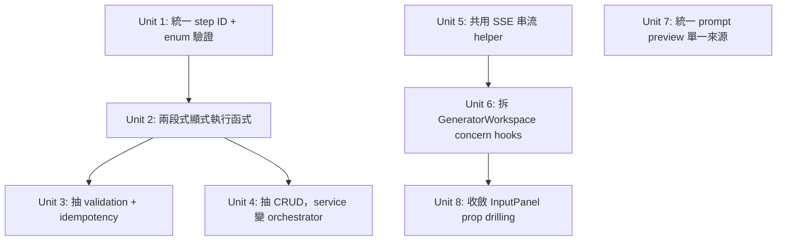

# refactor: Restructure the generation workflow — honest pipeline engine + layered decomposition

## Overview

「工作流」在本專案 = 內容生成的 pipeline（`build-context → render-prompt → apply-controls →〔LLM 串流〕→ clean-content → format-output`）加上驅動它的生成服務與前端介面。全面盤點（直接讀檔 + 探索代理交叉驗證）找出 **12 項結構/品質異味**，集中在三個層次：

1. **Pipeline 編排散落在 service** — `PipelineStep` 抽象、`registry`、`PIPELINE_STEPS` 常數都在，但 `generation-service.ts` 沒把它們收斂成單一編排入口，而是手動 `enabledSteps.has(...)` 逐步硬接於 service 內，且 step ID 散在三處（常數/registry/測試）。
2. **生成服務職責過載** — 單檔 324 行同時管 CRUD、驗證、idempotency、pipeline 編排、串流、取消生命週期。
3. **前端上帝組件** — `GeneratorWorkspace` 535 行、~20 個 `useState`、13 個 handler，混了表單/編排/評分/大綱/變體/匯出/provider 檢查/hotspot；兩個串流 hook 重複 SSE 解析邏輯。

本計畫是**行為保持（behavior-preserving）重構**（唯一刻意例外見 Unit 1 的分層驗證），分 4 個 Phase 交付（**Phase 1 獨立、Phase 2 依 Phase 1、Phase 3 獨立且可與 Phase 1-2 並行、Phase 4 依 Phase 3**），靠既有測試套件（記憶記載 ~541 測試）守住行為，再為抽出的純單元補測試。

**核心設計洞見**：pipeline 不是單純線性 map——**LLM 串流卡在 `apply-controls` 與 `clean-content` 之間**，把鏈切成兩段純函式（`request → normalizedRequest`、`accumulated string → string`），中間夾著一個 impure 的串流 I/O。所以單一 `for step of steps` 泛型迴圈天生跑不通（步驟異質 I/O，無 `unknown`/existential 不能折成陣列）。誠實的模型是「**串流前的提示詞組裝**」+「**串流後的後處理**」兩段顯式函式。

**重要釐清（架構審查修正）**：本計畫把編排**收斂成兩個顯式函式**，但**步驟順序與組成仍寫死在函式內**（刻意以型別安全換取 runtime 泛型）。registry 在執行期只驅動「**啟用 gating 集合**」，**不**驅動順序——`ALL_PIPELINE_STEPS` 的陣列順序執行期不被讀取。因此本計畫**不**宣稱「registry 驅動執行」；新增/重排步驟仍需手改該函式，只是改的是 pipeline 模組那一個檔，不再是 `generation-service`。

## Problem Frame

架構定義了嚴格依賴方向 `presentation → app routes → application → domain ← infrastructure`，且 `.eslintrc.json` 已用 `import/no-restricted-paths` 靜態強制 presentation→application / domain 邊界（健康，須保留尊重）。但「工作流」這條主路徑本身的內部結構劣化：抽象與實作脫節、職責過載、UI 上帝組件。這條是**生成主路徑（會真實計費 provider）**，重構必須零行為變更、零退化。

過去兩份重構計畫（`2026-06-26-003` 內聚/耦合、`2026-06-26-006` errorResponse 分層）已完成，但 006 明確把 `GeneratorWorkspace` 重構與 `plugins/pipeline → application/pipeline` 路徑遷移**延後成獨立評估**——本計畫承接前者，並對後者做出決定（見 Key Technical Decisions）。

## Requirements Trace

- R1. 步驟編排離開 `generation-service`，收斂到 pipeline 模組單一處；**啟用 gating** 由 preset `enabledPipelineSteps` 驅動；**順序/組成刻意保留為程式碼顯式**（型別安全優先於 runtime 泛型）。新增/重排步驟改的是 pipeline 模組那一個檔，不是 service。
- R2. 串流前/串流後兩段 pipeline 的邊界顯式化；編排邏輯離開 `generation-service`，集中到 pipeline 模組。
- R3. Pipeline step ID 只有**單一來源**（`domain/pipeline-steps.ts`），registry 與 zod schema 都引用它；**寫入**（create/update）時非法步驟被拒，**讀取**既有 row 時容錯剝除未知步驟（local-first：不得 brick 既有資料）。
- R4. `generation-service.ts` 拆分為內聚模組（CRUD / 驗證+idempotency / 編排），單檔職責單一。
- R5. `GeneratorWorkspace` 縮減為「組合 + 版面」，生成/變體/大綱編排與評分/匯出移到 concern hooks。
- R6. 兩個串流 hook（`use-generation-stream`、`use-variant-generation`）共用一份 SSE 解析 + token 緩衝 helper，消除重複。
- R7. Prompt preview 只有單一權威實作，client bridge 與 server route 共用。
- R8. 全程 `pnpm typecheck`、`pnpm test`、`pnpm test:e2e` 維持綠燈；既有 API 契約與行為不變。

## Scope Boundaries

- **不改任何使用者可見行為**：相同輸入 → 相同輸出、相同事件序列、相同錯誤訊息。**唯一例外** = Unit 1 的 `enabledPipelineSteps` 分層驗證：**寫入**端新增更嚴格的拒絕（刻意），**讀取**端對既有壞 row 改為容錯剝除（比現況更安全，仍非位元保持）——見 Unit 1 與 Risks。
- **不把串流編排搬到 application「供 server 端複用」**（探索代理建議 #5/#11/#12 的重型版本）。理由：local-first app，唯一客戶端就是此 UI，為不存在的 server/CLI 複用需求買單屬過度設計。改採輕量去重（R6）。
- **不動** `.eslintrc.json` 的層邊界 zone 定義（設計正確，保留）。
- **不動** `StoragePort` / `LLMProviderAdapter` / `BaseAdapter` 介面（已驗證設計正確）。
- **不動** provider adapter、watermark/hotspot sidecar、quality judge 的內部邏輯。
- **不重寫** Zustand store 互不 import 原則。
- **不做** 功能增加、UI 改版、新 provider。

## Context & Research

### Relevant Code and Patterns

- `src/plugins/pipeline/registry.ts:95-109` — `steps` 陣列 + `listPipelineSteps()`/`getPipelineStep()`；後者僅測試使用，前者僅 `bootstrap/route.ts` 用作 metadata。
- `src/domain/pipeline-steps.ts:5-28` — `PIPELINE_STEPS` 常數 + `ALL_PIPELINE_STEPS`（執行順序的唯一聲明）。
- `src/domain/ports/pipeline.ts:17-21` — `PipelineStep<I,O>` 介面（異質 I/O）。
- `src/application/generation/generation-service.ts:127-150` — `prepareGeneration` 手動逐步硬接（串流前三步）。
- `src/application/generation/generation-service.ts:276-297` — `streamToProvider` 串流完成後手動跑 clean/format（串流後兩步）。
- `src/application/generation/generation-service.ts:69-111` — `validateGenerationRequest` + idempotency + `CachedGenerationError`（可抽出）。
- `src/application/generation/generation-service.ts:32-60` — CRUD + cancel（可抽出）。
- `src/presentation/generation/generator-workspace.tsx:34-535` — 上帝組件；`computePromptPreview` 經 `presentation/lib` bridge 呼叫（邊界合法）。
- `src/presentation/generation/use-generation-stream.ts`（241 行）、`use-variant-generation.ts`（193 行）— 重複的 SSE 解析 + RAF token 緩衝。
- `src/presentation/lib/preview-prompt.ts`（58 行）vs `src/app/api/prompt-templates/preview/route.ts` — prompt preview 雙實作。
- `src/presentation/generation/input-panel.tsx` — 28 props（prop drilling）。
- 既有 concern-hook 模式：`use-draft-versions.ts`、`use-restore-from-history.ts`、`use-variant-generation.ts`、`use-generation-stream.ts`（團隊已熟悉，重構沿用此模式）。
- `.eslintrc.json:7-30` — 層邊界靜態強制（保留）。

### Institutional Learnings

- `docs/solutions/stability/2026-06-26-s4-stability-reverify-findings.md` — 穩定性復驗發現（取消/串流/狀態邊界的既有處理，重構時不得退化）。
- 計畫 `2026-06-26-003` R3 已修正「registry 謊報步驟清單」（`apply-controls` 已納入陣列）——本計畫在其上繼續，把「使用」也對齊。
- 記憶：分支移動快、多 agent 易撞檔 → 開工前先 `git fetch` + 用 worktree 跑並行 agent。

### External References

- 不需外部研究：pipeline / hook 抽取屬 repo 內既有模式，本地有 ≥3 個直接範例可循（4 個 concern hooks、registry pattern、port pattern）。

## Key Technical Decisions

- **兩段式顯式函式，而非單一泛型迴圈**：因串流卡在中間，把執行拆成 `buildRenderedPrompt`（串流前：build-context→render-prompt→apply-controls）與 `postProcessContent`（串流後：clean-content→format-output）兩個函式，置於 pipeline 模組。**刻意不命名為 "runner/engine"**——那會暗示「registry 迭代」這個本計畫禁止的做法。型別在函式內顯式串接（保留 compile-time 安全）；registry 只驅動「enabled gating 集合」，**順序寫死在函式內**（見 Overview 釐清）。**拒絕**把異質步驟塞進 `unknown` 泛型 runtime runner——5 個步驟不值得犧牲型別安全。
- **Step ID 單一來源**：registry 每個 step 的 `id` 改引用 `PIPELINE_STEPS.X`；`generation.ts` 的 `enabledPipelineSteps` 從 `z.array(z.string())` 改為 `z.array(z.enum([...ALL_PIPELINE_STEPS]))`。非法/typo 步驟在 schema 解析時即被拒（解決 #3/#7/#8）。
- **pipeline 模組保留在 `src/plugins/pipeline/`**：計畫 006 把「`plugins/pipeline → application/pipeline` 遷移」列為待評估。**決定：不遷移**。**誠實理由（架構審查修正）**：現況**已存在** `application ↔ plugins` 套件級循環——`registry.ts:2-5` 早就 import `@/application/content/cleaner`、`@/application/prompt/*`，step 物件本質是 application service 的薄 adapter，並非自足 plugin。所以「application → plugins → domain 單向」的說法是**錯的**。本決定是「**不惡化既有循環**」而非「層次已乾淨」：新增的兩個函式放 `plugins/` 不會讓循環變差，且 `.eslintrc.json` 的 `import/no-restricted-paths` 未把 `plugins/` 納入 zone，故可編譯。若要真正乾淨分層，編排函式應移到 `application/`、只留 registry/metadata 在 `plugins/`——那正是本計畫拒絕的遷移，取捨成立，但理由是降風險，不是層次本就乾淨。
- **生成服務拆三塊**：`generation-crud.ts`（list/get/update/delete/cancel）、`generation-validation.ts`（validate + idempotency + `CachedGenerationError`）、`generation-service.ts` 留作 orchestrator（`streamGeneration`/`prepareGeneration`/`streamToProvider`，呼叫兩個執行函式與 validation）。對外 import 入口維持（必要時加 barrel re-export），避免改動 18+ route/呼叫端。
- **前端用 concern hooks 拆解，不引入新狀態管理框架**：沿用既有 hook 模式，避免 over-engineering。
- **串流去重採共用純 helper，非服務化**：抽 `parseGenerationStream`（SSE 行解析）+ token 緩衝 util，兩 hook 共用。

## Open Questions

### Resolved During Planning

- **要不要把 pipeline 變成 runtime 泛型 runner？** 否——串流夾在中間 + 型別安全考量，兩段式 typed 顯式函式更誠實（見 Key Technical Decisions）。代價是：registry 只驅動 gating 不驅動順序，R1 已據此誠實縮口。
- **要不要遷移 `plugins/pipeline → application/pipeline`？** 否——影響面 vs 收益不划算，計畫 006 已標記待評估，此處做出「不遷移」決定。
- **拆 `generation-service` 會不會破壞 18+ 呼叫端 import？** 不會——保留原檔作為 orchestrator + 必要 re-export，呼叫端 import 路徑不變。

### Deferred to Implementation

- `GeneratorWorkspace` 抽出的 concern hooks 確切邊界與命名（`useGeneratorController` vs 細拆 `useScoring`/`useExportActions`）——以實作時的內聚度判斷，計畫給方向不鎖死。
- 共用 SSE helper 的確切函式簽章（generator/變體兩種 token 緩衝節奏是否完全一致）——需讀兩 hook 細節後定。
- Prompt preview 統一後，server route 是否變死碼可刪——實作時 grep 呼叫端確認。

## High-Level Technical Design

> *以下為方向性設計，供審閱驗證「形狀」，非實作規格。實作代理應視為脈絡，而非照抄的程式碼。*

**現況（編排散在 service 內）：**

```
streamGeneration(input)
  ├─ validateGenerationRequest()        ← 驗證 + idempotency 混在 service
  ├─ prepareGeneration()
  │    ├─ if enabled(build-context)  buildContextStep.execute()   ┐ 串流前三步
  │    ├─ if enabled(render-prompt)  renderPromptStep.execute()   │ 手動硬接
  │    └─ if enabled(apply-controls) applyControlsStep.execute()  ┘ + 各自 fallback
  └─ streamToProvider()
       ├─ for await token … (SSE)
       └─ on complete: if enabled(clean) … if enabled(format) …   ← 串流後兩步手動硬接
```

**目標（兩段式顯式函式，service 變薄協調者）：**

```
domain/pipeline-steps.ts   → PIPELINE_STEPS (唯一 ID 來源) + PipelineStepId enum
plugins/pipeline/
  ├─ registry.ts           → step 物件 (id 引用 PIPELINE_STEPS) + listPipelineSteps()
  └─ execute.ts (new)
        buildRenderedPrompt(ctx, request, enabled) → RenderedPromptPayload   〔串流前；不持久化〕
        postProcessContent(ctx, rawContent, title, enabled) → string         〔串流後〕

application/generation/
  ├─ generation-validation.ts (new)  → validateGenerationRequest + idempotency + CachedGenerationError
  ├─ generation-crud.ts (new)        → list/get/update/delete/cancel
  └─ generation-service.ts (orchestrator)
        streamGeneration = validate → buildRenderedPrompt → 〔service 持久化〕 → stream
                                    → (complete 才) postProcessContent → 〔service 持久化〕
        ※ persistence (storage.generations.create/update) 一律留在 service，不進 pipeline 模組
```

**前端目標：**

```
GeneratorWorkspace (≈組合 + 版面)
  ├─ useGenerationForm()      表單狀態 (title/summary/preset/provider/customVars/controls)
  ├─ useGeneratorController() generate / variants / outline 編排 + ensureProviderOk
  ├─ useScoring()             quality + local score
  ├─ useExportActions()       copy md/txt + export
  └─ <InputPanel form={…}/>   grouped props，砍 prop drilling

streaming helper (shared):
  parseGenerationStream(response) + tokenBuffer()  ← use-generation-stream & use-variant-generation 共用
```

## Implementation Units



Phase 1（Unit 1–2）與 Phase 3（Unit 5–6）彼此獨立，可並行於不同 worktree；Phase 2（Unit 3–4）依賴 Phase 1；Phase 4（Unit 7–8）為收尾。

---

- [x] **Unit 1: 統一 pipeline step ID，寫入嚴格 / 讀取容錯驗證**

**Goal:** 消滅三處 step ID 定義，讓 `domain/pipeline-steps.ts` 成為唯一來源；**新建/更新** preset 時拒絕非法步驟；**讀取既有** preset 時容錯（剝除未知步驟 + 警告），不讓單一壞 row 拖垮整個 preset 載入。

**Requirements:** R3

**Dependencies:** 無

**⚠ 關鍵層次決策（文件審查 P1 修正）：** enum 必須**分層**，不能無腦套在 `generationPresetSchema`：
- **讀取路徑風險（local-first 致命）**：`generation-preset-repo.ts:12` 對每筆 row 跑 `generationPresetSchema.parse()`，`list()` 再 map 全表。若把 enum 直接套上 `generationPresetSchema`，**任何一筆**含未知步驟的 row 會在 parse 丟錯 → `list()` 整批失敗 → bootstrap/設定面板**一張 preset 都載不出**（硬當機，非優雅略過）。e2e fixture 曾用 `generate-content`/`persist-generation` 幻影步驟，證明此類字串在本 codebase 血統中存在、可能已寫進真實使用者 row。這是 local-first app，**開發者無法 grep 使用者本機 SQLite**，原計畫「grep seed/migration」的緩解對使用者資料**無效**。
- **正確做法**：寫入路徑（API create/update schema）用嚴格 `z.array(pipelineStepIdSchema)` 拒絕**新**的 typo；讀取路徑改為**容錯**——以 `z.array(pipelineStepIdSchema).catch(...)` 或 preprocess 剝除未知 id + `logger.warn`，**永不丟錯**。如此 R3「不再產生壞資料」達成，且既有使用者 DB 不被 brick。

**Files:**
- Modify: `src/plugins/pipeline/registry.ts`（每個 step `id` 改用 `PIPELINE_STEPS.X`）
- Modify: `src/domain/pipeline-steps.ts`（新增 `pipelineStepIdSchema = z.enum([...ALL_PIPELINE_STEPS])`）
- Modify: `src/domain/schemas/generation.ts`（**寫入** schema 嚴格：`generationPresetCreateSchema:139` 的 `enabledPipelineSteps` → `z.array(pipelineStepIdSchema)`，保留 `.default([...DEFAULT_ENABLED_STEPS])`；**讀取** schema `generationPresetSchema:124` 用容錯變體，剝除未知 id 不丟錯——**兩處都要改**，否則讀寫驗證不對稱）
- Modify: `src/infrastructure/storage/generation-preset-repo.ts`（確認 `:12` 讀取路徑套用容錯 schema；`:21` 的 `parseJson<string[]>` 維持）
- Modify: `src/tests/e2e/generation-flow.spec.ts`（移除 phantom `generate-content`/`persist-generation`，對齊真實步驟）
- Test: `src/tests/unit/pipeline-steps.test.ts`（新增）；`src/tests/unit/generation-preset-repo.test.ts`（容錯讀取，新增或補強）

**Approach:**
- registry step 物件的 `id: "build-context"` 等字面量改為 `id: PIPELINE_STEPS.BUILD_CONTEXT`。
- 寫入嚴格、讀取容錯（見上方層次決策）。
- 仍須 grep seed/migration 確認**本 repo 出貨資料**合法（縮小問題面），但**不**依賴它保護使用者 DB——讀取容錯才是真正的防護。
- 修正 e2e fixture 的幻影步驟（#3）。

**Patterns to follow:** `domain/schemas/*` 既有 `z.enum` 用法（如 `enums.ts`）；zod `.catch()` / `.preprocess()` 容錯模式。

**Test scenarios:**
- Happy path：合法 `enabledPipelineSteps` 全集通過讀寫解析。
- Edge case：空陣列（全部步驟停用）仍合法。
- Error path（**寫入**）：create/update 帶 `"typo-step"` → zod 拒絕，錯誤點名非法值。
- Edge case（**讀取容錯**）：DB row 含 `["build-context","typo-step","render-prompt"]` → 讀取**剝除** `typo-step`、保留合法步驟、發 warn、**不丟錯**，`list()` 正常回傳。
- Integration：單筆壞 row **不**讓 `list()` 整批失敗（直接守 local-first brick 風險）。
- Integration：registry 每個 step 的 `id` ∈ `ALL_PIPELINE_STEPS`（防 registry 與常數漂移的守門測試）。

**Verification:** `pnpm typecheck` 綠；寫入測試證明新 typo 被拒；讀取測試證明壞 row 被容錯剝除而非 brick 全表；e2e fixture 不再含幻影步驟。

---

- [x] **Unit 2: 兩段式顯式 pipeline 執行函式**

**Goal:** 把散在 service 的手動步驟編排，集中成 `buildRenderedPrompt`（串流前）+ `postProcessContent`（串流後）兩個顯式函式（gated by enabled 集合，順序寫死於函式內）；service 改為呼叫它們。

**Requirements:** R1, R2, R8

**Dependencies:** Unit 1

**為何值得做（回應「只是搬家不增能力」的質疑）：** 這兩個函式**不是** engine、不新增組合能力——它們把 ~30 行 gating 邏輯從 service 搬到單一受測模組。值得的理由有三：(1) 讓 `generation-service` 卸下個別 step import，Phase 2（Unit 3-4）才能在更小的單一職責檔上拆 validation/CRUD，不必繞過內嵌編排；(2) gating 邏輯集中到**一個有測試的地方**，而非散在串流迴圈裡；(3) 顯式持久化邊界（execute.ts 不碰 storage）讓「提示詞組裝」與「DB 寫入」職責分離。代價是計費路徑的 parity 風險（自評 Med/High）——故 Unit 2 以相同 fixture 嚴格比對、先補 characterization 測試。這是**有意識的取捨**，不是為重構而重構。

**Files:**
- Create: `src/plugins/pipeline/execute.ts`（函式刻意不叫 runner/engine，避免暗示 registry 迭代）
- Modify: `src/plugins/pipeline/registry.ts`（必要時 export 步驟分組；保留 `listPipelineSteps`。**`getPipelineStep` 決策**：現有 `src/tests/unit/pipeline-registry.test.ts` 仍 import 並斷言它——若刪除須**同步退役該測試**，若保留須給它真實用途。本計畫**傾向保留** `getPipelineStep`（成本低、已有測試覆蓋），不刪）
- Modify: `src/tests/unit/pipeline-registry.test.ts`（隨 registry step `id` 改用常數而更新；若 `getPipelineStep` 去留有變更則一併調整）
- Modify: `src/tests/unit/api-routes.test.ts`（確認 `listPipelineSteps` mock 於 registry 變更後仍滿足）
- Modify: `src/domain/pipeline-steps.ts`（更新 `:18` 「order matters — it's the execution order」註解：Unit 2 後執行順序住在 `execute.ts`，此陣列只餵 gating 集合與 bootstrap 顯示，否則成誤導來源）
- Modify: `src/application/generation/generation-service.ts:113-165, 242-298`（`prepareGeneration` 用 `buildRenderedPrompt`；`streamToProvider` 的 `complete` 分支用 `postProcessContent`）
- Test: `src/tests/unit/pipeline-execute.test.ts`（新增）

**Approach:**
- `buildRenderedPrompt(ctx, request, enabled)`：依序 gated 執行 build-context→render-prompt→apply-controls，回傳 `RenderedPromptPayload`；保留現有「步驟停用時的 fallback 預設值」語義（型別在函式內顯式串接）。
- `postProcessContent(ctx, rawContent, title, enabled)`：gated 執行 clean-content→format-output，回傳最終字串。
- service 不再 import 個別 step 物件，只 import 這兩個函式。
- **持久化邊界（硬約束）**：`storage.generations.create/update`（現於 `prepareGeneration:151-163`）**留在 service**，不得進 `execute.ts`——否則引入今天不存在的 `plugins → infrastructure/storage` 依賴。函式只回傳資料，service 負責持久化。
- **後處理只在 `complete` 分支跑**：現況 `error`（`:266-274`）與 cancel（`:305-313`）分支提早 return **原始 `accumulated`**，不跑後處理。`postProcessContent` 只能掛在 `complete`（`:275` else）路徑，絕不可在 error/abort 內容上執行。
- **行為等價關鍵**：逐一比對現有 `enabledSteps.has()` 分支 fallback（`:130-150, 276-284`），函式須產出位元等價結果。

**Execution note:** 行為保持重構——先確認既有 generation 測試覆蓋各步驟開關組合，必要時先補 characterization 測試再動 service。

**Technical design:** *(方向性，非規格)*
```
buildRenderedPrompt(ctx, request, enabled):
  payload = enabled.has(BUILD_CONTEXT) ? buildContextStep.execute(ctx, request)
                                        : { request, variables: {} }
  rendered = enabled.has(RENDER_PROMPT) ? renderPromptStep.execute(ctx, payload)
                                         : defaultRendered(ctx, request)   // 同現有 fallback
  return enabled.has(APPLY_CONTROLS) ? applyControlsStep.execute(ctx, rendered) : rendered
  // postProcessContent 只收 (rawContent, title, ctx)，拿不到 ContextPayload.variables /
  // RenderedPromptPayload（串流斬斷了鏈）。未來後處理步驟若需串流前資料，經 PipelineContext
  // 傳遞，而非擴張位置參數簽章。
```

**Patterns to follow:** 現有 `prepareGeneration` 的 fallback 結構（搬移而非重寫語義）。

**Test scenarios:**
- Happy path：全步驟啟用 → 函式輸出 == 重構前 `prepareGeneration`/post-process 輸出（相同 fixture 比對）。
- Edge case：僅 `build-context`+`render-prompt`（停用 controls）→ 不套用 controls，與舊行為一致。
- Edge case：停用 clean-content 但啟用 format-output → 直接 format 原始內容（對齊 `:282-284`，最易踩的 parity 陷阱）。
- Edge case：全部後處理停用 → 回傳原始累積內容。
- Error path：串流中 `error` 事件 → **不跑** `postProcessContent`，`final` 帶**原始** `accumulated`（對齊 `:266-274`）。
- Error path：使用者 cancel（`controller.signal.aborted`）→ **不跑**後處理，content = 原始 `accumulated`，status=cancelled（對齊 `:305-313`）。
- Integration：透過 `streamGeneration` 端到端，事件序列與最終 `outputContent` 與重構前一致；DB persist 仍由 service 觸發。**注意**：「位元等價」只對 `postProcessContent` 這類**純函式**（給定固定 accumulated 字串）可斷言；端到端 parity 必須對著**被 stub 的 provider adapter**（依 repo 慣例 `vi.spyOn(global, "fetch")` 發固定 token 序列）跑，**不可**對真實 provider（非確定性 + 每次計費）。

**Verification:** 既有 generation 測試全綠；新單元測試證明各 enabled 組合 + error/cancel 分支行為等價；service 不再 import 個別 step；`execute.ts` 不 import storage；端到端 parity 測試使用 stub provider（非 live）。

---

- [ ] **Unit 3: 抽出驗證 + idempotency 模組**

**Goal:** 把 `validateGenerationRequest`、idempotency 邏輯、`CachedGenerationError` 從 service 抽到專責模組。

**Requirements:** R4, R8

**Dependencies:** Unit 2

**Files:**
- Create: `src/application/generation/generation-validation.ts`
- Modify: `src/application/generation/generation-service.ts`（import 之）
- Test: `src/tests/unit/generation-validation.test.ts`（新增；既有 idempotency 測試若在 service test 內則遷移/補強）

**Approach:**
- 純搬移 `generation-service.ts:62-111` + `CachedGenerationError`（15-19），維持函式簽章與丟錯型別。
- 保持 `streamGeneration` 對 `CachedGenerationError` 的 catch 行為（replay 快取）不變。

**Execution note:** 行為保持——idempotency 是計費正確性關鍵，搬移後須跑既有 idempotency 測試。

**Patterns to follow:** application 層既有「函式式 service」風格（非 class）。

**Test scenarios:**
- Happy path：全新 request（無 idempotencyKey）→ 回傳 validated bundle。
- Edge case：idempotencyKey 命中 completed+有內容 → 丟 `CachedGenerationError`（replay）。
- Error path：idempotencyKey 命中 in-flight（queued/streaming）→ 丟 `GENERATION_IN_PROGRESS`。
- Edge case：命中 failed/cancelled 舊 row → 刪除舊 row 後放行（對齊 `:88-92`）。
- Error path：preset/provider/template 不存在 或 provider disabled → 對應 `*_NOT_FOUND`/`PROVIDER_DISABLED`。

**Verification:** `pnpm test` 綠；validation 測試涵蓋全部 idempotency 分支；`generation-service` 行數下降且不再含驗證細節。

---

- [ ] **Unit 4: 抽出 CRUD，service 收斂為 orchestrator**

**Goal:** 把 list/get/update/delete/cancel 抽到 `generation-crud.ts`，`generation-service.ts` 只留串流編排。

**Requirements:** R4, R8

**Dependencies:** Unit 2（理想在 Unit 3 後）

**Files:**
- Create: `src/application/generation/generation-crud.ts`
- Modify: `src/application/generation/generation-service.ts`
- Modify: 呼叫端 route（如 `src/app/api/generations/route.ts`、`[id]/route.ts`、`[id]/cancel/route.ts`）— 若改 import 來源，逐一更新；或在 service 加 re-export 維持入口
- Test: `src/tests/unit/generation-crud.test.ts`（新增或自既有遷移）

**Approach:**
- 搬移 `generation-service.ts:32-60`（list/get/update/delete/cancel）。
- **入口穩定優先**：傾向在 `generation-service.ts` re-export CRUD 函式，route import 不變（對齊計畫 006「避免大面積 import 遷移」教訓）。

**Execution note:** 先決定 re-export vs 改 import；若 re-export 則 route 零改動，風險最低。

**Patterns to follow:** `crud-helpers.ts` 的 `getOrThrow`；其他 application service 的函式式風格。

**Test scenarios:**
- Happy path：list（含 search/offset/limit）、get、update content、delete 各回傳預期。
- Error path：get/update/delete 不存在 id → `getOrThrow` 丟「生成记录不存在」。
- Edge case：cancel 命中 in-flight → controller 取消 + status=cancelled；cancel 無對應 controller → `{cancelled:false}`。
- Integration：經 route 呼叫 CRUD（驗證 re-export/import 沒斷）。

**Verification:** `pnpm typecheck`+`pnpm test`+`pnpm test:e2e` 全綠；`generation-service.ts` 僅含 `streamGeneration` 編排相關。

---

- [ ] **Unit 5: 抽出共用 SSE 串流 helper，去重兩 hook**

**Goal:** `use-generation-stream` 與 `use-variant-generation` 共用一份 SSE 行解析 + token 緩衝 util，消除重複（輕量解 #11/#12，不做服務化）。

**Requirements:** R6, R8

**Dependencies:** 無（前端，可與 Phase 1 並行）

**Files:**
- Create: `src/presentation/generation/stream-parser.ts`（`parseGenerationStream` + token 緩衝）
- Modify: `src/presentation/generation/use-generation-stream.ts`
- Modify: `src/presentation/generation/use-variant-generation.ts`
- Test: `src/tests/unit/stream-parser.test.ts`（新增，node 環境）

**Approach:**
- 抽出純函式：把 `Response` body 串流解析成 `GenerationStreamEvent` 的 async iterator；token 緩衝（RAF/interval flush）抽成可注入 flush 策略的小工具。
- 兩 hook 改用之，保留各自的 React state 更新與取消語義。
- 確認兩者 token 緩衝節奏差異（generator 用 RAF、變體用 interval）能用同一 util 參數化（見 Deferred）。

**Execution note:** 先寫 `stream-parser` 的 SSE 解析測試（含半截 chunk、多事件同一 chunk），再接 hook。

**Patterns to follow:** 既有 hook 的 SSE 解析迴圈（`use-generation-stream.ts:132-188`）。

**Test scenarios:**
- Happy path：完整 SSE 串流 → 依序產出 token/metadata/complete/final 事件。
- Edge case：事件跨 chunk 邊界被切半 → 正確重組。
- Edge case：單一 chunk 含多個 `data:` 行 → 全部解析。
- Error path：`error` 事件 → 正確產出並終止。
- Edge case：abort 中途 → 迭代終止、不丟未處理例外。

**Verification:** 兩 hook 不再各自重複 SSE 解析；新解析測試綠；生成/變體 e2e 行為不變。

---

- [ ] **Unit 6: 拆解 GeneratorWorkspace 為 concern hooks**

**Goal:** 把生成/變體/大綱編排、評分、匯出從 535 行上帝組件抽到 concern hooks，組件縮為「組合 + 版面」。

**Requirements:** R5, R8

**Dependencies:** Unit 5

**Files:**
- Create: `src/presentation/generation/use-generator-controller.ts`（handleGenerate/Variants/outline/expandOutline/onPrimaryGenerate/cancelActive/ensureProviderOk）
- Create: `src/presentation/generation/use-scoring.ts`（quality + local score，含 `activeGenIdRef` 防競態）
- Create: `src/presentation/generation/use-export-actions.ts`（copy md/txt、export md/txt、saveToHistory）
- Modify: `src/presentation/generation/generator-workspace.tsx`
- Test: `src/tests/unit/use-scoring.test.tsx`、`use-generator-controller.test.tsx`（jsdom）

**Approach:**
- 沿用既有 hook 模式（`use-draft-versions` 等）。
- 保留既有競態防護：`activeGenIdRef` gate（`:106-107, 323-348`）、score 失敗 retry 的 `\b5\d\d\b` 判斷（`:346`）、seed 覆寫 confirm（`:305-314`）。
- 組件最終只保留：store 讀取 + 版面 + 把 hook 回傳值接到子面板。

**Execution note:** 高風險上帝組件——每抽一個 hook 就跑一次 `pnpm test` + 手動煙測生成流程；可拆成多個 commit。

**Patterns to follow:** `use-variant-generation.ts`、`use-draft-versions.ts` 的回傳物件形狀。

**Test scenarios:**
- Happy path（controller）：`onPrimaryGenerate` 在 outline/variant/single 三模式各派發正確流程。
- Edge case（controller）：`ensureProviderOk` 失敗 → 不發起生成、設 providerError。
- Happy path（scoring）：score 成功且 active gen 未切換 → 設分數。
- Edge case（scoring）：請求進行中切換 active generation → 結果被 `activeGenIdRef` gate 丟棄。
- Error path（scoring）：429/5xx → retry 一次；其他錯誤 → 設 scoreFailed。
- Happy path（export）：copy/export md 與 txt（stripMarkdown）內容正確。

**Verification:** `generator-workspace.tsx` 顯著縮短（目標 < ~250 行）；hook 測試綠；生成/變體/大綱/評分/匯出 e2e 行為不變。

---

- [ ] **Unit 7: 統一 prompt preview 為單一權威來源**

**Goal:** client bridge 與 server route 共用同一 prompt preview 實作，消除雙實作漂移風險。

**Requirements:** R7, R8

**Dependencies:** 無

**Files:**
- Modify: `src/application/prompt/*`（抽/確認單一 `buildPromptPreview` 純函式：resolve variables + render system/user）
- Modify: `src/presentation/lib/preview-prompt.ts`（bridge 改為轉呼該權威函式）
- Modify: `src/app/api/prompt-templates/preview/route.ts`（改呼該權威函式；若主流程已不用此 route，grep 確認後評估刪除）
- Test: `src/tests/unit/prompt-preview.test.ts`（新增/合併）

**Approach:**
- 權威純函式放 application 層（client 經 `presentation/lib` bridge 取用，符合 eslint 邊界）。
- 比對 `preview-prompt.ts:31-57` 與 route 的變數解析 + 渲染，確認等價後收斂為一份。

**Patterns to follow:** `application/prompt/renderer.ts`、`variables.ts` 既有純函式。

**Test scenarios:**
- Happy path：給定 template + title + summary + customVars + controls → systemPrompt/userPrompt 與重構前 client 版一致。
- Edge case：缺 template → 回傳 null/空（對齊現有 client 行為）。
- Integration：route 與 bridge 對同一輸入回傳相同結果（單一來源證明）。

**Verification:** 只剩一份 preview 邏輯；client/server 對同輸入輸出一致；既有 preview 測試綠。

---

- [ ] **Unit 8: 收斂 InputPanel 的 prop drilling**

**Goal:** 把 InputPanel 的 28 個分散 props 收成結構化分組（form 物件 + handlers 物件），降低維護面。

**Requirements:** R5, R8

**範圍提醒（scope review）：** 本 unit 動的是 InputPanel（子元件介面美化），非 R5 的 GeneratorWorkspace 解耦本體，收益偏「介面整潔」而非結構去耦。**它是全 8 unit 中最可延後/最先可砍的一個**——若計費路徑的風險預算需縮，優先從這裡砍。

**Dependencies:** Unit 6

**Files:**
- Modify: `src/presentation/generation/input-panel.tsx`
- Modify: `src/presentation/generation/generator-workspace.tsx`（傳分組 props）
- Test: `src/tests/unit/input-panel.test.tsx`（若無則新增冒煙級）

**Approach:**
- 把 `{title, eventSummary, presetId, selectedProfileId, customVarValues, controls, ...}` 收成 `form` 物件；`onTitleChange`/`onControlChange` 等收成 `onFormChange`/handlers 物件。
- 純結構調整，不改子元件行為。**不**引入 Context（YAGNI；單一消費者）。

**Execution note:** 純 props 重塑——以既有 InputPanel 渲染測試 + e2e 守行為。

**Patterns to follow:** Unit 6 抽出的 `useGenerationForm`（若採用）回傳物件形狀。

**Test scenarios:**
- Happy path：改 title/summary/preset/control 各觸發正確 handler 與值。
- Edge case：customVar 變更 merge 進既有值（對齊 `:429-431`）。
- Integration：經 GeneratorWorkspace 渲染，輸入面板互動與重構前一致。

**Verification:** InputPanel 介面顯著簡化；輸入互動 e2e 不變；typecheck 綠。

## System-Wide Impact

- **Interaction graph:** 主受影響入口 = `POST /api/generations`（streamGeneration）、`/api/completions`（outline）、`/api/generations/[id]/(score|local-score|export|cancel|drafts)`。執行函式/CRUD 重構須維持這些 route 的事件序列與回傳形狀。
- **Error propagation:** `CachedGenerationError` replay、provider 驗證失敗、串流中 error 事件、setup 例外（corrupt secret）、取消競態（`controller.signal.aborted` 判斷而非 DB status，`:305`）——全部行為須保持。
- **State lifecycle risks:** `releaseGenerationController` 每次生命週期只調用一次（計畫 006 已修雙重 release）；idempotency 的 stale row 刪除/supersede；draft/score 隨 active generation 切換清空。
- **API surface parity:** 不改任何 route 的 request/response schema；若拆檔改 import，優先 re-export 保持入口穩定。
- **Integration coverage:** mock 證不了的跨層行為——「全步驟啟用 vs 子集」端到端 outputContent 等價、串流事件序列、取消 → cancelled 狀態——須由 e2e/integration 守。
- **Unchanged invariants:** 依賴方向、`.eslintrc.json` 邊界、`StoragePort`/adapter 介面、Zustand store 互不 import、secrets 加密路徑——皆不變。

## Risks & Dependencies

| Risk | Likelihood | Impact | Mitigation |
|------|-----------|--------|------------|
| 執行函式 fallback 與舊 service 行為不等價（計費主路徑） | Med | High | Unit 2 以相同 fixture 比對重構前後 outputContent；先補 characterization 測試 |
| enum 套在讀取 schema → 單一壞 preset row 讓 `list()` 整批 parse 失敗，bootstrap 一張都載不出（local-first：使用者 DB 無法 grep） | Med | High | Unit 1 **讀取路徑容錯**（剝除未知 id + warn，永不丟錯）；嚴格 enum 只套**寫入** schema；測試直接驗證壞 row 不 brick 全表 |
| 拆 service 破壞 18+ route import | Med | Med | 優先 re-export 保入口；逐 route typecheck |
| 上帝組件抽 hook 引入 React 競態/重渲染回歸 | Med | Med | 保留既有 ref-gate；每抽一 hook 跑 test + 煙測；可多 commit |
| 多 agent / 分支移動快撞檔 | Med | Med | 開工前 `git fetch`；Phase 1 與 Phase 3 用獨立 worktree 並行 |
| 串流 token 緩衝節奏差異無法共用 util | Low | Low | Unit 5 參數化 flush 策略；無法統一則退為共用「解析」只去重一半 |
| 既有 `application ↔ plugins` 循環：未來 ESLint 把 `plugins/` 納入 restricted zone 會曝光此循環而中斷 | Low | Low | 本計畫不惡化循環；於 PR 註記此為已知既有耦合，不在本計畫範圍內解 |
| `postProcessContent` 拿不到串流前 payload，未來後處理步驟需要時誤改簽章 | Low | Low | Unit 2 明訂：串流前資料經 `PipelineContext` 傳遞，非擴張位置參數 |

## Phased Delivery

### Phase 1 — Pipeline 引擎誠實化（Unit 1–2）
先把編排收斂成兩個顯式執行函式（service 不再硬接步驟）、step ID 單一來源 + enum 驗證。這是後續解耦的地基，獨立可 merge。

### Phase 2 — 生成服務分層（Unit 3–4）
在執行函式之上拆 validation 與 CRUD，service 收斂為薄協調者。依賴 Phase 1。

### Phase 3 — 前端解耦（Unit 5–6）
先去重串流 helper，再拆上帝組件。可與 Phase 1/2 並行於獨立 worktree。

### Phase 4 — 邊界與重複收尾（Unit 7–8）
統一 prompt preview、收斂 prop drilling。低風險收尾。

## Documentation / Operational Notes

- 若 Unit 7 確認 `/api/prompt-templates/preview` 變死碼並刪除，於 PR 註記（外部無消費者，本地唯一呼叫端是 panel）。
- `CLAUDE.md` 的 pipeline 章節若因結構調整需補一句「`execute.ts` 為步驟執行入口」，於 Phase 1 收尾時更新。
- 無 schema migration、無 env 變更。**但** Unit 1 的 enum 化會接觸既有 preset 讀取路徑——讀取容錯（剝除未知 step + warn）是必要的 local-first 防護，等同一次「資料寬容化」而非 migration；PR 須註記此為刻意的讀取行為調整。

## Sources & References

- 探索代理盤點：12 項排序異味（pipeline 引擎、service 過載、上帝組件、串流重複、step ID 三處、preview 雙實作、prop drilling）。
- 前序計畫：`docs/plans/2026-06-26-003-refactor-high-cohesion-low-coupling-plan.md`（completed）、`docs/plans/2026-06-26-006-refactor-structural-optimization-completion-plan.md`（completed，延後本計畫承接的兩項）。
- 關鍵程式：`src/application/generation/generation-service.ts`、`src/plugins/pipeline/registry.ts`、`src/domain/pipeline-steps.ts`、`src/presentation/generation/generator-workspace.tsx`、`.eslintrc.json`。
- Learnings：`docs/solutions/stability/2026-06-26-s4-stability-reverify-findings.md`。
</content>
</invoke>
